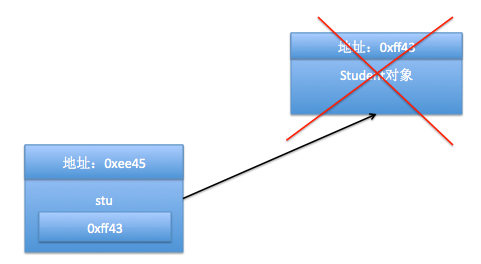
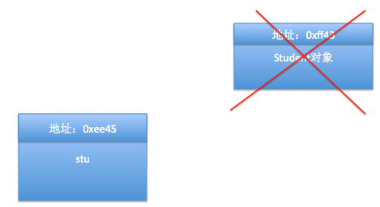
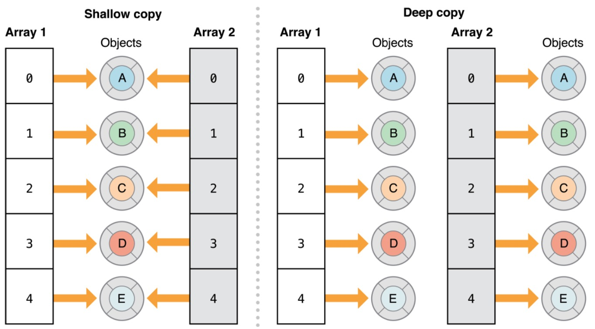
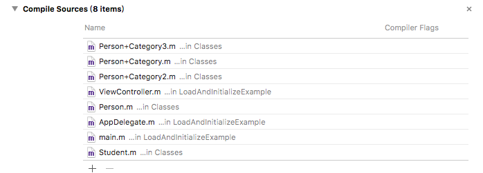
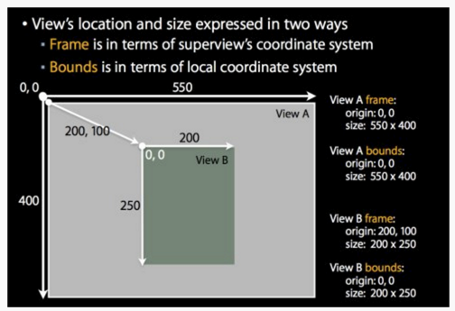
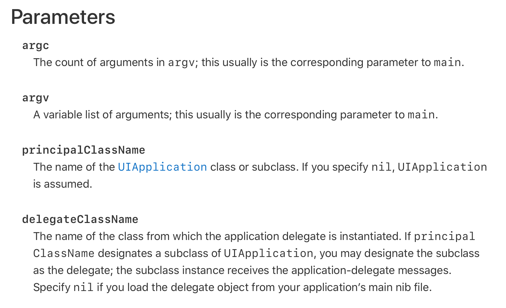
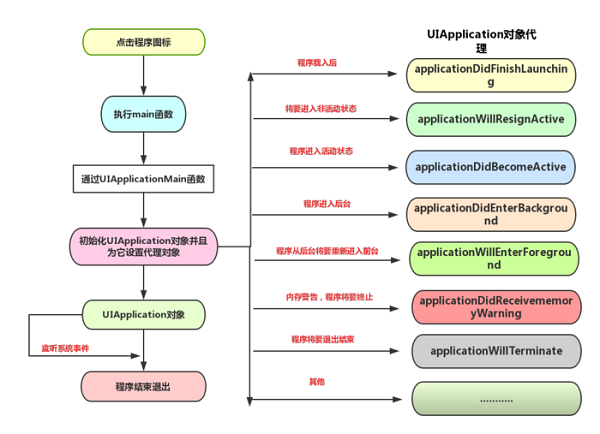

#  一、iOS基础部分

* [1.1、iOS内存机制](#1.1)
	* [1.1.1、简述OC内存管理机制](#1.1.1)
	* [1.1.2、对MRC和ARC的理解，什么是ARC？ARC基本原理？ARC是为了解决什么问题诞生的？ARC不足的地方？](#1.1.2)
	* [1.1.3、ObjC中，与alloc语义相反的方法是dealloc还是release？需要与alloc配对使用的方法是dealloc还是release，为什么？与retain语义相反的方法是dealloc还是release，为什么？与retain配对使用的方法是dealloc还是release，为什么？](#1.1.3)
	* [1.1.4、为什么说Objective-C是一门动态的语言？iOS的动态性？](#1.1.4)
	* [1.1.5、[未完成]ARC情况下，编译的时候，系统是怎么添加相关内存管理的代码](#1.1.5)
	
* [1.2、@property属性](#1.2)
	* [1.2.1、@property 的本质是什么？ivar、getter、setter 是如何生成并添加到这个类中的？](#1.2.1)
	* [1.2.2、@synthesize 和 @dynamic 分别有什么作用？](#1.2.2)
	* [1.2.3、如何自己重写 setter / getter?](#1.2.3)
	* [1.2.4、@property中有哪些属性关键字？默认的关键字是什么？](#1.2.4)
	* [1.2.4.1、属性关键字 readwrite，readonly，assign，retain，copy，nonatomic 、atomic、strong、weak、unsafe_unretained 各是什么作用，在哪种情况下用？](#1.2.4.1)
	* [1.2.5、写一个 setter 方法用于完成 `@property (nonatomic, retain) NSString *name;`，写一个 setter 方法用于完成 `@property (nonatomic, copy) NSString *name;`](#1.2.5)
	* [1.2.6、什么情况使用 weak 关键字？相比 assign 有什么不同？](#1.2.6)
	* [1.2.6.1、对象回收时 weak 指针自动被置为 nil 是如何实现的？](#1.2.6.1)
	* [1.2.7、为什么assign不推荐用于修饰对象？](#1.2.7)
	* [1.2.7.1、什么是空指针、野指针？如何产生野指针？](#1.2.7.1)
	* [1.2.7.2、野指针的定位](#1.2.7.2)
	* [1.2.8、为什么我们常见的delegate属性都用是assign而不是retain/strong？](#1.2.8)
	* [1.2.8.1、为什么很多内置类如UITableViewControl的delegate属性都是assign而不是retain？请举例](#1.2.8.1)
	* [1.2.8.2、delegate的内存管理属性是weak还是assign？](#1.2.8.2)
	* [1.2.9、怎么用 copy 关键字？block用copy修饰吗？可以用其他修饰符吗？](#1.2.9)
	* [1.2.10、用@property声明的 NSString / NSArray / NSDictionary 经常使用 copy 关键字，为什么？如果改用strong关键字，可能造成什么问题？](#1.2.10)
	* [1.2.11、这个写法会出什么问题：`@property (copy) NSMutableArray *arr;`](#1.2.11)
	* [1.2.12、如何让自己的类用 copy 修饰符？](#1.2.12)
	* [1.2.13、对于深拷贝和浅拷贝的理解，系统对象 NSString/NSMutableString/NSArray/NSMutableArray 的 copy 与 mutableCopy 方法](#1.2.13) 
	* [1.2.14、类变量的 @public，@protected，@private，@package 声明各有什么含义？](#1.2.14)
  
* [1.3、autorelease/autoreleasePool](#1.3) -- 未完结
	* [1.3.1、一个 autorealese 对象在什么时刻释放](#1.3.1)
	* [1.3.2、方法里有局部对象， 出了方法后会立即释放吗？](#1.3.2)
	* [1.3.3、Autorelease原理](#1.3.3)
	* [1.3.4、Autorelease在类方法中的使用](#1.3.4)
	* [1.3.5、谈谈你对autoreleasePool自动释放池的理解，自动释放池的原理](#1.3.5)
	* [1.3.6、方法里有局部对象， 出了方法后会立即释放吗](#1.3.6)
	* [1.3.7、autoreleasePool自动释放池在 MRC和ARC 下的区别？](#1.3.7)
	* [1.3.8、多层自动释放池嵌套的对象在哪一层释放？](#1.3.8)
	* [1.3.9、autoreleasePool自动释放池的应用场景](#1.3.9)


* [1.4、iOS中的方法比较](#1.4)   
	* [1.4.1、+(void)load; +(void)initialize；区别？有什么用处？initialize方法如何调用,以及调用时机](#1.4.1)
	* [1.4.2、谈谈instancetype和id的异同？id和NSObject＊的区别？id 声明的对象有什么特性？](#1.4.2)
	* [1.4.3、UIView和CALayer是啥关系？](#1.4.3)
	* [1.4.4、isKindOfClass和isMemberOfClass的区别？](#1.4.4)
	* [1.4.5、frame 和 bounds 有什么不同？frame 和 bounds 分别是用来做什么的？frame 和 bound 一定都相等么？如果有不等的情况，请举例说明](#1.4.5)
	* [1.4.6、imageName 和 imageWithContextOfFile 的区别？哪个性能高？](#1.4.6)
	* [1.4.7、layoutSubview 和 drawRect 比较？使用drawRect有什么影响？](#1.4.7)
	* [1.4.8、loadView是干嘛用的？viewWillLayoutSubView你总是知道的](#1.4.8)


* [1.5、iOS编程中一些基础](#1.5)    
	* [1.5.1、iOS中数据持久化存储方案有哪些？各自使用场景？](#1.5.1)
	* [1.5.2、沙盒的目录结构是怎样的？各自一般用于什么场合？](#1.5.2)
	* [1.5.3、介绍下内存的几大区域？内存中的栈和堆的区别是什么？那些数据在栈上，哪些在堆上？](#1.5.3)
	* [1.5.4、#import跟 #include 有什么区别，@class呢，#import<> 跟 #import””有什么区别？](#1.5.4)
	* [1.5.5、#define和const定义的变量，有什么区别？](#1.5.5)
	* [1.5.6、static、extern有什么作⽤?](#1.5.6)   
	* [1.5.7、NSString存储类型](#1.5.7)
	* [1.5.7.1、判断两个NSString的字面量是否相同，为什么要用isEqualToString来判断，而不能用==或isEqual来判断呢？](#1.5.7.1)
	* [1.5.8、NSCache与可变集合有几点不同](#1.5.8)
	* [1.5.9、什么是谓词？谓词的简单使用？](#1.5.9)
	* [1.5.10、iOS逆向传值的几种方法整理](#1.5.10)
	* [1.5.11、浅谈iOS开发中方法延迟执行的几种方式](#1.5.11)
	* [1.5.11.1、计时器有哪些？NSTimer创建后，会在哪个线程运行？如何让计时器调用一个类方法？](#1.5.11.1)
	* [1.5.11.2、使用CADisplayLink、NSTimer有什么注意点？](#1.5.11.2)
	* [1.5.12、怎样实现一个singleton的类？如何释放一个单例类？单例的好处与坏处？](#1.5.12)
	* [1.5.13、如何令⾃⼰所写的对象具有拷⻉功能？](#1.5.13)
	* [1.5.14、如何重写类的方法？](#1.5.14)
	* [1.5.15、协议是什么？有什么作用？](#1.5.15)
	* [1.5.16、请用简单的代码展示@protocol的定义及实现](#1.5.16)
	* [1.5.17、简述NotificationCenter、KVC、KVO、Delegate？并说明它们之间的区别？](#1.5.17)
	* [1.5.18、dealloc什么时候调用？[super dealloc]何时调用？ARC下dealloc过程？](#1.5.18)
	* [1.5.19、iOS中nil 、Nil、 NULL 、NSNull介绍](#1.5.19)
  
* [1.6、iOS中一些机制和原理](#1.6)   
	* [1.6.1、简单说一下APP的生命周期](#1.6.1)
	* [1.6.2、简单说一下APP的启动过程,从main文件开始说起](#1.6.2)
	* [1.6.3、简单说一下UIViewController的生命周期](#1.6.3)
	* [1.6.4、简单说一下UIView的生命周期](#1.6.4)
	* [1.6.5、谈谈事件响应链，如何响应view之外的事件](#1.6.5)
	* [1.6.6、事件传递链，页面上一个按钮，按钮和它的superView有一样的action,为什么只执行button的action？](#1.6.6)
	* [1.6.7、iOS里面的手势是如何实现的?](#1.6.7)
	* [1.6.8、简单介绍下APNS](#1.6.8)
	* [1.6.9、UITableView的重用机制](#1.6.9)
	* [1.6.10、静态库和动态库介绍？](#1.6.10)
	* 1.6.11、静态库的原理是什么？你有没有⾃⼰写过静态编译库，遇到了哪些问题？](#1.6.11)
	* [1.6.12、你是否接触过OC中的反射机制？简单聊一下概念和使用？](#1.6.12)
* [1.7、其他](#1.7)    
	* [1.7.1、C++引用和指针区别](#1.7.1)
	* [1.7.2、对于Objective-C，你认为它最大的优点和最大的不足是什么？对于不足之处，现在有没有可用的方法绕过这些不足来实现需求。如果可以的话，你有没有考虑或者实践过重新实现OC的一些功能，如果有，具体会如何做？](#1.7.2)


<h1 id="1.1">1.1、iOS内存机制</h1>
<h2 id="1.1.1">1.1.1、简述OC内存管理机制</h2>
* 内存管理规则

|Objective-C对象的动作 | Objective-C对象的方法|
|----|----|
|1. 创建一个对象并获取它的所有权 | alloc/new/copy/mutableCopy (RC = 1) |
|2. 获取对象的所有权|retain (RC + 1)|
|3. 放弃对象的所有权|release (RC - 1)|
|4. 释放对象|dealloc (RC = 0 ，此时会调用该方法)|

OC使用了一种叫做引用计数的机制来管理内存中的对象。OC中每个对象都对应着他们自己的引用计数，引用计数可以理解为一个整数计数器，系统判断对象要不要回收的唯一依据就是`RC ?= 0`。

当使用alloc方法创建对象的时候，此时 RC=1；当retain这个对象时，此时RC+1=2；由于调用alloc/retain一次，所以需要release这个对象两次，此时RC=0；而当RC=0时，系统会自动调用dealloc方法释放对象。

* 引用计数的机制分为：

	* 手动引用计数MRC(Manual Reference Counting)：从OS X Lion和iOS 5开始，不再需要程序员手动调用retain和release方法来管理Objective-C对象的内存

	* 自动引用计数ARC(Automatic Reference Counting)：它让编译器来代替程序员来自动加入retain和release方法来持有和放弃对象的所有权。
􏱃􏱄􏴫􏰞􏳫􏴬􏴀􏴭􏱄􏱷􏲮􏰈􏳹􏱨􏳠􏲆􏲇􏱇􏱈􏱢􏰈􏱤􏱥


在MRC中会引起引用计数变化的关键字有：alloc，retain，copy，release，autorelease。（strong关键字只用于ARC，作用等同于retain）

* 内存管理之属性关键字
	* 1、原子操作相关： atomic(默认，线程操作安全)、nonatomic
	* 2、内存管理相关：assign、weak、copy、strong(默认)、unsafe_unretained
	* 3、读写操作：readwrite(默认，表示既有getter方法，也有setter方法)、readonly(表示只有getter方法)
	* 4、setter/getter方法


* 内存管理相关：assign、weak、copy、strong(默认)、unsafe_unretained
	* assign “设置方法” 只会针对“纯量类型”（scalar type， CGFloat或NSInteger等）的简单赋值操作
	* retain(MRC)/strong(ARC) “拥有关系” 为这种属性设置新值时，设置方法先保留新值，并释放旧值，然后再将新值设置上去
	* weak “非拥有关系” 为这种属性设置新值时，设置方法既不保留新值，也不释放旧值。此特质同assign类似，然而属性所指的对象遭到摧毁时，属性也会被清空(nil out)
	* unsafe_unretained 此特质的语义和assign相同，但是它适用于“对象类型”（object type），该特质表达一种“非拥有关系”（“不保留”，unretained），当目标对象遭到摧毁时，属性值不会自动清空（“不安全”，unsafe），这一点与weak有区别
	* copy 此特质所表达的所属关系与strong类似。然而设置方法并不保留新值，而是将其“拷贝”（copy）。当属性类型为NSString *时，经常使用此特质来保护其封装性，因为传递给设置方法的新值可能指向一个NSMutableString类的实例，而NSMutableString是NSString的子类，表示一种可以修改的其值的字符串，此时若是不拷贝字符串，那么设置完属性之后，字符串的值就可能会在对象不知情的情况下被修改。


* 在ARC环境中，id类型和对象类型与c语言类型不同，它的类型上必须附加 **所有权修饰符ownership qualifiers** 其中一个来修饰：

```
__strong(默认，如果不指定其他，编译器就默认加入)
__weak
__unsafe_unretained
__autoreleasing
```

* 属性与所有权修饰符的对应关系

| 属性声明的属性 Property modifier | 所有权修饰符 Ownership qualifier|
|----|----|
|strong|__strong|
|retain|__strong|
|copy|__strong|
|weak|__weak|
|assign|`__unsafe_unretained`|
|unsafe_unretained|`__unsafe_unretained`|


* 对所有权修饰词深层次理解 -- [浅谈 iOS ARC 内存管理](https://cloud.tencent.com/developer/article/1397994)

>**`__strong`**
>
>`__strong` 表示强引用，对应定义 property 时用到的 strong。当对象没有任何一个强引用指向它时，它才会被释放。如果在声明引用时不加修饰符，那么引用将默认是强引用。当需要释放强引用指向的对象时，需要保证所有指向对象强引用置为 nil。__strong 修饰符是 id 类型和对象类型默认的所有权修饰符。


>**`__weak`**
>
>`__weak` 表示弱引用，对应定义 property 时用到的 weak。弱引用不会影响对象的释放，而当对象被释放时，所有指向它的弱引用都会自定被置为 nil，这样可以防止野指针。__weak 最常见的一个作用就是用来避免强引用循环。
>
>**`__weak`** 的几个使用场景：
>
> 1. 在 Delegate 关系中防止强引用循环。在 ARC 特性下，通常我们应该设置 Delegate 属性为 weak 的。但是这里有一个疑问，我们常用到的 UITableView 的 delegate 属性是这样定义的： @property (nonatomic, assign) id<UITableViewDelegate> delegate;，为什么用的修饰符是 assign 而不是 weak？其实这个 assign 在 ARC 中意义等同于 __unsafe_unretained（后面会讲到），它是为了在 ARC 特性下兼容 iOS4 及更低版本来实现弱引用机制。一般情况下，你应该尽量使用 weak。
> 2. 在 Block 中防止强引用循环。
> 3. 用来修饰指向由 Interface Builder 创建的控件。比如：@property (nonatomic, weak) IBOutlet UIButton *testButton;。


>**`__unsafe_unretained`**
>
>ARC 是在 iOS5 引入的，而 `__unsafe_unretained` 这个修饰符主要是为了在 ARC 刚发布时兼容 iOS4 以及版本更低的系统，因为这些版本没有弱引用机制。这个修饰符在定义 property 时对应的是 unsafe_unretained。`__unsafe_unretained` 修饰的指针纯粹只是指向对象，没有任何额外的操作，不会去持有对象使得对象的 retainCount +1。而在指向的对象被释放时依然原原本本地指向原来的对象地址，不会被自动置为 nil，所以成为了野指针，非常不安全。
>
>**`__unsafe_unretained`** 的应用场景：
>
>在 ARC 环境下但是要兼容 iOS4.x 的版本，用 `__unsafe_unretained` 替代 `__weak` 解决强引用循环的问题。


> **`__autoreleasing`**
>
> 在 ARC 模式下，我们不能显示的使用 autorelease 方法了，但是 autorelease 的机制还是有效的，通过将对象赋给 __autoreleasing 修饰的变量就能达到在 MRC 模式下调用对象的 autorelease 方法同样的效果。
>
>**`__autoreleasing`** 修饰的对象会被注册到 Autorelease Pool 中，并在 Autorelease Pool 销毁时被释放。
>
>注意：定义 property 时不能使用这个修饰符，因为任何一个对象的 property 都不应该是 autorelease 类型的。


<h2 id="1.1.2">1.1.2、对MRC和ARC的理解，什么是ARC？ARC基本原理？ARC是为了解决什么问题诞生的？ARC不足的地方？</h2>
* Objective-c中提供了两种内存管理机制 
	* MRC（Manual Reference Counting）：手动引用计数
		
		> 需要程序员手动调用 retain、release、autorelease 这些方法来控制对象的引用计数，这种情况下开发者需要花费大量的精力来进行内存管理，并且很容易出现 release 一个已经释放的对象而导致程序崩溃。
		>
		>	* retain 增加对象的引用计数。
		>	* release 降低对象引用计数，引用计数为0的时候，释放对象。
		>	* autorelease 在当前的auto release pool结束后，降低对象引用计数。
		
	* ARC（Automatic Reference Counting）：自动引用计数
		
		> 对于 MRC 环境出现的问题，ARC 自动引用计数，则是由编译器智能的帮我们在合理的地方隐式地添加  retain、release、autorelease  方法（PS：这里不是简单插入这几个方法，而是插入它们对应的底层方法，一定程度上的优化执行效率）。ARC 使得内存管理更加轻松。


**问：什么是ARC？ARC基本原理？**

当我们编译源码的时候，编译器会分析源码中每个对象的生命周期，然后基于这些对象的生命周期，来添加相应的引用计数操作代码。所以，ARC 是工作在编译期的一种技术方案。

ARC的规则就是只要对象没有强指针引用，就会被释放掉，换而言之 只要还有一个强引用指针变量指向对象，那么这个对象就会存在内存中。弱指针指向的对象，会被自动变成空指针（nil指针），从而不会引发野指针错误。

**问：ARC是为了解决什么问题诞生的？**

ARC诞生肯定是MRC有着缺陷！

MRC缺陷一：当我们要释放一个堆内存时，首先要确定指向这个堆空间的指针都被release了。（避免提前释放，也就是很容易出现 release 一个已经释放的对象而导致程序崩溃。）

MRC缺陷二：释放指针指向的堆空间，首先要确定哪些指针指向同一个堆，这些指针只能释放一次。（MRC下即谁创建，谁释放，避免重复释放）

MRC缺陷三：模块化操作时，对象可能被多个模块创建和使用，不能确定最后由谁去释放。

MRC缺陷四：多线程操作时，不确定哪个线程最后使用完毕

ARC优势一：这一机制使得开发者无需键入 retain 和 release , 这不仅能够降低程序崩溃和内存泄露的风险, 而且可以减少开发者的工作量, 能够大幅度提升程序的 流畅性 和 可预测性. 

**问：ARC不足的地方？**

ARC不足一：ARC 不适用于 Core Foundation 框架中, 仍然需要手动管理内存.

ARC不足二：不能释放循环引用的对象（这里也不算是 ARC 不足，这个是引用计数机制本身的缺点）


<h2 id="1.1.3">1.1.3、ObjC中，与alloc语义相反的方法是dealloc还是release？需要与alloc配对使用的方法是dealloc还是release，为什么？与retain语义相反的方法是dealloc还是release，为什么？与retain配对使用的方法是dealloc还是release，为什么？</h2>
|Objective-C对象的动作 | Objective-C对象的方法|
|----|----|
|1. 创建一个对象并获取它的所有权 | alloc/new/copy/mutableCopy (RC = 1) |
|2. 获取对象的所有权|retain (RC + 1)|
|3. 放弃对象的所有权|release (RC - 1)|
|4. 释放对象|dealloc (RC = 0 ，此时系统会调用该方法)|


alloc语义相反：`alloc ---> dealloc (系统自动调用)`

alloc配对使用：`alloc (它们使retainCount = 1)  ---> release/autorelease  (它们使retainCount - 1 ) ---> retainCount为0时...系统会自动调用dealloc`


retain语义相反：`retain ---> release/autorelease`

retain配对使用：`retain（它们使retainCount + 1)  ---> release/autorelease  (它们使retainCount - 1 ) ---> 
retainCount为0时...系统会自动调用dealloc`


<h2 id="1.1.4">1.1.4、为什么说Objective-C是一门动态的语言？iOS的动态性？</h2>
**为什么说Objective-C是一门动态的语言？**

静态、动态是相对的，这里动态语言指的是不需要在编译时确定所有的东西，在运行时还可以动态的添加变量、方法和类。

Objective-C 可以通过Runtime 这个运行时机制，在运行时动态的添加变量、方法、类等，所以说Objective-C 是一门动态的语言。

**iOS的动态性？**

* 动态类型：

即运行时再决定对象的类型。简单说就是id类型，任何对象都可以被id指针所指，只有在运行时才能决定是什么类型。

* 动态绑定：

基于动态类型，在某个实例对象被确定后，其类型便被确定了。该对象对应的属性和响应的消息也被完全确定，这就是动态绑定。

* 动态加载:

所谓动态加载就是我们做开发的时候icon图片的时候在Retina设备上要多添加一个张@2x的图片,当设备更换的时候,图片也会自动的替换。


<h2 id="1.1.5">1.1.5、[未完成]ARC情况下，编译的时候，系统是怎么添加相关内存管理的代码</h2>


<h1 id="1.2">1.2、@property属性</h1>
<h2 id="1.2.1">1.2.1、@property 的本质是什么？ivar、getter、setter 是如何生成并添加到这个类中的？</h2>
**问：@property 的本质是什么？**

> @property的本质 = ivar (实例变量) + getter (取方法) + setter （存方法）


**问：ivar、getter、setter 是如何生成并添加到这个类中的？**

“自动合成”( autosynthesis) : 完成属性定义后，编译器会自动编写访问这些属性所需的方法，此过程叫做“自动合成”(autosynthesis)。

iOS5之前，在苹果使用GCC编译器时候，属性的使用方式是：也就是手动声明实例变量

```
***.h***
@interface ViewController : UIViewController
{
    //属性的实例变量
    NSString *myTitle;
}
//编译器遇到@property会自动声明对应的setter/getter
@property (copy, nonatomic) NSString *myTitle;
@end

***.m***
// 编译器遇到@synthesize会自动实现setter/getter方法
// 编译器遇到@synthesize回去访问myTitle的同名变量，如果没找到就报错。
@synthesize myTitle;
```

iOS5之后，现在，苹果将默认编译器从 GCC转换为LLVM(low level virtual machine)，从此 **不再需要为属性声明实例变量** 了。如果LLVM发现一个没有匹配实例变量的属性，**它将自动创建一个以下划线开头的实例变量**。

```
***.h***
@interface ViewController : UIViewController
// 编译器遇到@property会自动声明对应的setter/getter
@property (copy, nonatomic) NSString *myTitle;
@end
```

不隐藏代码，全部显示如下：

```
**.h**
#import <UIKit/UIKit.h>

@interface ViewController : UIViewController
{
/*
***被隐藏的代码：***
1.这个默认是@synthesize myTitle = _myTitle;生成的
2.所以如果我们手动设置@synthesize myTitle，那么我们编译器
  生成的变量就是NSString *myTitle,相当于@synthesize myTitle = myTitle,
  如果设置@synthesize myTitle = youTitle，那么编译器生成的变量就是NSString *youTitle了
  这要注意。
*/
    NSString *_myTitle;
}
@property (copy, nonatomic) NSString *myTitle;

//***被隐藏的代码***
//编译器遇到@property会自动声明setter/getter方法
- (void)setMyTitle:(NSString *)myTitle;
- (NSString *)myTitle;
@end

**.m**
/*
***被隐藏的代码***
1.@synthesize关键字会自动实现setter/getter的方法
2.@synthesize myTitle = _myTitle指明了属性myTitle的实例变量是_myTitle,setter/getter操作的对象就是_myTitle.
*/
@synthesize myTitle = _myTitle;

- (void)viewDidLoad {
    [super viewDidLoad];
    _myTitle = @"123";
}

//***被隐藏的代码***
// 由关键字@synthesize自动实现
- (NSString *)myTitle{
    return _myTitle;
}

- (void)setMyTitle:(NSString *)myTitle{
    _myTitle = myTitle;
}
```

> 代码说明：
> 
> 1.编译器遇到关键字@property，自动声明setter/getter方法。
> 
> 2.编译器遇到@synthesize,自动实现setter/getter方法。 注：Xcode 现在会默认自动添加 @synthesize 关键字。
> 
> 3.@synthesize myTitle = _myTitle;为属性myTitle生成了一个实例变量_myTitle，所以我们对属性的操作self.myTitle实质上都是在操作_myTitle变量。


<h2 id="1.2.2">1.2.2、@synthesize 和 @dynamic 分别有什么作用？</h2>
1、@property有两个对应的词，一个是 @synthesize，一个是 @dynamic。如果 @synthesize和 @dynamic都没写，那么默认的就是@syntheszie var = _var;

2、@synthesize 的语义是如果你没有手动实现 setter 方法和 getter 方法，那么编译器会自动为你加上这两个方法。

3、@dynamic 告诉编译器：属性的 setter 与 getter 方法由用户自己实现，不自动生成。（当然对于 readonly 的属性只需提供 getter 即可）。假如一个属性被声明为 @dynamic var，然后你没有提供 @setter方法和 @getter 方法，编译的时候没问题，但是当程序运行到 instance.var = someVar，由于缺 setter 方法会导致程序崩溃；或者当运行到 someVar = var 时，由于缺 getter 方法同样会导致崩溃。编译时没问题，运行时才执行相应的方法，这就是所谓的动态绑定。


<h2 id="1.2.3">1.2.3、如何自己重写 setter / getter？</h2>
我们会发现，当我们同时重写setter/getter时会报错，为什么呢？这是因为当我们同时重写setter/getter时，编译器自动添加的代码@synthesize myTitle = _myTitle;失效，就不会自动为我们生成实例变量_myTitle了，setter/getter操作的对象就不存在了。所以我们要加上@synthesize myTitle = _myTitle;,手动指定setter/getter要操作的实例对象是_myTitle。

```
***.h***
@interface Study_PropertyVC : UIViewController

@property (copy, nonatomic) NSString *myTitle;

// 重写setter getter
-(NSString *)myTitle;
-(void)setMyTitle:(NSString *)myTitle;

***.m***
@implementation Study_PropertyVC
/*
  @synthesize必须重写
 */
@synthesize myTitle = _newtitle;

// 重写setter getter
- (NSString *)myTitle{
    return _newtitle;
}

- (void)setMyTitle:(NSString *)myTitle{
    _newtitle = myTitle;
}
```

<h2 id="1.2.4">1.2.4、@property中有哪些属性关键字？默认的关键字是什么？</h2>
**问：@property中有哪些属性关键字？**

* 1、原子操作相关： atomic(默认，线程操作安全)、nonatomic
* 2、读写操作：readwrite(默认，表示既有getter方法，也有setter方法)、readonly(表示只有getter方法)
* 3、内存管理相关：assign、weak、copy、strong(默认)、unsafe_unretained
	* assign “设置方法” 只会针对“纯量类型”（scalar type， CGFloat或NSInteger等）的简单赋值操作
	* retain(MRC)/strong(ARC) “拥有关系” 为这种属性设置新值时，设置方法先保留新值，并释放旧值，然后再将新值设置上去
	* weak “非拥有关系” 为这种属性设置新值时，设置方法既不保留新值，也不释放旧值。此特质同assign类似，然而属性所指的对象遭到摧毁时，属性也会被清空(nil out)
	* unsafe_unretained 此特质的语义和assign相同，但是它适用于“对象类型”（object type），该特质表达一种“非拥有关系”（“不保留”，unretained），当目标对象遭到摧毁时，属性值不会自动清空（“不安全”，unsafe），这一点与weak有区别
	* copy 此特质所表达的所属关系与strong类似。然而设置方法并不保留新值，而是将其“拷贝”（copy）。当属性类型为NSString *时，经常使用此特质来保护其封装性，因为传递给设置方法的新值可能指向一个NSMutableString类的实例，而NSMutableString是NSString的子类，表示一种可以修改的其值的字符串，此时若是不拷贝字符串，那么设置完属性之后，字符串的值就可能会在对象不知情的情况下被修改。
* setter/getter方法

**问：默认的关键字是什么？**

1.对应基本数据类型默认关键字是

```atomic,readwrite,assign```

2.对于普通的 Objective-C 对象

```atomic,readwrite,strong```


<h2 id="1.2.4.1">1.2.4.1、属性关键字 readwrite，readonly，assign，retain，copy，nonatomic 、atomic、strong、weak、unsafe_unretained 各是什么作用，在哪种情况下用？</h2>
同上一题目，语言要重新组织


<h2 id="1.2.5">1.2.5、写一个 setter 方法用于完成 @property (nonatomic, retain) NSString *name;，写一个 setter 方法用于完成 @property (nonatomic, copy) NSString *name;</h2>

```
@property (nonatomic, retain) NSString *name;

- (void)setName:(NSString *)name {
	[str retain];
	[_name release];
	_name = str;
}

@property(nonatomic, copy) NSString *name;

- (void)setName:(NSString *)name {
	id t = [str copy];
	[_name release];
	_name = t;
}
```


<h2 id="1.2.6">1.2.6、什么情况使用 weak 关键字？相比 assign 有什么不同？</h2>
**问：什么情况使用 weak 关键字？**

* 1. 在 Delegate 关系中防止强引用循环。在 ARC 特性下，通常我们应该设置 Delegate 属性为 weak 的。但是这里有一个疑问，我们常用到的 UITableView 的 delegate 属性是这样定义的： @property (nonatomic, assign) id<UITableViewDelegate> delegate;，为什么用的修饰符是 assign 而不是 weak？其实这个 assign 在 ARC 中意义等同于 __unsafe_unretained（后面会讲到），它是为了在 ARC 特性下兼容 iOS4 及更低版本来实现弱引用机制。一般情况下，你应该尽量使用 weak。
* 2. 在 Block 中防止强引用循环。
* 3. 用来修饰指向由 Interface Builder 创建的控件，自身已经对它强引用一次了，没有必再强引用一次使用weak解决。比如：@property (nonatomic, weak) IBOutlet UIButton *testButton;。


**问：相比 assign 有什么不同？**

* weak 此特质表明该属性定义了一种“非拥有关系” (nonowning relationship)。为这种属性设置新值时，设置方法既不保留新值，也不释放旧值。此特质同assign类似，然而在属性所指的对象遭到摧毁时，属性值也会清空(nil out)，而 assign 属性不会清空。 
* assign的“设置方法”只会执行针对“纯量类型” (scalar type，例如 CGFloat 或 NSlnteger 等)的简单赋值操作。
* assign可以修饰对象(但不推荐)和基本数据类型都可以,但是只是简单地进行赋值操作而已，而 weak 必须用于OC对象。


<h3 id="1.2.6.1">1.2.6.1、对象回收时 weak 指针自动被置为 nil 是如何实现的？</h3>
[对象回收时 Weak 指针自动被置为 nil 是如何实现的](https://blog.csdn.net/fly1183989782/article/details/52300175)

我们都知道 Weak 指针不会增加所引用对象的计数，并在引用对象被回收的时候自动被置为 nil 。通常用于解决循环引用问题。那么，自动被置为 nil 是如何实现的呢？答案是 Weak 表。

**Weak 表**

  Runtime 维护了一个 Weak 表，用于存储所有 Weak 指针。Weak 表是一个哈希表，Key 是对象的地址，Value 是一个数组，数组里面放的是 Weak 指针的地址（这个地址的值是所指对象的地址）。

  在对象被回收的时候，经过层层调用，会最终触发下面的方法将所有Weak指针的值设为 nil 。(具体定义在objc-weak.m中)

```
PRIVATE_EXTERN void 
arr_clear_deallocating(weak_table_t *weak_table, id referent) {
    {
        weak_entry_t *entry = weak_entry_for_referent(weak_table, referent);
        if (entry == NULL) {
            /// XXX shouldn't happen, but does with mismatched CF/objc
            //printf("XXX no entry for clear deallocating %p\n", referent);
            return;
        }
        // zero out references
        for (int i = 0; i < entry->referrers.num_allocated; ++i) {
            id *referrer = entry->referrers.refs[i].referrer;
            if (referrer) {
                if (*referrer == referent) {
                    *referrer = nil;
                }
                else if (*referrer) {
                    _objc_inform("__weak variable @ %p holds %p instead of %p\n", referrer, *referrer, referent);
                }
            }
        }

        weak_entry_remove_no_lock(weak_table, entry);
        weak_table->num_weak_refs--;
    }
}
```

简单来说，这个方法首先根据对象地址获取所有 Weak 指针地址的数组，然后遍历这个数组，把每个地址存储的数据设为 nil ，最后把这个 key-value entry 从 Weak 表中删除。

这里只简单说说对象回收时，Weak 指针如何设为 nil，至于 Weak 指针如何注册到 Weak 表中、如何维护可以参考 objc-weak.m 中的其它源码。

**注意**

1. 从实现中可以看出，Weak 指针的使用涉及到 Hash 表的增删改查，存在一定的性能开销。 
2. 使用 Weak 指针的时候，应首先获取一个 Strong 指针再使用。倒不是为了防止在使用过程中，对象被回收，形成野指针。 这个不用担心，因为你使用了 Weak 指针，对象就会被加入到 autoreleasepool 中，可以放心使用。但是要注意的是，如果在一个代码块中频繁使用 Weak 指针，还是应首先获取一个 Strong 指针，否则这个对象会被一次又一次的加入 autoreleasepool 中，也存在一定的性能开销。


<h2 id="1.2.7">1.2.7、为什么assign不推荐用于修饰对象？</h2>
**assign可以用来修饰OC对象，但是不推荐！！！**

首先我们需要明确，对象的内存一般被分配到堆上，基本数据类型和oc数据类型的内存一般被分配在栈上。

如果用assign修饰对象，它的所有权修饰符是 __unsafe_unretained, 当对象被释放后，指针的地址还是存在的，也就是说指针并没有被置为nil，从而造成了野指针。因为对象是分配在堆上的，堆上的内存由程序员分配释放。而因为指针没有被置为nil,如果后续的内存分配中，刚好分配到了这块内存，就会造成崩溃。

而assign修饰基本数据类型或oc数据类型，因为基本数据类型是分配在栈上的，由系统分配和释放，所以不会造成野指针。


<h2 id="1.2.7.1">1.2.7.1、什么是空指针、野指针？如何产生野指针？</h2>
[【Objective-C】09-空指针和野指针](https://www.cnblogs.com/mjios/archive/2013/04/22/3034788.html)

* 空指针：

	1> 没有存储任何内存地址的指针就称为空指针(NULL指针)

	2> 空指针就是被赋值为0的指针，在没有被具体初始化之前，其值为0。

	```
		Student *s1 = NULL;
		Student *s2 = nil;
	```

* 野指针：

	"野指针"不是NULL指针，是指向"垃圾"内存（不可用内存）的指针。野指针是非常危险的。向野指针发送消息会导致崩溃。野指针错误形式在Xcode中通常表现为：Thread 1：EXC_BAD_ACCESS，因为你访问了一块已经不属于你的内存。

* 野指针，有指向，而空指针无指向，为NULL


**问：如何产生野指针？**

> 1. 指针变量未初始化
> 
> 	任何指针变量刚被创建时不会自动成为NULL指针，它的缺省值是随机的，它会乱指一气。所以，指针变量在创建的同时应当被初始化，要么将指针设置为NULL，要么让它指向合法的内存。
> 
> 2. 指针释放后之后未置空
> 
> 	有时指针在free或delete后未赋值 NULL，便会使人以为是合法的。别看free和delete的名字（尤其是delete），它们只是把指针所指的内存给释放掉，但并没有把指针本身干掉。此时指针指向的就是“垃圾”内存。释放后的指针应立即将指针置为NULL，防止产生“野指针”。
> 
> 3. 指针操作超越变量作用域
> 
> 	不要返回指向栈内存的指针或引用，因为栈内存在函数结束时会被释放。


示例一：

assign可以用来修饰OC对象，会造成野指针。
unsafe_unretained声明一个弱引用，但不会自动置为nil，会出现野指针。


示例二：

自定义Student类，在main函数中添加下列代码

```
1 Student *stu = [[Student alloc] init];
2 
3 [stu setAge:10];
4 
5 [stu release];
6 
7 [stu setAge:10];
```

运行程序，你会发现`[stu setAge:10];`报错了，是个野指针错误！

**分析一下报错原因**

1> 执行完第1行代码后，内存中有个指针变量stu，指向了Student对象
`Student *stu = [[Student alloc] init];`


假设Student对象的地址为0xff43，指针变量stu的地址为0xee45，stu中存储的是Student对象的地址0xff43。即指针变量stu指向了这个Student对象。

2> 接下来是第3行代码: `[stu setAge:10];`

这行代码的意思是：给stu所指向的Student对象发送一条setAge:消息，即调用这个Student对象的setAge:方法。目前来说，这个Student对象仍存在于内存中，所以这句代码没有任何问题。

3> 接下来是第5行代码: `[stu release];`

这行代码的意思是：给stu指向的Student对象发送一条release消息。在这里，Student对象接收到release消息后，会马上被销毁，所占用的内存会被回收。



Student对象被销毁了，地址为0xff43的内存就变成了"垃圾内存"，然而，指针变量stu仍然指向这一块内存，这时候，stu就称为了**野指针！**

4> 最后执行了第7行代码: `[stu setAge:10];`

这句代码的意思仍然是： 给stu所指向的Student对象发送一条setAge:消息。但是在执行完第5行代码后，Student对象已经被销毁了，它所占用的内存已经是垃圾内存，如果你还去访问这一块内存，那就会报野指针错误。这块内存已经不可用了，也不属于你了，你还去访问它，肯定是不合法的。所以，这行代码报错了！

5> 如果修改下代码： 

```
1 Student *stu = [[Student alloc] init];
2 
3 [stu setAge:10];
4 
5 [stu release];
6 
7 stu = nil;   // stu变成了空指针，stu就不再指向任何内存了
8 
9 [stu setAge:10];
```

 

因为stu是个空指针，没有指向任何对象，因此第9行的setAge:消息是发不出去的，不会造成任何影响。当然，肯定也不会报错。

<h3 id="1.2.7.2">1.2.7.2、野指针的定位</h3>
[iOS野指针定位总结](https://www.jianshu.com/p/8aba0ee41cd7)

[iOS 通向野指针的必经之路](https://www.jianshu.com/p/a9014c4f379d)


<h2 id="1.2.8">1.2.8、为什么我们常见的delegate属性都用是assign而不是retain/strong？</h2>
在 Delegate 关系中防止强引用循环。在 ARC 特性下，通常我们应该设置 Delegate 属性为 weak 的。
```@property (nonatomic, weak) id<UITableViewDelegate> delegate;```

但是这里有一个疑问，我们常用到的 UITableView 的 delegate 属性是这样定义的： `@property (nonatomic, assign) id<UITableViewDelegate> delegate;`，为什么用的修饰符是 assign 而不是 weak？其实这个 assign 在 ARC 中意义等同于所有权修饰符 `__unsafe_unretained`，它是为了在 ARC 特性下兼容 iOS4 及更低版本来实现弱引用机制。一般情况下，你应该尽量使用 weak。


<h3 id="1.2.8.1">1.2.8.1、为什么很多内置类如UITableViewControl的delegate属性都是assign而不是retain？请举例</h3>
我们常见的delegate往往是assign方式的属性而不是retain方式的属性，赋值不会增加引用计数，就是为了防止delegation两端产生不必要的循环引用。如果一个UITableViewController对象a通过retain获取了UITableView对象b的所有权，这个UITableView对象b的delegate又是a，如果这个delegate是retain方式的，那基本上就没有机会释放这两个对象了。如果是retain会引起循环引用。


<h3 id="1.2.8.2">1.2.8.2、delegate的内存管理属性是weak还是assign？</h3>
[delegate的内存管理属性是weak还是assign？](https://www.jianshu.com/p/ccc31e92c664)


<h2 id="1.2.9">1.2.9、怎么用 copy 关键字？block用copy修饰吗？可以用其他修饰符吗？</h2>
* NSString、NSArray、NSDictionary等等经常使用copy关键字，是因为他们有对应的可变类型：NSMutableString、NSMutableArray、NSMutableDictionary，为确保对象中的属性值不会无意间变动，应该在设置新属性值时拷贝一份，保护其封装性
* block也经常使用copy关键字
	* block 使用 copy 是从 MRC 遗留下来的“传统”,在 MRC 中,方法内部的 block 是在栈区的,使用 copy 可以把它放到堆区.
	* 在ARC中写不写都行：对于 block 使用 copy 还是 strong 效果是一样的，但是建议写上copy，因为这样显示告知调用者“编译器会自动对 block 进行了 copy 操作”


<h2 id="1.2.10">1.2.10、用@property声明的 NSString / NSArray / NSDictionary 经常使用 copy 关键字，为什么？如果改用strong关键字，可能造成什么问题？</h2>
**用@property声明的 NSString / NSArray / NSDictionary 经常使用 copy 关键字，为什么？**

copy 的语义是将对象拷贝一份给新的引用，通过新的引用对它的修改不影响原来那个被拷贝的对象。

NSString、NSArray、NSDictionary 等等经常使用 copy 关键字，是因为他们有对应的可变类型：NSMutableString、NSMutableArray、NSMutableDictionary。

使用 copy 无论给我传入是一个可变对象还是不可对象，我本身持有的就是一个不可变的副本。

```
-(void)string_Copy {
    NSMutableString *mutableStr = [NSMutableString stringWithFormat:@"123"];
    self.str2 = mutableStr;
    [mutableStr appendString:@"456"];
    
    NSLog(@"**推荐** NSString copy修饰词 : 此时string和copystring的内存地址都是不同的，修改一个，互不影响");
    NSLog(@"%@ == %p", self.str2, self.str2);
    NSLog(@"%@ == %p", mutableStr, mutableStr);
}

-(void)array_Copy {
    NSMutableArray *mutableArray = [NSMutableArray array];
    [mutableArray addObject:@"1"];
    
    self.arr2 = mutableArray;
   	 
    NSLog(@"**** NSArray Copy修饰词 : 此时内存地址都是不同的，修改一个，互不影响");
    NSLog(@"修改前 == %@ == %p", self.arr2, self.arr2);
    NSLog(@"修改前 == %@ == %p", mutableArray, mutableArray);
    
    [mutableArray addObject:@"2"];
    
    NSLog(@"修改后 == %@ == %p", self.arr2, self.arr2);
    NSLog(@"修改后 == %@ == %p", mutableArray, mutableArray);
}
```

**如果改用strong关键字，可能造成什么问题？**

如果我们使用是 strong ,那么这个属性就有可能指向一个可变对象,如果这个可变对象在外部被修改了,那么会影响该属性。

```
-(void)string_Strong {
    NSMutableString *mutableStr = [NSMutableString stringWithFormat:@"123"];
    self.str1 = mutableStr;
    [mutableStr appendString:@"456"];
    
    NSLog(@"NSString Strong修饰词 : 此时string和copystring的内存地址都是一样的，修改一个，两个就同时被修改");
    NSLog(@"%@ == %p", self.str1, self.str1);
    NSLog(@"%@ == %p", mutableStr, mutableStr);
}

-(void)array_Strong {
    NSMutableArray *mutableArray = [NSMutableArray array];
    
    [mutableArray addObject:@"1"];
    
    self.arr1 = [NSArray array];
    self.arr1 = mutableArray;
    
    NSLog(@"**** NSArray Strong修饰词 : 此时内存地址都是一样的，修改一个，两个就同时被修改");
    NSLog(@"修改前 == %@ == %p", self.arr1, self.arr1);
    NSLog(@"修改前 == %@ == %p", mutableArray, mutableArray);
    
    [mutableArray addObject:@"2"];

    NSLog(@"修改后 == %@ == %p", self.arr1, self.arr1);
    NSLog(@"修改后 == %@ == %p", mutableArray, mutableArray);
}
```


<h2 id="1.2.11">1.2.11、这个写法会出什么问题：`@property (copy) NSMutableArray *arr;`</h2>
1. atomic 属性会影响性能；

2. 由于copy复制了一个不可变的NSArray对象，如果对arr进行添加、删除、修改数组内部元素的时候，程序找不到对应的方法而崩溃；


<h2 id="1.2.12">1.2.12、如何让自己的类用 copy 修饰符？</h2>
1. 需要声明该类遵从NSCopying 或 NSMutableCopying协议；

2. 实现NSCopying协议，该协议只有一个方法：`-(id)copyWithZone:(NSZone *)zone;`

* **拓展**

	copy：不可变拷贝,遵循NSCopying协议，需要对应实现copyWithZone方法；

	mutableCopy：可变拷贝，遵循NSMutableCopying协议，需要对应实现mutableCopyWithZone:方法；


<h2 id="1.2.13">1.2.13、对于深拷贝和浅拷贝的理解，系统对象 NSString/NSMutableString/NSArray/NSMutableArray 的 copy 与 mutableCopy 方法</h2>
浅复制：指针拷贝，源对象和副本指向的是同一个对象
对象的引用计数器+1，其实相当于做了一次retain操作

深复制：内容拷贝，源对象和副本指向的是不同的两个对象
源对象引用计数器不变，副本计数器设置为1


> **非集合类 NSString/NSMutableString**
> 
> * [immutableObject copy]   // 浅复制
> * [immutableObject mutableCopy]   // 深复制
> * [mutableObject copy]        // 深复制
> * [mutableObject mutableCopy]  // 深复制


> **集合类 NSArray/NSMutableArray**
> 
> * [immutableObject copy]  // 浅复制
> * [immutableObject mutableCopy]  // 单层深复制
> * [mutableObject copy]  // 单层深复制
> * [mutableObject mutableCopy]  // 单层深复制





<h2 id="1.2.14">1.2.14、类变量的 @public，@protected，@private，@package 声明各有什么含义？</h2>
上面的几个声明表明类成员的作用域:

@private 私有的，作用范围只能在自身类（外界既不可访问，又不能继承）；

@protected(默认) 受保护的，作用范围在自身类和子类（外界不可访问，但是可以继承）；

@public 共有的，作用范围最大，可以在任何地方被访问（外界即可访问，又可以继承）；

@package 作用范围只能在框架内，框架之外不能访问，也就是说本包内可以使用，跨包就不行。


<h1 id="1.3">1.3、autorelease/autoreleasePool</h1>
<h2 id="1.3.1">1.3.1、一个 autorealese 对象在什么时刻释放</h2>
[sunntxx -- 黑幕背后的Autorelease](http://blog.sunnyxx.com/2014/10/15/behind-autorelease/)

> 1. 手动指定 autoreleasepool 的 autorelease 对象，在当前作用域大括号结束时释放。
>
> 2. 不手动指定 autoreleasepool 的 autorelease 对象出了作用域之后，会被添加到最近一次创建的自动释放池中，并会在当前的 runloop 迭代结束时释放。而它能够释放的原因是***系统在每个 runloop 迭代中都加入了自动释放池 Push 和 Pop***。


**举个例子**

```
__weak id reference = nil;
- (void)viewDidLoad {
    [super viewDidLoad];
    NSString *str = [NSString stringWithFormat:@"sunnyxx"];
    // str是一个autorelease对象，设置一个weak的引用来观察它
    reference = str;
}
- (void)viewWillAppear:(BOOL)animated {
    [super viewWillAppear:animated];
    NSLog(@"%@", reference); // Console: sunnyxx
}
- (void)viewDidAppear:(BOOL)animated {
    [super viewDidAppear:animated];
    NSLog(@"%@", reference); // Console: (null)
}
```
这个实验同时也证明了viewDidLoad和viewWillAppear是在同一个runloop调用的，而viewDidAppear是在之后的某个runloop调用的。
由于这个vc在loadView之后便add到了window层级上，所以viewDidLoad和viewWillAppear是在同一个runloop调用的，因此在viewWillAppear中，这个autorelease的变量依然有值。

当然，我们也可以手动干预Autorelease对象的释放时机：

```
- (void)viewDidLoad {
    [super viewDidLoad];
    @autoreleasepool {
        NSString *str = [NSString stringWithFormat:@"sunnyxx"];
    }
    NSLog(@"%@", str); // Console: (null)
}
```


<h2 id="1.3.2">1.3.2、方法里有局部对象， 出了方法后会立即释放吗？</h2>
* 如果局部对象是在方法结束的时候调用release释放，那会立马释放。
* 如果局部对象是以调用autorelease的方式释放，那会在所属的那一次runloop睡眠或者退出的时候释放。


<h2 id="1.3.3">1.3.3、Autorelease原理</h2>
[sunntxx -- 黑幕背后的Autorelease](http://blog.sunnyxx.com/2014/10/15/behind-autorelease/)

ARC下，我们使用@autoreleasepool{}来使用一个AutoreleasePool，随后编译器将其改写成下面的样子：

```
void *context = objc_autoreleasePoolPush();
// {}中的代码
objc_autoreleasePoolPop(context);
```

而这两个函数都是对AutoreleasePoolPage的简单封装，所以自动释放机制的核心就在于这个类。

AutoreleasePoolPage是一个C++实现的类


<h2 id="1.3.4">1.3.4、Autorelease在类方法中的使用</h2>
<h2 id="1.3.4">1.3.5、哪些对象是release？哪些对象是autorelease?</h2>
一般来说,除了alloc、new或copy之外的方法创建的对象都被声明了autorelease
比如下面的对象都已经是autorelease的，不需要再release

```
NSNumber *n = [NSNumber numberWithInt:100];

NSString *s = [NSString stringWithFormat:@"jack"];

NSString *s2 = @"rose";
```

**在创建对象的类方法中使用autorelease的好处:**

　　1>节省代码,外面如果想创建一个book,直接调[Book book]就行了,不需要写这么长,[ [ [Book alloc ] init ] autorelease ]

　　2>返回对象给别人用的时候,别人不需要去管内存. 例如Book *b = [Book book];别人不需要再release了,因为book方法内部已经做了autorelease

　　3>从内存管理原则的角度,因为book方法,不是alloc,也不是retain,所以不需要release


<h2 id="1.3.1">1.3.1、谈谈你对autoreleasePool自动释放池的理解，自动释放池的原理</h2>
OC对象的生命周期取决于引用计数，我们有两种方式可以释放对象：一种是直接调用release释放；另一种是调用autorelease将对象加入自动释放池中。自动释放池用于存放那些需要在稍后某个时刻释放的对象。


**使用autorelease的好处**

(1). 不需要再关心对象释放的时间

(2). 不需要再关心什么时候调用release

**autorelease何时释放?**

对于autoreleasepool本身,会在如下两个条件发生时候被释放 

1)手动释放Autorelease pool

2)Runloop结束后自动释放


<h2 id="1.3.1">1.3.1、autoreleasePool自动释放池在 MRC和ARC 下的区别</h2>
<h2 id="1.3.1">1.3.1、多层自动释放池嵌套的对象在哪一层释放</h2>
<h2 id="1.3.1">1.3.1、autoreleasePool自动释放池的应用场景</h2>
http://www.mamicode.com/info-detail-459385.html

[iOS面试—2、autoreleasePool](https://www.cnblogs.com/saytome/p/9353299.html)


<h1 id="1.4">1.4、iOS中的方法比较</h1>
<h2 id="1.4.1">1.4.1、+(void)load; +(void)initialize；区别？有什么用处？initialize方法如何调用,以及调用时机</h2>
* [load](https://developer.apple.com/documentation/objectivec/nsobject/1418815-load?language=objc)

	Invoked whenever a class or category is added to the Objective-C runtime; implement this method to perform class-specific behavior upon loading.

* [initialize](https://developer.apple.com/documentation/objectivec/nsobject/1418639-initialize?language=objc)

	Initializes the class before it receives its first message.


[iOS类方法load和initialize详解](https://www.jianshu.com/p/c52d0b6ee5e9)

||+(void)load|+(void)initialize|
|----|----|----|
| 调用时机 | 只要文件被引用就会被调用，所以如果类没有被引进项目,就不会调用 +load	| 是在类或者它的子类收到第一条消息（实例方法、类方法）之前被调用的。|
| 调用顺序 | 1、+load 会在 main() 函数之前被调用；<br> 2、父类 > 子类 > 分类 | 父类 > 子类（或分类） |
| 子类、类别调用 | 子类：如果子类没有实现 load 方法, 该子类是不会调用该方法的, 就算父类实现了也不会调用父类的load方法；<br><br> 类别：当有多个类别(Category)都实现了load方法,这几个load方法都会执行,但执行顺序不确定，执行顺序与其在Compile Sources中出现的顺序一致; | 如果子类实现 initialize方法时,会覆盖父类initialize方法；<br><br> 如果子类不实现 initialize 方法，会把父类的实现继承过来调用一遍；<br><br>当有多个Category都实现了initialize方法,会覆盖类中的方法,只执行一个(会执行Compile Sources 列表中最后一个Category 的initialize方法) |
| 调用次数 | 1次 | 1、如果只有父类，则调用1次或0次；<br>2；有子类则调用多次；（子类也会调用父类的initialize方法） |
| 线程安全 | load 方法是线程安全的，内部使用了锁，应避免线程阻塞在 load 中。 | 在initialize方法收到调用时，运行环境基本健全。initialize的运行过程中是能保证线程安全的； |
| 常见场景 | 1、由于调用load方法时的环境很不安全，我们应该尽量减少load方法的逻辑；<br> 2、load 中实现 Method Swizzle | 1、常用于初始化全局变量和静态变量；<br> 2、者单例模式的实现方案； |


<h2 id="1.4.2">1.4.2、谈谈instancetype和id的异同？id和NSObject＊的区别？id 声明的对象有什么特性？</h2>
**问：谈谈instancetype和id的异同？**

[iOS instancetype 和 id 区别详解](https://juejin.im/entry/588022572f301e00697c8756)

（1）id在编译的时候不能判断对象的真实类型；
instancetype在编译的时候可以判断对象的真实类型；

（2）如果init方法的返回值是instancetype,那么将返回值赋值给一个其它的对象会报一个警告，如果是在以前，init的返回值是id,那么将init返回的对象地址赋值给其它对象是不会报错的；

 (3）id可以用来定义变量, 可以作为返回值, 可以作为形参；
instancetype只能用于作为返回值；


**问：id和NSObject＊的区别？**

* id 被成为万能指针,也就是可以指向任何对象.
* NSObject * 本身就是定义指向NSObject类型的指针.

```
 1. id foo1;
 2. NSObject *foo2;
 3. id<NSObject> foo3;
```

第一种是最常用的，它简单地申明了指向对象的指针，没有给编译器任何类型信息，因此，编译器不会做类型检查。但也因为是这样，你可以发送任何信息给id类型的对象。这就是为什么+alloc返回id类型，但调用[[Foo alloc] init]不会产生编译错误。

因此，**id类型是运行时的动态类型，编译器无法知道它的真实类型，即使你发送一个id类型没有的方法，也不会产生编译警告。**

我们知道，id类型是一个Objective-C对象，但并不是都指向继承自NSOjbect的对象，即使这个类型和NSObject对象有很多共同的方法，像retain和release。要让编译器知道这个类继承自NSObject，一种解决办法就是像第2种那样，使用NSObject静态类型，当你发送NSObject没有的方法，像length或者count时，编译器就会给出警告。这也意味着，你可以安全地使用像retain，release，description这些方法。

因此，申明一个通用的NSObject对象指针和你在其它语言里做的类似，像Java，但其它语言有一定的限制，没有像Objective-C这样灵活。并不是所有的Foundation/Cocoa对象都继承息NSObject，比如NSProxy就不从NSObject继承，所以你无法使用NSObject＊指向这个对象，即使NSProxy对象有release和retain这样的通用方法。为了解决这个问题，这时候，你就需要一个指向拥有NSObject方法对象的指针，这就是第3种申明的使用情景。

id告诉编译器，你不关心对象是什么类型，但它必须遵守NSObject协议(protocol)，编译器就能保证所有赋值给id类型的对象都遵守NSObject协议(protocol)。这样的指针可以指向任何NSObject对象，因为NSObject对象遵守NSObject协议(protocol)，而且，它也可以用来保存NSProxy对象，因为它也遵守NSObject协议(protocol)。这是非常强大，方便且灵活，你不用关心对象是什么类型，而只关心它实现了哪些方法。


**问：id 声明的对象有什么特性？**

1. 没有*号;
2. id类型的对象可以是任意类型的OC对象，而不关心其具体类型，与C中的void*万能指针相似;
3. 具有运行时的特点，在程序运行时才确定对象的类型;
4. 可以对其发送任何（存在的）消息；


<h2 id="1.4.3">1.4.3、UIView和CALayer是啥关系？</h2>
1. 首先UIView可以响应事件，Layer不可以；
2. UIView主要处理事件，CALayer负责绘制就更好；
3. View 持有 Layer 用于显示，View 中大部分显示属性实际是从 Layer 映射而来；
4. Layer 的 delegate 在这里是 View，当其属性改变、动画产生时，View 能够得到通知；
5. UIView 和 CALayer 不是线程安全的，并且只能在主线程创建、访问和销毁。
6. 每个 UIView 内部都有一个 CALayer 在背后提供内容的绘制和显示，并且 UIView 的尺寸样式都由内部的 Layer 所提供。两者都有树状层级结构，layer 内部有 SubLayers，View 内部有 SubViews.但是 Layer 比 View 多了个AnchorPoint


<h2 id="1.4.4">1.4.4、isKindOfClass和isMemberOfClass的区别？</h2>
* isKindOfClass 判断是否是这个类或者这个类的子类的实例；
* isMemberOfClass 判断是否是这个类的实例；


<h2 id="1.4.5">1.4.5、frame 和 bounds 有什么不同？frame 和 bounds 分别是用来做什么的？frame 和 bound 一定都相等么？如果有不等的情况，请举例说明</h2>
**问：frame 和 bounds 有什么不同？**

[frame和bounds的区别](https://www.jianshu.com/p/964313cfbdaa)

* frame: 该view在父view坐标系统中的位置和大小。（参照点是，父亲的坐标系统）
* bounds：该view在本地坐标系统中的位置和大小。（参照点是，本地坐标系统，就相当于ViewB自己的坐标系统，以0,0点为起点）



**问：frame 和 bounds 分别是用来做什么的？**

* frame是参考父view的坐标系来设置自己左上角的位置。
* 设置bounds可以修改自己坐标系的原点位置，进而影响到其“子view”的显示位置。

* bounds使用场景：
	
	其实bounds我们一直在使用，就是我们使用scrollview的时候。

	为什么我们滚动scrollview可以看到超出显示屏的内容。就是因为scrollview在不断改变自己的bounds，从而改变scrollview上的子view的frame，让他们的frame始终在最顶级view（window）的frame内部，这样我们就可以始终看到内容了。


**问：frame 和 bound 一定都相等么？如果有不等的情况，请举例说明**

[未答]


<h2 id="1.4.6">1.4.6、imageName 和 imageWithContextOfFile 的区别？哪个性能高？](#1.4.6)
</h2>

> imageNamed性能高，因为他缓存到内存中了！

1. 用imageNamed的方式加载时，图片使用完毕后缓存到内存中，内存消耗多，加载速度快。即使生成的对象被 autoReleasePool释放了，这份缓存也不释放，如果图像比较大，或者图像比较多，用这种方式会消耗很大的内存。imageNamed采用了缓存机制，如果缓存中已加载了图片，直接从缓存读就行了，每次就不用再去读文件了，效率会更高 
2. imageWithContextOfFile加载，图片是不会缓存的，加载速度慢。
3. 大量使用imageNamed方式会在不需要缓存的地方额外增加开销CPU的时间。当应用程序需要加载一张比较大的图片并且使用一次性，那么其实是没有必要去缓存这个图片的，用imageWithContentsOfFile是最为经济的方式,这样不会因为UIImage元素较多情况下，CPU会被逐个分散在不必要缓存上浪费过多时间.

**结论**
* 如果图片较小,并且频繁使用的图片,使用imageName:来加载图片(按钮图片/主页图片/占位图)
* 如果图片较大,并且使用次数较少,使用 imageWithContentOfFile:来加载(相册/版本新特性)


<h2 id="1.4.7">1.4.7、layoutSubview 和 drawRect 比较？使用drawRect有什么影响？</h2>
**问：layoutSubview 和 drawRect 比较？**

参考：[layout专题中的 1.1](https://github.com/lionsom/iOS-/blob/master/Layout.md)


**问：使用drawRect有什么影响？**

[iOS面试题：使用drawRect有什么影响？](https://www.jianshu.com/p/a759440eec5a)


<h2 id="1.4.8">1.4.8、loadView是干嘛用的？viewWillLayoutSubView你总是知道的</h2>
[iOS知识点 - 15题](https://www.jianshu.com/p/fa77cc46c007)


<h1 id="1.5">1.5、iOS编程中一些基础</h1>
<h2 id="1.5.1">1.5.1、iOS中数据持久化存储方案有哪些？各自使用场景？</h2>
**问：iOS中数据持久化存储方案有哪些？**

* KeyChain 钥匙串

* NSUserDefault 偏好设置

* Archive 归档序列化存储

* plist 属性列表文件

* file 文件写入沙盒存储

* DB 本地数据库，包括：SQLite、FMDB、CoreData

**问：各自使用场景？优缺点？**

* KeyChain 钥匙串：程序常见的敏感数据通常有密码，秘钥

* NSUserDefault：专门用来保存应用程序的配置信息的，一般不要在偏好设置中保存其他数据。

* Archive 归档序列化存储：使用对模型对象进行归档的技术可以轻松将复杂的对象写入文件，然后再从中读取它们。

* plist：它适用于少量且数据基本不怎么改变的情况。

* file文件写入沙盒存储：一般持久化一些文件，比如图片，音频，视频等，文件沙盒存储主要存储非机密数据。

* DB 本地数据库：适合储存大规模数据，管理方便，不过操作稍微复杂一些。


<h2 id="1.5.2">1.5.2、沙盒的目录结构是怎样的？各自一般用于什么场合？</h2>


* MyApp.app 该目录包含了应用程序本身的数据，程序打包的时候的资源文件和一些本地文件就是存放在这个目录下的。 程序的可执行程序、plist文件也在这个目录下。 这个目录不会被iTunes同步

* Document 存放应用运行时生成的并且需要保存的数据。iTunes或iCloud同步设备时会备份该目录

* Library/Caches 存放应用运行时生成的并且需要保存的数据。iTunes或iCloud不同步。

* Library/Preferences 存放偏好设置。iOS的偏好设置（settings）应用也会在该目录查找应用的设置信息。NSUserDefaults保存在该目录下。iTunes或iCloud同步设备时备份该目录。

* tmp 存放应用运行时所需的临时数据。当某个应用没运行时，iOS系统可能会清除该目录下的文件。但不可依赖这种自动清除机制，应该及时手动清除。


<h2 id="1.5.3">1.5.3、介绍下内存的几大区域？内存中的栈和堆的区别是什么？那些数据在栈上，哪些在堆上？</h2>
**问：介绍下内存的几大区域？**

1.栈区(stack) 由编译器自动分配并释放，存放函数的参数值，局部变量等。栈是系统数据结构，对应线程/进程是唯一的。优点是快速高效，缺点时有限制，数据不灵活。［先进后出］由编译器自动分配释放

2.堆区(heap) 由程序员分配和释放，如果程序员不释放，程序结束时，可能会由操作系统回收 ，比如在ios 中 alloc 都是存放在堆中。一般由程序员分配释放，若程序员不释放，程序结束时可能由OS回收

3.全局区(静态区) (static) 全局变量和静态变量的存储是放在一起的，初始化的全局变量和静态变量存放在一块区域，未初始化的全局变量和静态变量在相邻的另一块区域，程序结束后由系统释放。
注意：全局区又可分为未初始化全局区：.bss段 和 初始化全局区：data段。

4.文字常量区 存放常量字符串，程序结束后由系统释放程序结束释放。

5.代码区 存放函数的二进制代码


**问：内存中的栈和堆的区别是什么？**

||栈区|堆区|
|----|----|----|
|管理方式|由编译器自动管理|申请和释放工作有程序员控制，容易产生memory Leak|
|分配方式|由编译器自动管理分配|堆都是动态分配|
|分配效率|高|低|
|申请大小|栈是向低地址扩展的数据结构，是一块连续的内存区域，大小固定|堆是向高地址扩展的数据结构，是不连续的内存区域。这是由于系统是用链表来存储的空闲内存地址的，自然是不连续的，而链表的遍历方向是由低地址向高地址。|
|碎片的问题|栈是先进后出的队列，一一对应，不会出现浪费|频繁的new/delete势必会造成内存空间的不连续，从而造成大量的碎片，使程序效率降低|


**问：哪些数据在栈上，哪些在堆上？**

```
int a = 10;   // 全局初始化区
char *p;    // 全局未初始化区
 
main {
   int b;   // 栈区
   char s[] = "abc";   // 栈区
   char *p1;   // 栈区
   char *p2 = "123456";   // 123456 在常量区，p2在栈上
   static int c = 0;   // 全局(静态)初始化区
    
   w1 = (char *)malloc(10);
   w2 = (char *)malloc(20);   // 分配得来的10和20字节的区域就在堆区。
}
```

<h2 id="1.5.4">1.5.4、#import跟 #include 有什么区别，@class呢，#import<> 跟 #import””有什么区别？</h2>
**问：#import 跟 #include 有什么区别？**

1、#import 是 Objective-C 导入头文件的关键字；
2、#include 是 C/C++导入头文件的关键字；
3、使用#import 头文件会自动只导入一次，不会重复导入，相当于#include 和#pragmaonce；
4、使用#include容易引起的重复引用问题，即classA引用了classC，classB也引用了classC，而当classD同时引用classA，classB的时候就会报重复引用的错误。

**问：@class**

1、@class主要是用于声明一个类，告诉编译器它后面的名字是一个类的名字，而这个类的定义实现暂时不知道的；
2、也是因为在@class仅仅只是声明一个类，所以在后面的实现文件里面是需要去#import这个类，这时候才包含了这个被引用的类的所有信息。

**问：#import <> 跟 #import ””有什么区别？**

1、#import<>用来包含系统的头文件；
2、#import””用来包含用户头文件。


<h2 id="1.5.5">1.5.5、#define和const定义的变量，有什么区别？</h2>
[iOS 宏(define)与常量(const)的正确使用](https://www.jianshu.com/p/f83335e036b5)

|| #define | const |
|----|----|----|
| 编译时刻 | 宏是预编译 | const是编译阶段 |
| 编译检查 | 宏不做检查，不会报编译错误，只是替换 | const会编译检查，会报编译错误 |
| 内存分配 | 系统不为宏分配内存 | 系统为const的常量分配内存 |
| 优劣势 | 1、宏能定义一些函数 `#define MAX(a,b) ((a)>(b)?(a):(b))` <br> 2、使用大量宏，容易造成编译时间久，每次都需要重新替换。 | const不能定义函数 |
| 使用 | 例子：`#define Coder @"hello"` <br> `#define MAX(a,b) ((a)>(b)?(a):(b))` | 1.const仅仅用来修饰右边的变量（基本数据变量p，指针变量*p）<br> 2.被const修饰的变量是只读的。<br> 3.例子：定义只读全局变量 `NSString * const str  = @"123";`|


**#define 注意边缘效应：**

define N 2 + 3 // 这样定义

int a = N / 2; // 预想结果应该是2， 但结果却是3

原因在于在预处理阶段，编译器将a=N/2处理成了a=2+3/2；
　　

<h2 id="1.5.6">1.5.6、static、extern有什么作⽤?</h2>
（1）extern修饰的全局变量默认是有外部链接的，作用域是整个工程，在一个文件内定义的全局变量，在另一个文件中，通过extern全局变量的声明，就可以使用全局变量。

（2）static修饰全局变量，全局变量的作用域仅限于当前文件；

（3）static修饰局部变量，让局部变量只初始化一次，局部变量在程序中只有一份内存，并不会改变局部变量的作用域，仅仅是改变了局部变量的生命周期（只到程序结束，这个局部变量才会销毁）。

```
void test() {
    static int a = 0;
    a++;
    NSLog(@"a = %d", a);
}

int main(int argc, const char * argv[]) {
    @autoreleasepool {
        for (int i = 0; i<3; i++) {
           test();
       }
    }
    return 0;
}

// 输出 1 2 3
```

<h2 id="1.5.7">1.5.7、NSString存储类型</h2>
[NSString的内存管理](https://www.skyfly.xyz/2015/11/08/iOS/NSString的内存管理/)

[NSTaggedPointerString,__NSCFConstantString,__NSCFString和NSString的关系?NSString为什么用copy?](https://blog.csdn.net/qq_31186665/article/details/84069883)

[NSString内存小结，以及isEqual与isEqualToString的研究](https://www.jianshu.com/p/68ae38ec85d9)

[深入理解 Tagged Pointer -- 唐巧](https://www.infoq.cn/article/deep-understanding-of-tagged-pointer/)
[【译】采用Tagged Pointer的字符串](http://www.cocoachina.com/articles/13449)

**查看NSString isa类型**

```
#import <objc/runtime.h>

NSLog(@"%@",object_getClass(string));
```
**三种类型**

* __NSCFString
* __NSCFConstantString
* NSTaggedPointerString


<h2 id="1.5.7.1">1.5.7.1、判断两个NSString的字面量是否相同，为什么要用isEqualToString来判断，而不能用==或isEqual来判断呢？</h2>
[小谈NSString的内存分配](https://www.jianshu.com/p/c89c6a955772)


<h2 id="1.5.8">1.5.8、NSCache与可变集合有几点不同</h2>
NSCache类结合了各种自动删除策略，以确保不会占用过多的系统内存。

NSCache是线程安全的，我们可以在不同的线程中添加、删除和查询缓存中的对象，而不需要锁定缓存区域。

NSCache提供缓存限制，如属性countLimit限定了缓存最多维护的对象的个数，属性totalCostLimit来限定缓存能维持的最大内存。


<h2 id="1.5.9">1.5.9、什么是谓词？谓词的简单使用？</h2>
**问：什么是谓词？**

谓词NSPredicate是通过给定的逻辑条件作为约束条件，完成对数据的筛选。

**问：谓词的简单使用？**

[iOS中的谓词（NSPredicate）使用](http://bbs.itheima.com/thread-312123-1-1.html)


<h2 id="1.5.10">1.5.10、iOS逆向传值的几种方法整理</h2>
第一种：代理传值

第二种：通知传值

第三种：单例传值

第四种：block传值

第五种：extern传值

第六种：KVO传值

第七种：NSUserDefaults


<h2 id="1.5.11">1.5.11、浅谈iOS开发中方法延迟执行的几种方式</h2>
[浅谈iOS开发中方法延迟执行的几种方式](https://www.jianshu.com/p/6ed28a29b391)

[选择 GCD 还是 NSTimer ？](https://www.jianshu.com/p/0c050af6c5ee)

1. performSelector方法
2. Timer 定时器
3. Thread 线程的sleep
4. GCD

* performSelector方法

```
[self performSelector:@selector(delayMethod) withObject:nil afterDelay:2.0];
```
注：此方法是一种非阻塞的执行方式，未找到取消执行的方法。

* NSTimer定时器

```
NSTimer *timer = [NSTimer scheduledTimerWithTimeInterval:2.0 target:self selector:@selector(delayMethod) userInfo:nil repeats:NO];
```
注：此方法是一种非阻塞的执行方式，取消执行方法：- (void)invalidate;即可。

* NSThread线程的sleep

```
[NSThread sleepForTimeInterval:2.0];
```
注：此方法是一种阻塞执行方式，建议放在子线程中执行，否则会卡住界面。但有时还是需要阻塞执行，如进入欢迎界面需要沉睡3秒才进入主界面时。
没有找到取消执行方式。

* GCD

```
__block ViewController/*主控制器*/ *weakSelf = self;

dispatch_time_t delayTime = dispatch_time(DISPATCH_TIME_NOW, (int64_t)(2.0/*延迟执行时间*/ * NSEC_PER_SEC));

dispatch_after(delayTime, dispatch_get_main_queue(), ^{
    [weakSelf delayMethod];
});
```
注：此方法可以在参数中选择执行的线程，是一种非阻塞执行方式。没有找到取消执行方式。


<h2 id="1.5.11.1">1.5.11.1、计时器有哪些？NSTimer创建后，会在哪个线程运行？如何让计时器调用一个类方法？</h2>
**问：计时器有哪些？**
1. NSTimer
2. CADisplayLink
3. GCD

**问：NSTimer创建后，会在哪个线程运行？**

[【iOS沉思录】如何创建NSTimer并使其在当前线程中正常运行？](https://blog.csdn.net/cordova/article/details/79225004)

* 1. 创建NSTimer有两种方法：

```
+ (NSTimer *)timerWithTimeInterval:(NSTimeInterval)ti target:(id)aTarget selector:(SEL)aSelector userInfo:(nullable id)userInfo repeats:(BOOL)yesOrNo;
+ (NSTimer *)scheduledTimerWithTimeInterval:(NSTimeInterval)ti target:(id)aTarget selector:(SEL)aSelector userInfo:(nullable id)userInfo repeats:(BOOL)yesOrNo;
```

这两种方法的主要区别为，使用`timerWithTimeInterval`创建的`timer`不会自动添加到当前`RunLoop`中，需要手动添加并制定`RunLoop`的模式：`[[NSRunLoop currentRunLoop] addTimer:mainThreadTimer forMode:NSDefaultRunLoopMode]; `，而使用`scheduledTimerWithTimeInterval`创建的`RunLoop`会默认自动添加到当前`RunLoop`中。

结论： (1）用scheduledTimerWithTimeInterval创建的，在哪个线程创建就会被加入哪个线程的RunLoop中，就运行在哪个线程 ;（2）自己创建的Timer，加入到哪个线程的RunLoop中就运行在哪个线程。

* 2. NSTimer可能在主线程中创建，也可能在子线程中创建：

主线程中的RunLoop默认是启动的，所以timer只要添加到主线程RunLoop中就会被执行；而子线程中的RunLoop默认是不启动的，所以timer添加到子线程RunLoop中后，还要手动启动RunLoop才能使timer被执行。

NSTimer只有添加到启动起来的RunLoop中才会正常运行。NSTimer通常不建议添加到主线程中执行，因为界面的更新在主线程中，界面导致的卡顿会影响NSTimer的准确性。

以下为四种情形下正确的使用方法：

```
- (void)viewDidLoad {
    [super viewDidLoad];
    /* 主线程中创建timer */
    NSTimer *mainThreadTimer = [NSTimer timerWithTimeInterval:10.0 target:self selector:@selector(mainThreadTimer_SEL) userInfo:nil repeats:YES];
    NSTimer *mainThreadSchduledTimer = [NSTimer scheduledTimerWithTimeInterval:10.0 target:self selector:@selector(mainThreadSchduledTimer_SEL) userInfo:nil repeats:YES];
    /* 将mainThreadTimer1添加到主线程runloop */
    [[NSRunLoop currentRunLoop] addTimer:mainThreadTimer forMode:NSDefaultRunLoopMode];

    /* 子线程中创建timer */
    dispatch_async(dispatch_get_global_queue(DISPATCH_QUEUE_PRIORITY_DEFAULT, 0), ^{
        NSTimer *subThreadTimer = [NSTimer timerWithTimeInterval:10.0 target:self selector:@selector(subThreadTimer_SEL) userInfo:nil repeats:YES];
        NSTimer *subThreadSchduledTimer = [NSTimer scheduledTimerWithTimeInterval:10.0 target:self selector:@selector(subThreadSchduledTimer_SEL) userInfo:nil repeats:YES];
        /* 将subThreadTimer1添加到子线程runloop */
        [[NSRunLoop currentRunLoop] addTimer:subThreadTimer forMode:NSDefaultRunLoopMode];
        /* 启动子线程runloop */
        [[NSRunLoop currentRunLoop] runMode:NSDefaultRunLoopMode beforeDate:[NSDate distantFuture]];
    });
}

- (void) mainThreadTimer_SEL{
    NSLog(@"mainThreadTimer is working!");
}
- (void) mainThreadSchduledTimer_SEL{
    NSLog(@"mainThreadSchduledTimer is working!");
}

- (void) subThreadTimer_SEL{
    NSLog(@"subThreadTimer is working!");
}
- (void) subThreadSchduledTimer_SEL{
    NSLog(@"subThreadSchduledTimer is working!");
}
```

**问：如何让计时器调用一个类方法？**

计时器只能调用实例方法，但是可以在这个实例方法里面调用静态方法。

```
[NSTimer scheduledTimerWithTimeInterval:1 target:self selector:@selector(timerMethod) userInfo:nil repeats:YES];
 
- (void)timerMethod {
    //调用类方法
    [[self class] staticMethod];
}
 
- (void)invalid {
    [timer invalid];
    timer = nil;
}
```


<h2 id="1.5.11.2">1.5.11.2、CADisplayLink、NSTimer区别？使用CADisplayLink、NSTimer有什么注意点？</h2>
**问：CADisplayLink、NSTimer区别？**

CADisplayLink是一个能让我们以和屏幕刷新率同步的频率将特定的内容画到屏幕上的定时器类。 CADisplayLink以特定模式注册到runloop后， 每当屏幕显示内容刷新结束的时候，runloop就会向 CADisplayLink指定的target发送一次指定的selector消息， CADisplayLink类对应的selector就会被调用一次。

NSTimer以指定的模式注册到runloop后，每当设定的周期时间到达后，runloop会向指定的target发送一次指定的selector消息。

**问：使用CADisplayLink、NSTimer有什么注意点？**

1. 防止循环引用

```
+ (NSTimer *)scheduledTimerWithTimeInterval:(NSTimeInterval)ti   target:(id)aTarget selector:(SEL)aSelector userInfo:(nullable id)userInfo repeats:(BOOL)yesOrNo;
+ (CADisplayLink *)displayLinkWithTarget:(id)target selector:  (SEL)sel;
```

2. 定时不精确

iOS设备的屏幕刷新频率是固定的，CADisplayLink在正常情况下会在每次刷新结束都被调用，精确度相当高。

NSTimer的精确度就显得低了点，比如NSTimer的触发时间到的时候，runloop如果在阻塞状态，触发时间就会推迟到下一个runloop周期。并且 NSTimer新增了tolerance属性，让用户可以设置可以容忍的触发的时间的延迟范围。


<h2 id="1.5.12">1.5.12、怎样实现一个singleton的类？如何释放一个单例类？单例的好处与坏处？</h2>
[iOS 创建单例的两种方法](https://www.cnblogs.com/ygm900/p/3607143.html)

**问：怎样实现一个singleton的类？如何释放一个单例类？****

这里直接写出目前比较新的写法 单例+dispatch_once

1. 线程安全。
2. 满足静态分析器的要求。
3. 兼容了ARC

```
static testClass *_sharedInstance = nil;  

+ (id)sharedInstance {  
    static dispatch_once_t once;  
    dispatch_once(&once, ^{  
        _sharedInstance = [[self alloc] init];  
    });   
    return _sharedInstance;  
}  


// 释放单例
+ (void)destroyInstance {
    _sharedInstance =nil;
}
```

**问：单例的好处与坏处？**

* 优点：

1. 所有对象都访问唯一实例
1. 由于在系统内存中只存在一个对象，因此可以节约系统资源，对于一些需要频繁创建和销毁的对象单例模式无疑可以提高系统的性能。

* 缺点：

1. 由于单利模式中没有抽象层，因此单例类的扩展有很大的困难；
2. 单例类的职责过重，在一定程度上违背了“单一职责原则”；
3. 单例是一直存在在内存中的，所以过多的单例会造成内存浪费；


<h2 id="1.5.13">1.5.13、如何令⾃⼰所写的对象具有拷⻉功能？</h2>
> 类似于：[1.2.12、如何让自己的类用 copy 修饰符？](#1.2.12)

<h2 id="1.5.14">1.5.14、如何重写类的方法？</h2>
[【iOS】category 重写方法的调用](https://www.jianshu.com/p/87cfbdda0a68)

使用Category来重写类的方法；

我们经常会遇到分类中重写了原类方法导致原类中的方法被覆盖了，category的底层实现是在加载的时候，把category中的方法添加到原类的方法列表中，当调用方法时会遍历方法列表找到对应的响应子就返回，不再向下遍历。因为category的优先级高于类的优先级，使得原类中的选择子遍历不到。


<h2 id="1.5.15">1.5.15、协议是什么？有什么作用？</h2>
[李峰峰博客 -- iOS Protocol详解](https://imlifengfeng.github.io/article/469/)

**问：协议是什么？**

只做方法声明。本质是一组方法列表，用来规范接口。

**问：有什么作用？**

举例一：UItableview的数据源就是一个协议，因为有些东西，自己内部不要去写死，比如说展示什么数据最好由外界觉得，这时候搞一个协议，大家相互遵守，并且在不同的类中，根据自己的需要实现这个协议方法，就可以找到拿数据。

举例二：传值使用过协议。


<h2 id="1.5.16">1.5.16、请用简单的代码展示@protocol的定义及实现</h2>
* **`MyProtocol`协议定义**


```
#import <Foundation/Foundation.h>

/**
 Protocol的基本用途：
 （1）可以用来声明一大堆方法（不能声明成员变量）
 （2）只要某个类遵守了这个协议，就相当于拥有这个协议中的所有方法声明
 （3）只要父类遵守了某个协议，就相当于子类也遵守了
 （4）Protocol来代替实现多继承
 
 注意：在其中声明需要的方法，但要注意的是这里只做声明，不做实现。并且不能声明变量。
 */
@protocol MyProtocol <NSObject>

// (默认) 要求实现，如果没有实现，会发出警告，但不报错
@required
- (void)requiredMethod;


// 不要求实现，不实现也不会有警告
@optional
-(void)optionalMethod;

@end
```

* **遵循`MyProtocol`协议**


```
Person.h文件

#import <Foundation/Foundation.h>

// 第一步：导入protocol
#import "MyProtocol.h"

NS_ASSUME_NONNULL_BEGIN

// 第二步：遵守protocol
@interface Person : NSObject <MyProtocol>

@end
```

```
Person.m文件

#import "Person.h"

@implementation Person

// 第三步：实现方法
- (void)requiredMethod{
    NSLog(@"requiredMethod——必须实现的方法");
}

- (void)optionalMethod{
    NSLog(@"optionalMethod——选择实现的方法");
}

@end
```

* **调用遵循了协议的对象**

```
// 第四步：创建Person的对象去调用这些遵循的方法
    Person * person = [Person new];
    [person requiredMethod];
    [person optionalMethod];
```


<h2 id="1.5.17">1.5.17、简述NotificationCenter、KVC、KVO、Delegate？并说明它们之间的区别？</h2>
1. KVO（Key-Value-Observing）:一对多，观察者模式，键值观察机制，它提供了观察某一属性变化的方法，极大简化了代码。
	
2. KVC（Key-Value-Coding）:是键值编码，一个对象在调用setValue的时候，   
	* 检查是否存在相应key的set方法，存在就调用set方法。    
 	* set方法不存在，就查找_key的成员变量是否存在，存在就直接赋值。    
 	* 如果_key没找到，就查找相同名称的key，存在就赋值。    
 	* 如果没有就调用valueForUnderfinedkey和setValue：forUndefinedKey。

3. Delegate：通常发送者和接收者的关系是直接的一对一的关系。    

	* 代理的目的是改变和传递控制链。允许一个类在某些特定时刻通知到其他类，而不需要获取到那些类的指针。    
	* 可以减少框架复杂度。消息的发送者（sender）告知接收者（receiver）某个事件将要发生，delegate同意然后发送响应者事件，delegate机制使得接收者可以改变发送者的行为。

4. Notification：观察者模式，通常发送者和接收者的关系是间接的多对多关系。消息的发送者告知接收者事件已经发生或者将要发送，仅此而已，接收者并不能反过来影响发送者的行为。


**区别：**

* 效率肯定是delegate比NSNotification高

* delegate方法比notification更加直接，需要关注返回值，所以delegate方法往往包含should这个很传神的词。相反的，notification最大的特色就是不关心结果。所以notification往往did这个词汇。    

* 两个模块之间联系不是很紧密，就是notification传值，例如多线程之间传值用notification.

* delegate只是一个较为简单的回调，且主要用在一个模块中，例如底层功能完成了，需要把一些值传到上层去，就事先把上层的函数通过delegate传到底层，然后在底层call这个delegate，它们都在一个模块中，完成了一个功能，例如说NavgationController从B界面到A点返回按钮（调用popViewController方法）可以调用delegate比较好。


<h2 id="1.5.18">1.5.18、dealloc什么时候调用？[super dealloc]何时调用？ARC下dealloc过程？</h2>
**问：dealloc什么时候调用？**
1、这个类被release的时候会被调用；
2、这个对象的retain count为0的时候会被调用；或者说一个对象或者类被置为nil的时候；

**问：[super dealloc]何时调用？**

ARC：不调用[super dealloc]，父类的dealloc方法会在子类dealloc方法返回后自动执行；

MRC：你的 dealloc 实现必须把调用父类的实现作为最后一条指令。如下：

```
- (void)dealloc {
    [XXX release];
    [super dealloc];
}
```

**问：ARC下dealloc过程？**

[ARC下dealloc过程及.cxx_destruct的探究](http://blog.sunnyxx.com/2014/04/02/objc_dig_arc_dealloc/)


<h2 id="1.5.19">1.5.19、iOS中nil 、Nil、 NULL 、NSNull介绍</h2>
[iOS-----类和对象,nil/Nil/NULL的区别](https://www.cnblogs.com/congli0220/p/4949137.html)

* **nil**：是指向OC中对象的空指针。

```
示例代码：
 NSString *someString = nil;
 NSURL *someURL = nil;
 id someObject = nil;
 if (anotherObject == nil)     // do something
```

* **Nil**：指向OC中类的空指针

```
示例代码：　　
 Class someClass = Nil;　
 Class anotherClass = [NSString class];
```

* **NULL**：可以用在C语言的各种指针上。

```
示例代码：
 int *pointerToInt = NULL;　　　　
 char *pointerToChar = NULL;　　
 struct TreeNode *rootNode = NULL;
```

* **NSNull**

NSNull是一个类，它定义了一个单例对象用于表示集合对象的空值

NSNull是用于表示空值对象的类。

NSNull经常用于NSArray、NSDictionary等，因为它们不能存储nil值，所以使用NSNull来代替nil。

```
// 错误写法：nil为数组结束标志，所以此时该数组的count=2，所以数组不能存储nil值。
NSArray *array = [[NSArray array]initWithObjects:@"1",@"2",nil,@"4", nil];
// 正确写法：[NSNull null]通常可以作为数组的占位符。
NSArray *array = [[NSArray array]initWithObjects:@"1",@"2",[NSNull null],@"4", nil];
	
NSMutableDictionary *dict = [NSMutableDictionary dictionary];
// 错误写法，会出现编译错误。
[dict setObject:nil forKey:@"key"]; 
// 正确写法
[dict setObject:[NSNull null] forKey:@"key"];
```

**拓展**

若obj为nil：
［obj message］将返回NO,而不是NSException

若obj为NSNull：
［obj message］将抛出异常NSException


<h1 id="1.6">1.6、iOS中一些机制和原理</h1>
<h2 id="1.6.1">1.6.1、简单说一下APP的生命周期</h2>
iOS APP启动

```
int main(int argc, char * argv[]) {
    @autoreleasepool {
      return UIApplicationMain(argc, argv, nil, NSStringFromClass([AppDelegate class]));
    }
}
```

[UIApplicationMain官方文档](https://developer.apple.com/documentation/uikit/1622933-uiapplicationmain?language=occ)




1. argc和argv参数是为了与C语言保持一致，在这没用到，不详述。

2. principalClassName(主要类名)：如果principalClassName是nil，那么它的值将从Info.plist中获取，如果Info.plist中没有，则默认为UIApplication。principalClass这个类除了管理整个程序的生命周期之外什么都不做，它只负责监听事件然后交给delegateClass去做。

3. delegateClassName(委托类名)：delegateClass将在工程新建时实例化一个对象。NSStringFromClass([AppDelegate class]) //相当于@"AppDelegate"


**AppDelegate具体代理**



* 启动程序

	```
	-[AppDelegate application:didFinishLaunchingWithOptions:] 
	-[AppDelegate applicationDidBecomeActive:]
	```

* 点击home键 进入后台

	```
	-[AppDelegate applicationWillResignActive:]
	-[AppDelegate applicationDidEnterBackground:]
	```

* 重新点击 进入程序

	```
	-[AppDelegate applicationWillEnterForeground:]
	-[AppDelegate applicationDidBecomeActive:]
	```

* 内存警告

	```
	-[AppDelegate applicationDidReceiveMemoryWarning:]
	```


<h2 id="1.6.2">1.6.2、简单说一下APP的启动过程,从main文件开始说起</h2>
```
int main(int argc, char * argv[]) {
    @autoreleasepool {
      return UIApplicationMain(argc, argv, nil, NSStringFromClass([AppDelegate class]));
    }
}
```

具体介绍看 [1.6.1、简单说一下APP的生命周期](#1.6.1)

从main文件开始说起程序启动分为两类:1.有storyboard 2.没有storyboard

```
（一）有storyboard情况下:

1.main函数

2.UIApplicationMain

    - 创建UIApplication对象
    - 创建UIApplication的delegate对象

3.根据Info.plist获得最主要storyboard的文件名,加载最主要的storyboard(有storyboard)

    - 创建UIWindow
    - 创建和设置UIWindow的rootViewController
    - 显示窗口

    
（二）没有storyboard情况下:

1.main函数

2.UIApplicationMain

    - 创建UIApplication对象
    - 创建UIApplication的delegate对象

3.delegate对象开始处理(监听)系统事件(没有storyboard)

    - 程序启动完毕的时候, 就会调用代理的application:didFinishLaunchingWithOptions:方法
    - 在application:didFinishLaunchingWithOptions:中创建UIWindow
    - 创建和设置UIWindow的rootViewController
    - 显示窗口
```


**拓展：这块可以结合冷启动优化一起看**

[03·iOS 面试题·main()之前的过程有哪些?](https://www.jianshu.com/p/3a1a337f40bf)

[戴铭 - iOS高手课 02 | App 启动速度怎么做优化与监控？](https://time.geekbang.org/column/article/85331)


<h2 id="1.6.3">1.6.3、简单说一下UIViewController的生命周期</h2>
```
-init
-loadView
-viewDidLoad
-viewWillAppear
-viewDidAppear
-viewWillDisappear
-viewDidDisappear
-viewWillUnload (iOS6后废弃)
-viewDidUnload  (iOS6后废弃)
-dealloc
```


<h2 id="1.6.4">1.6.4、简单说一下UIView的生命周期</h2>

<h2 id="1.6.5">1.6.5、谈谈事件响应链，如何响应view之外的事件</h2>
**问：谈谈事件响应链**

[UIResponder-(学习整理)](https://www.jianshu.com/p/4285c26f1d2c)

**问：如何响应view之外的事件**


<h2 id="1.6.6">1.6.6、事件传递链，页面上一个按钮，按钮和它的superView有一样的action,为什么只执行button的action？</h2>
[iOS面试题：事件传递链，页面上一个按钮，按钮和它的superView有一样的action,为什么只执行button的action?](https://www.jianshu.com/p/45fc4798d36f)

<h2 id="1.6.7">1.6.7、iOS里面的手势是如何实现的?</h2>
[iOS 手势识别的工作原理及简单应用](http://www.cocoachina.com/articles/21315)

<h2 id="1.6.8">1.6.8、简单介绍下APNS</h2>
[iOS的推送服务APNs详解](https://www.jianshu.com/p/a1c68ca79dbf)


<h2 id="1.6.9">1.6.9、UITableView的重用机制？为什么要用重用机制？</h2>
**问：UITableView重用机制**

重用机制主要用到了一个可变数组`visiableCells`和一个可变的字典类型`reusableTableCells`,其中`visiableCells`用来存储当前`UITableView`显示的`cell`，`reusableTableCells`用来存储已经用`identify`缓存的`cell`。当`UITableView`滚动的时候，会先在`reusableTableCells`中根据`identify`找是否有有已经缓存的`cell`，如果有直接用，没有再去初始化。

**问：为什么要用重用机制?**

众所周知，UITableView是可以滚动的一个控件，当UITableView回滚时，如果不用重用机制会重复初始化原来已初始化的cell，所以用重用机制会节省性能，避免出现一些因为网络因素而造成的卡顿现象。


<h2 id="1.6.10">1.6.10、静态库和动态库介绍？</h2>

<h2 id="1.6.11">1.6.11、静态库的原理是什么？你有没有⾃⼰写过静态编译库，遇到了哪些问题？</h2>
<h2 id="1.6.12">1.6.12、你是否接触过OC中的反射机制？简单聊一下概念和使用？</h2>
> JAVA反射机制是在运行状态中，对于任意一个类，都能够知道这个类的所有属性和方法；对于任意一个对象，都能够调用它的任意方法和属性；这种动态获取信息以及动态调用对象方法的功能称为java语言的反射机制。

```
1). class反射
    通过类名的字符串形式实例化对象。
        Class class = NSClassFromString(@"student"); 
        Student *stu = [[class alloc] init];
    将类名变为字符串。
        Class class =[Student class];
        NSString *className = NSStringFromClass(class);
2). SEL的反射
    通过方法的字符串形式实例化方法。
        SEL selector = NSSelectorFromString(@"setName");  
        [stu performSelector:selector withObject:@"Mike"];
    将方法变成字符串。
        NSStringFromSelector(@selector*(setName:));
```

<h1 id="1.7">1.7、其他</h1>
<h2 id="1.7.1">1.7.1、C++引用和指针区别</h2>
指针是指向一块内存地址的变量，这个变量可以指向其他地址；

引用就是对变量起一个别名，而变量还是原来的变量，并没有重新定义一个变量。

1. 一个变量可以有多个别名
2. 引用必须初始化
3. 引用只可以在变量初始化的时候引用一次，只能是一个变量的别名。

```
#include<iostream>
using namespace std;
 
int main() {
      int a = 10;
      int& n = a;
      
      cout<<a<<endl;
      cout<<n<<endl;
      cout<<&a<<endl;
      cout<<&n<<endl;
 
      return 0;
}

// 输出
10
10
0057F9A0
0057F9A0
```


<h2 id="1.7.2">1.7.2、对于Objective-C，你认为它最大的优点和最大的不足是什么？对于不足之处，现在有没有可用的方法绕过这些不足来实现需求。如果可以的话，你有没有考虑或者实践过重新实现OC的一些功能，如果有，具体会如何做？</h2>
**问：对于Objective-C，你认为它最大的优点和最大的不足是什么？**

[详解Objective-C的优点和不足](https://blog.csdn.net/chenyufeng1991/article/details/49097459)

优势：

1. 面向对象的特性：封装、继承、多态;
2. OC的动态性，之所以叫做动态，是因为必须到运行时（run time）才会做一些事情。
（动态特性的三个方面：动态类型、动态绑定、动态加载）

	* （1）动态类型
> 动态类型，（id类型）在编译器编译的时候不能被识别出，在运行时（run time），程序运行的时候才会根据语境来识别。
静态类型，与动态类型相对。在编译的时候就能识别出来，明确的基本类型都属于静态类型。（int、NSString等）

	* （2）动态绑定
> （关键词@selector）跳过编译，在运行时动态添加函数调用，运行时才决定调用什么方法，传递什么参数。


	* （3）动态加载
> 根据需求动态地加载资源。


缺点

（1）不支持命名空间

（2）不支持多继承


