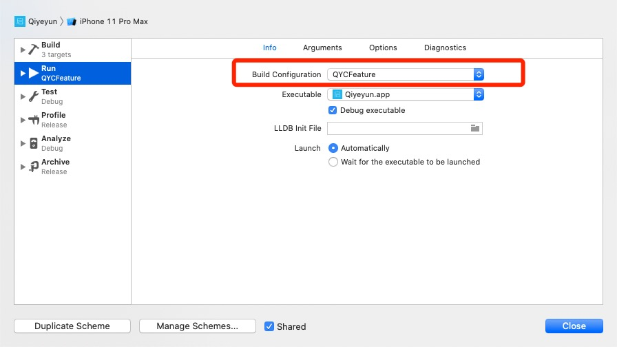
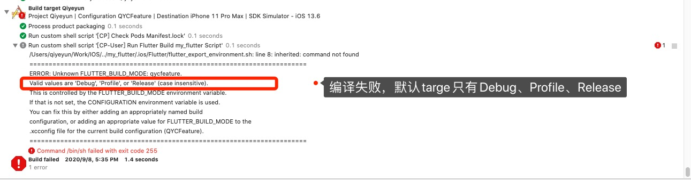
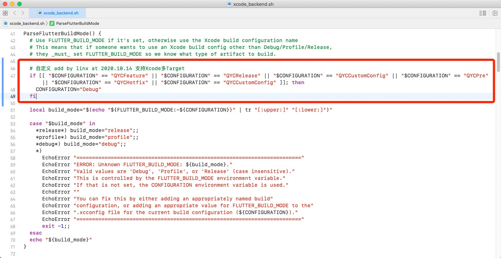
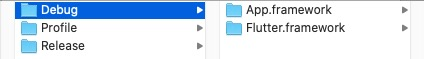

[Flutter中文网 - 将 Flutter module 集成到 iOS 项目](https://flutter.cn/docs/development/add-to-app/ios/project-setup)

[Flutter中文网 - 在 iOS 应用中添加 Flutter 页面](https://flutter.cn/docs/development/add-to-app/ios/add-flutter-screen#create-a-flutterengine)


# 一、创建 Flutter module

```
$ flutter create --template module my_flutter
```


# 二、在你的既有应用中集成 Flutter module

## 选项 A - 使用 CocoaPods 依赖管理和已安装的 Flutter SDK 。（推荐）

1. 在 `Podfile` 中添加下面代码：

   ```
   flutter_application_path = '../my_flutter'
   load File.join(flutter_application_path, '.ios', 'Flutter', 'podhelper.rb')
   ```

2. 每个需要集成 Flutter 的 `Podfile target`，执行 `install_all_flutter_pods(flutter_application_path)`：

   ```
   target 'MyApp' do
     install_all_flutter_pods(flutter_application_path)
   end
   ```

3. 运行 `pod install`。


**【备忘】**

```
当你在 `my_flutter/pubspec.yaml` 改变了 Flutter plugin 依赖，需要在 Flutter module 目录运行 `flutter pub get`，来更新会被`podhelper.rb` 脚本用到的 plugin 列表，然后再次在你的应用目录 `some/path/MyApp` 运行 `pod install`.
```


`podhelper.rb` 脚本会把你的 plugins， `Flutter.framework`，和 `App.framework` 集成到你的项目中。


你应用的 Debug 和 Release 编译配置，将会集成相对应的 Debug 或 Release 的 [编译产物](https://flutter.cn/docs/testing/build-modes)。可以增加一个 Profile 编译配置用于在 profile 模式下测试应用。 ***（这里就引发了踩坑1中描述的问题）***


**【小提示】**

`Flutter.framework` 是 Flutter engine 的框架， `App.framework` 是你的 Dart 代码的编译产物。


## 选项A — 踩坑记录

### 1、无法编译QYCFeature

* **【现场】**






* **【原因】**

Flutter SDK中默认支持Debug、Release、Profile。


* **【解决】**

在Flutter SDK中修改脚本 `Flutter SDK -> flutter -> packages -> flutter_tools -> bin -> xcode_backend.sh` 目录下



```
  # Use FLUTTER_BUILD_MODE if it's set, otherwise use the Xcode build configuration name
  # This means that if someone wants to use an Xcode build config other than Debug/Profile/Release,
  # they _must_ set FLUTTER_BUILD_MODE so we know what type of artifact to build.
  # 自定义 add by linx at 2020.09.08 支持Xcode多Target
  if [[ "$CONFIGURATION" == "QYCFeature" || "$CONFIGURATION" == "QYCRelease" || "$CONFIGURATION" == "QYCCustomConfig" || "$CONFIGURATION" == "QYCPre" || "$CONFIGURATION" == "QYCHotfix" || "$CONFIGURATION" == "QYCCustomConfig" ]]; then
    CONFIGURATION="Debug"
  fi
  local build_mode="$(echo "${FLUTTER_BUILD_MODE:-${CONFIGURATION}}" | tr "[:upper:]" "[:lower:]")"
  local artifact_variant="unknown"
  case "$build_mode" in
    *release*) build_mode="release"; artifact_variant="ios-release";;
    *profile*) build_mode="profile"; artifact_variant="ios-profile";;
    *debug*) build_mode="debug"; artifact_variant="ios";;
    *)
      EchoError "========================================================================"
      EchoError "ERROR: Unknown FLUTTER_BUILD_MODE: ${build_mode}."
      EchoError "Valid values are 'Debug', 'Profile', or 'Release' (case insensitive)."
      EchoError "This is controlled by the FLUTTER_BUILD_MODE environment variable."
      EchoError "If that is not set, the CONFIGURATION environment variable is used."
      EchoError ""
      EchoError "You can fix this by either adding an appropriately named build"
      EchoError "configuration, or adding an appropriate value for FLUTTER_BUILD_MODE to the"
      EchoError ".xcconfig file for the current build configuration (${CONFIGURATION})."
      EchoError "========================================================================"
      exit -1;;
  esac
```


### 2、Xcode编译报错

解决流程：

1. Flutter_moudle项目 `flutter pub get` 后运行；
2. 若Flutter_moudle运行失败，`git reset --hard`， 再  `flutter pub get` ；再运行。

2. Xcode 项目 `pod install` ；
3. Clean
4. Build


## 选项 B - 在 Xcode 中集成 frameworks

除了上面的方法，你也可以创建必备的 frameworks，手动修改既有 Xcode 项目，将他们集成进去。当你组内其它成员们不能在本地安装 Flutter SDK 和 CocoaPods，或者你不想使用 CocoaPods 作为既有应用的依赖管理时，这种方法会比较合适。但是每当你在 Flutter module 中改变了代码，都必须运行 `flutter build ios-framework`。


```
$ flutter build ios-framework --output=../myFlutterApp
```




## 选项B — 踩坑记录

### 1、生成三个环境的Framework导致不能兼容

`flutter build ios-framework` 生成 Debug、Profile、Release 三个环境。

* Debug Frameworks 存在请求崩溃等未知问题，且较为卡顿；

* Release Frameworks 不支持X86架构，无法在模拟器上运行；


后来，综合了下：

使用Release Frameworks与Debug Frameworks中X86模块合并，这样就可以支持模拟器运行了，能运行iOS项目，但打不开Flutter页面。


# 三、在 iOS 应用中添加 Flutter 页面


# 四、Xcode中使用Flutter『热重启』『热加载』


打开Flutter_module项目运行 `flutter attach`，

打开Xcode运行，若失败，重复几次。

出现 `Syncing files to device iPhone 11 Pro Max...` 即为成功

此时Flutter可进行 `Hot Reload` 、`Hot Restart` 、断点等操作；


# 五、调试Dart代码


