# 导图

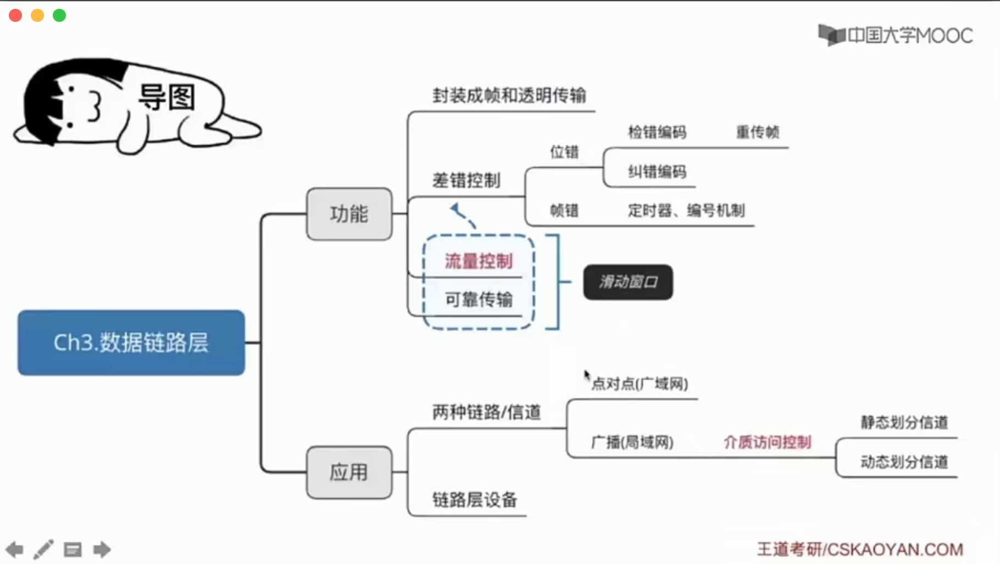

# 数据链路层概述

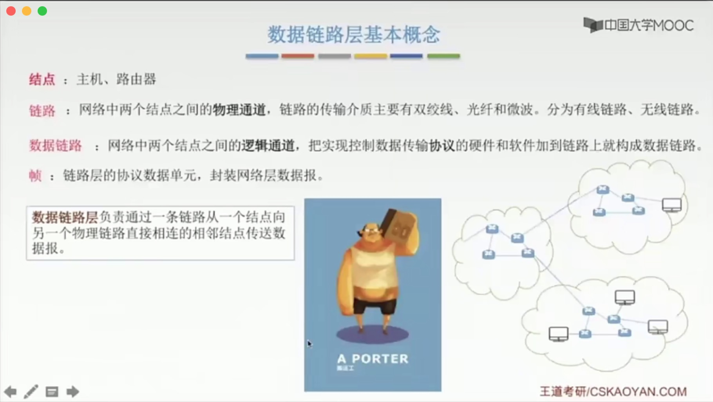

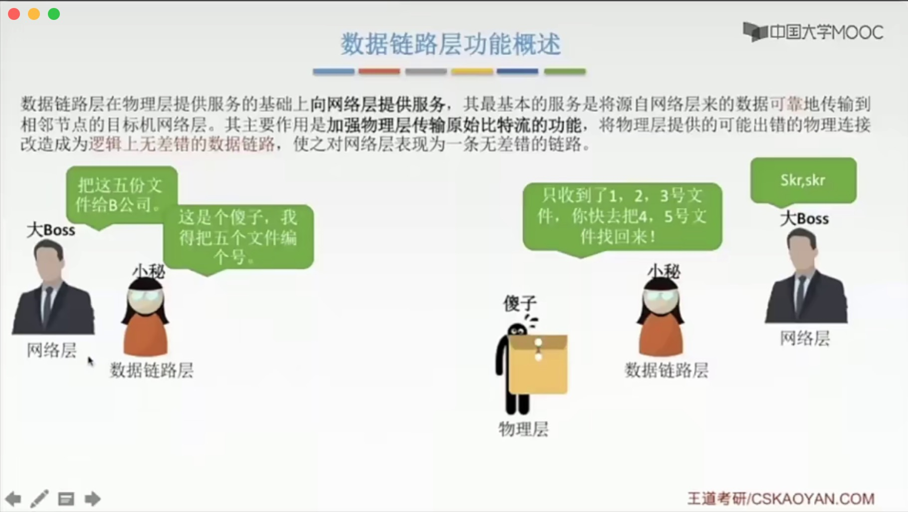

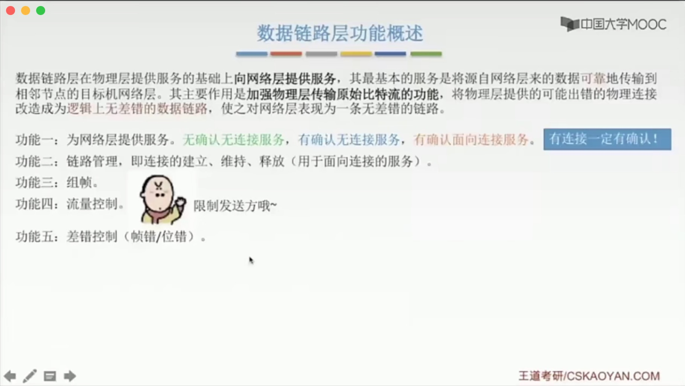

# 封装成帧

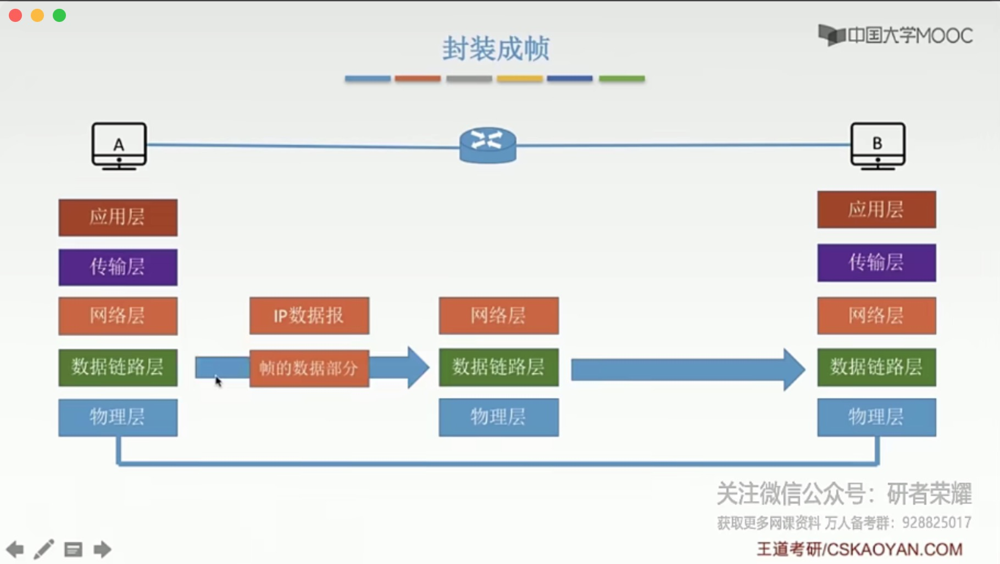

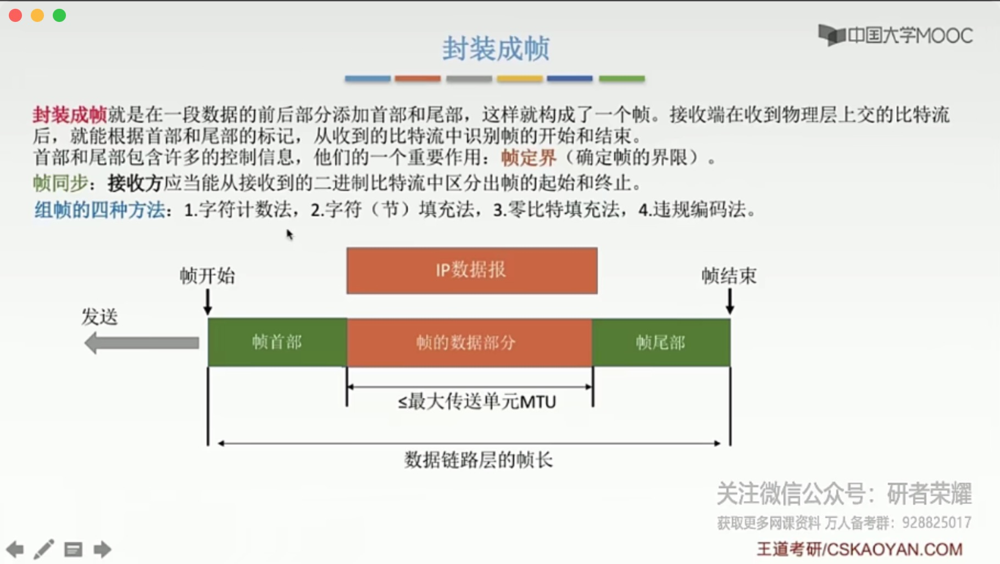

## 透明传输

> 1. 透明传输的概念；
> 2. 如何保证透明传输。

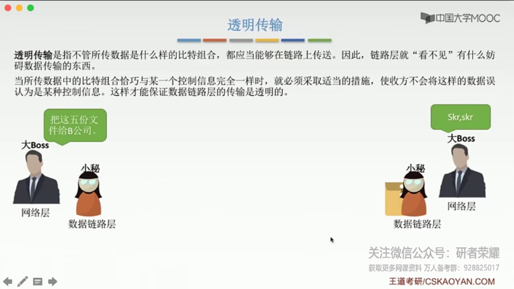

## 透明传输在组帧上的应用

### 1.字符计数法

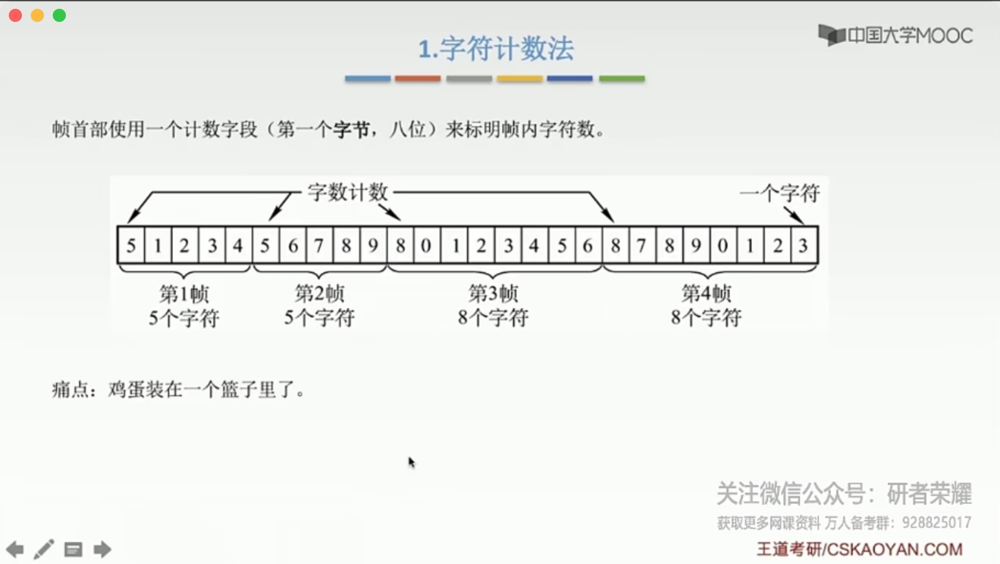

### 2.字符填充法

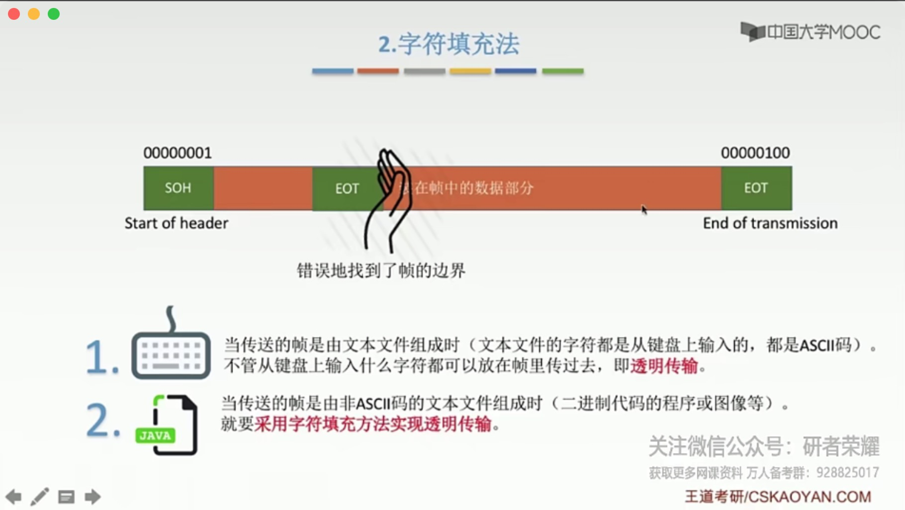

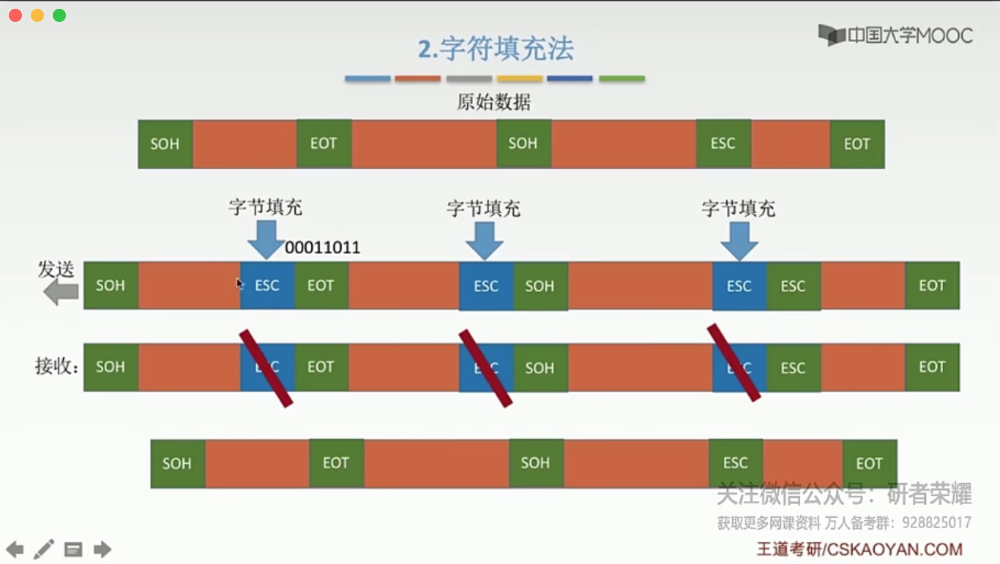

### 3.*零比特填充法

> 固定首尾：0111 1110
>
> 数据组若遇到连续5个1，后面补充一个0，就不会存在与首尾相同的数据了。

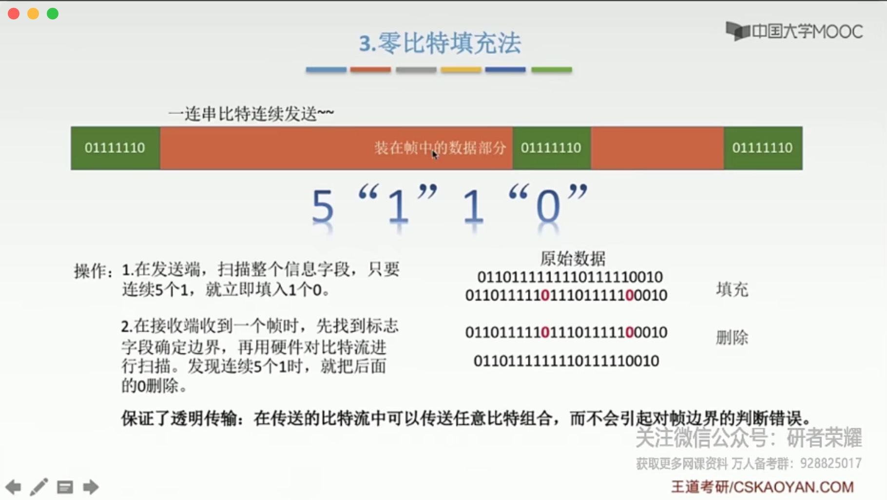

### 4.*违规编码法

> 利用与曼彻斯特编码不同的编码进行区分。

# 差错控制 与 检错编码

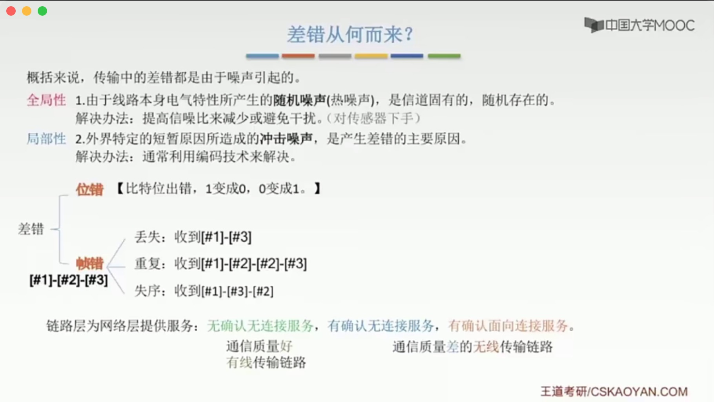

## 比特出错

### 检错编码

#### 奇偶校验码

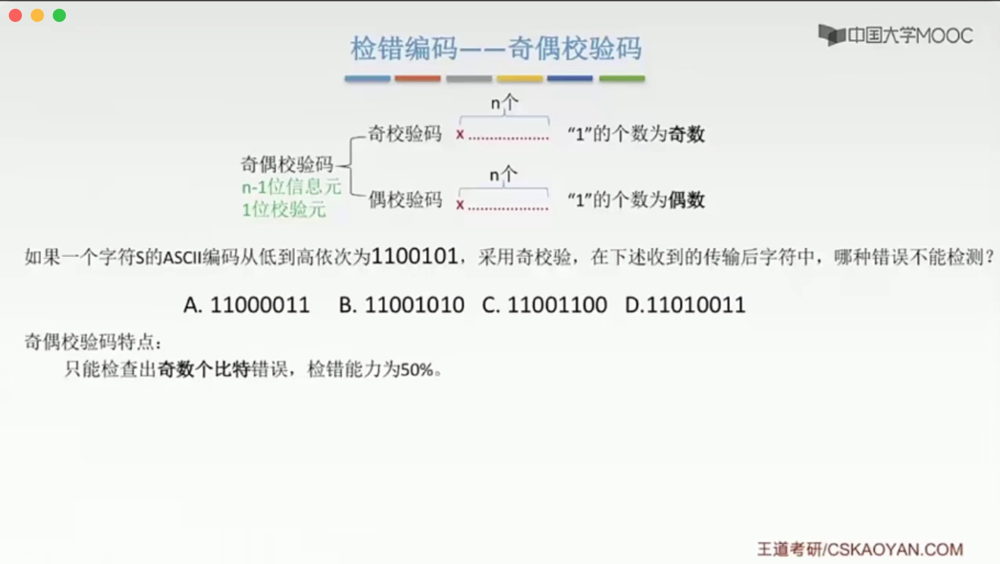

#### CRC循环冗余码

> 需要学会做题。

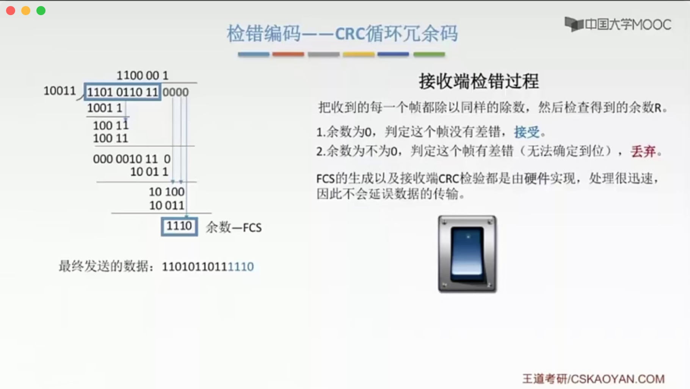

> CRC只是对帧进行丢弃，所以接收端丢失了一个帧，还不是可靠传输，后续还需要进行帧处理。

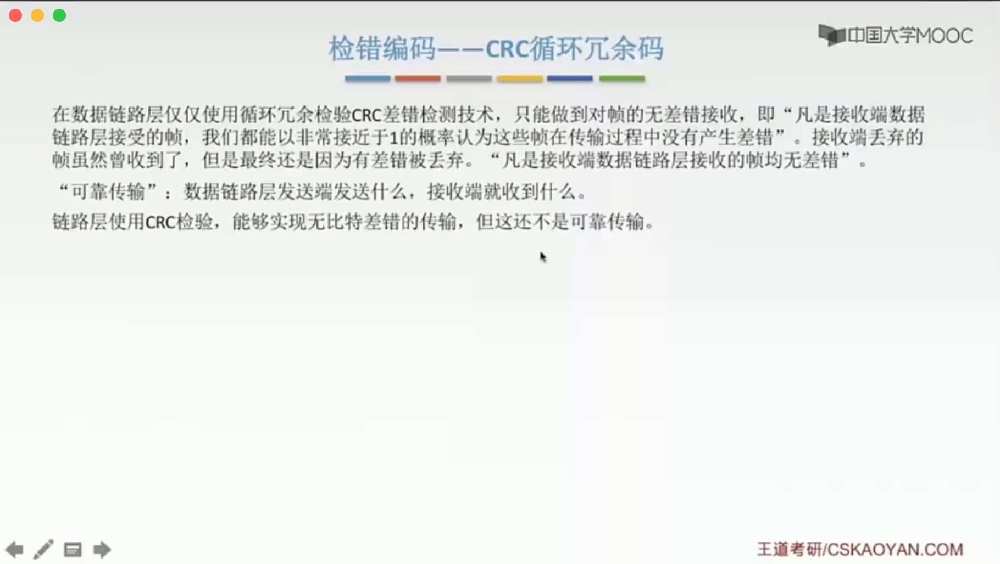

### 纠错编码

#### 海明码

