# 第二章：数据的运算与表示

问：数据如何在计算机中表示？ 

问：运算器如何实现数据的算数、逻辑运算？

## 2.1、进位计数制

详情：《进制转换》

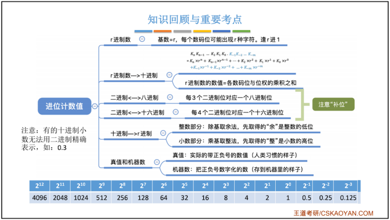

## 2.2、数字的编码 - BCD码

**BCD ：Binary-Coded Decimal，用二进制编码的十进制**：用4位`二进制数`来表示1位`十进制数`中的0~9这10个数码。

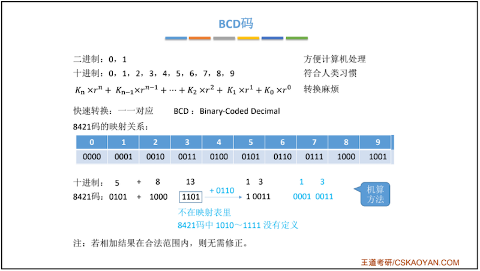

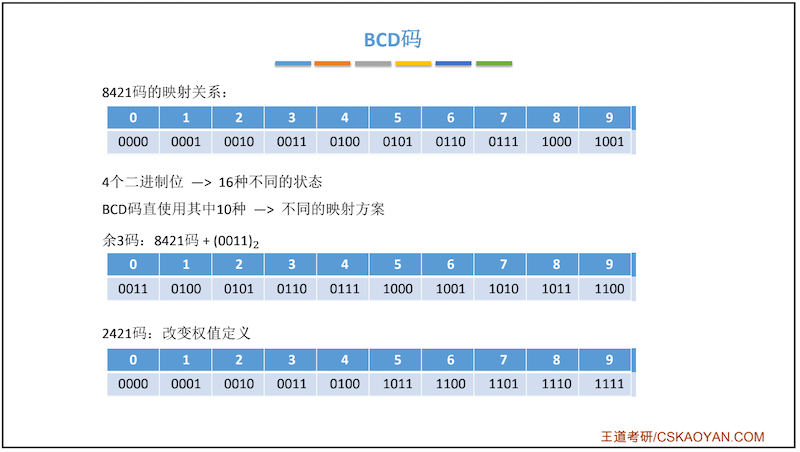

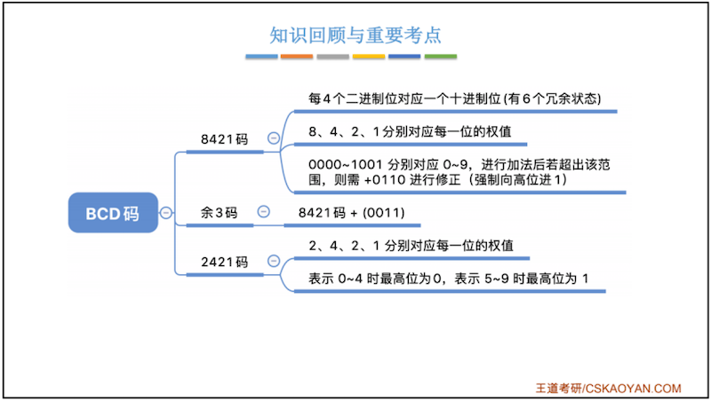

## 2.3、字符与字符串

问：1.英文字符在计算机内的表示？

问：2.中文字符在计算机内的表示？

问：3.字符串的存储？

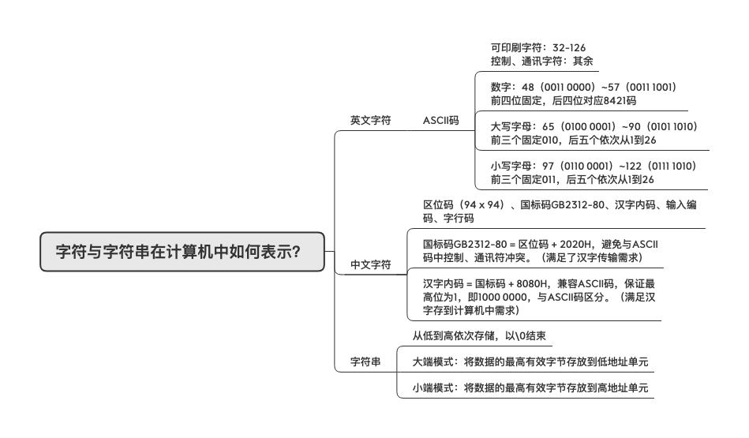

### 2.3.1、ASCII码

​		[ASCII](https://zh.wikipedia.org/wiki/ASCII)编码：**American Standard Code for information Interchange（美国信息交换标准码）**，是基于**拉丁字母**的一套电脑[编码](https://baike.baidu.com/item/编码/80092)系统，主要用于显示现代 *英语*，而其扩展版本[EASCII](https://zh.wikipedia.org/wiki/EASCII)则可以部分支持其他[西欧](https://zh.wikipedia.org/wiki/西欧)[语言](https://zh.wikipedia.org/wiki/语言)，并等同于国际标准[ISO/IEC 646](https://zh.wikipedia.org/wiki/ISO/IEC_646)。ASCII第一次以规范标准的类型发表是在1967年，最后一次更新则是在1986年，到目前为止共定义了128个字符 。

​		ASCII码是7位编码，它的二进制取值范围：`0000000 ~ 1111111` ，对应十六进制为：`00h ~ 7Fh`，一共规定了128个字符的编码，ASCII码虽然是7位，但存储依旧是8位存储。只占用了一个字节的后面7位，最前面的一位统一规定为`0`。

​		标准的ASCII至今为止共定义了128个字符，其中33个不可显示字符，95个可现实字符。

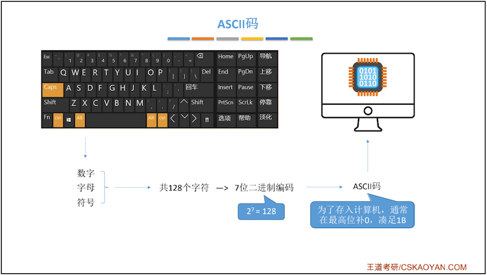

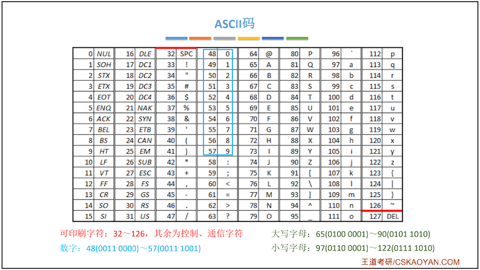

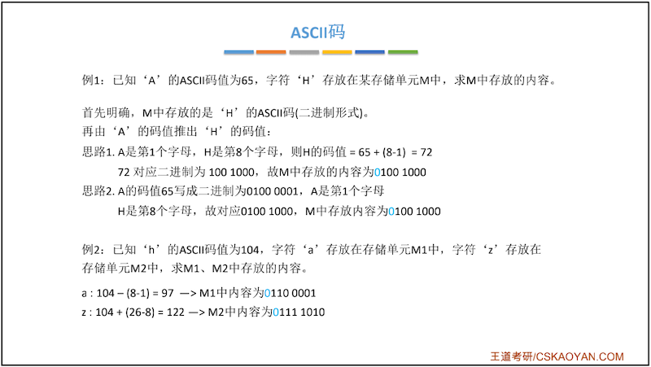

### 2.3.2、汉字的表示与编码

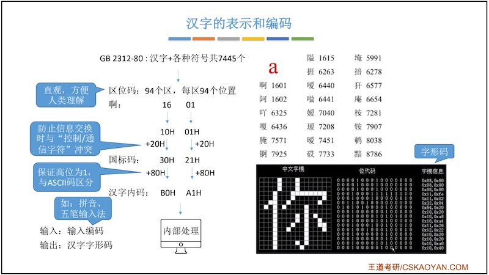

#### 中文字符集介绍

**GB2312–80编码**：1980年发布，1981年5月1日实施的简体中文汉字编码国家标准《信息交换用汉字编码字符集–基本集》即**国标码**。GB2312对汉字采用双字节编码，收录7445个图形字符，其中包括6763个汉字。

**BIG5编码**：台湾地区繁体中文标准字符集，采用双字节编码，共收录13053个中文字，1984年实施。

**GBK编码**：1995年12月发布的汉字编码国家标准，是对GB2312编码的扩充，对汉字采用双字节编码。GBK字符集共收录21003个汉字，包含国家标准GB13000-1中的全部中日韩汉字，和BIG5编码中的所有汉字。

**GB18030编码**：2000年3月17日发布的汉字编码国家标准，是对GBK编码的扩充，覆盖中文、日文、朝鲜语和中国少数民族文字，其中收录27484个汉字。GB18030字符集采用单字节、双字节和四字节三种方式对字符编码。兼容GBK和GB2312字符集。

**Unicode编码**：国际标准字符集，它将世界各种语言的每个字符定义一个唯一的编码，以满足跨语言、跨平台的文本信息转换。

#### 汉字的表示和编码

参考文档：[汉字编码表示与显示](chrome-extension://cdonnmffkdaoajfknoeeecmchibpmkmg/assets/pdf/web/viewer.html?file=https%3A%2F%2Fd1.amobbs.com%2Fbbs_upload782111%2Ffiles_35%2Fourdev_606868FF22L8.pdf)

汉字编码分为输入码、国标码、区位码、机内码和字形码。

* 输入码（外码）：是用来将汉字输入到计算机中的一组键盘符号。按输入码编码的主要依据，大体可分为顺序码、音码、形码、音形码四类，常用的输入码有拼音码、五笔字型码等，如“保”字，用全拼，输入码为“BAO”，用区位码，输入码为“1703 ”，用五笔字型则为“WKS”。

* 国标码：我国国家标准局于1981年5月颁布了《信息交换用汉字编码字符集——基本集》，代号为GB2312-80，共对6763个汉字和682个图形字符进行了编码，其编码原则为：汉字用两个**字节**表示，每个字节用七位码（高位为0）。

* 区位码：是国标码的另一种表现形式。在国标GB2312-80中，国标码除了用双七位二进制表示外，还可以表示成区位码的形式。即在国标代码表中，将行号称为区号，列号称为位号，分别有94个区和94个位。区号和位号用十进制表示，不足两位前面补0。这样每个汉字或符号都可用4位十进制表示。区位码因此可以用来作输入码。是汉字输入的基本编码方法之一。如“保”字在二维代码表中处于17区第3位，区位码即为“1703 ”。

* 机内码：国标码是汉字信息交换的标准编码，但因其前后字节的最高位为0，与ASCII码发生冲突，如“保”字，国标码为31H和23H，而西文字符“1”和“#”的ASCII也为31H和23H，现假如内存中有两个字节为31H和23H，这到底是一个汉字?还是两个西文字符“1”和“#”于是就出现了二义性，显然，国标码是不可能在计算机内部直接采用的，于是，汉字的机内码采用变形国标码，其变换方法为：将国标码的每个字节都加上128，即将两个字节的最高位由0改1，其余7位不变，如：由上面我们知道，“保”字的国标码为3123H，前字节为00110001B，后字节为00100011B，高位改1为10110001B和10100011B 即为B1A3H，因此，汉字的机内码就是B1A3H。

  显然，汉字机内码的每个字节都大于128，这就解决了与西文字符的ASCII码冲突的问题。

* 字形码：是汉字的输出码，输出汉字时都采用图形方式，无论汉字的笔画多少，每个汉字都可以写在同样大小的方块中。通常用16×16点阵来显示汉字。

##### 区位码与国标码的转换

> 十进制区位码 转 十六禁止 
>
> 国标码 = 区位码16 ＋ 2020H
>
> eg：“保”字的国标码为3123H，它是经过下面的转换得到的：1703D -> 1103H -> +2020H -> 3123H。

##### 国标码与机内码的转换

>  机内码 = 国标码 + 8080H
>
> eg：“保”字的国标码为3123H，转换得到机内码：3123H + 8080H = B1A3H

### 2.3.3、字符串

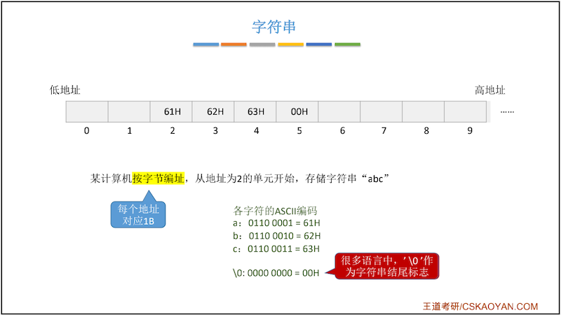

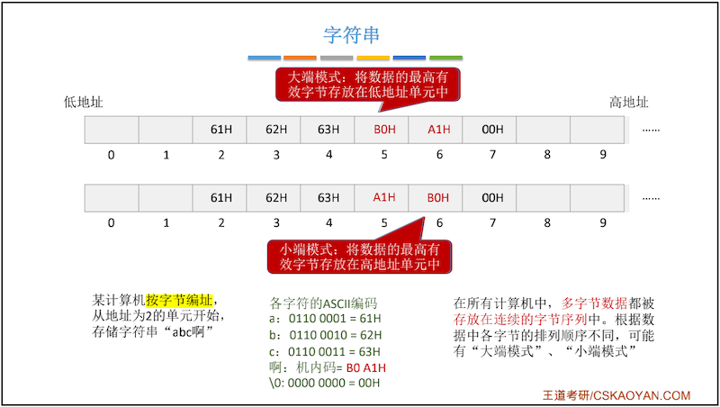

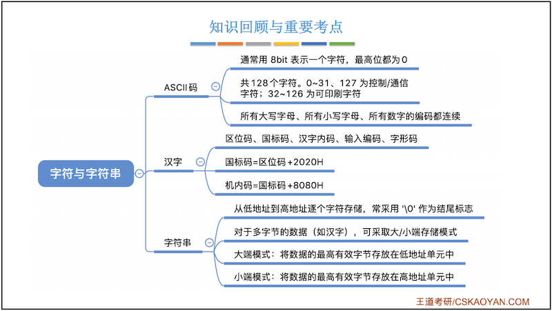

