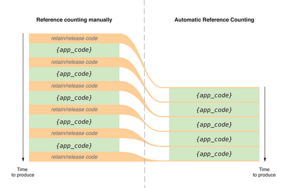

* [1.1、iOS内存机制](#1.1)
	* [1.1.1、简述OC内存管理机制](#1.1.1)
	* [1.1.2、对MRC和ARC的理解，什么是ARC？ARC基本原理？ARC是为了解决什么问题诞生的？ARC不足的地方？](#1.1.2)
	* [1.1.3、与retain配对使用的方法是dealloc还是release，为什么？需要与alloc配对使用的方法是dealloc还是release，为什么？](#1.1.3)
	* [1.1.4、为什么说Objective-C是一门动态的语言？iOS的动态性？](#1.1.4)
	
	* [1.1.5、ARC情况下，编译的时候，系统是怎么添加相关内存管理的代码](#1.4)
	* [1.、对于Objective-C，你认为它最大的优点和最大的不足是什么？对于不足之处，现在有没有可用的方法绕过这些不足来实现需求。如果可以的话，你有没有考虑或者实践过重新实现OC的一些功能，如果有，具体会如何做？]()
	
* [1.2、@property属性](#1.2)
	* [1.2.1、@property 的本质是什么？ivar、getter、setter 是如何生成并添加到这个类中的？](#1.2.1)
	* [1.2.2、@synthesize 和 @dynamic 分别有什么作用？](#1.2.2)
	* [1.2.3、如何自己重写 setter / getter?](#1.2.3)
	* [1.2.4、@property中有哪些属性关键字？默认的关键字是什么？](#1.2.4)
	* [1.2.4.1、属性关键字 readwrite，readonly，assign，retain，copy，nonatomic 、atomic、strong、weak、unsafe_unretained 各是什么作用，在哪种情况下用？](#1.2.4.1)
	* [1.2.5、写一个 setter 方法用于完成 `@property (nonatomic, retain) NSString *name;`，写一个 setter 方法用于完成 `@property (nonatomic, copy) NSString *name;`](#1.2.5)
	* [1.2.6、什么情况使用 weak 关键字？相比 assign 有什么不同？](#1.2.6)
	* [1.2.7、为什么assign不推荐用于修饰对象？](#1.2.7)
	* [1.2.7.1、什么是空指针、野指针？如何产生野指针？](#1.2.7.1)
	* [1.2.7.2、野指针的定位](#1.2.7.2)
	* [1.2.8、为什么我们常见的delegate属性都用是assign而不是retain/strong？](#1.2.8)
	* [1.2.8.1、为什么很多内置类如UITableViewControl的delegate属性都是assign而不是retain？请举例](#1.2.8.1)
	* [1.2.8.2、delegate的内存管理属性是weak还是assign？](#1.2.8.2)
	* [1.2.9、怎么用 copy 关键字？block用copy修饰吗？可以用其他修饰符吗？](#1.2.9)
	* [1.2.10、用@property声明的 NSString / NSArray / NSDictionary 经常使用 copy 关键字，为什么？如果改用strong关键字，可能造成什么问题？](#1.2.10)
	* [1.2.11、这个写法会出什么问题：`@property (copy) NSMutableArray *arr;`](#1.2.11)
	* [1.2.12、如何让自己的类用 copy 修饰符？](#1.2.12)
	* [1.2.13、对于深拷贝和浅拷贝的理解，系统对象 NSString/NSMutableString/NSArray/NSMutableArray 的 copy 与 mutableCopy 方法](#1.2.13) 
	* [1.2.14、类变量的 @public，@protected，@private，@package 声明各有什么含义？](#1.2.14)
   		
    
* [1.3、autoreleasePool](#1.3)
	* [1.3.1、谈谈你对autoreleasePool自动释放池的理解，自动释放池的原理](#1.17)
	* [1.3.2、autoreleasePool自动释放池在 MRC和ARC 下的区别](#1.17)
	* [1.、不⼿动指定autoreleasepool的前提下，⼀个autorealese对象在什么时刻释放？]()
	* [1.3.3、多层自动释放池嵌套的对象在哪一层释放]()
	* [1.3.4、autoreleasePool自动释放池的应用场景]()
	* [1.3.5、autorelease对象在什么时机会被调用release]()
	* [1.3.6、方法里有局部对象， 出了方法后会立即释放吗]()

* [1.4、iOS中的方法](#1.4)   
	* [1.4.1、+(void)load; +(void)initialize；区别？有什么用处？initialize方法如何调用,以及调用时机](#1.4.1)
	* [1.4.2、谈谈instancetype和id的异同？id和NSObject＊的区别？id 声明的对象有什么特性？](#1.4.2)
	* [1.4.3、UIView和CALayer是啥关系？](#1.4.3)
	* [1.4.4、isKindOfClass和isMemberOfClass的区别？](#1.4.4)
	* [1.4.5、frame 和 bounds 有什么不同？frame 和 bounds 分别是用来做什么的？frame 和 bound 一定都相等么？如果有不等的情况，请举例说明](#1.4.5)
	* [1.、loadView是干嘛用的？viewWillLayoutSubView你总是知道的]()
	* [1.、imageName和mageWithContextOfFile的区别?哪个性能高]()
	* [1.、drawRect与layout]()
	* [1.、setNeedsDisplay]()

* [1.5、iOS编程中一些基础]()    
	* [1.、数据持久化存储方案有哪些？]()
	* [1.、沙盒的目录结构是怎样的？各自一般用于什么场合？]()
	* [1.、介绍下内存的几大区域？内存中的栈和堆的区别是什么？那些数据在栈上，哪些在堆上？]()
	* [1.、#import跟 #include 有什么区别，@class呢，#import<> 跟 #import””有什么区别？]()
	* [1.、#define和const定义的变量，有什么区别？]()
	* [1.、static有什么作⽤?]()   
	* [1.、iOS逆向传值的几种方法整理]()
	* [1.、浅谈iOS开发中方法延迟执行的几种方式]()
	* [1.、怎样实现一个singleton的类？单例的好处与坏处？如何释放一个单例类？]()
	* [1.1、如何令⾃⼰所写的对象具有拷⻉功能?]()
	* [1.、如何重写类方法]()
	* [1.、什么是谓词？谓词过滤]()
	* [1.、NSString存储类型]()
	* [1.、NSCache与可变集合有几点不同]()
	* [1.、UITableView的重用机制]()
	* [1.、请用简单的代码展示@protocol的定义及实现.]()
	* [1.、协议是什么?有什么作用?]()
	* [1.、简述NotificationCenter、KVC、KVO、Delegate？并说明它们之间的区别？]()
    
* [1.6、iOS中一些机制和原理]()   
    * [1.、简单介绍下APNS]()
    * [1.、谈谈事件响应链，如何响应view之外的事件]()
    * [1.、事件传递链，页面上一个按钮，按钮和它的superView有一样的action,为什么只执行button的action?]()
    * [1.、iOS里面的手势是如何实现的?]()
    * [1.、main()之前的过程有哪些？]()
    * [1.、简单说一下APP的启动过程,从main文件开始说起。]()
    * [1.、UIViewController的生命周期， 应用的生命周期]()
    
* [1.7、其他]()    
	* [1.3、iOS中nil 、Nil、 NULL 、NSNull，你真的了解吗？]() 
    * [1.、c++引用和指针区别]()
    * [1.、静态库的原理是什么？你有没有⾃⼰写过静态编译库，遇到了哪些问题？]()
    * [1.、描述一个你遇到过的retain cycle例子。如何避免retain cycle]()
    * [1.、计时器有哪些？NSTimer创建后，会在哪个线程运行？如何让计时器调用一个类方法？]()
    * [1.、你是否接触过OC中的反射机制？简单聊一下概念和使用，反射函数？]()
    * [1.、使用CADisplayLink、NSTimer有什么注意点？]()


<h1 id="1.1">1.1、iOS内存机制</h1>

<h2 id="1.1.1">1.1.1、简述OC内存管理机制</h2>

* 内存管理规则

|Objective-C对象的动作 | Objective-C对象的方法|
|----|----|
|1. 创建一个对象并获取它的所有权 | alloc/new/copy/mutableCopy (RC = 1) |
|2. 获取对象的所有权|retain (RC + 1)|
|3. 放弃对象的所有权|release (RC - 1)|
|4. 释放对象|dealloc (RC = 0 ，此时会调用该方法)|

OC使用了一种叫做引用计数的机制来管理内存中的对象。OC中每个对象都对应着他们自己的引用计数，引用计数可以理解为一个整数计数器，系统判断对象要不要回收的唯一依据就是`RC ?= 0`。

当使用alloc方法创建对象的时候，此时 RC=1；当retain这个对象时，此时RC+1=2；由于调用alloc/retain一次，所以需要release这个对象两次，此时RC=0；而当RC=0时，系统会自动调用dealloc方法释放对象。

* 引用计数的机制分为：

	* 手动引用计数MRC(Manual Reference Counting)：从OS X Lion和iOS 5开始，不再需要程序员手动调用retain和release方法来管理Objective-C对象的内存

	* 自动引用计数ARC(Automatic Reference Counting)：它让编译器来代替程序员来自动加入retain和release方法来持有和放弃对象的所有权。
􏱃􏱄􏴫􏰞􏳫􏴬􏴀􏴭􏱄􏱷􏲮􏰈􏳹􏱨􏳠􏲆􏲇􏱇􏱈􏱢􏰈􏱤􏱥




在MRC中会引起引用计数变化的关键字有：alloc，retain，copy，release，autorelease。（strong关键字只用于ARC，作用等同于retain）

* 内存管理之属性关键字
	* 1、原子操作相关： atomic(默认，线程操作安全)、nonatomic
	* 2、内存管理相关：assign、weak、copy、strong(默认)、unsafe_unretained
	* 3、读写操作：readwrite(默认，表示既有getter方法，也有setter方法)、readonly(表示只有getter方法)


* 内存管理相关：assign、weak、copy、strong(默认)、unsafe_unretained
	* assign “设置方法” 只会针对“纯量类型”（scalar type， CGFloat或NSInteger等）的简单赋值操作
	* retain(MRC)/strong(ARC) “拥有关系” 为这种属性设置新值时，设置方法先保留新值，并释放旧值，然后再将新值设置上去
	* weak “非拥有关系” 为这种属性设置新值时，设置方法既不保留新值，也不释放旧值。此特质同assign类似，然而属性所指的对象遭到摧毁时，属性也会被清空(nil out)
	* unsafe_unretained 此特质的语义和assign相同，但是它适用于“对象类型”（object type），该特质表达一种“非拥有关系”（“不保留”，unretained），当目标对象遭到摧毁时，属性值不会自动清空（“不安全”，unsafe），这一点与weak有区别
	* copy 此特质所表达的所属关系与strong类似。然而设置方法并不保留新值，而是将其“拷贝”（copy）。当属性类型为NSString *时，经常使用此特质来保护其封装性，因为传递给设置方法的新值可能指向一个NSMutableString类的实例，而NSMutableString是NSString的子类，表示一种可以修改的其值的字符串，此时若是不拷贝字符串，那么设置完属性之后，字符串的值就可能会在对象不知情的情况下被修改。


* 在ARC环境中，id类型和对象类型与c语言类型不同，它的类型上必须附加 **所有权修饰符ownership qualifiers** 其中一个来修饰：

```
__strong(默认，如果不指定其他，编译器就默认加入)
__weak
__unsafe_unretained
__autoreleasing
```

* 属性与所有权修饰符的对应关系

| 属性声明的属性 Property modifier | 所有权修饰符 Ownership qualifier|
|----|----|
|strong|__strong|
|retain|__strong|
|copy|__strong|
|weak|__weak|
|assign|`__unsafe_unretained`|
|unsafe_unretained|`__unsafe_unretained`|


* 对所有权修饰词深层次理解 -- [浅谈 iOS ARC 内存管理](https://cloud.tencent.com/developer/article/1397994)

>**`__strong`**
>
>`__strong` 表示强引用，对应定义 property 时用到的 strong。当对象没有任何一个强引用指向它时，它才会被释放。如果在声明引用时不加修饰符，那么引用将默认是强引用。当需要释放强引用指向的对象时，需要保证所有指向对象强引用置为 nil。__strong 修饰符是 id 类型和对象类型默认的所有权修饰符。


>**`__weak`**
>
>`__weak` 表示弱引用，对应定义 property 时用到的 weak。弱引用不会影响对象的释放，而当对象被释放时，所有指向它的弱引用都会自定被置为 nil，这样可以防止野指针。__weak 最常见的一个作用就是用来避免强引用循环。
>
>**`__weak`** 的几个使用场景：
>
> 1. 在 Delegate 关系中防止强引用循环。在 ARC 特性下，通常我们应该设置 Delegate 属性为 weak 的。但是这里有一个疑问，我们常用到的 UITableView 的 delegate 属性是这样定义的： @property (nonatomic, assign) id<UITableViewDelegate> delegate;，为什么用的修饰符是 assign 而不是 weak？其实这个 assign 在 ARC 中意义等同于 __unsafe_unretained（后面会讲到），它是为了在 ARC 特性下兼容 iOS4 及更低版本来实现弱引用机制。一般情况下，你应该尽量使用 weak。
2. 在 Block 中防止强引用循环。
3. 用来修饰指向由 Interface Builder 创建的控件。比如：@property (nonatomic, weak) IBOutlet UIButton *testButton;。


>**`__unsafe_unretained`**
>
>ARC 是在 iOS5 引入的，而 `__unsafe_unretained` 这个修饰符主要是为了在 ARC 刚发布时兼容 iOS4 以及版本更低的系统，因为这些版本没有弱引用机制。这个修饰符在定义 property 时对应的是 unsafe_unretained。`__unsafe_unretained` 修饰的指针纯粹只是指向对象，没有任何额外的操作，不会去持有对象使得对象的 retainCount +1。而在指向的对象被释放时依然原原本本地指向原来的对象地址，不会被自动置为 nil，所以成为了野指针，非常不安全。
>
>**`__unsafe_unretained`** 的应用场景：
>
>在 ARC 环境下但是要兼容 iOS4.x 的版本，用 `__unsafe_unretained` 替代 `__weak` 解决强引用循环的问题。


> **`__autoreleasing`**
>
> 在 ARC 模式下，我们不能显示的使用 autorelease 方法了，但是 autorelease 的机制还是有效的，通过将对象赋给 __autoreleasing 修饰的变量就能达到在 MRC 模式下调用对象的 autorelease 方法同样的效果。
>
>**`__autoreleasing`** 修饰的对象会被注册到 Autorelease Pool 中，并在 Autorelease Pool 销毁时被释放。
>
>注意：定义 property 时不能使用这个修饰符，因为任何一个对象的 property 都不应该是 autorelease 类型的。


