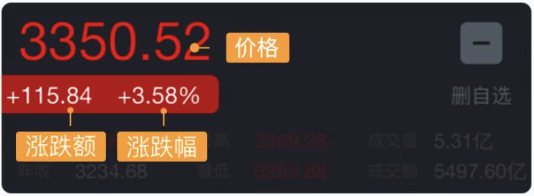
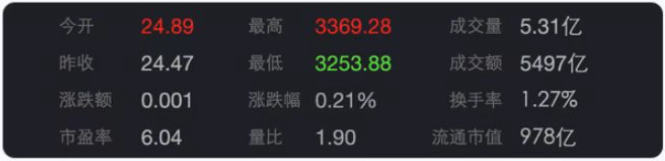
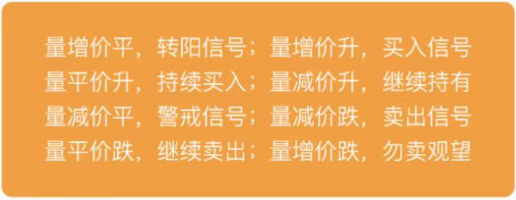
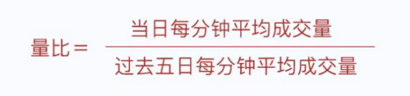
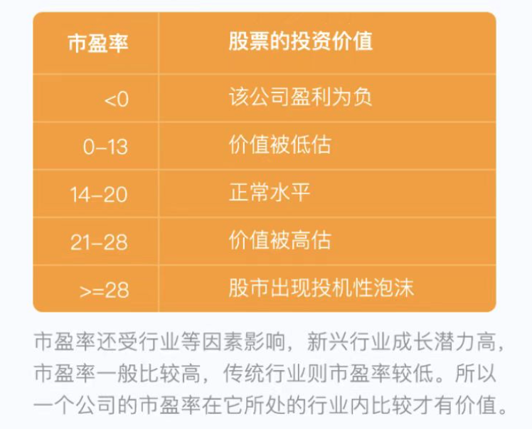

# 交易时间

> **周末** 及 **法定节假日** ***休市***

# 行情数据

三大数据： 影响股价交易的最重要的数据。

其他数据： 股民分析参考的重要标准。

## 三大行情数据

### 价格

> 股票的当前价格。是由市场需求决定的。

### 涨跌幅

> 当前价比收盘涨了多少钱或跌了多少钱。（+ 涨， - 跌）

#### 涨跌幅限制

> 沪深交易所规定股票涨跌幅度不🉐超过正负10%。
>
> ps: 刚上市的新股，第一天涨幅不会超过44%。

### 涨跌额

> 当前价相对于上一个收盘价的涨跌幅度。

## 其他数据

### 今开

> 开盘之前的 9:15 - 9:25为集合竞价时间，集合竞价的报单由交易所统一撮合成交，产生了今天的开盘价。
>
> 开盘价高于昨日收盘价，就是『高开』，说明今日买方情绪比较激烈，利于股价上涨。反之，则是『低开』。

### 昨收

> 上个交易日的收盘价格。
>
> 收盘价是市场经过一天博弈产生的结果，具有重要的参考意义，是预判某一天行情的标准。

### 最高最低

> 当天交易里最高和最低的交易价格。

### 成交量

> 当天交易成交了多少股数。
>
> 在沪深市场，成交量一般以『手』为单位。
>
> 1手 = 100股
>
> 买股票的时候最少买1手

### 成交额

> 股票当天成交的金额。
>
> 成交额受股票流通的规模、投资者对股票的热情、市场的整体热度等多方面因素影响。

### 量比

> 量比是短线操作的秘密武器。
>
> 当量比大于1时，说明交易比过去5日火爆；
>
> 当量比小于1时，说明成交在萎缩。

### 换手率

> 一只股票当天的成交额占其整个流通金额的比率。
>
> 某只换手率越大，说明股票交易越活跃，也蕴含更多的投资机会！

### 市盈率

> 市盈率反映该股的投资价值。
>
> 市盈率越高，说明股价被高估，可能有泡沫；
>
> 市盈率越低，说明估计被低估。
>
> 每股价格 / 每股收益 = 市盈率

### 流通市值

> 行话看盘子大小，就是指的流通市值。
>
> 一般来说，流通市值大的公司一般股票偏于稳定；
>
> 流通市值小的公司则易于炒作。
>
> 可交易的流通股本 X 当时股价 = 流通市值

### 外盘

> 主动买进
>
> 主动去适应卖方的价格成交的，就是红色，叫外盘。
>
> 一般外盘意味着看涨。

### 内盘

> 主动卖出
>
> 主动迎合买方的价格成交的，就是绿色，叫内盘。
>
> 一般内盘意味着看跌。

