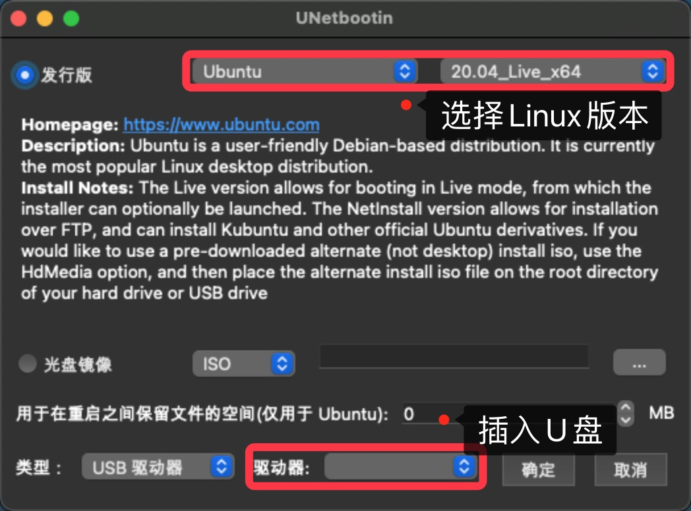
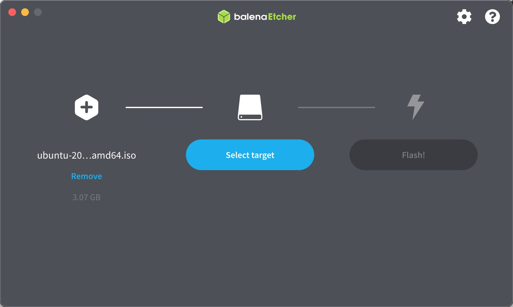
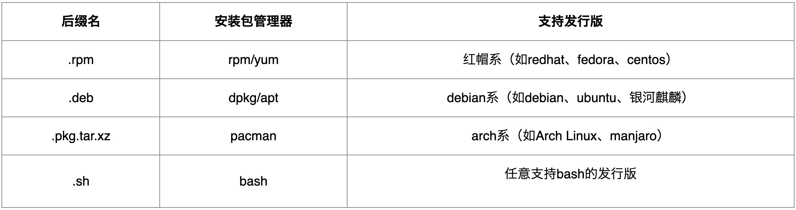

# 下载Ubuntu镜像

* Ubuntu官网 https://ubuntu.com/download
* Ubuntu Release发行版官网 http://releases.ubuntu.com/20.04/
* 推荐：UNetbootin https://unetbootin.github.io/
  * UNetbootin工具管理多种Linux系统以及多个版本！！

## 推荐：UNetbootin

* 可直接插入U盘下载，制作启动盘！！

* 或者先现在镜像，获取下载地址后，使用迅雷下载更快！！！再用balenaEtcher制作启动盘！！！

# 制作启动盘

## 推荐：balenaEtcher

* https://www.balena.io/etcher/
* 选择刚刚下载的镜像，再选择刚刚的U盘作为目标，制作启动盘！！

# 安装Ubuntu

* 设置U盘为第一启动项，F2进入Bios
* 重启，一步步安装即可！！

# 安装包分类

* apt：Advanced Packaging Tool（apt）是[Linux](https://baike.baidu.com/item/Linux/27050)下的一款安装包[管理工具](https://baike.baidu.com/item/管理工具/9143974)，是一个客户/[服务器系统](https://baike.baidu.com/item/服务器系统/2997788)。

* [Linux apt基本知识](https://www.runoob.com/linux/linux-comm-apt.html)

* 软件后缀分类

  

# 翻墙 - V2ray

# Github

* 先安装git
  * `$ sudo apt install git`
* 创建ssh key
  * `$ ssh-keygen -t rsa -C "email@qq.com" `
* 拷贝`id_rsa.pub`里的公钥，前往[Github - ssh]()设置

