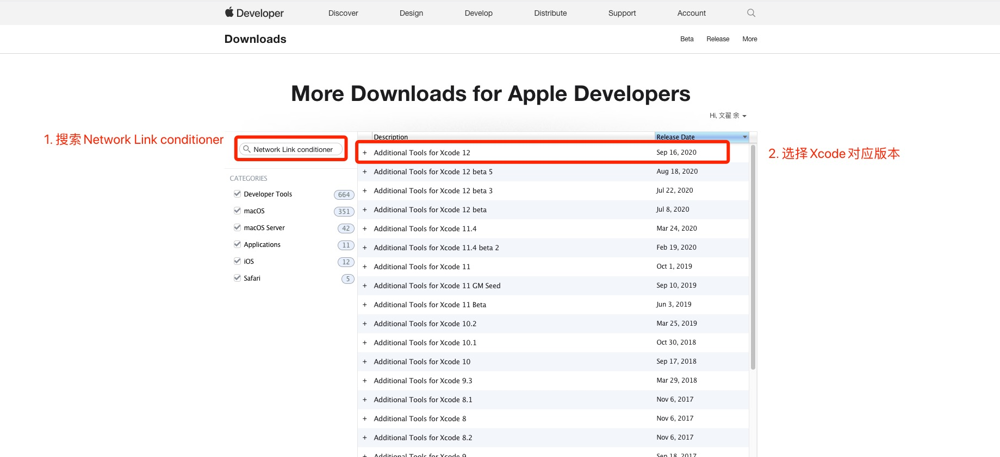
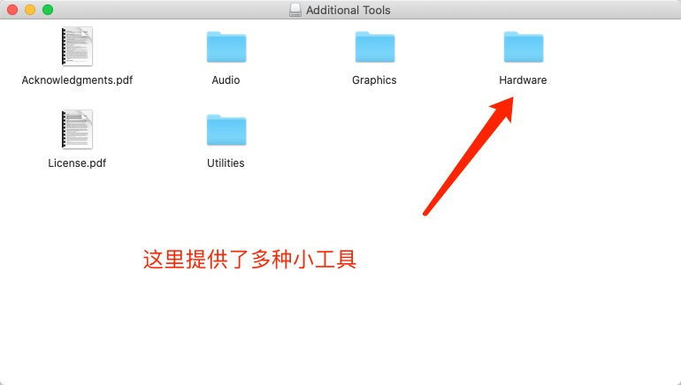
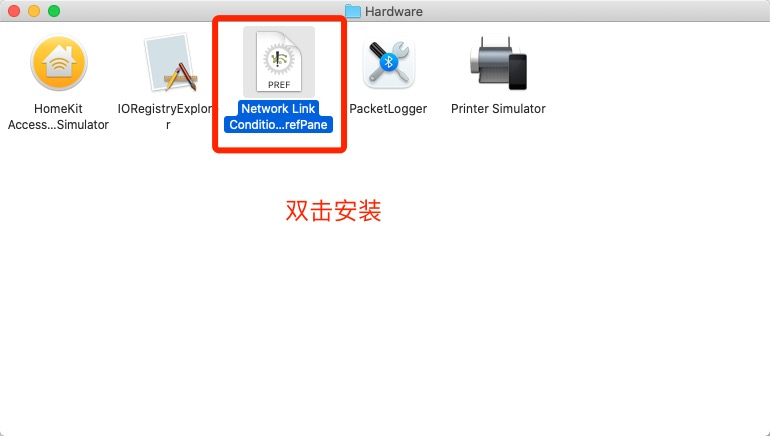
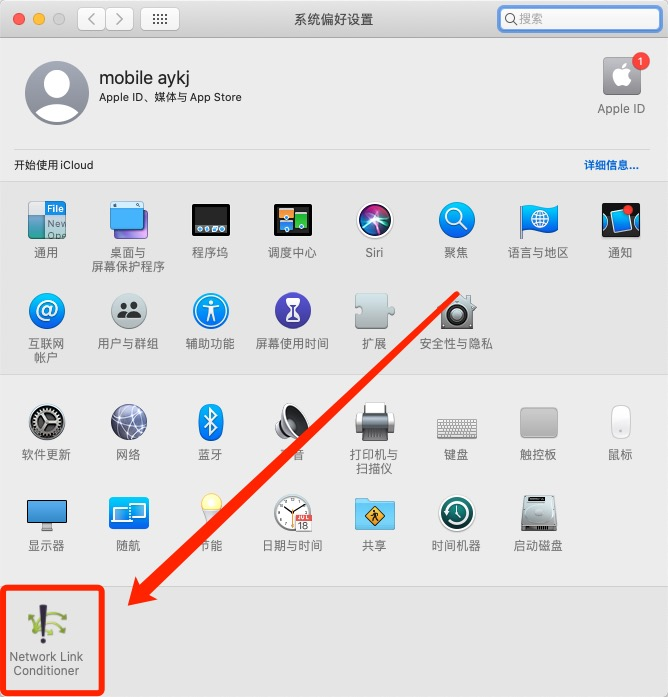
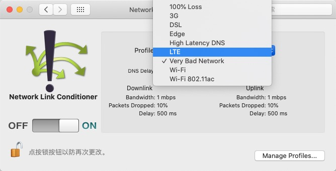

# 一、Mac模拟弱网

在 Mac 机器上可以利用 **Network Link Conditioner** 模拟一个弱网络环境。

### 1. 前往下载 Additional_Tools_for_Xcode_12.dmg

* [Apple Developer - More Downloads for Apple Developers](https://developer.apple.com/download/more/)

### 2. 安装 Network Link Conditioner

打开 Additional_Tools_for_Xcode_12.dmg，这里给我们提供了许多小工具，我们需要的 Network Link Conditioner 在 Hardware 下

