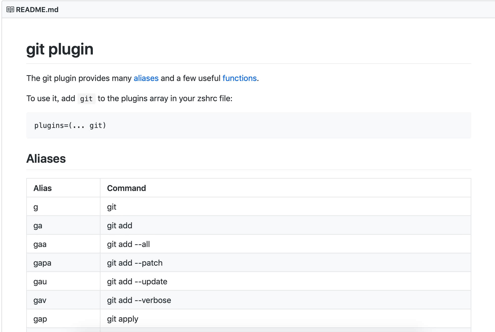
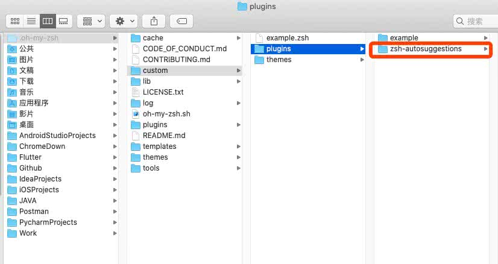

[官网 - https://ohmyz.sh](https://ohmyz.sh)

[GitHub - oh-my-zsh](https://github.com/robbyrussell/oh-my-zsh)


## 一、Shell介绍

可阅读我的另一篇 [Shell入门](https://github.com/lionsom/iOS-/blob/master/Shell学习/Shell入门.md)


## 二、安装Zsh

### 2.1、官网推荐两种方式：

* via curl

```
sh -c "$(curl -fsSL https://raw.githubusercontent.com/robbyrussell/oh-my-zsh/master/tools/install.sh)"
```

* via wget

```
sh -c "$(wget -O- https://raw.githubusercontent.com/robbyrussell/oh-my-zsh/master/tools/install.sh)"
```

### 2.2、安装过程


## 三、Shell相关操作

### 3.1、查看系统中的shell

```
➜  ~ cat /etc/shells 
/bin/bash
/bin/csh
/bin/ksh
/bin/sh
/bin/tcsh
/bin/zsh
```

### 3.2、查看默认shell

```
➜  ~ echo $SHELL
/bin/zsh
```

### 3.3、修改系统默认shell

当前默认为zsh，改为bash

```
➜  ~ chsh -s /bin/bash
Changing shell for qiyeyun.
Password for qiyeyun: 
```

**输入密码，重启Terminal，完成。**

### 3.4、切换shell

```
// 默认shell
➜  ~ echo $SHELL
/bin/zsh

// 切换bash
➜  ~ bash
bash-3.2$ 

// 返回默认shell
➜  ~ bash
bash-3.2$ exit
exit
➜  ~ 
```

### 3.5、查看zsh/bash版本

```
➜  ~ zsh --version
zsh 5.3 (x86_64-apple-darwin18.0)
➜  ~ bash -version
GNU bash, version 3.2.57(1)-release (x86_64-apple-darwin18)
Copyright (C) 2007 Free Software Foundation, Inc.
```


## 四、自定义快捷键（alias）

前往安装目录下，打开隐藏文件 `.zshrc`（显示隐藏文件：command+shift+>）： 

```
vi ~/.zshrc
```

在最后一块，提示我们设置自己的 `aliases`，并提供了两个示例给我们，模仿写一个alias，显示最后一段：

```
# Set personal aliases, overriding those provided by oh-my-zsh libs,
# plugins, and themes. Aliases can be placed here, though oh-my-zsh
# users are encouraged to define aliases within the ZSH_CUSTOM folder.
# For a full list of active aliases, run `alias`.
#
# Example aliases
# alias zshconfig="mate ~/.zshrc"
# alias ohmyzsh="mate ~/.oh-my-zsh"
alias aaaa="ls"
```

**重启Terminal，输入aaaa，同ls的指令，成功！！！**


## 五、Themes

>  尽在 [Zsh github](https://github.com/robbyrussell/oh-my-zsh)

### 5.1、更换主题

您将需要编辑`~/.zshrc`文件，显示隐藏文件 `⌘⇧.`

```
# Set name of the theme to load --- if set to "random", it will
# load a random theme each time oh-my-zsh is loaded, in which case,
# to know which specific one was loaded, run: echo $RANDOM_THEME
# See https://github.com/robbyrussell/oh-my-zsh/wiki/Themes
ZSH_THEME="robbyrussell"

# Set list of themes to pick from when loading at random
# Setting this variable when ZSH_THEME=random will cause zsh to load
# a theme from this variable instead of looking in ~/.oh-my-zsh/themes/
# If set to an empty array, this variable will have no effect.
# ZSH_THEME_RANDOM_CANDIDATES=( "robbyrussell" "agnoster" "xiong-chiamiov")


/////// ========= 说明 ==========
// 默认选择一个主题
ZSH_THEME="robbyrussell"

// 系统随机一个主题
ZSH_THEME="random"

// 配置中随机一个主题
ZSH_THEME_RANDOM_CANDIDATES=( "robbyrussell" "agnoster" "xiong-chiamiov")
```

## 5.2、自定义Themes

同6.3自定义plugins


## 六、Plugins

### 6.1、目录说明


### 6.2、自带plugins之git

查看所有插件plugins [github/plugins](https://github.com/robbyrussell/oh-my-zsh/tree/master/plugins)

查看我们使用的plugins，在 `.zshrc` 中：

```
# Which plugins would you like to load?
# Standard plugins can be found in ~/.oh-my-zsh/plugins/*
# Custom plugins may be added to ~/.oh-my-zsh/custom/plugins/
# Example format: plugins=(rails git textmate ruby lighthouse)
# Add wisely, as too many plugins slow down shell startup.
plugins=(git)
```

可以看到默认中，只是添加了git插件，前往 [github/plugins/git](https://github.com/robbyrussell/oh-my-zsh/tree/master/plugins/git)

如下图：



**使用示例：**


### 6.3、自定义安装plugins之zsh-autosuggestions




1. 前往 `.oh-my-zsh`  --> `custom` --> `plugins` 文件夹目录下安装自定义plugins。

2. ```
   ➜ git clone git://github.com/zsh-users/zsh-autosuggestions
   ```

3. 在 `.zshrc` 配置中添加

   ```
   # Which plugins would you like to load?
   # Standard plugins can be found in ~/.oh-my-zsh/plugins/*
   # Custom plugins may be added to ~/.oh-my-zsh/custom/plugins/
   # Example format: plugins=(rails git textmate ruby lighthouse)
   # Add wisely, as too many plugins slow down shell startup.
   plugins=(pod git)
   plugins=(git zsh-autosuggestions)				// 新增zsh-autosuggestions
   ```

4. 最后执行`source ~/.zshrc` 即可，重启终端，就出现了自动补全功能。


## 七、配置文件

oh-my-zsh的配置文件为`.zshrc`，而默认shell（bash）的配置文件为`.bash_profile` 。


**若bash_profile不生效？**

1. 打开Oh My Zsh的配置文件`.zshrc`（`vi ~/.zshrc`），在其中添加代码：`source ~/.bash_profile`，
2. 终端执行`source ~/.zshrc`即可


## 拓展

### 1. 隐藏文件

**方法一：**

 `⌘⇧.(Command + Shift + .)` 

**方法二：**

在终端使用:

> //显示隐藏文件
>  defaults write com.apple.finder AppleShowAllFiles -bool true
>  //不显示隐藏文件
>  defaults write com.apple.finder AppleShowAllFiles -bool false

