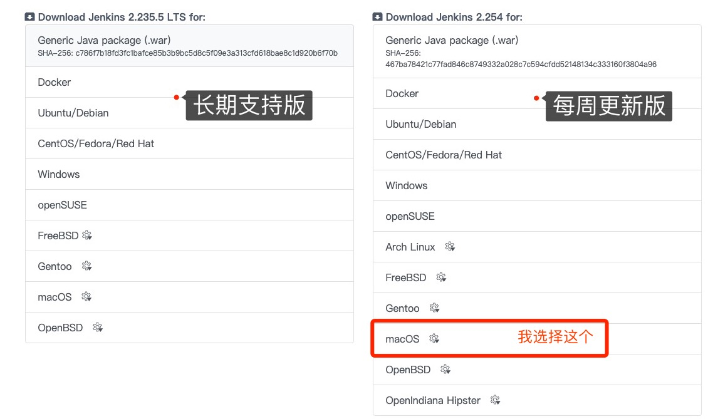
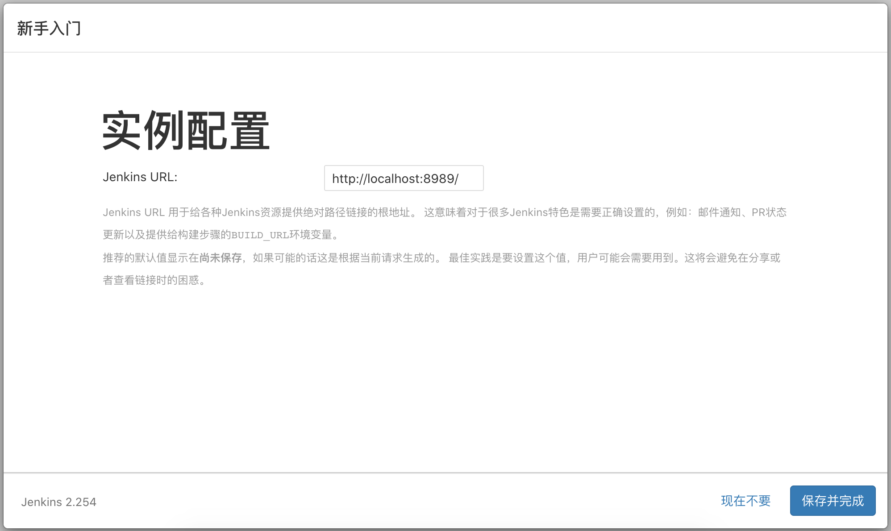
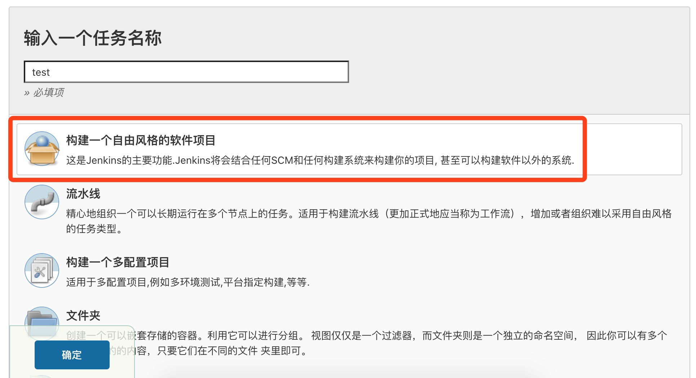
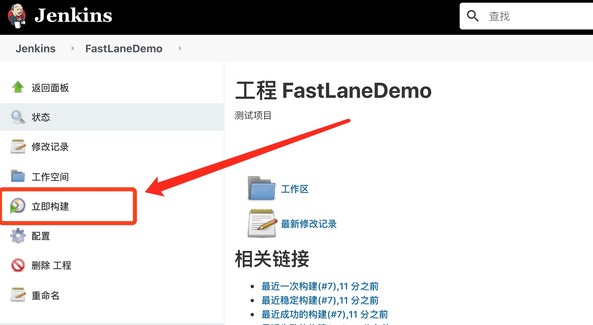
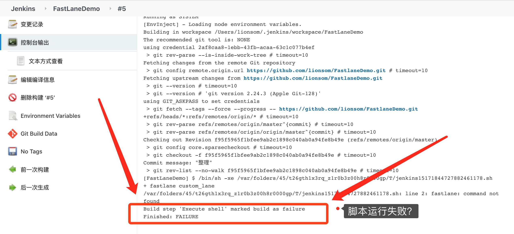
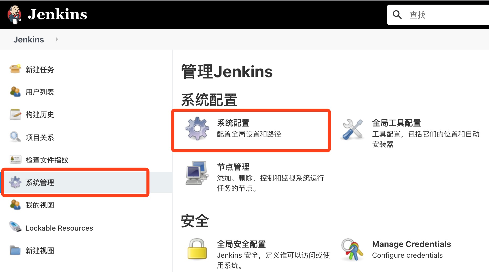
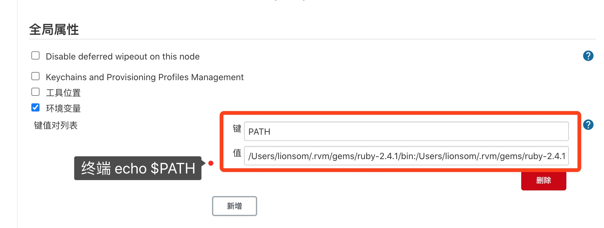
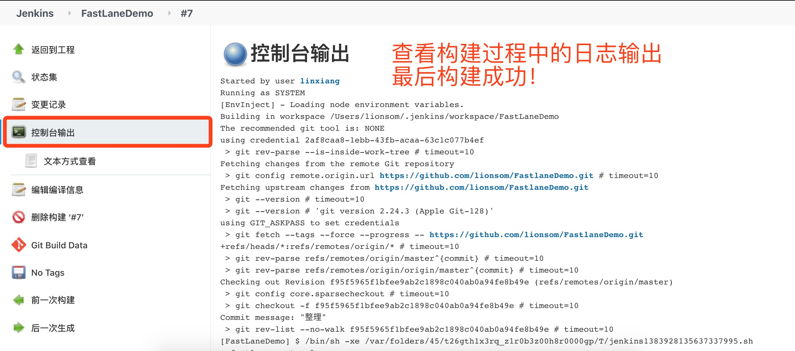

# 文档

[官网 - Jenkins](https://www.jenkins.io/)

[官网 - Jenkins Download](https://www.jenkins.io/download/)

[官网 - macOS Installers for Jenkins Weekly 安装每周版本 ](https://www.jenkins.io/download/weekly/macos/)

[官网 - Jenkins 用户手册 中文](https://www.jenkins.io/zh/doc/)


# 名词解释

* 持续集成（Continuous Integration，CI）代码合成、构建、部署、测试，不断执行这个过程并反馈结果；
* 持续部署（Continuous Deploy，CD）部署到测试环境、预生产环境、生产环境；
* 持续交付（Continuous Delivery，CD）部署到生产环境，给客户使用。


# 一、Jenkins版本选择




# 二、macOS安装

[macOS Installers for Jenkins Weekly ](https://www.jenkins.io/download/weekly/macos/)


**使用 Homebrew 安装**

```
➜ brew install jenkins
➜ brew install jenkins@YOUR_VERSION
➜ brew services start jenkins
➜ brew services restart jenkins
➜ brew upgrade jenkins
```


# 三、开启Jenkins服务

* 命令

```
➜ brew services start jenkins
➜ brew services stop jenkins
➜ brew services restart jenkins
```

* 实操

```
➜  XiOS git:(master) ✗ brew services start jenkins
==> Successfully started `jenkins` (label: homebrew.mxcl.jenkins)

➜  XiOS git:(master) ✗ brew services stop jenkins
Stopping `jenkins`... (might take a while)
==> Successfully stopped `jenkins` (label: homebrew.mxcl.jenkins)

➜  XiOS git:(master) ✗ brew services restart jenkins
Stopping `jenkins`... (might take a while)
==> Successfully stopped `jenkins` (label: homebrew.mxcl.jenkins)
==> Successfully started `jenkins` (label: homebrew.mxcl.jenkins)
```

* 验证，打开 http://localhost:8080/ 


* 登录，`open /Users/lionsom/.jenkins/secrets/initialAdminPassword ` 获取管理员密码


# 四、安装插件

## 1. 安装推荐插件

> 由于第一次安装，不太了解，故选择推荐的插件。


## 2. 注册

> 本地用户名统一：linx
>
> 密码：123456





## 3. 更改端口号 8080 -> 8989

1. 找到Jenkins物理路径

```
➜  which jenkins
/usr/local/bin/jenkins
```

2. 打开目录 `/usr/local/bin/` 

```
➜  open /usr/local/bin/
```


3. 修改 `homebrew.mxcl.jenkins.plist` 


4. 重启Jenkins服务

```
➜  brew services restart jenkins
Stopping `jenkins`... (might take a while)
==> Successfully stopped `jenkins` (label: homebrew.mxcl.jenkins)
==> Successfully started `jenkins` (label: homebrew.mxcl.jenkins)
```

登录：http://localhost:8989


# 五、构建方式


## 1. 使用Xcode插件

> 结论：不推荐，插件支持不到位。


## 2. 使用shell脚本

> 这里搭配fastlane构建，fastlane详情看隔壁一篇《Fastlane》


# 六、脚本构建
## 5.1. 操作流程









## 5.2. 脚本构建失败

【原因】

出现这个问题可能是因为你没有设置pod的运行路径，解决方法如下

【解决】

> 系统管理 -> 系统配置 -> 全局属性
>
> 终端中输入`echo $PATH` 获取本地环境变量
>
> 勾选环境变量，键默认填写`PATH`，值填写你从终端复制的那个字符串。






## 5.3. 再次构建成功




# 七、远程触发构建

**刚刚我们是在Jenkins网页上点击构建，如何支持HTTP请求构建**


## 1. 配置「构建触发器」

**在构建触发器中，我们可以发现「触发远程构建」，勾选并设置Token。**


## 2. 模拟HTTP请求

**通过Postman模拟http请求，发现请求失败，提示验证不通过，匿名用户没有权限。**


## 3. 添加权限

**前往Jenkins网页 -> 系统管理  -> 安全 -> 全局安全配置 -> 授权策略 中添加对匿名用户的操作权限。**


## 4. 再次模拟HTTP请求构建，成功！

