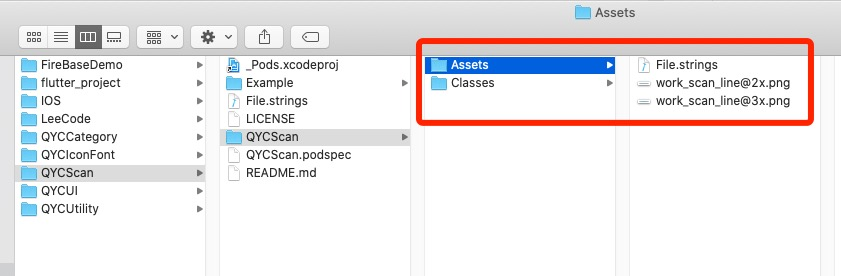
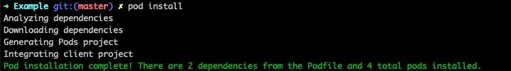
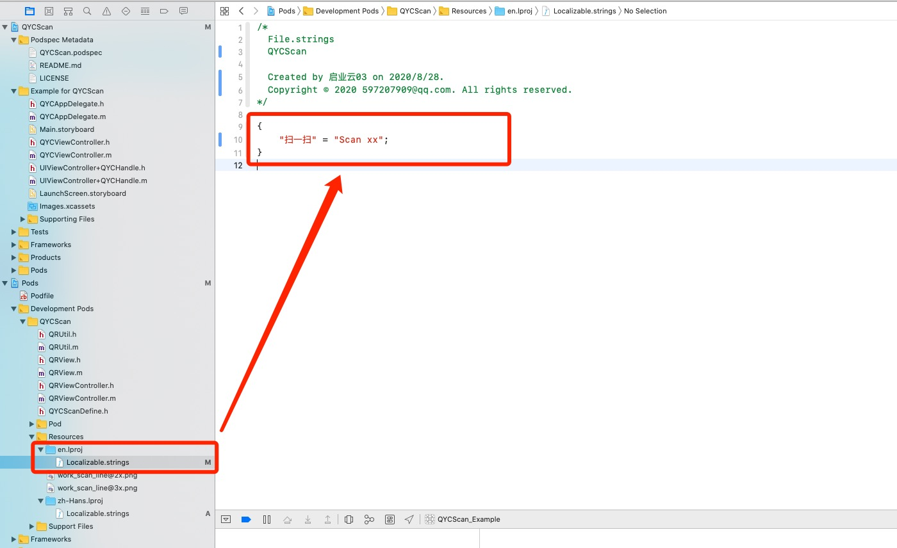
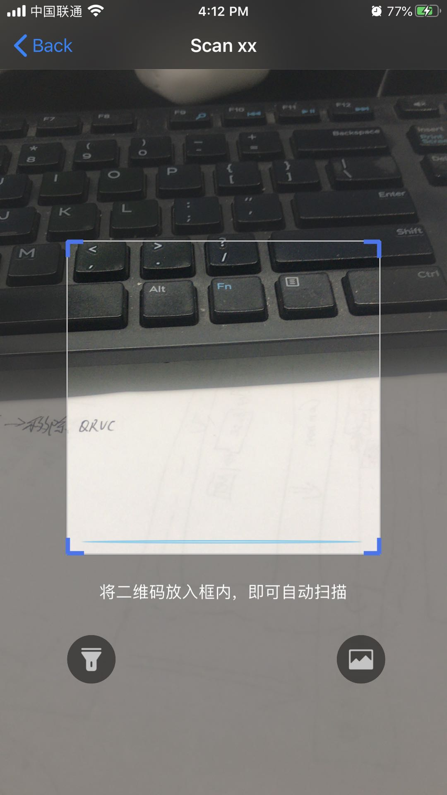

# 一、组件暗黑

```
// 颜色适配暗黑
static inline UIColor* QYCColor(UIColor *lightColor, UIColor *darkColor) {
    if (@available(iOS 13.0, *)) {
        return [UIColor colorWithDynamicProvider:^UIColor * _Nonnull(UITraitCollection * _Nonnull trainCollection) {
            if ([trainCollection userInterfaceStyle] == UIUserInterfaceStyleLight) {
                return lightColor;
            }
            else {
                return darkColor;
            }
        }];
    }
    else {
        return lightColor ? lightColor : (darkColor ? darkColor : [UIColor clearColor]);
    }
}

// 十六进制颜色
#define HexColor(hex) [UIColor colorWithRed:((hex >> 16) & 0xFF)/255.0 green:((hex >> 8) & 0xFF)/255.0 blue:(hex & 0xFF)/255.0 alpha:1.0]

// 十六进制颜色
#define HexColorAlpha(hex, al) [UIColor colorWithRed:((hex >> 16) & 0xFF)/255.0 green:((hex >> 8) & 0xFF)/255.0 blue:(hex & 0xFF)/255.0 alpha:al]
```


使用：

```
QYCColor(HexColor(0xFFFFFF), HexColor(0xC4C4C4));
```


# 二、组件国际化

## 1. 在 Example 中查看组件支持国际化语言


## 2. 可创建多个语言


## 3. 先在任意目录下创建 `String File` 


## 4. 将创建好的 `String File` 拖动到 `Assets` 下


## 5. 终端前往Example 目录下，本地更新库 `pod install` 







## 6. 点击`String File` 右侧 `Localize...`按钮


## 7. 先随便选择一个语言


## 8. 勾选多个语言


## 9. 实际物理路径中，`String File` 会变成两个对应语言的文件


## 10. 重新本地加载 `pod install`


## 11. 库中如何使用？

```
#pragma mark - =========== 国际化 ===========

+ (NSString *)localizedString:(NSString *)key {
    
    NSString *language = [[NSLocale preferredLanguages] firstObject];
    if (language.length == 0) {
        return key;
    }
    NSString *fileNamePrefix = @"zh-Hans";
    if([language hasPrefix:@"en"]) {
        fileNamePrefix = @"en";
    }
    NSBundle *tmpBundle = [NSBundle bundleForClass:[self class]];
    NSURL *url = [tmpBundle URLForResource:@"QYCScan" withExtension:@"bundle"];
    if(!url) return key;
    NSBundle *tmp = [NSBundle bundleWithURL:url];
    
    NSString *path = [tmp pathForResource:fileNamePrefix ofType:@"lproj"];
    NSBundle *bundle = [NSBundle bundleWithPath:path];
    NSString *localizedString = [bundle localizedStringForKey:key value:nil table:@"Localizable"];
    if (!localizedString) {
        localizedString = key;
    }
    return localizedString;
}


// 调用
NSString *AA = [QRUtil localizedString:@"扫一扫"];
```


## 12. 测试数据




## 13.成功

