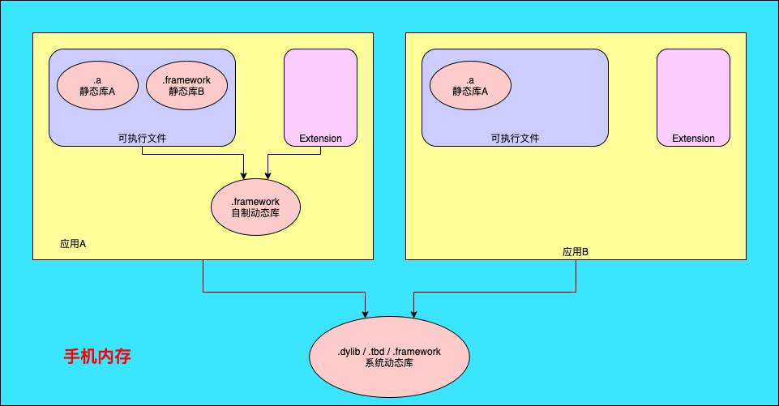
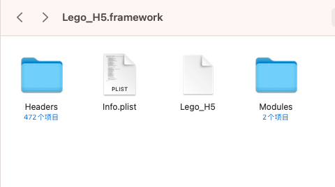
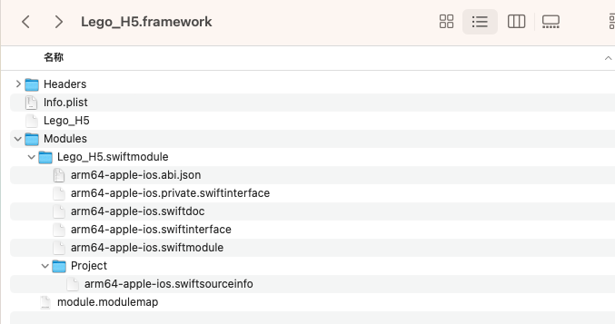
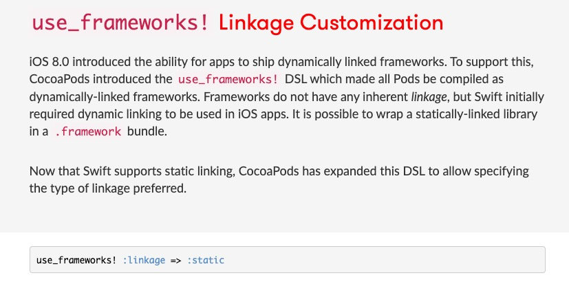

[TOC]

# ====== Part One 基础知识 ======


# 一、库

## 1.1 什么是库

　　库就是程序代码的集合，将N个文件组织起来，是共享程序代码的一种方式。库从本质上来说是一种可执行代码的二进制格式，可以被载入内存中执行。


## 1.2 库的分类

根据程序代码的开源情况，库可以分为两类

- 开源库

    > 源代码是公开的，你可以看到具体实现。比如知名的第三方框架：AFNetworking、SDWebImage。

- 闭源库

    > 不公开源代码，只公开调用的接口，看不到具体的实现，是一个编译后的二进制文件。这种常见于一些公司的 SDK 包，比如高德地图 SDK、环信即时通讯 SDK 等。而闭源库又分为两类：静态库和动态库。

    * 静态库
    * 动态库


## 1.3 从源代码到 app

当我们点击了 build 之后，做了什么事情呢？

- 预处理（Pre-process）：把宏替换、删除注释、展开头文件，产生 .i 文件。
- 编译（Compliling）：把之前的 .i 文件转换成汇编语言，产生 .s 文件。
- 汇编（Asembly）：把汇编语言文件转换为机器码文件，产生 .o 文件。
- 链接（Link）：对 .o 文件中的对于其他的库的引用的地方进行引用，生成最后的可执行文件（同时也包括多个 .o 文件进行 link）。


## 1.4 iOS 设备的 CPU 架构

* 模拟器

    > 4s-5: i386 
    >
    > 5s-iPhone X（包括 iPhone SE）: x86_64

* 真机

    > armv6：iPhone、iPhone 2、iPhone 3G、iPod Touch（第一代）、iPod Touch（第二代） 
    >
    > armv7：iPhone 3Gs、iPhone 4、iPhone 4s、iPad、iPad 2 
    >
    > armv7s：iPhone 5、iPhone 5c（静态库只要支持了 armv7，就可以在 armv7s 的架构上运行，向下兼容） 
    >
    > arm64：iPhone 5s、iPhone 6、iPhone 6 Plus、iPhone 6s、iPhone 6s Plus、iPad Air、iPad Air2、iPad mini2、iPad mini3、iPhone 7、iPhone 7 Plus、iPhone 8、iPhone 8 Plus、iPhone X


# 二、静态库和动态库

**静态库和动态库是相对编译期和运行期**的：静态库在程序编译时会被链接到目标代码中，程序运行时将不再需要改静态库；而动态库在程序编译时并不会被链接到目标代码中，只是在程序运行时才被载入。


## 2.1 存在形式

- **静态库形式**：`.a` 和 `.framework`
    - **.a + .h + sourceFile = .framework**
    - **.a 是一个纯二进制文件，.framework 中除了有二进制文件之外还有资源文件。**.a 要有 .h 文件以及资源文件配合，.framework 文件可以直接使用。总的来说，.a + .h + sourceFile = .framework。所以创建静态库最好还是用 .framework 的形式。
- **动态库形式**：`.dylib / .tbd`  和 `.framework`
    - Xcode7 之后 .tbd 代替了 .dylib


静态库简单的理解是多个目标文件 (`object file`, 以 `.o` 为后缀) 的打包集合. 静态库的存在形式:

- Mac/iOS: `.a` 或封装成 `.framework`
- Linux: `.a`
- Windows: `.lib`

动态库的存在形式分为以下几种:

- MacOS/iOS: `.tbd`, `.dylib` 或封装成 `.framework`
- Linux: `.so`
- Windows: `.DLL`

macOS 大规模地使用 `shared libraries`, 可以前往路径 `/usr/lib` 文件夹查看系统的动态库。


## 2.2 Framework 为什么既是静态库又是动态库？

系统的 .framework 是动态库，我们自己建立的 .framework 一般都是静态库。但是现在用 xcode 创建Framework 的时候默认是动态库，一般打包成 SDK 给别人用的话都使用的是静态库，可以修改 Build Settings的 `Mach-O Type` 为 Static Library。


## 2.3 使用区别

静态库：链接时会被完整的复制到可执行文件中，被多次使用就有多分拷贝。如下图，抖音和微信的可执行文件加载静态库时，每个可执行文件链接时都要加载这份静态库。


系统动态库：链接时不复制，程序运行时由系统动态加载到内存，供程序调用，系统只加载一次，多个程序共用，节省内存。


自建动态库：自己打包的动态库，则是在应用程序里的，但是与静态库不同，它不在可执行文件中。由于自建动态库可以`App Extension`和`APP`之间共用一份（App 和 Extension 的 Bundle 是共享的），因此苹果又把这种 Framework 称为 `Embedded Framework`。


**自建动态库和系统的动态库有什么区别呢？**

1. 后缀不同：自建动态库目前只能打包 **`.framework`** 格式的动态库。 系统动态库格式有多种；
2. 存储环境与运行环境不同：系统动态库只加载一次，供多个应用调用；自建动态库存放在自己应用的`.app`目录下，运行在沙盒里，而不是系统中，只能自己的`App Extension`和`APP`使用。
3. 权限不同：iOS8 之前苹果不允许第三方框架使用动态方式加载，从 iOS8 开始允许开发者有条件地创建和使用动态框架。


**整体概览**




## 2.4 优缺点

利用静态函数库编译成的 <font color=red><u>文件比较大</u></font>，因为整个函数库的所有数据都会被整合进目标代码中。

它的优点就显而易见了，即 <font color=red>编译后的执行程序不需要外部的函数库支持</font> ，因为所有使用的函数都已经被编译进去了。当然这也会成为他的缺点，因为如果静态函数库改变了，那么你的程序必须重新编译。

相对于静态函数库，动态函数库在编译的时候 并没有被编译进目标代码中，你的程序执行到相关函数时才调用该函数库里的相应函数，因此动态函数库所产生的<font color=red>可执行文件比较小</font>。由于函数库没有被整合进你的程序，而是程序运行时动态的申请并调用，所以程序的运行环境中必须提供相应的库。动态函数库的改变并不影响你的程序，所以动态函数库的升级比较方便。

- 静态库：

    ①、模块化，分工合作，提高了代码的复用及核心技术的保密程度
    ②、避免少量改动经常导致大量的重复编译连接
    ③、也可以重用，注意不是共享使用

- 动态库：

    ①、可以将最终可执行文件体积缩小，将整个应用程序分模块，团队合作，进行分工，影响比较小
    ②、多个应用程序共享内存中得同一份库文件，节省资源
    ③、可以不重新编译连接可执行程序的前提下，更新动态库文件达到更新应用程序的目的
    ④、应用插件化
    ⑤、软件版本实时模块升级
    ⑥、在其它大部分平台上，动态库都可以用于不同应用间共享， 共享可执行文件，这就大大节省了内存。


## 2.5 动、静态库的混用

我们可以在一个项目中使用一部分动态库, 再使用一部分静态库, 如果涉及到第三方库与库之间的依赖关系时, 那么遵守如下原则:

- 静态库可以依赖静态库
- 动态库可以依赖动态库
- 动态库不能依赖静态库！是因为静态库不需要在运行时再次加载, 如果多个动态库依赖同一个静态库, 会出现多个静态库的拷贝, 而这些拷贝本身只是对于内存空间的消耗.


# 三、.framework组成介绍

> 一个Framework其实就是一个有着特定结构的文件夹装着各种共享的资源。
>
> 这些资源通常是 **图片、Xibs、动态库、静态库、文档...等**，他们被封装成bundle存储却又不像其他的bundles( 像是 .app)，Framework毫不掩饰的表明它纯粹就是一个文件夹。




## Headers


`Headers`: 包含了 `Framework` 对外公开的 `C & Obj-C headers`, Swift 并不会用到这些 `Headers`, 如果你的 `framework` 是用 `Swift` 写的, Xcode 会自动帮你创建这个文件夹以提供互用性。

若你有时不清楚在Swift代码里加 @objc, @objcMembers 的影响，可以查看 **Build Settings** 里“SWIFT_OBJC_INTERFACE_HEADER_NAME”所指的文件，并试着改动@objc @objcMembers的宣告，看看这些改动对这文件的影响。


## Modules



这文件夹包含了LLVM, Swift 的 Module信息。

.modulemap档案是给Clang使用的。

> 关于Clang 可看译者的另一篇文 [LLVM前端Clang](https://juejin.cn/post/6844903716709990414)

.swiftmodule 文件夹下的档案类似headers，但是不像是 headers, 这些档案是二进制的且[“无格式也有可能会改变”](https://link.juejin.cn/?target=https%3A%2F%2Flists.swift.org%2Fpipermail%2Fswift-users%2FWeek-of-Mon-20171127%2F006660.html)，在你**Cmd-click** 一个Swift函数时Xcode就是利用这些档案去定位其所属的module。

尽管这些都是二进制文件，但他们仍是一种叫 **llvm bitcode** 的结构，正因如此，我们能用[`llvm-bcanalyzer`](https://link.juejin.cn/?target=https%3A%2F%2Fllvm.org%2Fdocs%2FCommandGuide%2Fllvm-bcanalyzer.html) and `llvm-strings`取得相关信息。


# 三、Swift与OC混编


## use_frameworks!

* [Why do we use use_frameworks! in CocoaPods?](https://stackoverflow.com/questions/41210249/why-do-we-use-use-frameworks-in-cocoapods)

* [Podfile中的 use_frameworks!](https://segmentfault.com/a/1190000007076865)

use_frameworks！ 告诉CocoaPods您要使用 Frameworks 而不是 Static Libraries。<font color=red>由于以前CocoaPods不支持Swift静态库，因此您必须使用。【CocoaPods 1.5.0已支持】</font>

> use_frameworks!		->	dynamic frameworks 方式 	-> 	.framework
>
> \#use_frameworks! 	-> 	static libraries 方式			 	->	 .a


## CocoaPods 1.5.0已支持 Swift 静态库

[CocoaPods 1.5.0 — Swift Static Libraries](https://blog.cocoapods.org/CocoaPods-1.5.0/)

[stackoverflow — Using cocoapods without use_frameworks! in Swift](https://stackoverflow.com/questions/33492873/using-cocoapods-without-use-frameworks-in-swift)

> Xcode9 beta 4 和 `Cocoapods` 在[1.5.0版本](http://blog.cocoapods.org/CocoaPods-1.5.0/)就支持`Swift`以静态库的形式集成到项目中。


## Cocoapods 1.9 支持 `use_frameworks! :linkage => :static`




## use_modular_headers!

使用场景：Swift pod depends on an Objective-C pod 

​		随着支持swift静态库，pod1.5也更新的对应的功能，如果swift的 pod 依赖于某个OC的 pod，需要为该OC版 pod 启用`modular headers`，所以多了 `use_modular_headers!`来全局开启，不过开启之后，之前一些不严谨的依赖，可能会报错，需要具体情况具体分析了。而且我也不建议这种跨语言的交叉依赖，比如我的项目主要是OC，依赖的swift版 pod，就是纯swift写的。

​		首先，[CocoaPods1.5.0](https://blog.cocoapods.org/CocoaPods-1.5.0/) 新增的属性 `use_modular_headers!`，是将所有的pods转为 Modular。Modular是可以直接在Swift中 import 的，不需要再经过 bridging-header 的桥接。

如果您的 Swift Pod依赖于Objective-C，则您需要为该 Objective-C Pod 启用 “modular headers”

单个库使用：`:modular_headers => true`


## OC Swift 混编

Objective-C 与 Swift 混编在使用上主要依赖两个头文件：ProjectName-Bridging-Header.h 和 ProjectName-Swift.h。

对于 Swift 调用 Objective-C，在 ProjectName-Bridging-Header.h 中 import 要使用的 Objective-C 头文件。

对于 Objective-C 调用 Swift，需要编译过程中生成的 ProjectName-Swift.h 文件，此文件会将 Objective-C 需要使用的 Swift 类转成 Objective-C 格式的 .h 文件。


当 Objective-C 与 Swift 进行混编时，编译的过程（Pipeline）是：

- 首先编译 Swift Module。预编译 Bridging Header 后，再编译 Swift 源文件。
- Swift 编译完成后，生成 ProjectName-Swift.h 的头文件供 Objective-C 使用。
- 最后编译 Objective-C 源文件。


## 头文件引入方式

```swift
@import QYCH5Module_Swift;

import QYCUtility.Swift

@import QYCUtility;

...
区别？
```


# 四、Module 系统

如果我们的`Framework`中需要用到`Swift-OC`混编，但是`Framework`中不能使用桥接文件，因此这种情况下可以使用`Module`解决。


# 三、Swift Framework中使用Module

[iOS-开发进阶07：Module与Swift库](https://www.jianshu.com/p/4dab600555dc)


## 动静态库以 .framework 形式被 `embed` 或 `not embed` 对包体积的影响


[(iOS)年轻人，听说你想使用Framework - 基礎觀念](https://juejin.cn/post/6844903736154800141)


## Xcode 里 Linking vs. Embedding Frameworks


