# 文档

[官网 - Jenkins](https://www.jenkins.io/)

[官网 - Jenkins Download](https://www.jenkins.io/download/)

[官网 - macOS Installers for Jenkins Weekly 安装每周版本 ](https://www.jenkins.io/download/weekly/macos/)

[官网 - Jenkins 用户手册 中文](https://www.jenkins.io/zh/doc/)


# 名词解释

* 持续集成（Continuous Integration，CI）代码合成、构建、部署、测试，不断执行这个过程并反馈结果；
* 持续部署（Continuous Deploy，CD）部署到测试环境、预生产环境、生产环境；
* 持续交付（Continuous Delivery，CD）部署到生产环境，给客户使用。


# 一、Jenkins版本选择

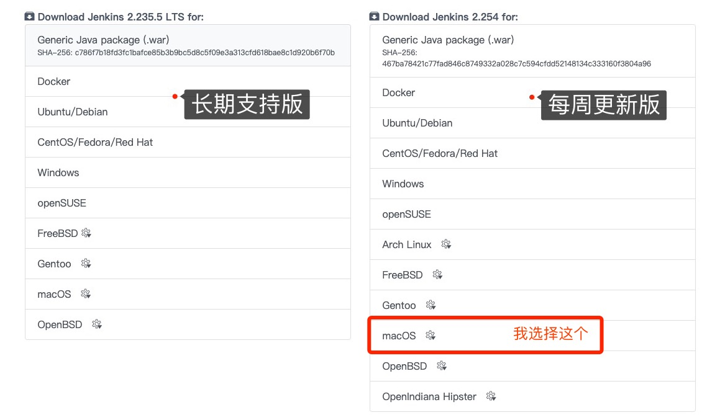


# 二、macOS安装

[macOS Installers for Jenkins Weekly ](https://www.jenkins.io/download/weekly/macos/)


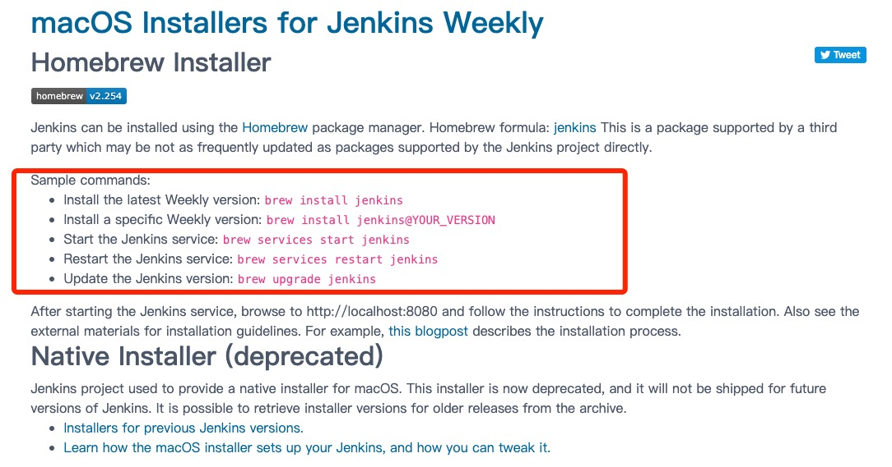


**使用 Homebrew 安装**

```
➜ brew install jenkins
➜ brew install jenkins@YOUR_VERSION
➜ brew services start jenkins
➜ brew services restart jenkins
➜ brew upgrade jenkins
```


# 三、开启Jenkins服务

* 命令

```
➜ brew services start jenkins
➜ brew services stop jenkins
➜ brew services restart jenkins
```

* 实操

```
➜  XiOS git:(master) ✗ brew services start jenkins
==> Successfully started `jenkins` (label: homebrew.mxcl.jenkins)

➜  XiOS git:(master) ✗ brew services stop jenkins
Stopping `jenkins`... (might take a while)
==> Successfully stopped `jenkins` (label: homebrew.mxcl.jenkins)

➜  XiOS git:(master) ✗ brew services restart jenkins
Stopping `jenkins`... (might take a while)
==> Successfully stopped `jenkins` (label: homebrew.mxcl.jenkins)
==> Successfully started `jenkins` (label: homebrew.mxcl.jenkins)
```

* 验证，打开 http://localhost:8080/ 

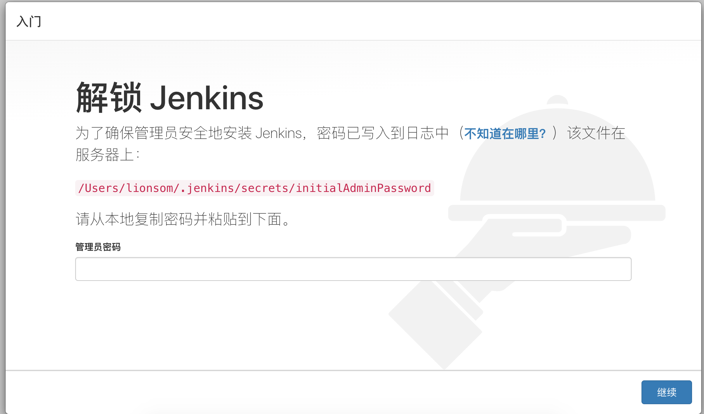

* 登录，`open /Users/lionsom/.jenkins/secrets/initialAdminPassword ` 获取管理员密码

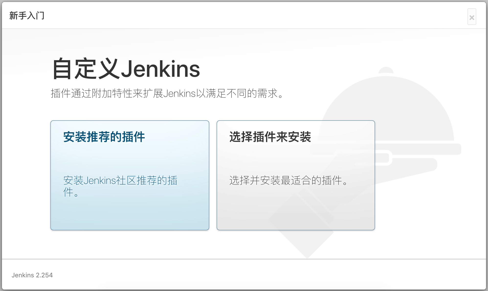


# 四、安装插件

## 1. 安装推荐插件

> 由于第一次安装，不太了解，故选择推荐的插件。

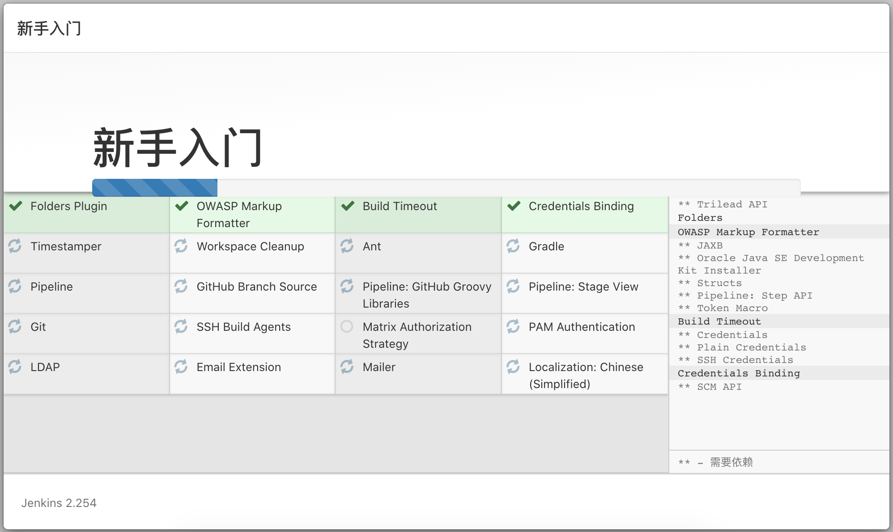


## 2. 注册

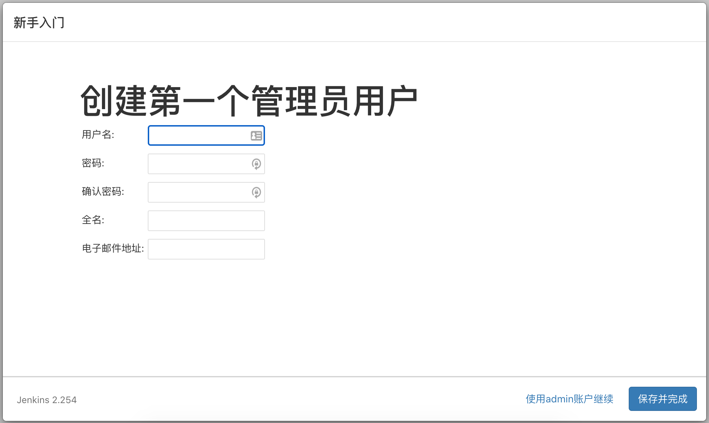

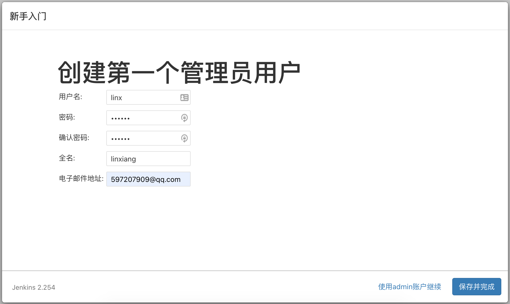

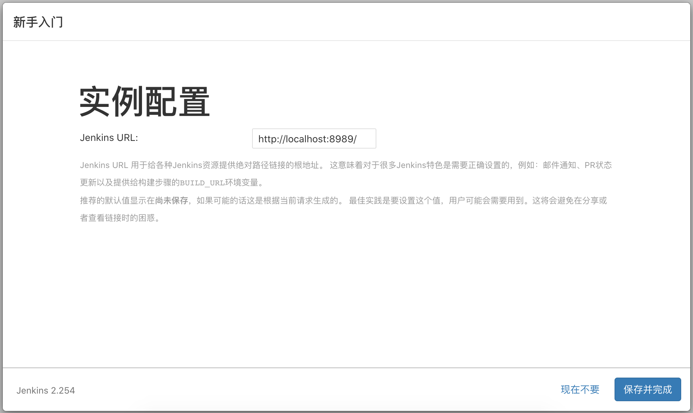


## 3. 更改端口号 8080 -> 8989

1. 找到Jenkins物理路径

```
➜  which jenkins
/usr/local/bin/jenkins
```

2. 打开目录 `/usr/local/bin/` 

```
➜  open /usr/local/bin/
```

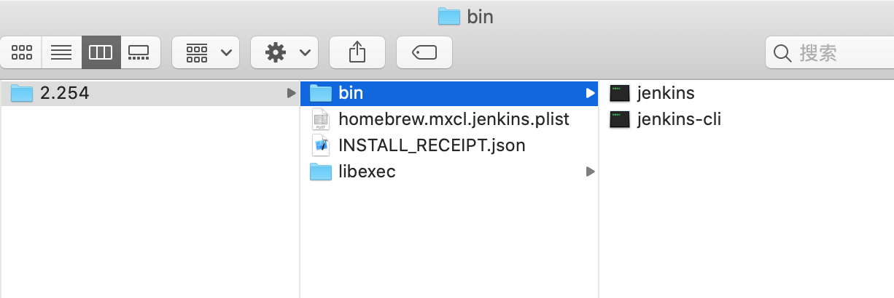

3. 修改 `homebrew.mxcl.jenkins.plist` 

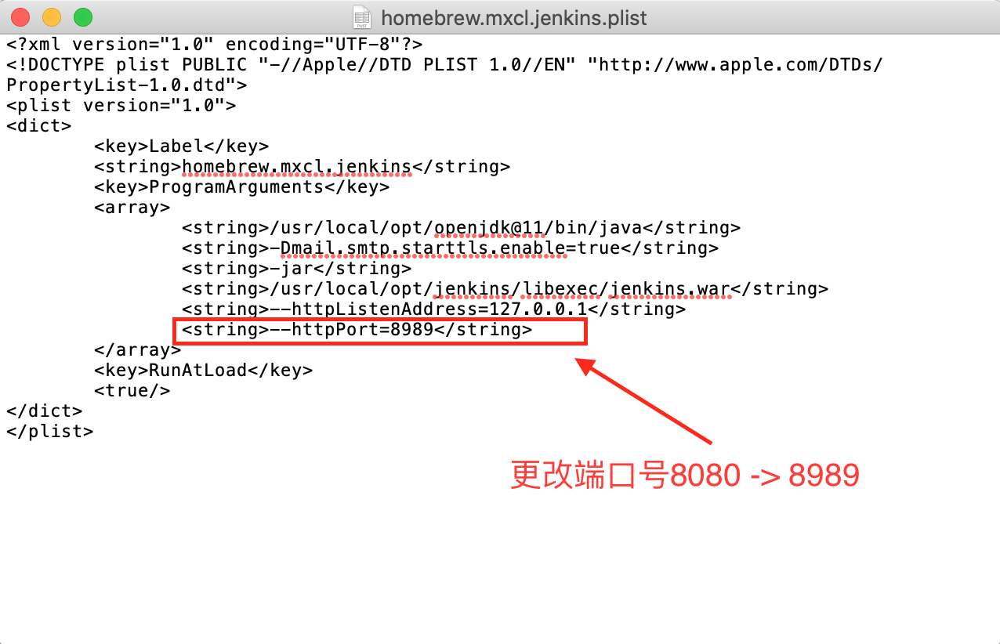

4. 重启Jenkins服务

```
➜  brew services restart jenkins
Stopping `jenkins`... (might take a while)
==> Successfully stopped `jenkins` (label: homebrew.mxcl.jenkins)
==> Successfully started `jenkins` (label: homebrew.mxcl.jenkins)
```

登录：http://localhost:8989

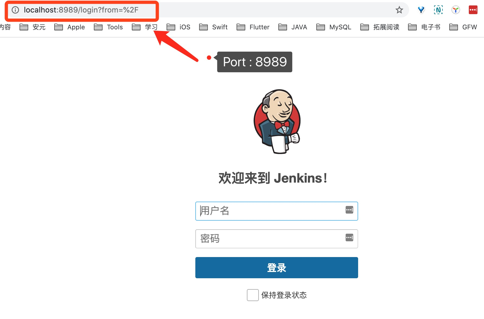

# Xcode插件


## 失败

### 方式一：更换下载地址

```
// Default URL
https://updates.jenkins.io/update-center.json

// New
http://mirrors.jenkins-ci.org/status.html

http://mirror.esuni.jp/jenkins/updates/update-center.json
```

### 方式二：


# 五、构建


