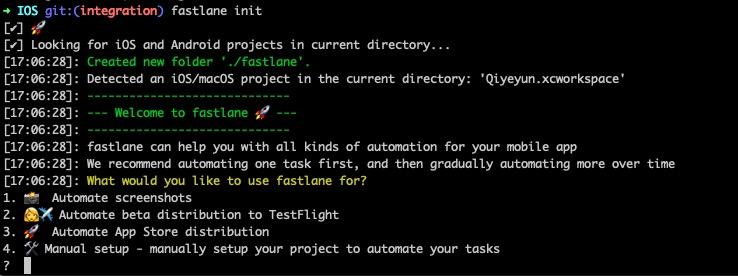
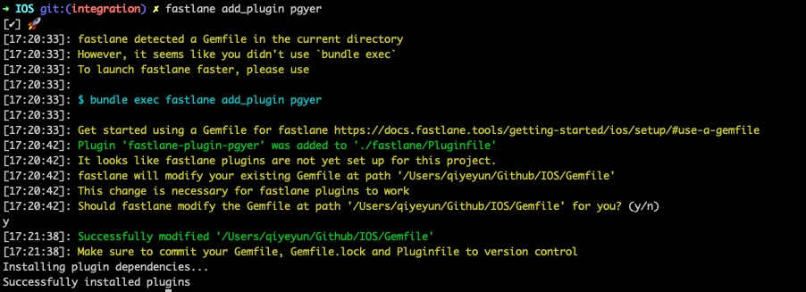
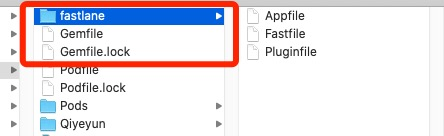
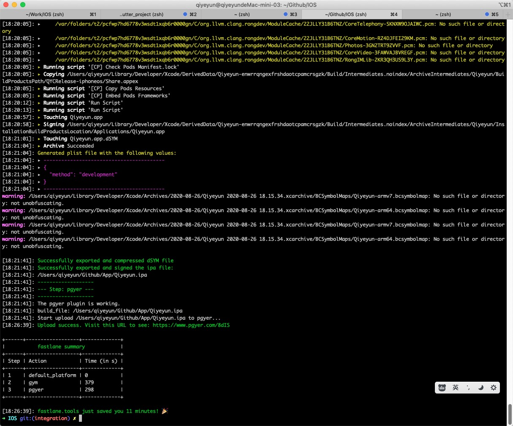
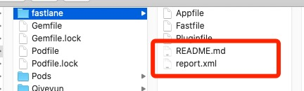
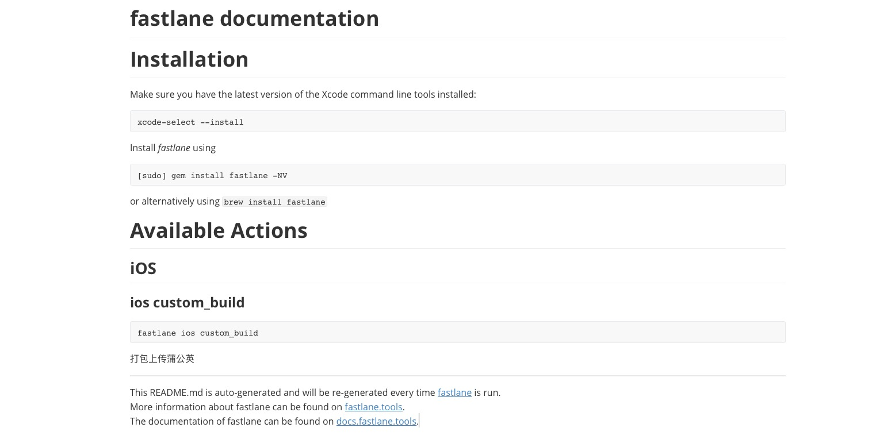
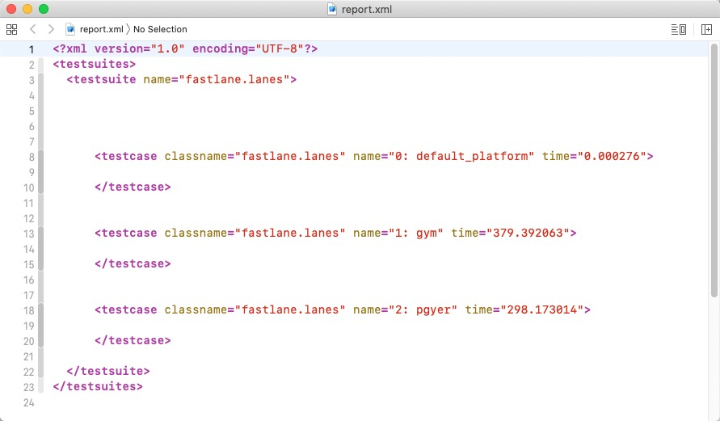
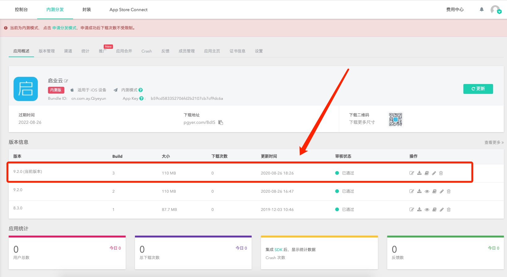

# 文档

* [fastlane官网](https://fastlane.tools/)

* [fastlane docs](https://docs.fastlane.tools/)


iOS自动打包脚本： [AutoPacking-iOS](https://github.com/monetking/AutoPacking-iOS)


# 名词

ruby

RubyGems 是 Ruby 的一个包管理器，它提供一个分发 Ruby 程序和库的标准格式，还提供一个管理程序包安装的工具。

Bundler - [Bundler 的作用及原理](https://ruby-china.org/topics/25530)

gym 是 fastlane 下的一个工具，针对于 iOS 编译打包生成 ipa 文件，


# 一、前期准备

## 1. 安装 Xcode 命令行工具

```
➜ xcode-select --install
```

## 2. 安装fastlane

### 方式一：Homebrew

```
// 安装
➜ brew install fastlane

// 查看版本
➜ fastlane --version
fastlane installation at path:
/Library/Ruby/Gems/2.6.0/gems/fastlane-2.156.1/bin/fastlane
-----------------------------
[✔] 🚀

// 更新
➜ brew upgrade fastlane
.......
```

### 方式二：RubyGems

```
➜ sudo gem install fastlane -NV
```


# 二、fastlane实践

## 1. Setting up fastlane

**终端进入工程主目录，输入：**

```
➜ fastlane init
```



```
1. 📸  Automate screenshots
2. 👩‍✈️  Automate beta distribution to TestFlight
3. 🚀  Automate App Store distribution
4. 🛠  Manual setup - manually setup your project to automate your tasks

1、代表app市场图片素材；
2、发布到TestFlight进行测试；
3、发布到App Store；
4、自定义。

这边我选 4 自定义
```


## 2. 安装插件 - 蒲公英

**【注意】：在项目目录下安装：**

```
➜ fastlane add_plugin pgyer
```




## 3. 文件介绍

上述两步骤完成后，工程主目录下会多出几个文件夹：



 **文件夹fastlane** ，里面包含 `Appfile` 和 `Fastfile`。

* Appfile ： 里面包含App相关信息；
* Fastfile ：包含fastlane相关配置信息，后续也是在此处理；

* Pluginfile ：包含插件相关信息；


`Gemfile` 与 `Gemfile.lock` 类比于 `Podfile` 与 `Podfile.lock`


## 4. Appfile配置

```
# For more information about the Appfile, see:
#     https://docs.fastlane.tools/advanced/#appfile

app_identifier("cn.com.ay.xxxx") 	# The bundle identifier of your app
apple_id("mobile@xxxx.com.cn") 		# Your Apple email address
```


## 5. Fastfile配置

```

default_platform(:ios)

platform :ios do

  desc "打包上传蒲公英"
  lane :custom_build do
    # add actions here: https://docs.fastlane.tools/actions
    gym(scheme: "Qiyeyun", 
        configuration: "QYCRelease",
        export_method: "development",
        silent: true,  # 隐藏没有必要的信息
        clean: true,  # 在构建前先clean
        output_directory: "../App" # Destination directory. Defaults to current directory.
    )
    pgyer(api_key: "c2ee006efdc4ade0085921exxxxxxxxx", 
          user_key: "f6a62972d4f3f6d0d02a8ff7xxxxxxxxx", 
          update_description: "update by fastlane",
          password: "111111",
          install_type: "2")
  end
end

```


## 6. 证书

本机电脑中存在证书，直接运行即可！

若无证书，未知。


## 7. 开始运行

```
➜ fastlane custom_build
```




有多出两个文件




`README.md` 如下：



`Report.xml` 包含了运行过程用时报告，如下：




## 8. 成功上传蒲公英




## 8. 安装包

 真机扫一扫蒲公英二维码，成功！！！


# 踩坑

## 1. 无法上传到蒲公英

```
Could not find action, lane or variable 'pgyer'. Check out the documentation for more details: https://docs.fastlane.tools/actions
```

【原因】：`fastlane add_plugin pgyer` 蒲公英插件安装目录错了，应该在项目目录下。


