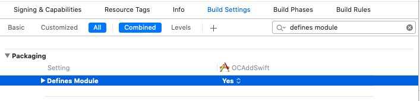
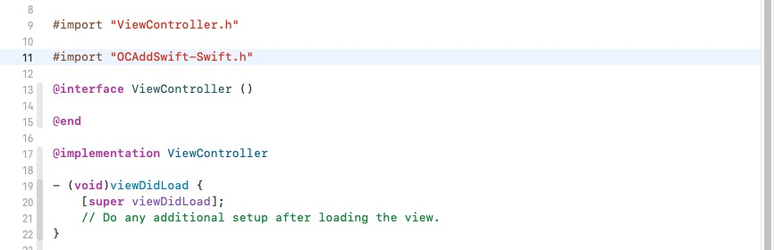
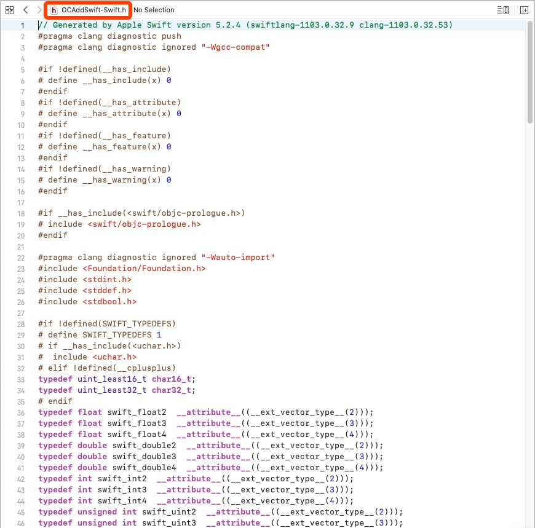
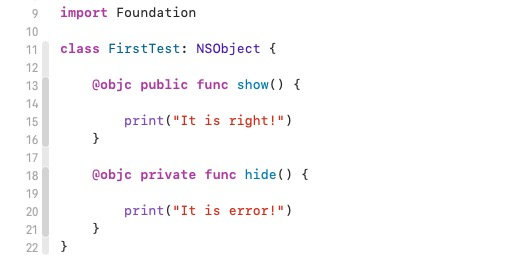
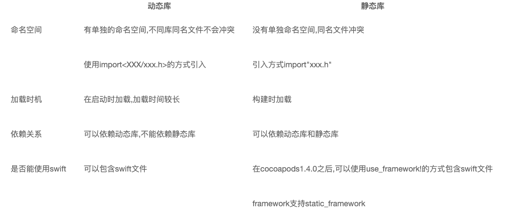
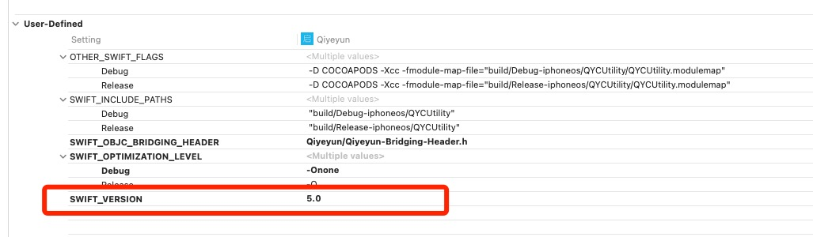

[iOS 静态库和动态库](https://www.cnblogs.com/dins/p/ios-jing-tai-ku-he-dong-tai-ku.html)

[Swift与OC混编过程中的配置](https://juejin.im/post/5d5a399a6fb9a06af50fca2b)


# ------ Part One 基础知识 ------


# 一、库

## 1.1 什么是库

　　库就是程序代码的集合，将N个文件组织起来，是共享程序代码的一种方式。库从本质上来说是一种可执行代码的二进制格式，可以被载入内存中执行。


## 1.2 库的分类

根据程序代码的开源情况，库可以分为两类

- 开源库

  > 源代码是公开的，你可以看到具体实现。比如知名的第三方框架：AFNetworking、SDWebImage。

- 闭源库

  > 不公开源代码，只公开调用的接口，看不到具体的实现，是一个编译后的二进制文件。这种常见于一些公司的 SDK 包，比如高德地图 SDK、环信即时通讯 SDK 等。而闭源库又分为两类：静态库和动态库。

  * 静态库
  * 动态库


## 1.3 从源代码到 app

当我们点击了 build 之后，做了什么事情呢？

- 预处理（Pre-process）：把宏替换、删除注释、展开头文件，产生 .i 文件。
- 编译（Compliling）：把之前的 .i 文件转换成汇编语言，产生 .s 文件。
- 汇编（Asembly）：把汇编语言文件转换为机器码文件，产生 .o 文件。
- 链接（Link）：对 .o 文件中的对于其他的库的引用的地方进行引用，生成最后的可执行文件（同时也包括多个 .o 文件进行 link）。


## 1.4 iOS 设备的 CPU 架构

* 模拟器

  > 4s-5: i386 
  >
  > 5s-iPhone X（包括 iPhone SE）: x86_64

* 真机

  > armv6：iPhone、iPhone 2、iPhone 3G、iPod Touch（第一代）、iPod Touch（第二代） 
  >
  > armv7：iPhone 3Gs、iPhone 4、iPhone 4s、iPad、iPad 2 
  >
  > armv7s：iPhone 5、iPhone 5c（静态库只要支持了 armv7，就可以在 armv7s 的架构上运行，向下兼容） 
  >
  > arm64：iPhone 5s、iPhone 6、iPhone 6 Plus、iPhone 6s、iPhone 6s Plus、iPad Air、iPad Air2、iPad mini2、iPad mini3、iPhone 7、iPhone 7 Plus、iPhone 8、iPhone 8 Plus、iPhone X


# 二、静态库和动态库

**静态库和动态库是相对编译期和运行期**的：静态库在程序编译时会被链接到目标代码中，程序运行时将不再需要改静态库；而动态库在程序编译时并不会被链接到目标代码中，只是在程序运行时才被载入。


## 2.1 存在形式

- **静态库形式**：`.a` 和 `.framework`
  - **.a + .h + sourceFile = .framework**
  - **.a 是一个纯二进制文件，.framework 中除了有二进制文件之外还有资源文件。**.a 要有 .h 文件以及资源文件配合，.framework 文件可以直接使用。总的来说，.a + .h + sourceFile = .framework。所以创建静态库最好还是用 .framework 的形式。
- **动态库形式**：`.dylib / .tbd`  和 `.framework`
  - Xcode7 之后 .tbd 代替了 .dylib


## 2.2 Framework 为什么既是静态库又是动态库？

系统的 .framework 是动态库，我们自己建立的 .framework 一般都是静态库。但是现在用 xcode 创建Framework 的时候默认是动态库，一般打包成 SDK 给别人用的话都使用的是静态库，可以修改 Build Settings的 `Mach-O Type` 为 Static Library。


## 2.3 使用区别

静态库：链接时会被完整的复制到可执行文件中，被多次使用就有多分拷贝。如下图，抖音和微信的可执行文件加载静态库时，每个可执行文件链接时都要加载这份静态库。


系统动态库：链接时不复制，程序运行时由系统动态加载到内存，供程序调用，系统只加载一次，多个程序共用，节省内存。


自建动态库：自己打包的动态库，则是在应用程序里的，但是与静态库不同，它不在可执行文件中。由于自建动态库可以`App Extension`和`APP`之间共用一份（App 和 Extension 的 Bundle 是共享的），因此苹果又把这种 Framework 称为 `Embedded Framework`。


**自建动态库和系统的动态库有什么区别呢？**

1. 后缀不同：自建动态库目前只能打包 **`.framework`** 格式的动态库。 系统动态库格式有多种；
2. 存储环境与运行环境不同：系统动态库只加载一次，供多个应用调用；自建动态库存放在自己应用的`.app`目录下，运行在沙盒里，而不是系统中，只能自己的`App Extension`和`APP`使用。
3. 权限不同：iOS8 之前苹果不允许第三方框架使用动态方式加载，从 iOS8 开始允许开发者有条件地创建和使用动态框架。


**整体概览**


## 2.4 优缺点

利用静态函数库编译成的 <font color=red><u>文件比较大</u></font>，因为整个函数库的所有数据都会被整合进目标代码中。

它的优点就显而易见了，即 <font color=red>编译后的执行程序不需要外部的函数库支持</font> ，因为所有使用的函数都已经被编译进去了。当然这也会成为他的缺点，因为如果静态函数库改变了，那么你的程序必须重新编译。

相对于静态函数库，动态函数库在编译的时候 并没有被编译进目标代码中，你的程序执行到相关函数时才调用该函数库里的相应函数，因此动态函数库所产生的<font color=red>可执行文件比较小</font>。由于函数库没有被整合进你的程序，而是程序运行时动态的申请并调用，所以程序的运行环境中必须提供相应的库。动态函数库的改变并不影响你的程序，所以动态函数库的升级比较方便。

- 静态库：

  ①、模块化，分工合作，提高了代码的复用及核心技术的保密程度
  ②、避免少量改动经常导致大量的重复编译连接
  ③、也可以重用，注意不是共享使用

- 动态库：

  ①、可以将最终可执行文件体积缩小，将整个应用程序分模块，团队合作，进行分工，影响比较小
  ②、多个应用程序共享内存中得同一份库文件，节省资源
  ③、可以不重新编译连接可执行程序的前提下，更新动态库文件达到更新应用程序的目的
  ④、应用插件化
  ⑤、软件版本实时模块升级
  ⑥、在其它大部分平台上，动态库都可以用于不同应用间共享， 共享可执行文件，这就大大节省了内存。


# 三、Swift与OC混编


## use_frameworks!

* [Why do we use use_frameworks! in CocoaPods?](https://stackoverflow.com/questions/41210249/why-do-we-use-use-frameworks-in-cocoapods)

* [Podfile中的 use_frameworks!](https://segmentfault.com/a/1190000007076865)

use_frameworks！ 告诉CocoaPods您要使用 Frameworks 而不是 Static Libraries。<font color=red>由于Swift不支持静态库，因此您必须使用框架。</font>

* Cocoa Touch Frameworks

  它们始终是开源的，并且会像您的应用程序一样构建。 （因此，在您运行应用程序时以及始终在清理项目后，Xcode有时会对其进行编译。）框架仅支持iOS 8和更高版本，但是您可以在框架中使用Swift和Objective-C。

* Cocoa Touch Static Libraries

  顾名思义，它们是静态的。 因此，当您将它们导入到项目中时，它们已经被编译。 您可以与其他人共享而不显示他们的代码。 请注意，静态库当前不支持Swift。 您将必须在库中使用Objective-C。 该应用程序本身仍可以用Swift编写。


## OC Swift 混编

Objective-C 与 Swift 混编在使用上主要依赖两个头文件：ProjectName-Bridging-Header.h 和 ProjectName-Swift.h。

对于 Swift 调用 Objective-C，在 ProjectName-Bridging-Header.h 中 import 要使用的 Objective-C 头文件。

对于 Objective-C 调用 Swift，需要编译过程中生成的 ProjectName-Swift.h 文件，此文件会将 Objective-C 需要使用的 Swift 类转成 Objective-C 格式的 .h 文件。


当 Objective-C 与 Swift 进行混编时，编译的过程（Pipeline）是：

- 首先编译 Swift Module。预编译 Bridging Header 后，再编译 Swift 源文件。
- Swift 编译完成后，生成 ProjectName-Swift.h 的头文件供 Objective-C 使用。
- 最后编译 Objective-C 源文件。


## 支持 Swift 静态库

> 更新: Xcode9 beta 4 和 CocoaPods 1.5 已经支持 Swift 静态库.


## use_modular_headers!

首先，CocoaPods1.5新增的属性use_modular_headers!，是将所有的pods转为 Modular。Modular是可以直接在Swift中 import 的，不需要再经过 bridging-header 的桥接。


如果您的Swift吊舱依赖于Objective-C，则您需要为该Objective-C吊舱启用“模块化标头”


报错：

https://www.codeleading.com/article/85905061910/

```
pre_install do |installer|
  # workaround for https://github.com/CocoaPods/CocoaPods/issues/3289
  Pod::Installer::Xcode::TargetValidator.send(:define_method, :verify_no_static_framework_transitive_dependencies) {}
end
```


##  

[CocoaPods 1.5.0 — Swift Static Libraries](https://blog.cocoapods.org/CocoaPods-1.5.0/)

Xcode9，swift就支持打成静态库了，所以不用非要弄成动态库。


随着支持swift静态库，pod1.5也更新的对应的功能，如果swift的 pod 依赖于某个OC的 pod，需要为该OC版 pod 启用`modular headers`，所以多了 `use_modular_headers!`来全局开启，不过开启之后，之前一些不严谨的依赖，可能会报错，需要具体情况具体分析了，网上相关的文章也很多，就不在这里一一赘述了。而且我也不建议这种跨语言的交叉依赖，比如我的项目主要是OC，依赖的swift版 pod，就是纯swift写的。


##  Clang Module


# 混编 Podfile 设置

全部使用：

问题：包大了

```
use_frameworks! :linkage => :static
```


# ------ Part TWO 混编实战 ------


# 一、OC项目新增Swift


## 1、建立桥接文件

在OC项目中新建Swift文件，会弹出提示，选择 `Create Bridging Header` 建立桥接文件，系统会建立 `“工程名-Bridging-Header.h”`。


## 2、项目配置

首先，在工程的 `Build Settings` 中把 `defines module` 设为 `YES`.




然后，把 `product module name` 设置为**项目工程的名字**。 (系统会自动为我们设置好)


我们再来看一下在这个宿主工程中，OC类中访问Swift，在工程配置的Build Settings中搜索Swift Compiler，可以看到Swift与OC混编的两个配置文件：


**此时系统会为工程创建一个“工程名-Swift.h”的文件(不会显示出来,可以引用)，此文件不可手动创建，必须使用系统创建的** ，此时我们在想要访问Swift方法的OC类中导入ProductName-Swift.h（手动输入没有提示，并且在编译之前报红），然后编译一下，再进入查看源文件：

在想要访问Swift方法的OC类中导入ProductName-Swift.h（手动输入没有提示，并且在编译之前报红），然后编译一下，再进入查看源文件：







## 3、创建Swift类


### 1. OC类调用Swift方法

> 1. Swift类中，凡是允许OC访问的方法，方法前都要加@objc；
> 2. Swift类中用public修饰过的方法，才会出现在ProductName-Swift.h文件中；
> 3. 所有Swift类在ProductName-Swift.h文件都会被自动注册，以会自动@interface修饰，ProductName-Swift.h文件会自动更新。




**调用**


### 2. Swift类调用OC方法


**调用**


## 4、OC项目添加Swift Pod

Podfile文件如下：

```ruby
# Uncomment the next line to define a global platform for your project
# platform :ios, '9.0'

source 'https://github.com/CocoaPods/Specs.git'
source 'http://git.qpaas.com/PaasPods/PaasSpecs.git'    # 组件化索引库


target 'main_OC' do
  # Comment the next line if you don't want to use dynamic frameworks
  use_frameworks!

  # Pods for main_OC
  pod 'QYCH5Module_Swift', '0.1.2'

end
```


**Swift头文件引入**

```swift
@import QYCH5Module_Swift;
```


**调用Swift代码**

```swift
- (void)touchesBegan:(NSSet<UITouch *> *)touches withEvent:(UIEvent *)event {
    // 调用Swift Pod库
    BaseWKWebViewVC *wkVC = [[BaseWKWebViewVC alloc] init];
    [self presentViewController:wkVC animated:YES completion:nil];
}
```


# 二、纯OC组件

### 组件验证：纯OC

```shell
# 本地验证
~ pod lib lint --allow-warnings --sources='https://github.com/CocoaPods/Specs.git' --use-libraries --verbose --no-clean

# 远程验证
~ pod spec lint --allow-warnings --sources='https://github.com/CocoaPods/Specs.git' --use-libraries --verbose --no-clean

# 更新
~ pod repo push LXSpecs OnlyOCDemo.podspec --allow-warnings --use-libraries
```


# 三、⭐OC组件含Swift 集成到 OC项目

## 1. OC组件含Swift

> 参考：QYCH5组件新增 .swift 文件  branch : feature/LXApr_Mix , tag : 0.0.1.T.3

注意点：

```objective-c
1、Example项目工程中新建Swift文件和桥接文件；
2、Example的Podfile 中 必须使用 use_frameworks!
3、.podspec中新增s.swift_version = '5.0'
4、若有静态库，还需新增s.static_framework = true  
  				    	与  s.pod_target_xcconfig = { 'VALID_ARCHS' => 'x86_64 armv7 arm64' }
5、验证时 pod lib lint 不使用 --use-libraries
```


### 组件验证：OC组件含Swift

```shell
pod lib lint --allow-warnings --sources='https://github.com/lionsom/LXSpecs.git,https://github.com/CocoaPods/Specs.git' --verbose --no-clean

pod spec lint --allow-warnings --sources='https://github.com/lionsom/LXSpecs.git,https://github.com/CocoaPods/Specs.git' --verbose --no-clean

pod repo push LXSpecs OCAddSwiftDemo.podspec --allow-warnings --skip-import-validation --sources='https://github.com/lionsom/LXSpecs.git,https://github.com/CocoaPods/Specs.git' --verbose 
```


## 2. OC组件含Swift集成到OC项目

> 参考：QYCH5集成到启业云，项目分支：feature/LXApr_Mix， QYCH5  tag: 0.0.1.T.3


* https://www.codeleading.com/article/85905061910/
* http://luoxianming.cn/2016/03/27/CocoaPods/

[Objective-C Swift 混编的模块二进制化 1：基础知识](https://juejin.cn/post/6844903844758077453)




注意点：

```o
1、OC主工程新增一个Swift文件与桥接文件，Objective-C Bridging Header = XXX
2、Swift Language Version = 5.0
3、Defines Module = YES;

```


# 四、⭐纯Swift组件集成到 OC Pod 与 OC项目


## 1. 纯Swift Pod

> 参考：QYCUtility组件

```objective-c
// podspec
s.swift_version = '5.0'

// 导入
import QYCUtility.Swift
// 或者
@import QYCUtility;
```


## 2. OC Pod 依赖 Swift Pod

> 参考：QYCCuteHand组件 依赖 QYCUtility组件

注意点：

```objective-c
1、Example项目工程中新建Swift文件和桥接文件；
2、Example的Podfile 中 必须使用 use_frameworks!
3、.podspec中新增s.swift_version = '5.0'
4、若有静态库，还需新增s.static_framework = true  
  							与  s.pod_target_xcconfig = { 'VALID_ARCHS' => 'x86_64 armv7 arm64' }
5、验证时 pod lib lint 不使用 --use-libraries
```


## 3. 含有Swift的OC Pod集成到OC项目中

> 参考：QYCCuteHand集成到启业云

```objective-c
【错误】1、OC工程Profile中必须使用 use_frameworks! 
  
 无需任何修改，直接引入Swift组件，安装即可！
```


### 报错

安装 QYCCuteHand（含Swift）Pod，运行启业云保错：


解决：

第一步：先修改项目支持的SWIFT_VERSION为组件库支持的最高版本；



第二步：项目中新建一个Swift文件并自动创建桥接文件。


# 五、Swift组件新增OC


