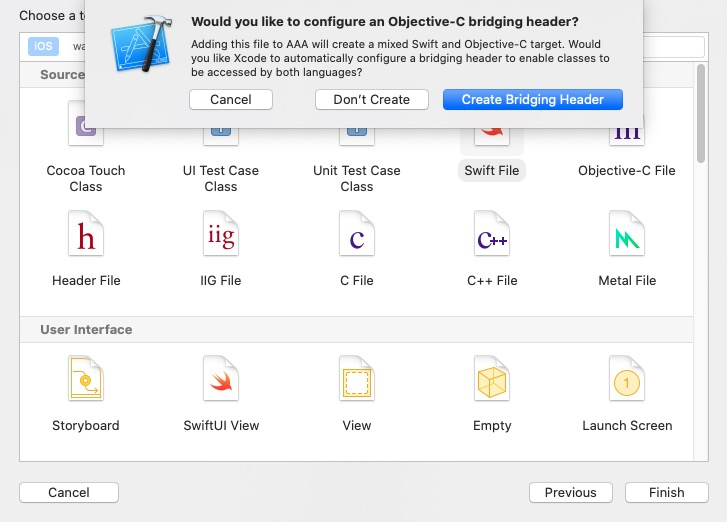

[Swift与OC混编过程中的配置](https://juejin.im/post/5d5a399a6fb9a06af50fca2b)


# 基础知识

## use_frameworks!

* [Why do we use use_frameworks! in CocoaPods?](https://stackoverflow.com/questions/41210249/why-do-we-use-use-frameworks-in-cocoapods)

* [Podfile中的 use_frameworks!](https://segmentfault.com/a/1190000007076865)

use_frameworks！ 告诉CocoaPods您要使用框架而不是静态库。由于Swift不支持静态库，因此您必须使用框架。

## Cocoa Touch Frameworks

它们始终是开源的，并且会像您的应用程序一样构建。 （因此，在您运行应用程序时以及始终在清理项目后，Xcode有时会对其进行编译。）框架仅支持iOS 8和更高版本，但是您可以在框架中使用Swift和Objective-C。

## Cocoa Touch Static Libraries

顾名思义，它们是静态的。 因此，当您将它们导入到项目中时，它们已经被编译。 您可以与其他人共享而不显示他们的代码。 请注意，静态库当前不支持Swift。 您将必须在库中使用Objective-C。 该应用程序本身仍可以用Swift编写。


## OC Swift 混编

Objective-C 与 Swift 混编在使用上主要依赖两个头文件：ProjectName-Bridging-Header.h 和 ProjectName-Swift.h。

对于 Swift 调用 Objective-C，在 ProjectName-Bridging-Header.h 中 import 要使用的 Objective-C 头文件。

对于 Objective-C 调用 Swift，需要编译过程中生成的 ProjectName-Swift.h 文件，此文件会将 Objective-C 需要使用的 Swift 类转成 Objective-C 格式的 .h 文件。


当 Objective-C 与 Swift 进行混编时，编译的过程（Pipeline）是：

- 首先编译 Swift Module。预编译 Bridging Header 后，再编译 Swift 源文件。
- Swift 编译完成后，生成 ProjectName-Swift.h 的头文件供 Objective-C 使用。
- 最后编译 Objective-C 源文件。


##  

[CocoaPods 1.5.0 — Swift Static Libraries](https://blog.cocoapods.org/CocoaPods-1.5.0/)

Xcode9，swift就支持打成静态库了，所以不用非要弄成动态库。


随着支持swift静态库，pod1.5也更新的对应的功能，如果swift的 pod 依赖于某个OC的 pod，需要为该OC版 pod 启用`modular headers`，所以多了 `use_modular_headers!`来全局开启，不过开启之后，之前一些不严谨的依赖，可能会报错，需要具体情况具体分析了，网上相关的文章也很多，就不在这里一一赘述了。而且我也不建议这种跨语言的交叉依赖，比如我的项目主要是OC，依赖的swift版 pod，就是纯swift写的。


##  Clang Module


# 一、OC项目新增Swift


## 1、建立桥接文件

在OC项目中新建Swift文件，会弹出提示，选择 `Create Bridging Header` 建立桥接文件，系统会建立 `“工程名-Bridging-Header.h”`。





## 2、项目配置

首先，在工程的 `Build Settings` 中把 `defines module` 设为 `YES`.


然后，把 `product module name` 设置为**项目工程的名字**。 (系统会自动为我们设置好)


我们再来看一下在这个宿主工程中，OC类中访问Swift，在工程配置的Build Settings中搜索Swift Compiler，可以看到Swift与OC混编的两个配置文件：


**此时系统会为工程创建一个“工程名-Swift.h”的文件(不会显示出来,可以引用)，此文件不可手动创建，必须使用系统创建的** ，此时我们在想要访问Swift方法的OC类中导入ProductName-Swift.h（手动输入没有提示，并且在编译之前报红），然后编译一下，再进入查看源文件：

在想要访问Swift方法的OC类中导入ProductName-Swift.h（手动输入没有提示，并且在编译之前报红），然后编译一下，再进入查看源文件：


## 3、创建Swift类


### 1. OC类调用Swift方法

> 1. Swift类中，凡是允许OC访问的方法，方法前都要加@objc；
> 2. Swift类中用public修饰过的方法，才会出现在ProductName-Swift.h文件中；
> 3. 所有Swift类在ProductName-Swift.h文件都会被自动注册，以会自动@interface修饰，ProductName-Swift.h文件会自动更新。


**调用**


### 2. Swift类调用OC方法


**调用**


## 4、OC项目添加Swift Pod

Podfile文件如下：

```ruby
# Uncomment the next line to define a global platform for your project
# platform :ios, '9.0'

source 'https://github.com/CocoaPods/Specs.git'
source 'http://git.qpaas.com/PaasPods/PaasSpecs.git'    # 组件化索引库


target 'main_OC' do
  # Comment the next line if you don't want to use dynamic frameworks
  use_frameworks!

  # Pods for main_OC
  pod 'QYCH5Module_Swift', '0.1.2'

end
```


**Swift头文件引入**

```swift
@import QYCH5Module_Swift;
```


**调用Swift代码**

```swift
- (void)touchesBegan:(NSSet<UITouch *> *)touches withEvent:(UIEvent *)event {
    // 调用Swift Pod库
    BaseWKWebViewVC *wkVC = [[BaseWKWebViewVC alloc] init];
    [self presentViewController:wkVC animated:YES completion:nil];
}
```


# 二、纯OC组件

### 组件验证：纯OC

```shell
# 本地验证
~ pod lib lint --allow-warnings --sources='https://github.com/CocoaPods/Specs.git' --use-libraries --verbose --no-clean

# 远程验证
~ pod spec lint --allow-warnings --sources='https://github.com/CocoaPods/Specs.git' --use-libraries --verbose --no-clean

# 更新
~ pod repo push LXSpecs OnlyOCDemo.podspec --allow-warnings --use-libraries
```


# 三、⭐OC组件含Swift 集成到 OC项目

## 1. OC组件含Swift

> 参考：QYCH5组件新增 .swift 文件  branch : feature/LXApr_Mix , tag : 0.0.1.T.3

注意点：

```objective-c
1、Example项目工程中新建Swift文件和桥接文件；
2、Example的Podfile 中 必须使用 use_frameworks!
3、.podspec中新增s.swift_version = '5.0'
4、若有静态库，还需新增s.static_framework = true  
  				    	与  s.pod_target_xcconfig = { 'VALID_ARCHS' => 'x86_64 armv7 arm64' }
5、验证时 pod lib lint 不使用 --use-libraries
```


### 组件验证：OC组件含Swift

```shell
pod lib lint --allow-warnings --sources='https://github.com/lionsom/LXSpecs.git,https://github.com/CocoaPods/Specs.git' --verbose --no-clean

pod spec lint --allow-warnings --sources='https://github.com/lionsom/LXSpecs.git,https://github.com/CocoaPods/Specs.git' --verbose --no-clean

pod repo push LXSpecs OCAddSwiftDemo.podspec --allow-warnings --skip-import-validation --sources='https://github.com/lionsom/LXSpecs.git,https://github.com/CocoaPods/Specs.git' --verbose 
```


## 2. OC组件含Swift集成到OC项目

> 参考：QYCH5集成到启业云，项目分支：feature/LXApr_Mix， QYCH5  tag: 0.0.1.T.3


* https://www.codeleading.com/article/85905061910/
* http://luoxianming.cn/2016/03/27/CocoaPods/

[Objective-C Swift 混编的模块二进制化 1：基础知识](https://juejin.cn/post/6844903844758077453)


注意点：

```o
1、OC主工程新增一个Swift文件与桥接文件，Objective-C Bridging Header = XXX
2、Swift Language Version = 5.0
3、Defines Module = YES;

```


# 四、⭐纯Swift组件集成到 OC Pod 与 OC项目


## 1. 纯Swift Pod

> 参考：QYCUtility组件

```objective-c
// podspec
s.swift_version = '5.0'

// 导入
import QYCUtility.Swift
```


## 2. OC Pod 依赖 Swift Pod

> 参考：QYCCuteHand组件 依赖 QYCUtility组件

注意点：

```objective-c
1、Example项目工程中新建Swift文件和桥接文件；
2、Example的Podfile 中 必须使用 use_frameworks!
3、.podspec中新增s.swift_version = '5.0'
4、若有静态库，还需新增s.static_framework = true  
  							与  s.pod_target_xcconfig = { 'VALID_ARCHS' => 'x86_64 armv7 arm64' }
5、验证时 pod lib lint 不使用 --use-libraries
```


## 3. 含有Swift的OC Pod集成到OC项目中

> 参考：QYCCuteHand集成到启业云

```objective-c
1、OC工程Profile中必须使用 use_frameworks!
```


# 五、Swift组件新增OC


