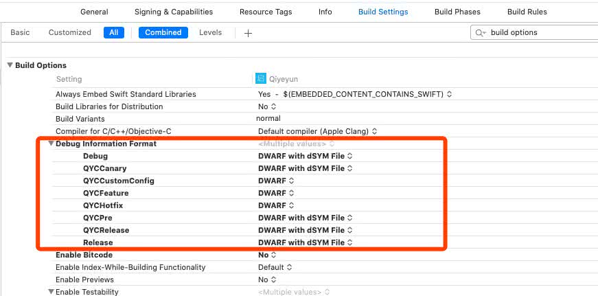
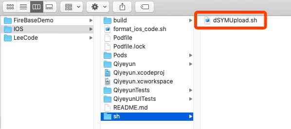
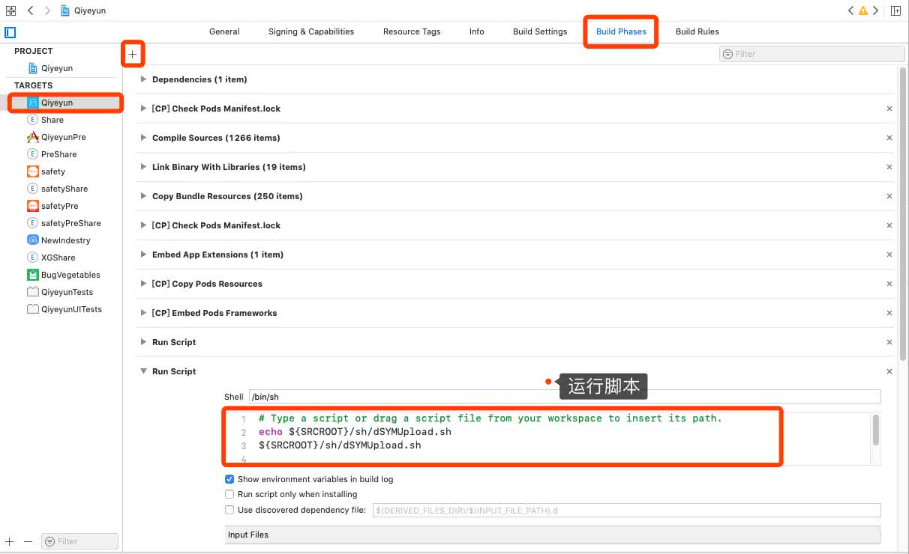
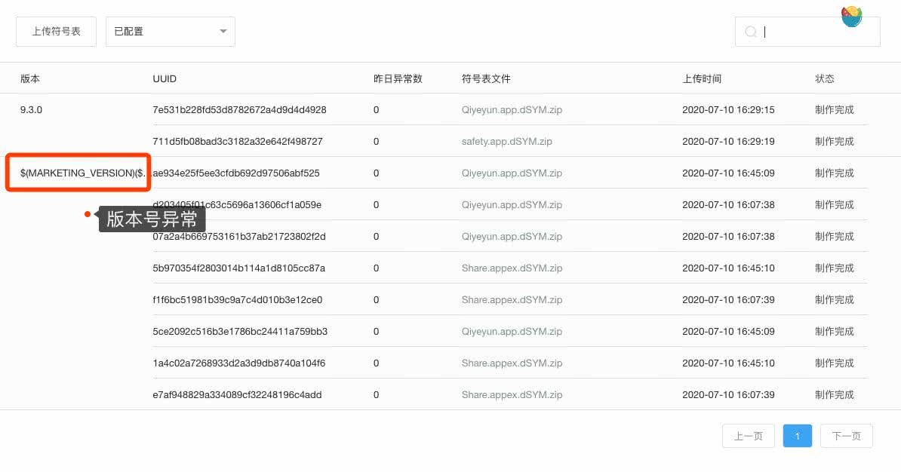
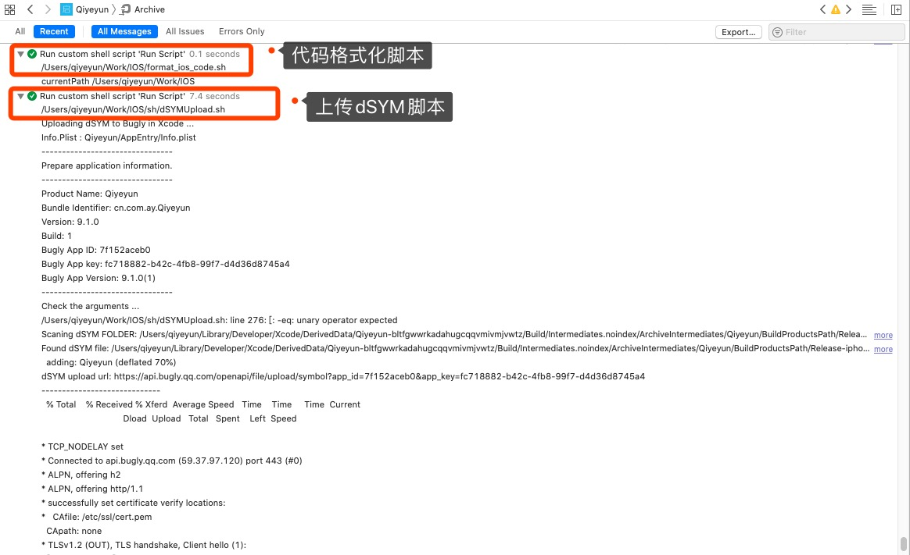
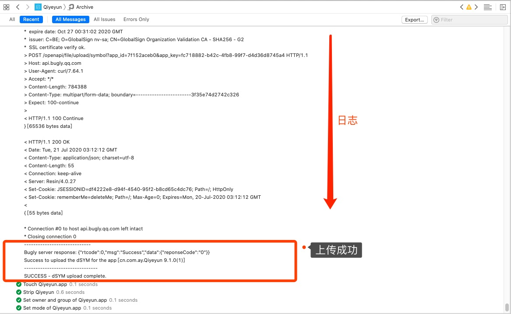

## 一、文档 & 简介

[Bugly文档中心](https://bugly.qq.com/docs/)

[Bugly iOS 符号表配置](https://bugly.qq.com/docs/user-guide/symbol-configuration-ios/?v=20200622202242)


### 1.1. 什么是符号表？

符号表是内存地址与函数名、文件名、行号的映射表。符号表元素如下所示：

```
<起始地址> <结束地址> <函数> [<文件名:行号>]
```

### 1.2. 为什么要配置符号表？

为了能快速并准确地定位用户APP发生**Crash的代码位置**，Bugly使用**符号表**对APP发生Crash的程序**堆栈**进行**解析**和**还原**。

### 1.3. 什么是dSYM文件？

iOS平台中，dSYM文件是指具有调试信息的目标文件，文件名通常为：**xxx.app.dSYM**。

### 1.4. 如何定位dSYM文件？

一般情况下，项目编译完dSYM文件跟app文件在同一个目录下，下面以XCode作为IDE详细说明定位dSYM文件。

```
-> 进入XCode；
-> 打开工程（已编译过）；
-> 在左栏找到“Product”项；
-> 鼠标右键点击编译生成的“xxx.app”；
-> 点击“Show in Finder”；
```

### 1.5. XCode编译后没有生成dSYM文件？

XCode Release编译默认会生成dSYM文件，而Debug编译默认不会生成，对应的Xcode配置如下：

```
XCode -> Build Settings -> Code Generation -> Generate Debug Symbols -> Yes
XCode -> Build Settings -> Build Option -> Debug Information Format -> DWARF with dSYM File
```





### 1.6. 开启Bitcode之后需要注意哪些问题？

不需要配置自动生成符号表的脚本了，也不要用本地生成的dSYM文件来生成符号表文件，因为本地编译生成的dSYM文件的符号表信息都被隐藏了。如果用本地编译生成的dSYM文件生成符号表文件并配置到Bugly平台之后，还原出来的结果将是类似于“__hiden#XXX”这样的符号。


### 1.7. 如何查看dSYM文件UUID？

#### 1.通过命令查看UUID

```
~ xcrun dwarfdump --uuid <dSYM文件>

///
➜ ~ xcrun dwarfdump --uuid /dSYMs/Qiyeyun.app.dSYM
UUID: AE934E25-F5EE-3CFD-B692-D97506ABF525 (armv7) /Users/qiyeyun/Library/Developer/Xcode/Archives/2020-07-10/Qiyeyun 2020-7-10, 6.24 PM.xcarchive/dSYMs/Qiyeyun.app.dSYM/Contents/Resources/DWARF/Qiyeyun
UUID: 5CE2092C-516B-3E17-86BC-24411A759BB3 (arm64) /Users/qiyeyun/Library/Developer/Xcode/Archives/2020-07-10/Qiyeyun 2020-7-10, 6.24 PM.xcarchive/dSYMs/Qiyeyun.app.dSYM/Contents/Resources/DWARF/Qiyeyun
```

#### 2.通过符号表文件查看UUID


### 1.8. 如何找回已发布到App Store的App对应的dSYM文件？

#### 1. 通过Xcode找回

```
Xcode顶部菜单栏 -> Window -> Organizer -> Archives -> 选择打好的包 -> Show in Finder -> 显示包内容 -> dSYM
```

#### 2. 通过 [iTunes Connect](https://itunesconnect.apple.com/) 找回

```
登录iTunes Connect -> 我的App -> 所有构建版本
```

#### 3. 通过mdfind工具找回

> 注意，使用mdfind时，UUID需要格式转换（增加“-”）： 12345678-1234-1234-1234-xxxxxxxxxxxx

```
➜ ~ mdfind "com_apple_xcode_dsym_uuids == AE934E25-F5EE-3CFD-B692-D97506ABF525"
/Users/qiyeyun/Library/Developer/Xcode/Archives/2020-07-10/Qiyeyun 2020-7-10, 6.24 PM.xcarchive
/Users/qiyeyun/Library/Developer/Xcode/Archives/2020-07-10/Qiyeyun 2020-7-10, 5.47 PM.xcarchive
/Users/qiyeyun/Library/Developer/Xcode/Archives/2020-07-10/Qiyeyun 2020-7-10, 5.26 PM.xcarchive
/Users/qiyeyun/Library/Developer/Xcode/Archives/2020-07-10/Qiyeyun 2020-7-10, 4.45 PM.xcarchive
```


## 二、iOS安装Bugly

### 2.1. 推荐CocoaPods

```
pod 'Bugly'
```

### 2.2. 初始化Bugly

```
// AppDelegate.m
#import <Bugly/Bugly.h>

- (BOOL)application:(UIApplication *)application didFinishLaunchingWithOptions:(NSDictionary *)launchOptions {
    [Bugly startWithAppId:@"此处替换为你的AppId"];
    return YES;
}
```


## 三、上传符号表

### 3.1. 自动配置：Xcode + sh脚本

自动配置请首先下载和解压[自动配置符号表工具包](https://bugly.qq.com/v2/sdk?id=6ecfd28d-d8ea-4446-a9c8-13aed4a94f04)，然后选择上传方式并配置Xcode的编译执行脚本。






### 3.2. 修改脚本

```
######################################################
# 1. 脚本集成到Xcode工程的Target
######################################################
BUGLY_APP_ID="xxx"
BUGLY_APP_KEY="xxxx"
BUNDLE_IDENTIFIER="xxxx"
```


## 四、Xcode Archive打包测试

### 4.1. 问题一："dSYMUpload.sh:Permission denied"

在Xcode 的 `Targets-->Build Phases-->Run Script` 执行sh脚本报错 “xxx.sh:Permission denied” 是因为第一次运行没有权限。

* #### 解决方法：

```
~ chmod 755 /xx/dSYMUpload.sh
```


### 4.2. 问题二：上传dSYM到Bugly成功，但版本号异常



* #### 原因：

xcode 11 后改成 ` $(MARKETING_VERSION) $(CURRENT_PROJECT_VERSION)`

* #### 解决方案：

```bash
BUNDLE_VERSION="$MARKETING_VERSION"
BUNDLE_SHORT_VERSION="$CURRENT_PROJECT_VERSION"
# BUNDLE_VERSION=$(/usr/libexec/PlistBuddy -c 'Print CFBundleVersion' "${INFOPLIST_FILE}")
# BUNDLE_SHORT_VERSION=$(/usr/libexec/PlistBuddy -c 'Print CFBundleShortVersionString' "${INFOPLIST_FILE}")
```


### 4.3. 查看编译日志

#### 1. 开始运行脚本



#### 2. dSYM上传成功




### 4.4. 查看Bugly符号表管理【成功】


