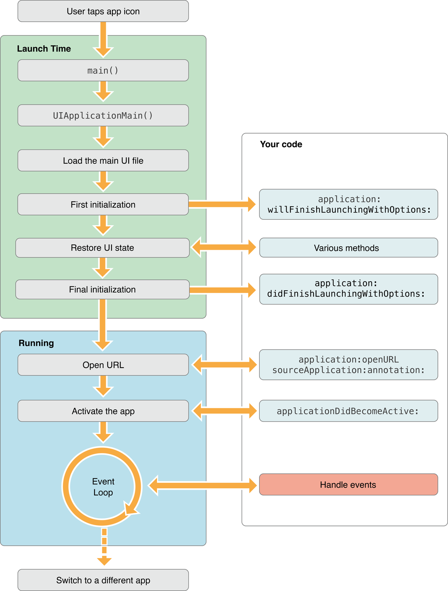
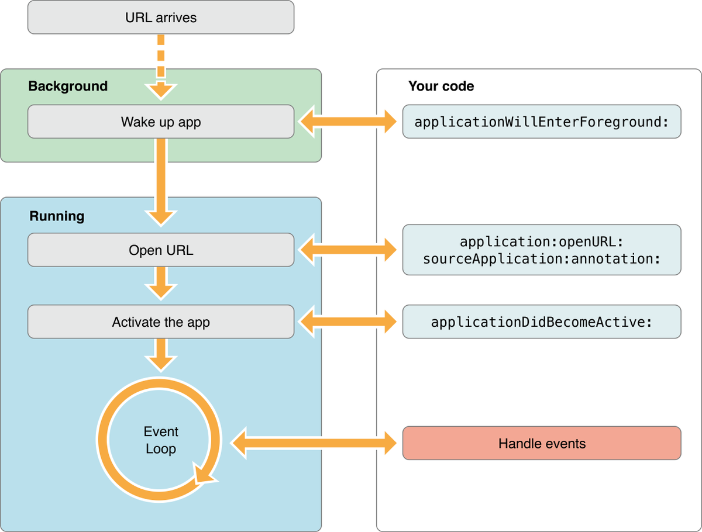

# URL Schemes

[Apple Document - About Apple URL Schemes](https://developer.apple.com/library/archive/featuredarticles/iPhoneURLScheme_Reference/Introduction/Introduction.html#//apple_ref/doc/uid/TP40007899)

[我的简书 - iOS - URL Schema](https://www.jianshu.com/p/137284ebe73d)

[一缕殇流化隐半边冰霜 - iOS 组件化 —— 路由设计思路分析](https://www.jianshu.com/p/76da56b3bd55)

明白了上面的生命周期之后，我们就可以通过调用[application:openURL:sourceApplication:annotation:](https://link.jianshu.com/?t=https://developer.apple.com/reference/uikit/uiapplicationdelegate/1623073-application)这个方法，来阻止一些App的随意调用。

# Universal Links

[Apple Document - Support Universal Links](https://developer.apple.com/library/archive/documentation/General/Conceptual/AppSearch/UniversalLinks.html)

[官方检验Universal Links](https://search.developer.apple.com/appsearch-validation-tool/)

