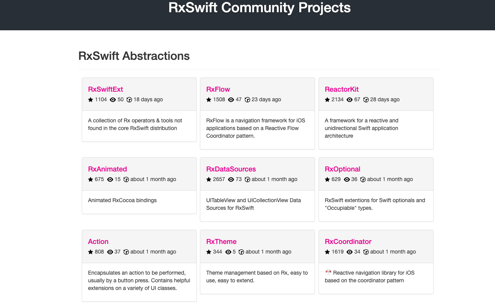

# RxSwift学习资料

## 官方

* [RxSwift - Github](https://github.com/ReactiveX/RxSwift)
* [RxSwift中文文档](https://beeth0ven.github.io/RxSwift-Chinese-Documentation/)
* [ReactiveX](http://reactivex.io/)

## 博客

* [RxSwift技术路线与参考资料](https://blog.csdn.net/qq_14920635/article/details/114981760)

* [Swift-RxSwift使用-航哥](https://www.hangge.com/blog/cache/category_72_11.html)
* [理解 RxSwift：为什么要使用 RxSwift（一）](https://juejin.cn/post/6844903859844808717)

## 书籍

* [《》]()

## 社区

RxSwift社区聚合了生态学习资源和文档等开源代码指南社区，包含以下模块：

* [RxSwift Community](https://community.rxswift.org/)

- 包含RxSwift一些抽象工具库，比如RxDataSource, RxCoordinator, Action, RxSwiftExt, ReactorKit等
- 其他库的扩展支持，比如RxRealm, RxAlamofire, RxWebKit等
- 提供RxSwift支持的库，比如 Moya
- 使用RxSwift编写的开源应用，比如[MVVM-RouterDemo](https://github.com/OlexandrStepanov/MVVM-RouterDemo), [Papr(MVVM+Coordinator)](https://github.com/jdisho/Papr), [Simple MVVM Login Example](https://github.com/carlosypunto/ReallySimpleMVVMLoginExampleWithRxSwift)

## RxSwift项目

* [RxSwift Community Projects](https://community.rxswift.org/)

# ff 

RxSwift简介

**响应式编程**

响应式编程（Reactive Programming）是一种通过异步和数据流来构建事务关系的编程思想。核心体现就是观察者和可被观察者,通过构造操作数据序列，然后再对这些序列作出响应。

**响应式编程框架**

在Objective-C语言中，也流行着响应式编程框架[ReactiveCocoa](https://github.com/ReactiveCocoa/ReactiveCocoa)

而在Swift语言中，最受欢迎的应该是ReativeX社区的[RxSwift](https://github.com/ReactiveX/RxSwift)

[ReactiveX](http://reactivex.io/)（简写: Rx） 是一个可以帮助我们简化异步编程的框架。

[RxSwift](https://github.com/ReactiveX/RxSwift) 是 [Rx](https://github.com/Reactive-Extensions/Rx.NET) 的 **Swift** 版本。

它尝试将原有的一些概念移植到 iOS/macOS 平台。

你可以在这里找到跨平台文档 [ReactiveX.io](http://reactivex.io/)。

KVO，异步操作 和 流 全部被统一成抽象序列。这就是为什么 Rx 会如此简单，优雅和强大。
