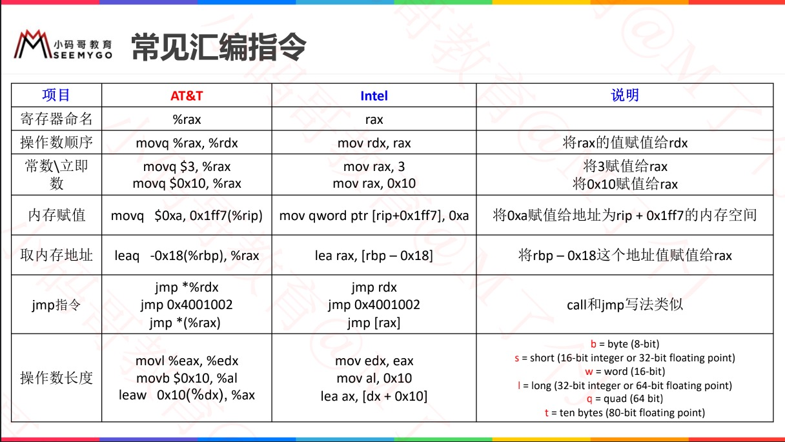
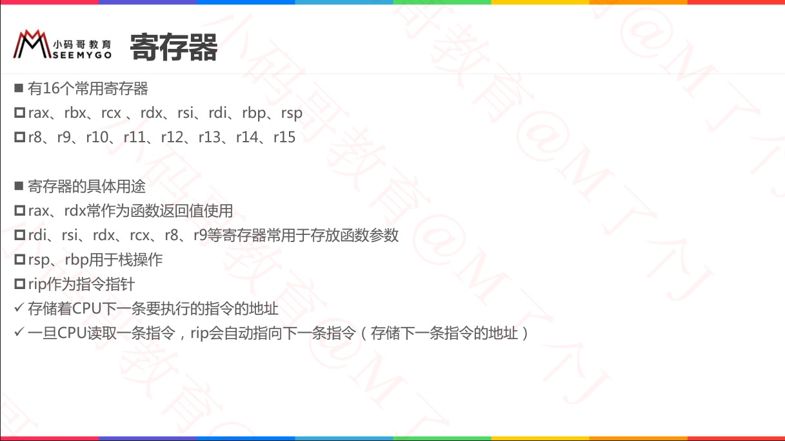
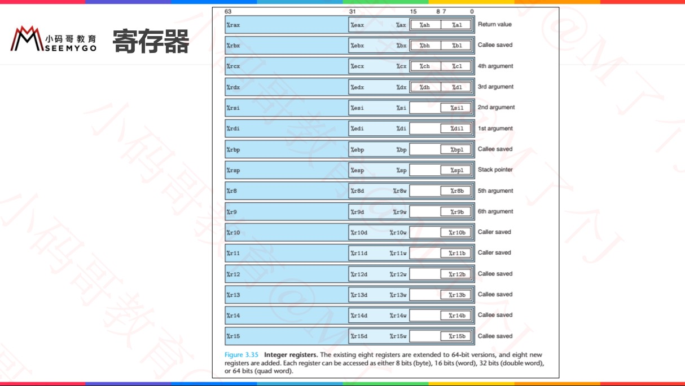
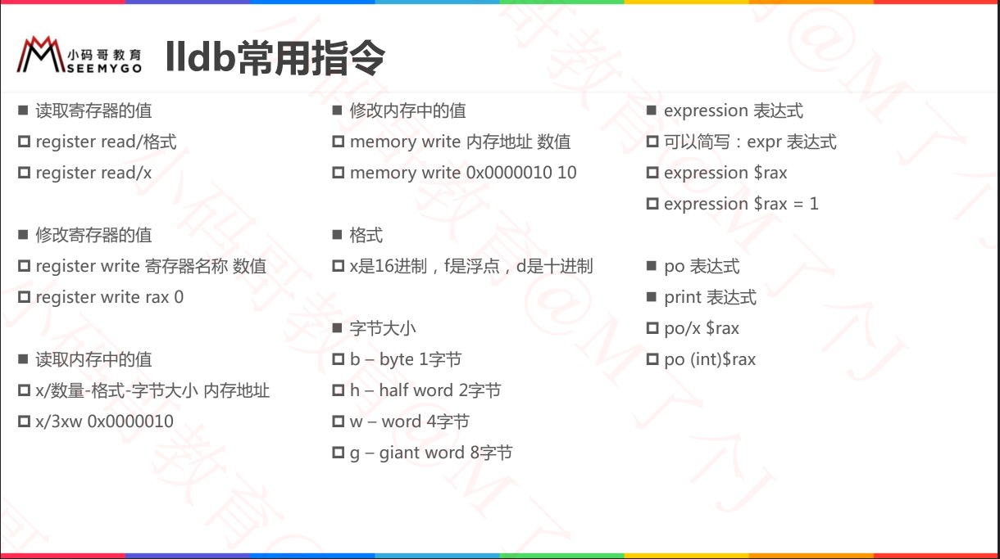
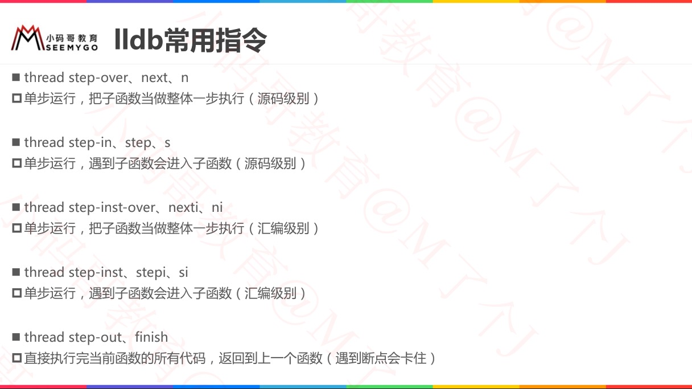
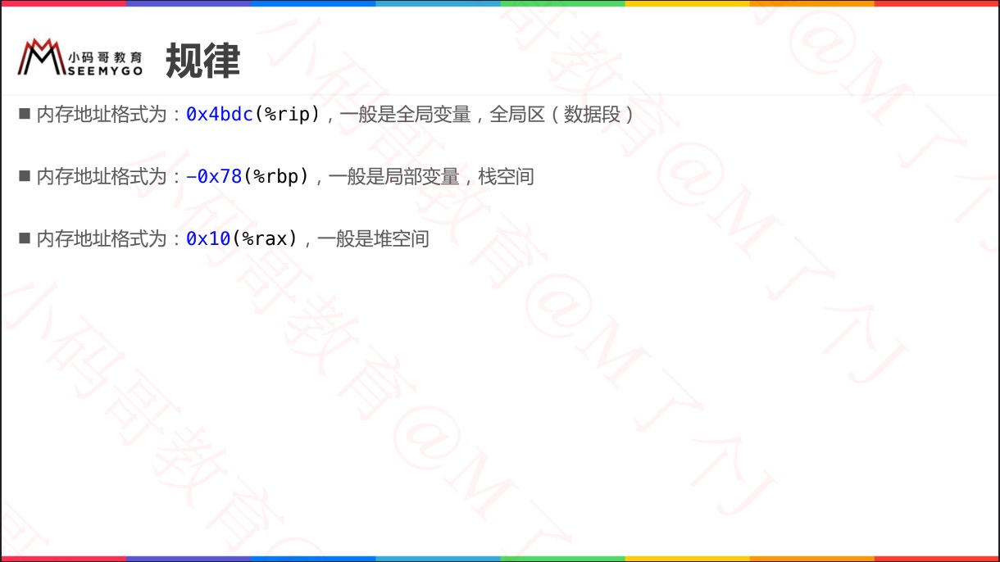

# 汇编基础、指令




# 寄存器






# LLDB

```swift
(lldb) register read rax
     rax = 0x00007ffeefbff230

(lldb) x/4xg 0x00007ffeefbff230
0x7ffeefbff230: 0x00007fff88a83d98 0x0000000000000000
0x7ffeefbff240: 0x00007ffeefbff270 0x0000000100505350
```







# 地址识别




