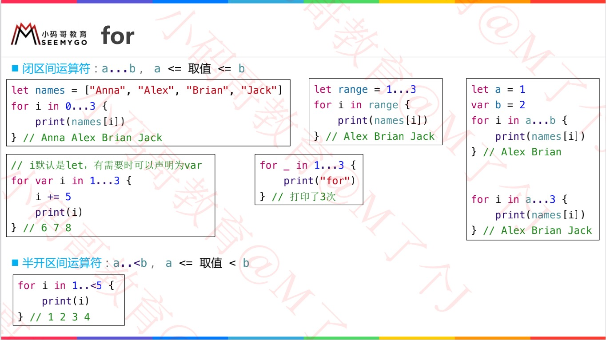
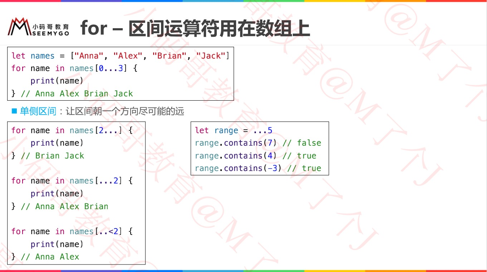
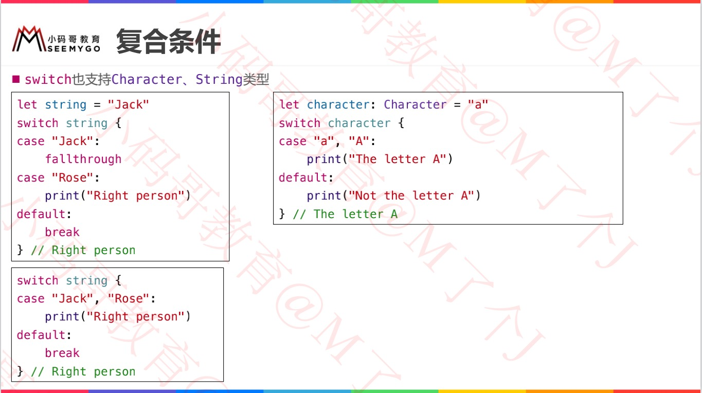
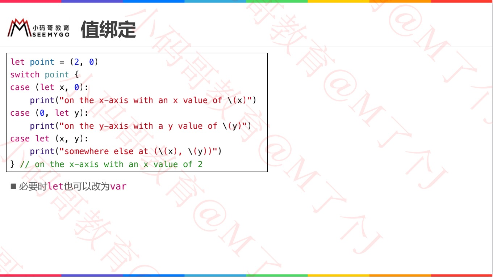
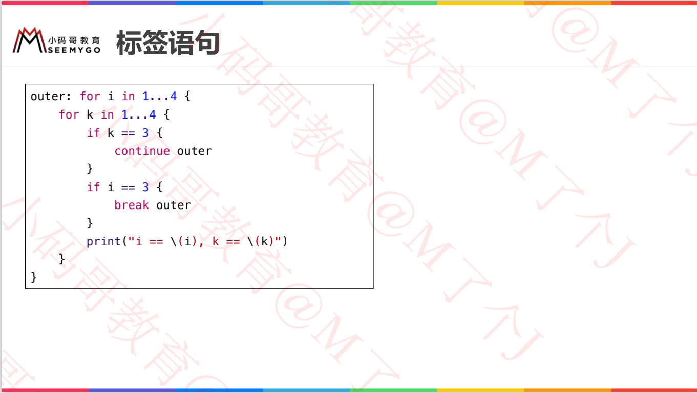

# if - else


# while


# for






## 区间类型


# switch


## fallthrough 贯穿


## switch 注意点


## switch 复合条件




## switch 区间匹配、元祖匹配


## switch 值绑定




# where


# 标签语句

> Demo：MyPlayground.playground	-->	AAA	-->	**func** 标签语句() 




guard case 用法

https://stackoverflow.com/questions/32256834/swift-guard-let-vs-if-let


# 一、Guard VS If 

* Guard let
  * 要求返回值，`return/throw/break/continue`；
  * 创建的变量，guard内不能访问，guard外可以访问；
  * 存在于函数的前面；

* If let
  * 返回值return非必须，当然也可以写；
  * 创建的变量，超出作用域就不能访问；


# 二、Guard 作用


## 1. 提前退出

> 如果name不存在，则不需要执行后面的代码，直接返回。

```swift
func greet(person: [String: String]) {
    guard let name = person["name"] else {
        return
    }
		//.......    
}
```


## 2.使代码清晰，避免金字塔

```swift
func validateFieldsAndContinueRegistration() {
    if let firstNameString = firstName.text where firstNameString.characters.count > 0 {
        if let lastNameString = lastName.text where lastNameString.characters.count > 0 {
            if let emailString = email.text where emailString.characters.count > 3 && emailString.containsString("@") {
                if let passwordString = password.text where passwordString.characters.count > 7 {
                    //......
                } else {
                    //......
                }
            } else {
                //......
            }
        } else {
            //......
        }
    } else {
        //......
    }
}
```


## 3.guard创建的变量作用域

> 使用guard可以创建一个新的变量，该变量将存在于else语句之外。
>
> 新创建的变量只存在于代码块内部。

```swift
func someFunc(blog: String?) {

    guard let blogName = blog else {
        print("some ErrorMessage")
        print(blogName)    // Error : Variable declared in 'guard' condition is not usable in its body
        return
    }
    print(blogName)   // You can access it here ie AFTER the guard statement!!

    // And if I decided to do 'another' guard let with the same name ie 'blogName' then I would create an error!
    guard let blogName = blog else { // Error: Definition Conflicts with previous value.
        print(" Some errorMessage")
        return
    }
    print(blogName)
}
```


