#  函数定义

## 无形式参数、无返回值

```swift
// 无形式参数、无返回值
func test1() {
		//......
}
/// 严格来讲，函数还是有一个返回值的，尽管没有定义返回值。没有定义返回类型的函数实际上会返回一个特殊的类型 Void。它其实是一个空的元组，作用相当于没有元素的元组，可以写作 () 。
```


## 多形式参数、有返回值

```swift
// 多形式参数、有返回值
func test2(name: String, aget: Int) -> String {
    //......
		return "xxx"
}
// 调用
test2(name: "lin", age: 12)
```


## 可选元组返回类型

```swift
// 可选元组返回类型
// (Int, Int)?的可选元组类型和包含可选类型的元组 (Int?, Int?)是不同的。
func minMax(array: [Int]) -> (min: Int, max: Int)? {
    if array.isEmpty { return nil }
    var currentMin = array[0]
    var currentMax = array[0]
    for value in array[1..<array.count] {
        if value < currentMin {
            currentMin = value
        } else if value > currentMax {
            currentMax = value
        }
    }
    return (currentMin, currentMax)
}
// 调用
let bounds = minMax(array: [8, -6, 2, 109, 3, 71])
print("min is \(bounds.min) and max is \(bounds.max)")
```


## 隐式返回（Implicit Return）

```swift
// 隐式返回的函数
// 整个函数体是一个单一表达式，那么函数隐式返回这个表达式，通俗来说：可以省略那个 return
func greeting(for person: String) -> String {
    "Hello, " + person + "!"
}
```


# 函数参数

## 参数标签（Argument Label）

```swift
// 默认情况下，形式参数使用它们的形式参数名作为实际参数标签。
func someFunction(firstParameterName: Int, secondParameterName: Int) {
    //......
}
// 调用
someFunction(firstParameterName: 1, secondParameterName: 2)


// 指定实际参数标签
func someFunction(argumentLabel parameterName: Int) {
    // In the function body, parameterName refers to the argument value
    // for that parameter.
}
// 调用
someFunction(argumentLabel: 1)


// 若指定了实际参数标签，则调用时必须使用实参标签
func someFunction(person: String, from hometown: String) -> String {
    return "Hello \(person)!  Glad you could visit from \(hometown)."
}
// 调用
someFunction(person: "Bill", from: "Cupertino")


// 省略实际参数标签
// 用下划线（ _ ）来代替显式的实际参数标签。
func someFunction(_ firstParameterName: Int, secondParameterName: Int) {
    // In the function body, firstParameterName and secondParameterName
    // refer to the argument values for the first and second parameters.
}
// 调用
someFunction(1, secondParameterName: 2)
```


## 默认参数值（Default Parameter Value）

```swift
// 默认形式参数值
func someFunction(parameterWithDefault: Int = 12) {
    //......
}
// 调用
someFunction(parameterWithDefault: 6) // parameterWithDefault is 6
someFunction() // parameterWithDefault is 12
```


## 可变参数（Variadic Parameter）

```swift
// 可变形式参数
// 一个可变形式参数可以接受零或者多个特定类型的值。可以通过在形式参数的类型名称后边插入三个点符号（ ...）来书写可变形式参数。
// 传入到可变参数中的值在函数的主体中被当作是对应类型的数组。举个栗子，一个可变参数的名字是 numbers类型是 Double...在函数的主体中它会被当作名字是 numbers 类型是 [Double]的常量数组。
// 注意：一个函数最多只能有一个可变形式参数。
func arithmeticMean(_ numbers: Double...) -> Double {
    var total: Double = 0
    for number in numbers {
        total += number
    }
    return total / Double(numbers.count)
}
// 调用
arithmeticMean(1, 2, 3, 4, 5)
// returns 3.0, which is the arithmetic mean of these five numbers
arithmeticMean(3, 8.25, 18.75)
// returns 10.0, which is the arithmetic mean of these three numbers
```

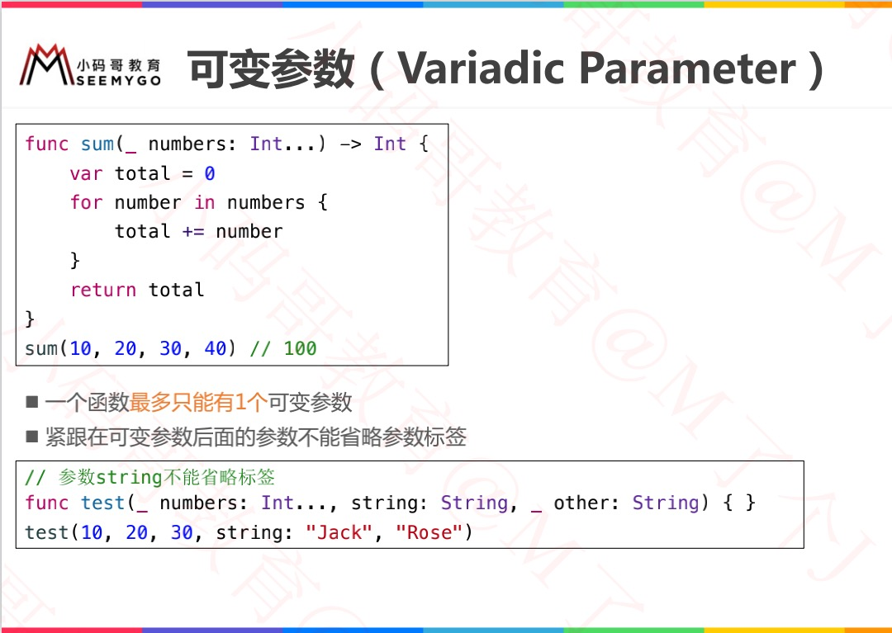


## 输入输出参数（In-Out Parameter）

```swift
/// 输入输出形式参数
/// 输入输出形式参数不能有默认值
/// 不能用常量或者字面量作为实际参数，因为常量和字面量不能修改。
/// 在将变量作为实际参数传递给输入输出形式参数的时候f，前边添加符号 ( &) 来明确可以被函数修改。
func swapTwoInts(_ a: inout Int, _ b: inout Int) {
    let temporaryA = a
    a = b
    b = temporaryA
}
// 调用
var someInt = 3
var anotherInt = 107
swapTwoInts(&someInt, &anotherInt)
print("someInt is now \(someInt), and anotherInt is now \(anotherInt)")
// prints "someInt is now 107, and anotherInt is now 3"
```

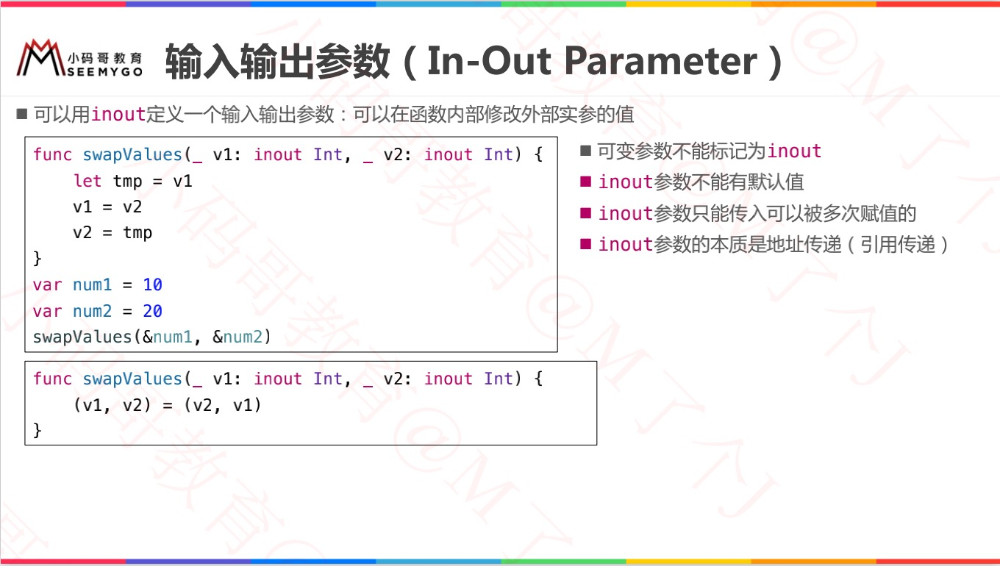


# 函数重载（Function Overload）

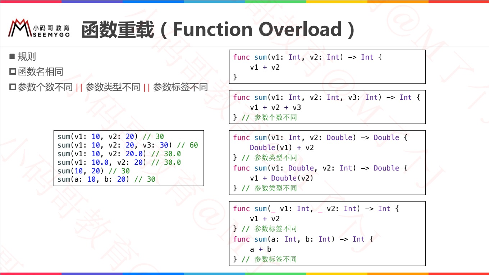

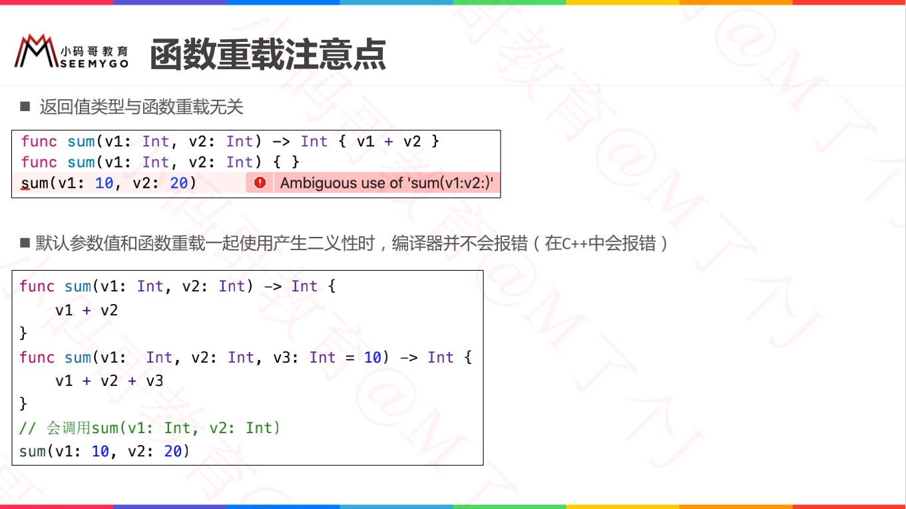

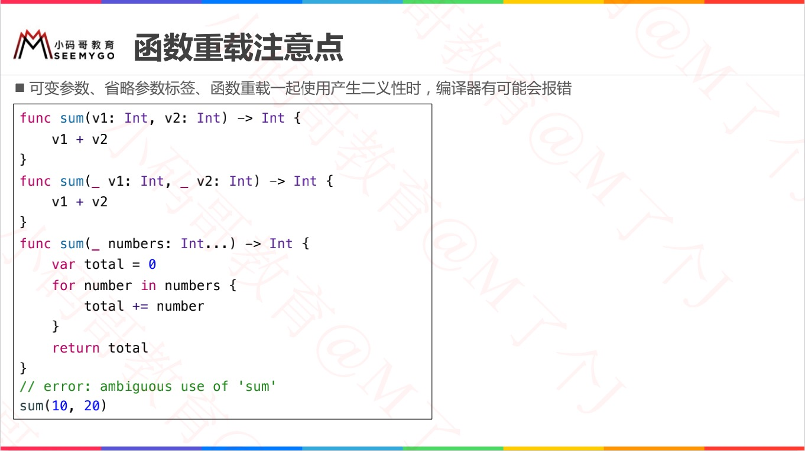


# 内联函数（Inline Function）

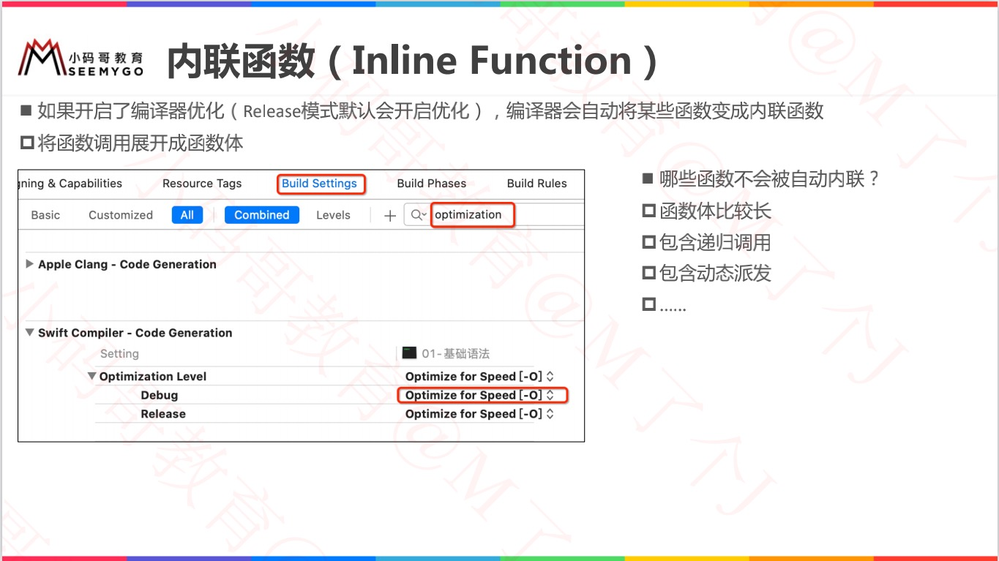

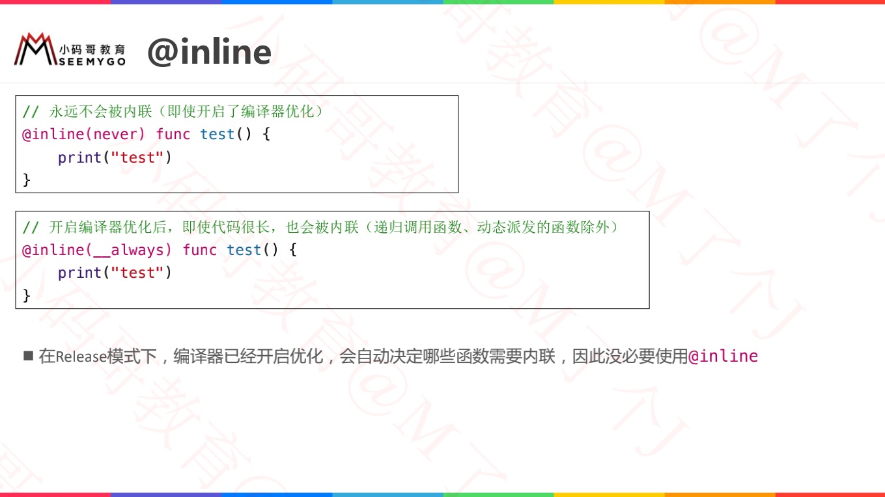


# 函数类型（Function Type）

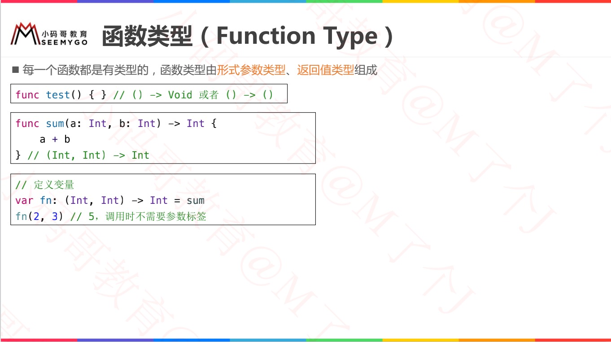

```swift
// 每一个函数都有一个特定的函数类型，它由形式参数类型，返回类型组成。
func printHelloWorld() {
    print("hello, world")
}
// 这个函数的类型是 () -> Void，或者 “一个没有形式参数的函数，返回 Void。”

func addTwoInts(_ a: Int, _ b: Int) -> Int {
    return a + b
}
// 函数的类型都是 (Int, Int) -> Int 。也读作：“有两个形式参数的函数类型，它们都是 Int类型，并且返回一个 Int类型的值。”


/// 声明函数类型的变量
var a: () -> Void
var b: (Int, String) -> String
var c: ([Int]) -> (Int, String)

// 使用函数类型
func addTwoInts(_ a: Int, _ b: Int) -> Int {
    return a + b
}
var d: (Int, Int) -> Int = addTwoInts
d(1, 3)
```


##  函数类型作为函数参数

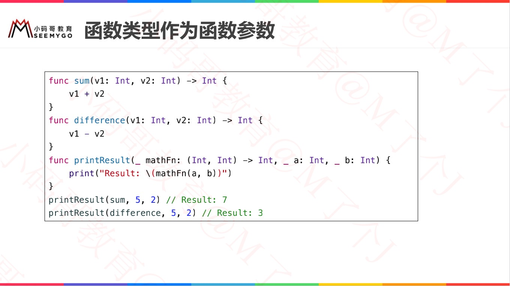

```swift
// 函数类型作为形式参数类型
func test() {
    print("test()方法被调用了")
}
func test11(param: () -> Void) {
    param()
}
// 调用一
test11(param: test)   // Log：test()方法被调用了
// 调用二
test11(param: {() -> Void in
    print("345")
})
// 调用三
test11 {() -> Void in
    print("123")
}

// 进阶
func sum(param: (Int, Int) -> Int) {
    let value = param(1, 3)
    print(value)
}
func add(a: Int, b: Int) -> Int {
    return a + b
}
// 调用一
sum(param: add)
// 调用二
sum(param: {(a: Int, b: Int) -> Int in
    return a + b
})

// 样例
var arr = [4,1,2,3]
arr.sort { (a, b) -> Bool in
    if a < b {
        return true
    } else {
        return false
    }
}
print(arr)   // Log：[1, 2, 3, 4]
```


## 函数类型作为函数返回值

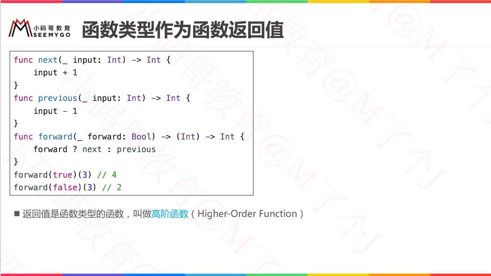

```swift
func play1(value: Int) -> Int {
    return value * value
}
func play2(value: Int) -> Int {
    return value + value
}
// 函数类型作为返回类型
func test(param: Bool) -> (Int) -> Int {
    return param ? play1 : play2
}
// 调用
var a = test(param: true)  // 此时a为一个函数
print(type(of: a))     // Log: (Int) -> Int
// 此时a为paly1函数
print(a(5)) 		// Log: 25
```


# 嵌套函数（Nested Function）

> 在函数里面定义函数

```swift
// 外面大方法
func test(param: Bool) -> (Int) -> Int {
    // 内部方法1
    func play1(value: Int) -> Int {
        return value * value
    }
		// 内部方法2
    func play2(value: Int) -> Int {
        return value + value
    }
    
    return param ? play1 : play2
}

// 调用
var a = test(param: true)  // 此时a为一个函数
print(type(of: a))     // Log: (Int) -> Int
// 此时a为paly1函数
print(a(5)) 		// Log: 25
```


# 闭包 Closure

> 1. 闭包是独立的函数块，可以在代码中传递和使用；
>
> 2. Swift中的闭包类似于C和Objective-C中的`block`以及其他编程语言中的`lambdas(匿名函数)`；
>
> 3. 闭包可以捕获和存储上下文中定义的任何常量和变量的引用；
> 4. 全局函数和嵌套函数实际上是闭包的特例。


闭包的形式有：

| 全局函数                 | 嵌套函数                         | 闭包表达式                                           |
| ------------------------ | -------------------------------- | ---------------------------------------------------- |
| 有名字但不能捕获任何值。 | 有名字，也能捕获封闭函数内的值。 | 无名闭包，使用轻量级语法，可以根据上下文环境捕获值。 |


```swift
let names = ["Chris", "Alex", "Ewa", "Barry", "Daniella"]

func backward(_ s1: String, _ s2: String) -> Bool {
    return s1 > s2
}
var reversedNames = names.sorted(by: backward)

var reversedNames1 = names.sorted(by: {(s1: String, s2: String) -> Bool in
    return s1 < s2
})
print(reversedNames)  // Log: ["Ewa", "Daniella", "Chris", "Barry", "Alex"]
print(reversedNames1) // Log: ["Alex", "Barry", "Chris", "Daniella", "Ewa"]
```


## 简写一览

```swift
// 类型一：变量：() -> Void
var a:() -> Void = { () -> Void in
    print("a")
}
a()
print(type(of: a))

var b:() -> Void = {
    print("b")
}
b()
print(type(of: b))

var c = {print("c")}
c()
print(type(of: c))


// 类型二：方法参数：() -> Void
func test(param: () -> Void) {
    param()
}

test(param: {() -> Void in
    print("test")
})

test(param: {
    print("test")
})

test {
    print("test")
}


// 类型三：方法参数：(Int) -> Void
func test(param: (Int) -> Void) {
    param(10)
}

test(param: {(value: Int) -> Void in
    print(value)
})

test(param: {(value: Int) in
    print(value)
})

test(param: {(value) in
    print(value)
})

test{(value) in
    print(value)
}


// 类型四：方法参数：(Int, Int) -> Int
func test(param: (Int, Int) -> Int) {
    print(param(10, 20))
}

test(param: {(value1: Int, value2: Int) -> Int in
    return value1 + value2
})

test(param: {
    return $0 + $1
})

test(param: {
    $0 + $1
})

test{
    $0 + $1
}
```


## 尾随闭包

```swift
func test(param: () -> Void) {
  	// 函数体部分
    param()
}

// 以下是不使用尾随闭包进行函数调用
test(param: {() -> Void in
    // 闭包主体部分
    print("test")
})

// 以下是不使用尾随闭包进行函数调用
test(param: {
    // 闭包主体部分
    print("test")
})

// 以下是使用尾随闭包进行函数调用
test() {
    // 闭包主体部分
    print("test")
}

// 如果闭包表达式是函数或方法的唯一参数，则当你使用尾随闭包时，你甚至可以把 () 省略掉：
test {
    // 闭包主体部分
    print("test")
}
```


## 值捕获

```swift
func makeIncrementer(forIncrement amount: Int) -> () -> Int {
    var runningTotal = 0
    func incrementer() -> Int {
        runningTotal += amount
        return runningTotal
    }
    return incrementer
}

let incrementByTen = makeIncrementer(forIncrement: 10)

incrementByTen()	// 10
incrementByTen()	// 20	
incrementByTen()	// 30
```


## 闭包是引用类型

```swift
let alsoIncrementByTen = incrementByTen
alsoIncrementByTen()	// 40
```


## 逃逸闭包 - 异步后调用

> 当一个闭包作为参数传到一个函数中，但是这个闭包在函数返回之后才被执行，我们称该闭包从函数中*逃逸*。
>
> 当你定义接受闭包作为参数的函数时，你可以在参数名之前标注 `@escaping`，用来指明这个闭包是允许“逃逸”出这个函数的。

```swift
var completionHandlers: [() -> Void] = []
func someFunctionWithEscapingClosure(completionHandler: @escaping () -> Void) {
    completionHandlers.append(completionHandler)
}

func someFunctionWithNonescapingClosure(closure: () -> Void) {
    closure()
}

class SomeClass {
    var x = 10
    func doSomething() {
        someFunctionWithEscapingClosure { self.x = 100 }
        someFunctionWithNonescapingClosure { x = 200 }
    }
}

let instance = SomeClass()
instance.doSomething()
print(instance.x)
// 打印出“200”

completionHandlers.first?()
print(instance.x)
// 打印出“100”
```


## 自动闭包 - 延迟加载

```swift
var customersInLine = ["Chris", "Alex", "Ewa", "Barry", "Daniella"]
print(customersInLine.count)
// 打印出“5”

let customerProvider = { customersInLine.remove(at: 0) }
print(customersInLine.count)
// 打印出“5”

print("Now serving \(customerProvider())!")
// 打印出“Now serving Chris!”
print(customersInLine.count)
// 打印出“4”
```


## 自动闭包 + 逃逸闭包

```swift
var customersInLine = ["Chris", "Alex", "Ewa", "Barry", "Daniella"]

// customersInLine i= ["Barry", "Daniella"]
var customerProviders: [() -> String] = []
func collectCustomerProviders(_ customerProvider: @autoclosure @escaping () -> String) {
    customerProviders.append(customerProvider)
}
collectCustomerProviders(customersInLine.remove(at: 0))
collectCustomerProviders(customersInLine.remove(at: 0))

print("Collected \(customerProviders.count) closures.")
// 打印“Collected 2 closures.”
for customerProvider in customerProviders {
    print("Now serving \(customerProvider())!")
}
// 打印“Now serving Barry!”
// 打印“Now serving Daniella!”
```


# 函数注释

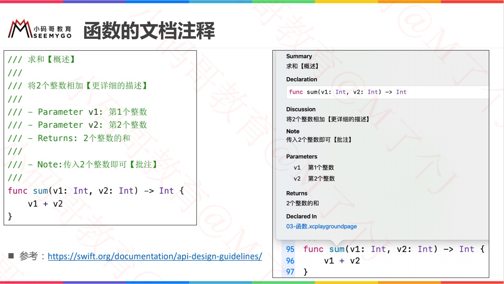

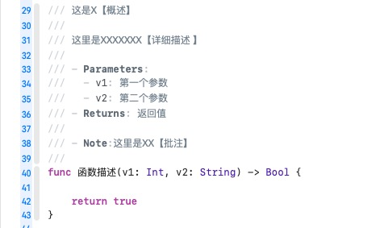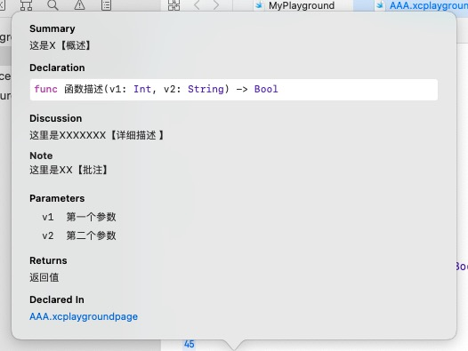


# Swift自带的print函数

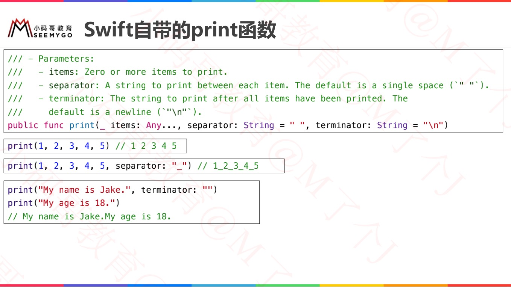


# typealias 

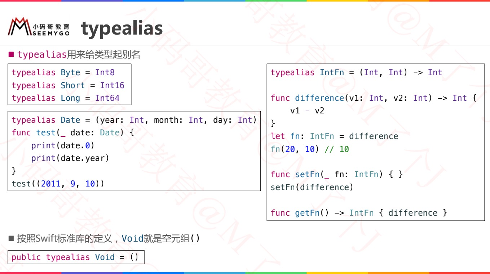

