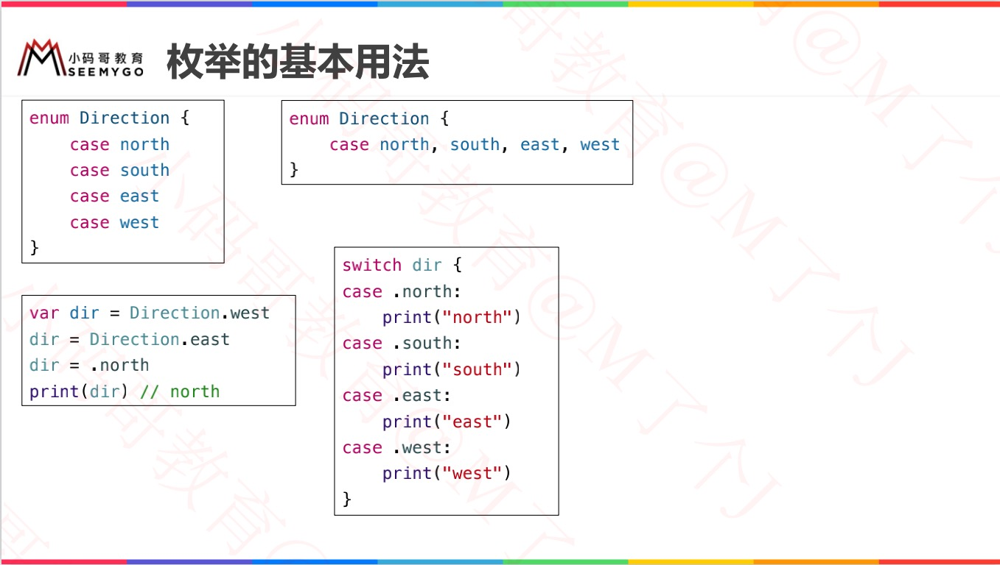
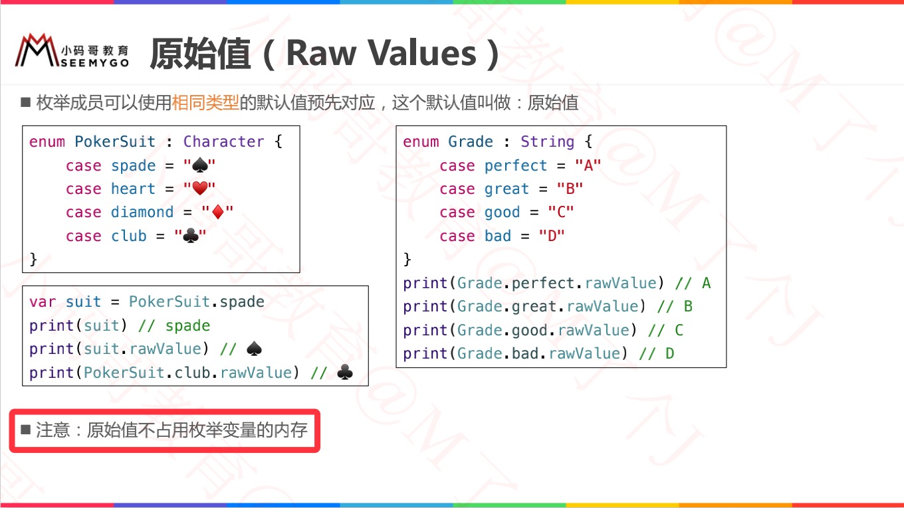
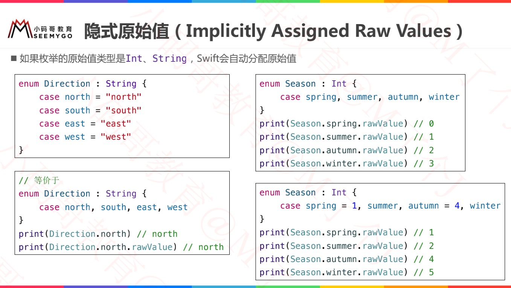
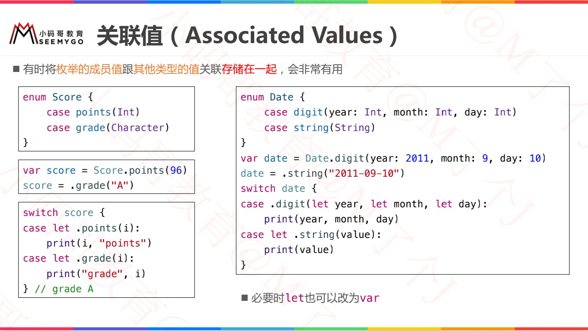
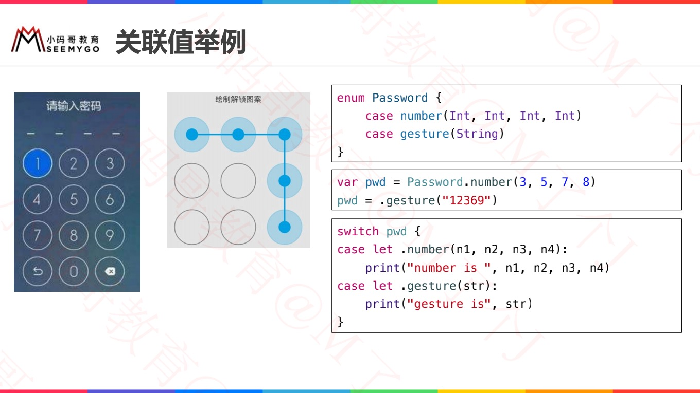
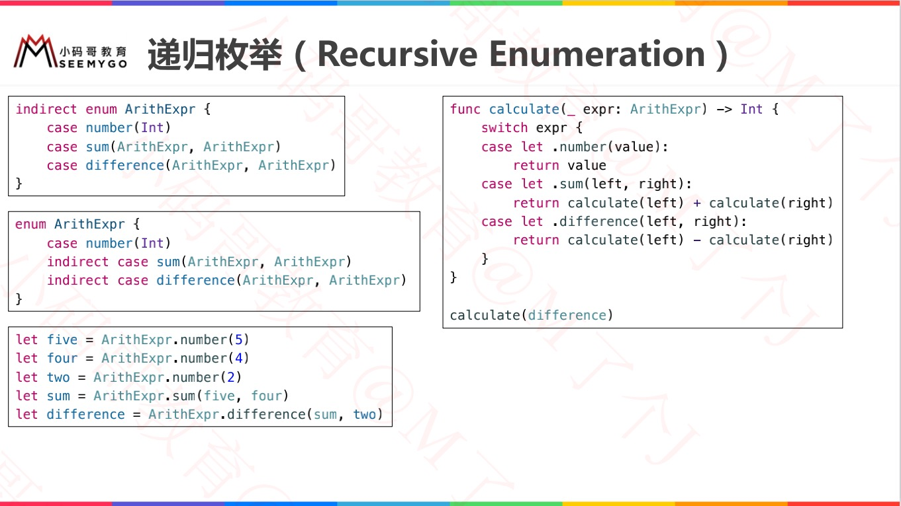
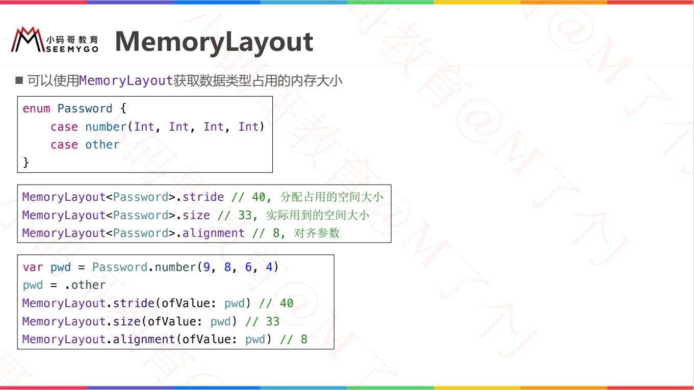
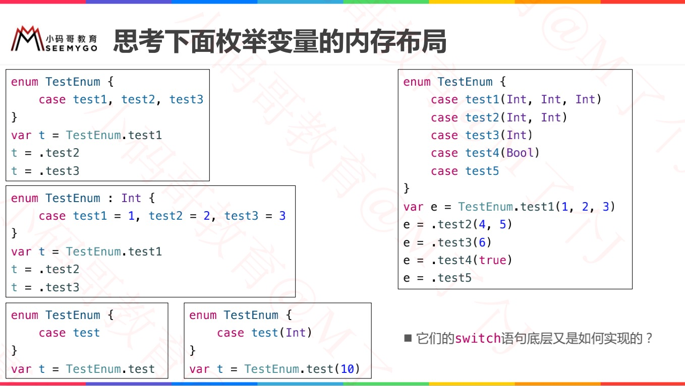
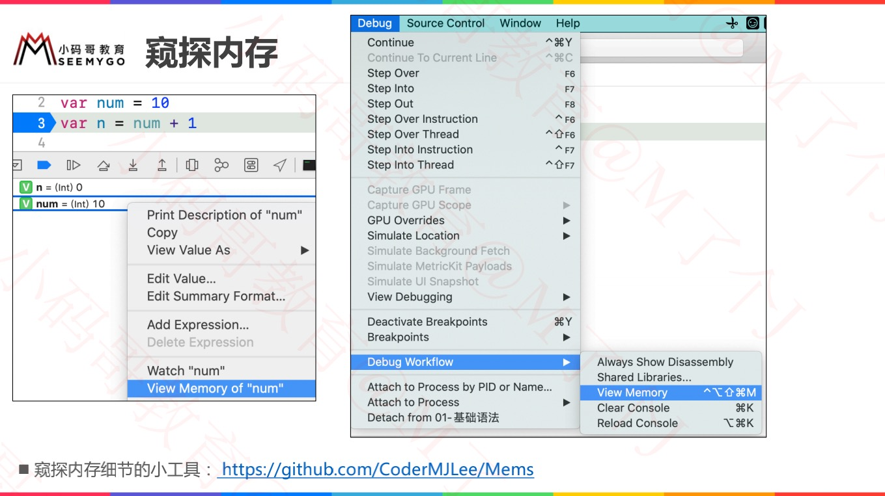
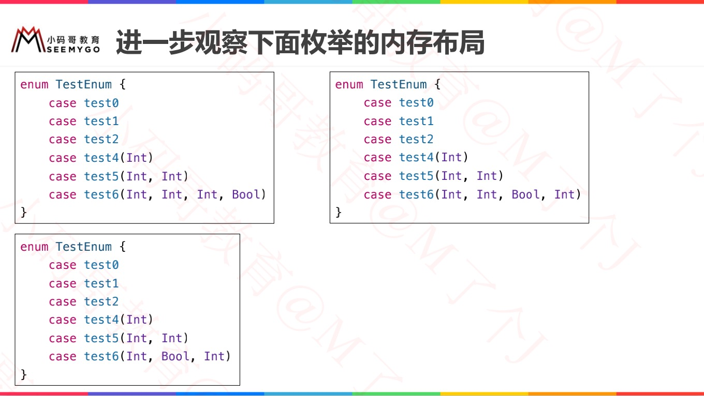

# 枚举定义



```swift
// 基础
enum TestEnum {
    case A
    case B
    case C, D, E
}


// Switch调用枚举
func swi(param: TestEnum) {
    switch param {
    case .A:
        print("A")
    case .B:
        print("B")
    case .C, .D ,.E:
        print("C, D, E")
    default:
        print("none")
    }
}
// 调用
swi(param: .D)
```


#  原始值（Raw Values）

```swift
// 设置原始值，
enum TestEnum1: Int {
    case A = 1
    case B = 2
  	case C				// 隐式指定为3
}
// 获取枚举值：A
print(TestEnum1.A)
// 获取原始值：2
print(TestEnum1.B.rawValue)
// 获取隐式指定的原始值：3
print(TestEnum1.C.rawValue)
```





# 隐式原始值（Implicitly Assigned Raw Values）




# 关联值（Associated Values）





```swift
enum Barcode {
    case upc(Int, Int, Int, Int)   // 条形码
    case qrCode(String)         // 二维码
}

func play(param: Barcode) {
    switch param {
    case let .upc(numberSystem, manufacturer, product, check):
        print("UPC : \(numberSystem), \(manufacturer), \(product), \(check).")
    case let .qrCode(productCode):
        print("QR code: \(productCode).")
    }
}

play(param: Barcode.upc(10, 20, 30, 40))  // Log: UPC : 10, 20, 30, 40.


// 微调
func play(param: Barcode) {
    switch param {
    case Barcode.upc(10, 20, 30, 40):
        print("匹配成功")
    case let .upc(numberSystem, manufacturer, product, check):
        print("UPC : \(numberSystem), \(manufacturer), \(product), \(check).")
    case let .qrCode(productCode):
        print("QR code: \(productCode).")
    }
}

// Log: 匹配成功
```


# 递归枚举（Recursive Enumeration）




# 遍历枚举

> 通过在枚举名字后面写 : CaseIterable 来允许枚举被遍历。

```swift
enum TestEnum: CaseIterable  {
    case A
    case B
    case C, D, E
}

print(type(of: TestEnum.AllCases())) 		// Array<TestEnum>
print(type(of: TestEnum.allCases)) 			// Array<TestEnum>

// 遍历
for item in TestEnum.allCases {
    print(item)
}
// A B C D E
```


# MemoryLayout 查看内存













