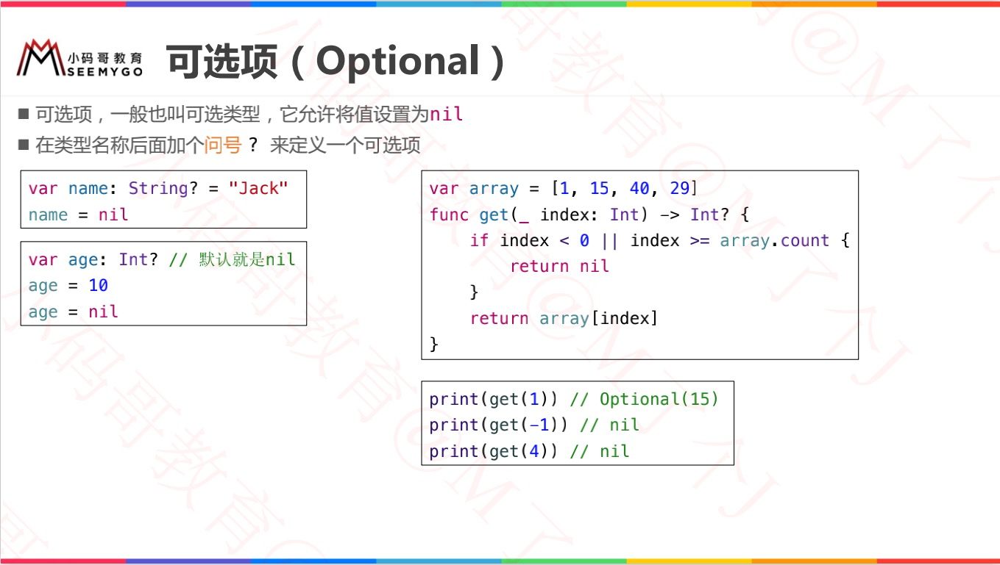
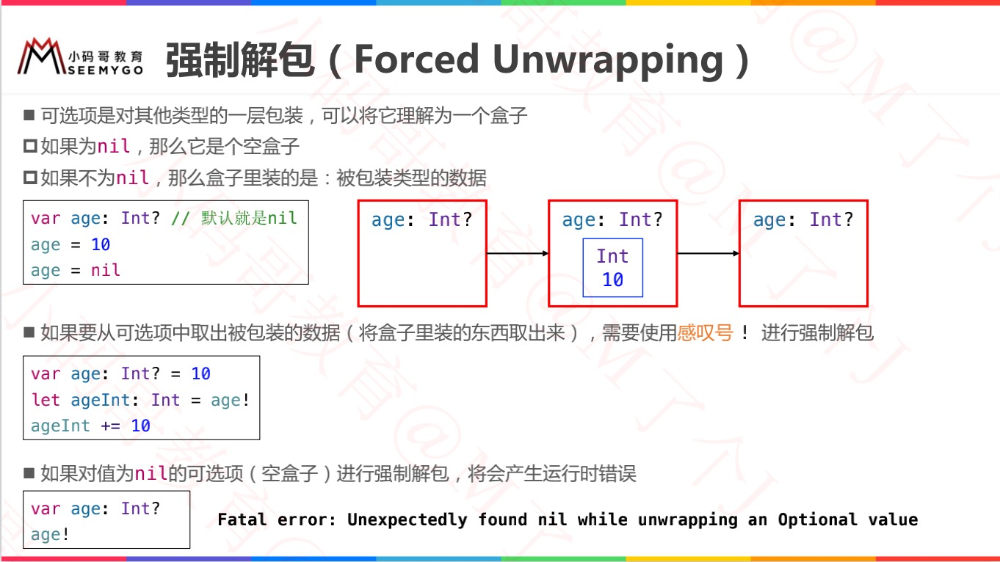
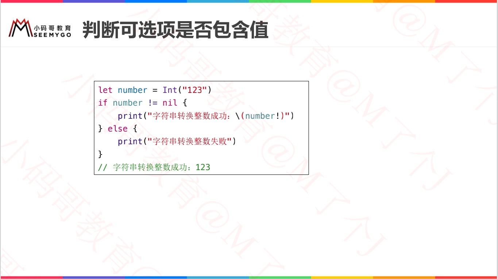
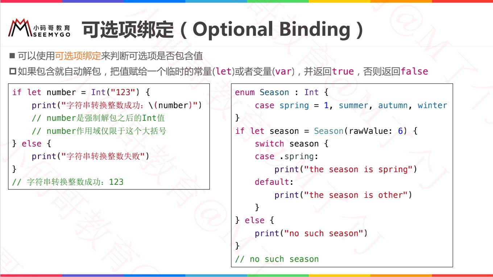
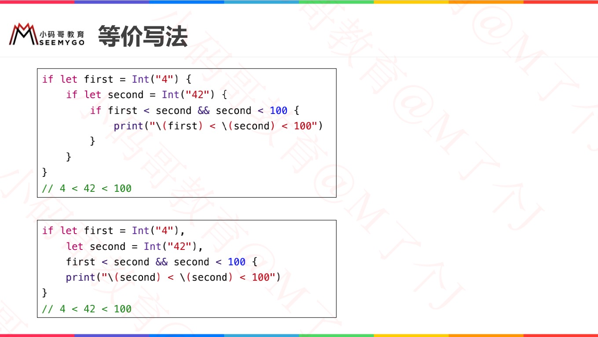
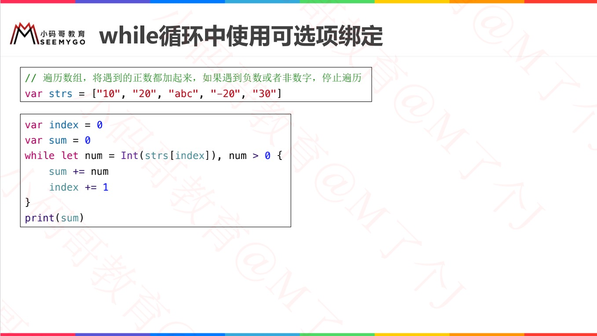

[Swift-可选项](https://www.jianshu.com/p/0d471e4e506b)

# 可选项（Optional）

# 强制解包（Forced Unwrapping） 

# 可选项绑定（Optional Binding）

## 一般方法：判断可选项是否包含值

## 可选项绑定

## 可选项绑定的等价写法

## while循环中使用可选项绑定

# 空合并运算符 ??（Nil-Coalescing Operator）

# guard语句

# 隐式解包（Implicitly Unwrapped Optional）

# 字符串插值

# 多重可选项

# 可选项的本质

