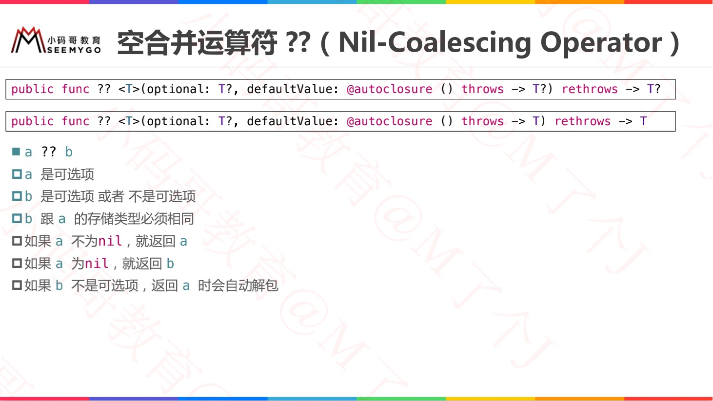
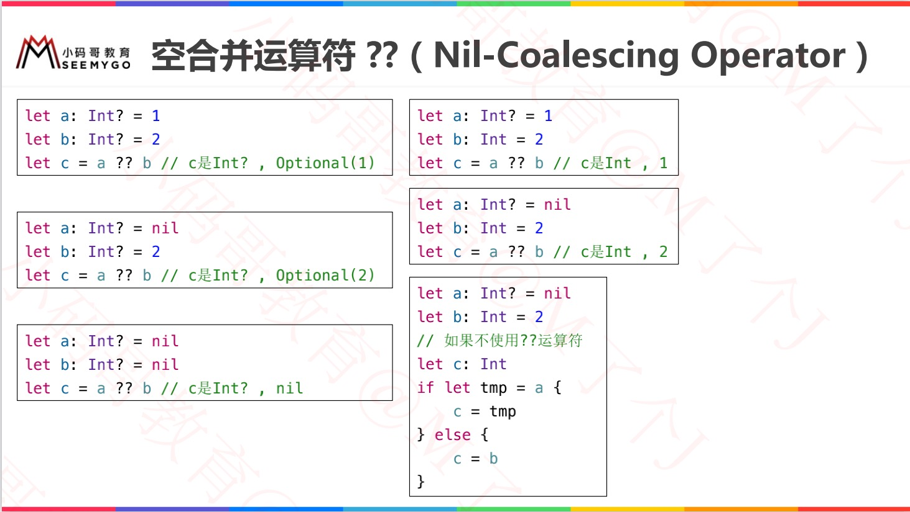
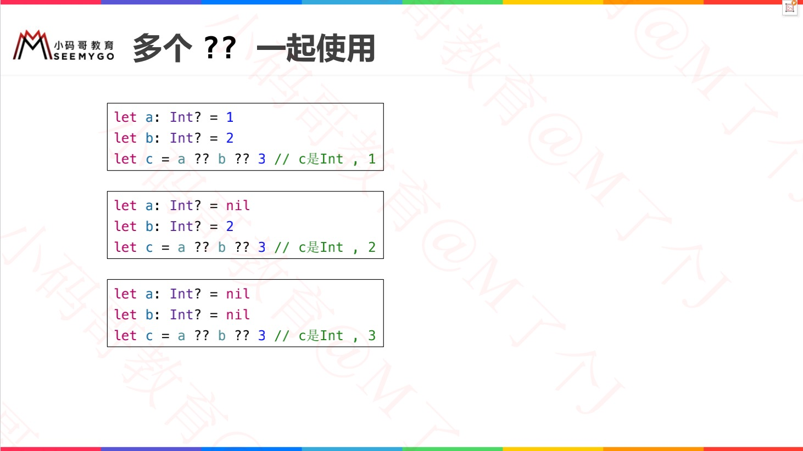
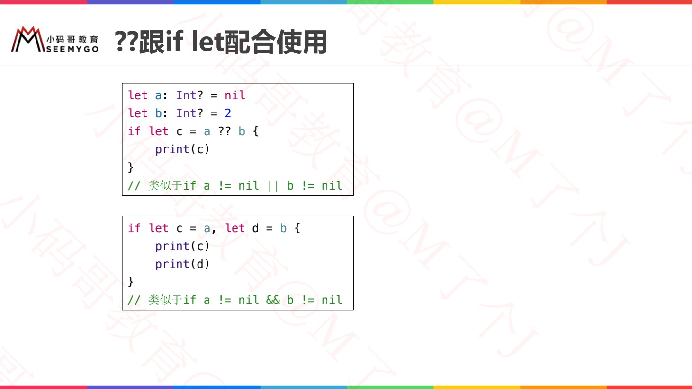
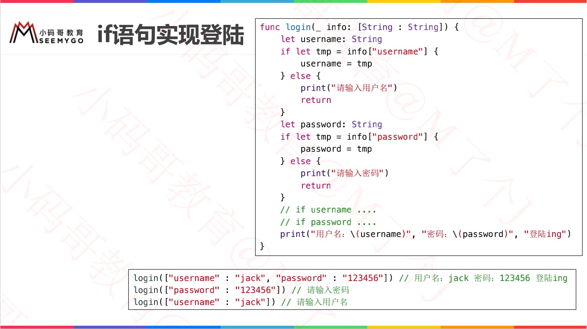
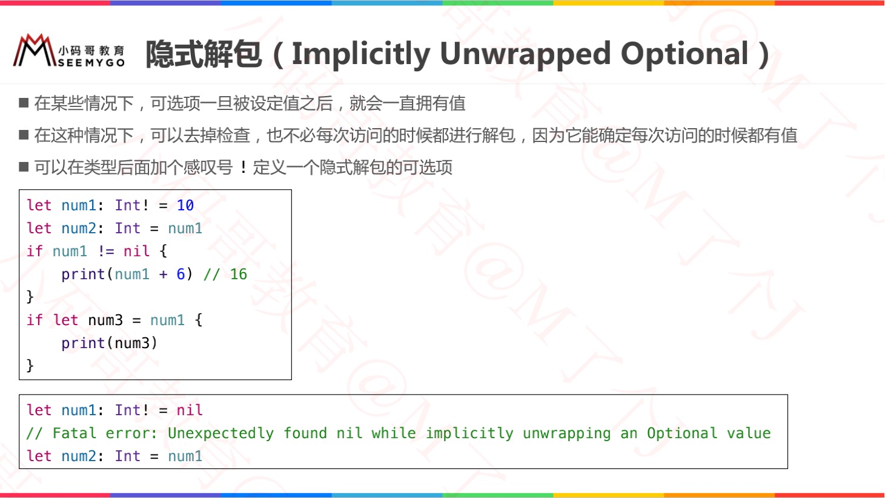
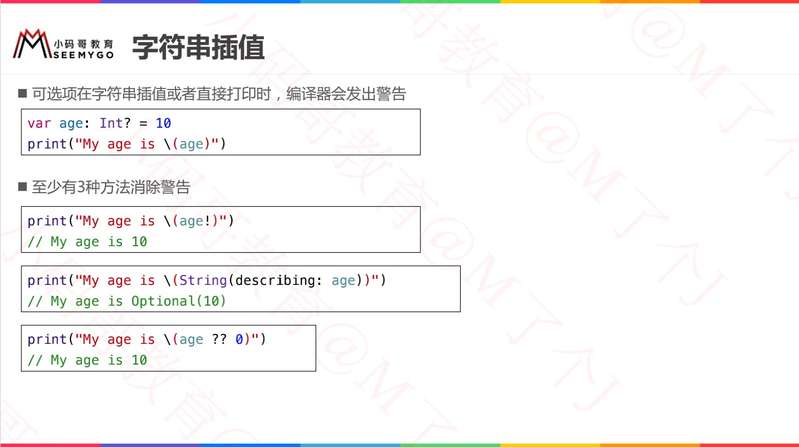
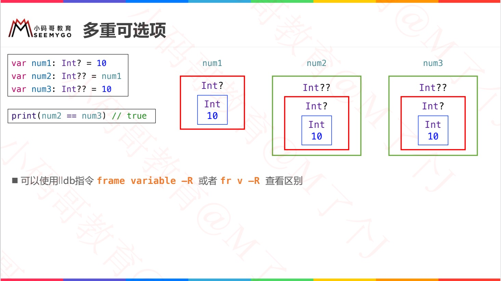
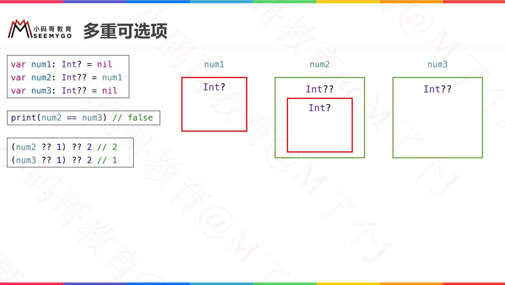

[Swift-可选项](https://www.jianshu.com/p/0d471e4e506b)


# 可选项（Optional）

> 可选项，一般也叫可选类型，它允许将值设置为nil
> 在类型名称后面加个问号 ? 来定义一个可选项


# 强制解包（Forced Unwrapping） 


# 可选项绑定（Optional Binding）

## 一般方法：判断可选项是否包含值


## 可选项绑定


## 可选项绑定的等价写法


## while循环中使用可选项绑定


# 空合并运算符 ??（Nil-Coalescing Operator）






## 多个 ??




## ?? 与 if




# if VS guard 可选性绑定




# 隐式解包（Implicitly Unwrapped Optional）




# 字符串插值




# 多重可选项

## 有值

```swift
var num1: Int? = 10    //包装Int类型的可选类型
var num2: Int?? = num1 //包装Int?可选类型的可选类型
var num3: Int?? = 10   //可能你会想，右边不应该传Int?类型的吗，其实传10编译器会自动帮我们包装的

print(num2 == num3) //true
可以这样理解：num2和num3都有值10，并且类型都是Int??，所以当然相等啦！
```




## 无值




# 可选项的本质⭐

> 可选项的本质是enum类型，只有none、some两个case

Swift源码中可选项的定义如下：

```swift
public enum Optional<Wrapped> : ExpressibleByNilLiteral {
    case none
    case some(Wrapped) //关联值，关联什么值和上面的泛型有关
    public init(_ some: Wrapped)
}
```


既然知道可选项本质了，所以可选项可以这么写：

```kotlin
var age: Int? = 10 //本质如下
var age0: Optional<Int> = Optional<Int>.some(10) //最具体
var age1: Optional = .some(10) //省略泛型类型
var age2 = Optional.some(10) //省略类型
var age3 = Optional(10) //使用初始化器，接收一个包装的值

age = nil //本质如下
age = .none
```

```swift
var age: Int? = nil  //本质如下 
var age = Optional<Int>.none
var age: Optional<Int> = .none
```

或者混着使用：

```swift
var age: Int? = .none
age = 10
age = .some(20)
age = nil
```


可选项也是支持绑定的

```swift
switch age {
case let v?:  //如果age有值，就将age解包赋值给v
    print("some", v) //这时候v就是Int类型，而不是Int?类型
case nil:  //如果age为nil，就会来到这里
    print("none")
}

//同理，也可以使用枚举，这种方式更容易理解
switch age {
case let .some(v):
    print("some", v)
case .none:
    print("none")
}
```


如果可选项有两个?，那么它本质就是：

```swift
var age_: Int? = 10
var age: Int?? = age_ //本质如下
var age = Optional.some(Optional.some(10))
var age: Optional<Optional> = .some(.some(10))

age = nil //本质如下
age = .none

var age: Int?? = 10 //本质如下
var age: Optional<Optional> = 10
```


作者：Imkata
链接：https://www.jianshu.com/p/0d471e4e506b
来源：简书
著作权归作者所有。商业转载请联系作者获得授权，非商业转载请注明出处。
