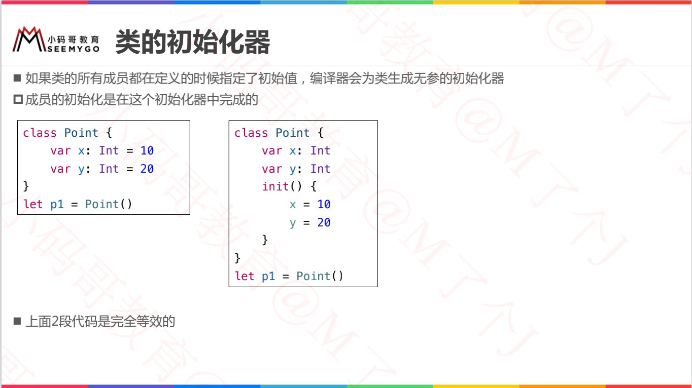
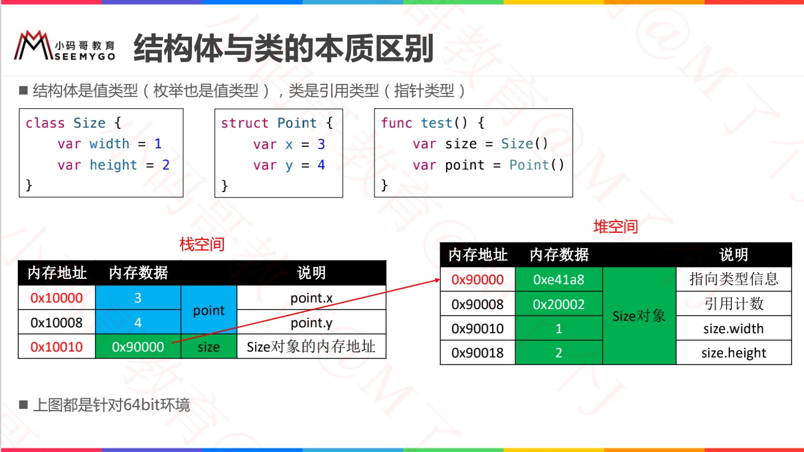
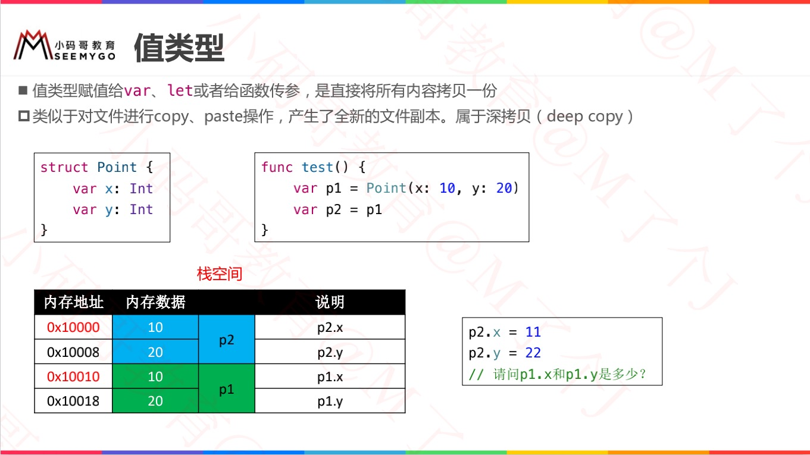
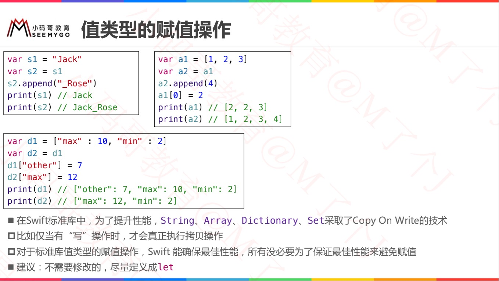
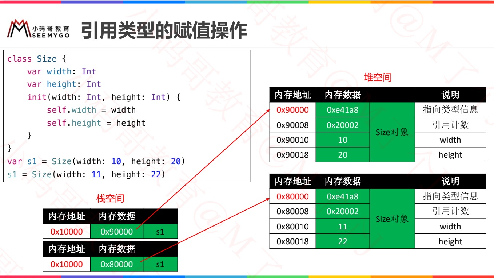
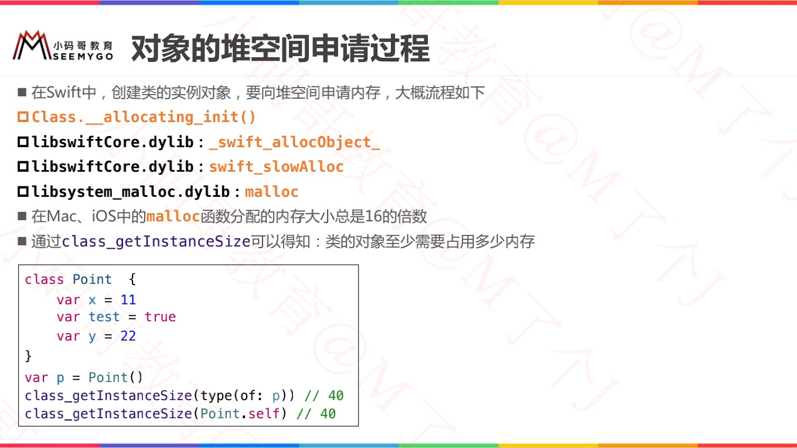
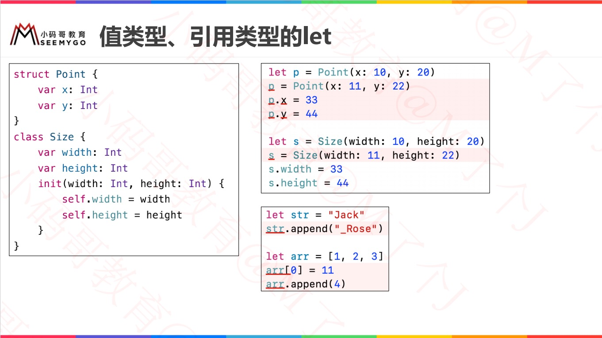
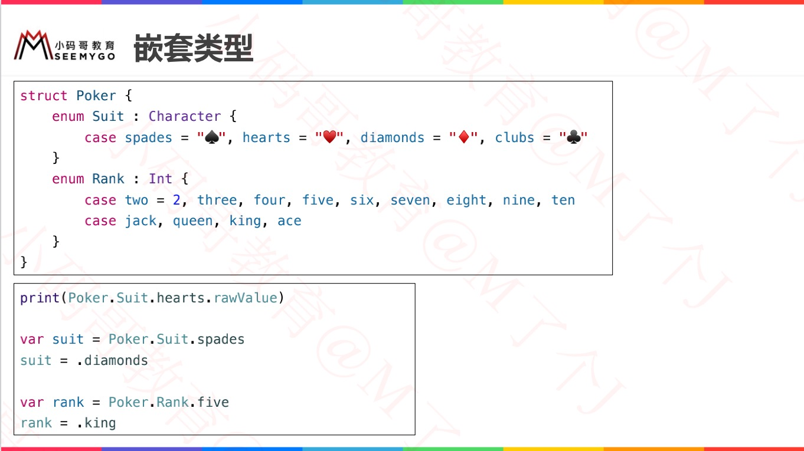
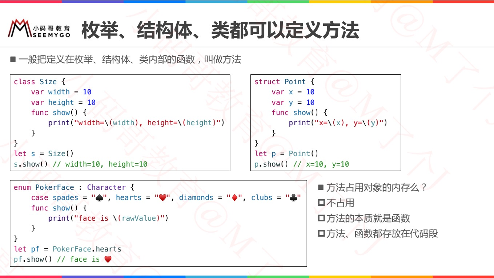
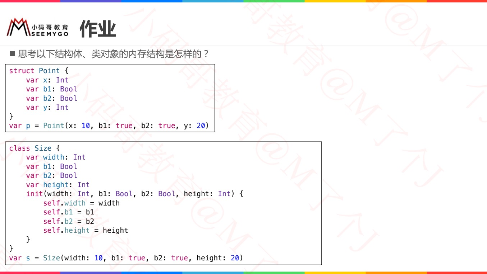

# 可参考

[类和结构体](https://www.cnswift.org/classes-and-structures#spl)

# 结构体

## 初始化器

### 自动生成初始化器

### 自定义初始化器

### 初始化器本质

# 类

## 初始化器

# 结构体与类的本质区别

**值类型**

> *值类型* 是一种当它被指定到常量或者变量，或者被传递给函数时会被 **拷贝** 的类型。
>
> * 基本类型：整数、浮点数、布尔量、字符串、数组和字典，都是值类型；
>
> * **结构体** 和 **枚举** 都是值类型。
>
> 这意味着你所创建的任何结构体和枚举实例——和实例作为属性所包含的任意值类型——在代码传递中总是被拷贝的。

**引用类型**

> * 类是引用类型
>
> * 闭包是引用类型
>
> 不同于值类型，在*引用类型*被赋值到一个常量，变量或者本身被传递到一个函数的时候它是*不会*被拷贝的。相对于拷贝，这里使用的是同一个对现存实例的引用。

## 值类型

### 值类型的赋值操作

## 引用类型（指针类型）

### 引用类型的赋值操作

### 创建类的实例对象，内存申请

# 值类型、引用类型的let

# 嵌套类型

# 枚举、结构体、类都可以定义方法

>* 一般把定义在枚举、结构体、类内部的函数，叫做方法
>
>* 方法占用对象的内存么？
>  * 不占用
>  * 方法的本质就是函数
>  * 方法、函数都存放在代码段

# 思考

