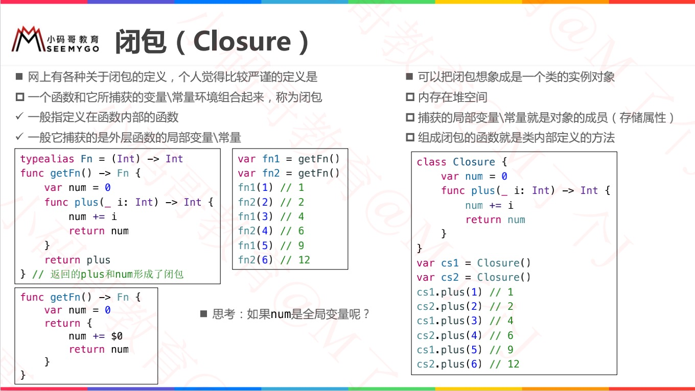
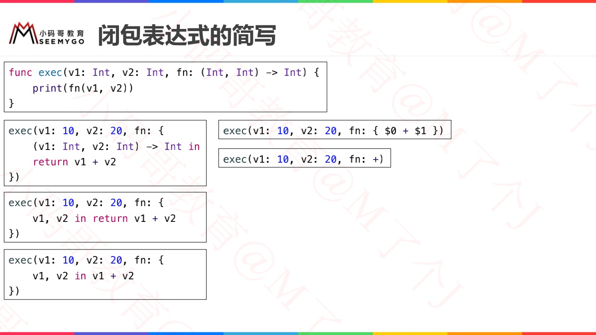
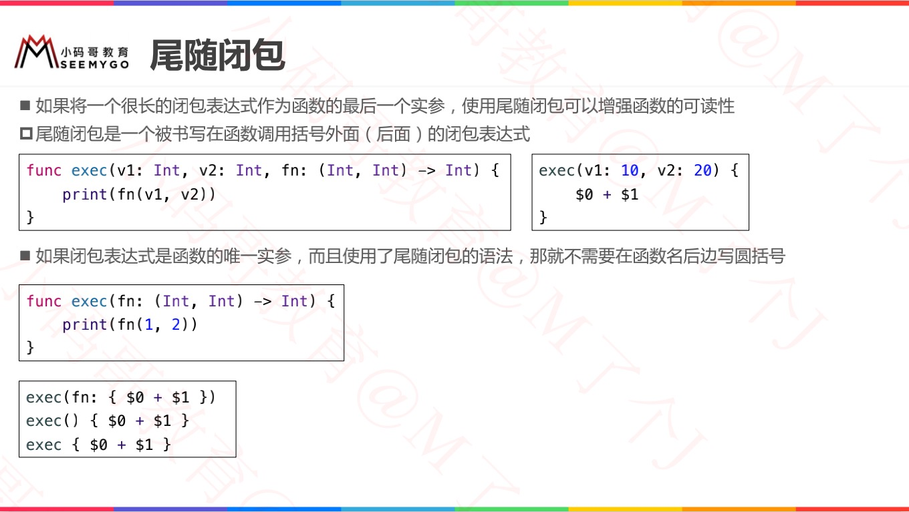
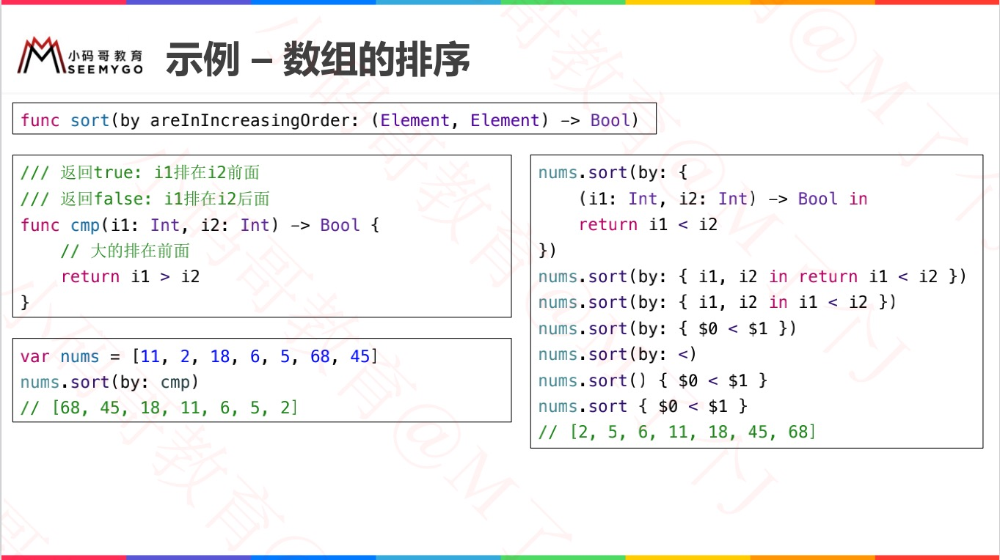
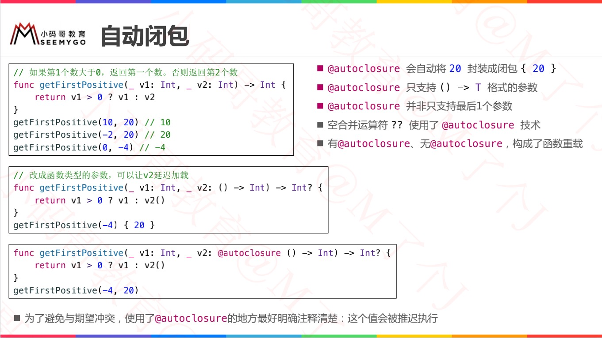
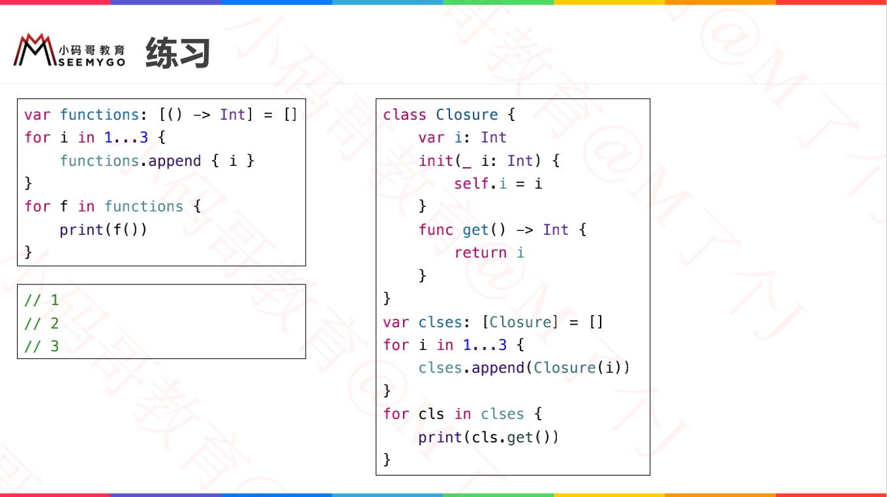
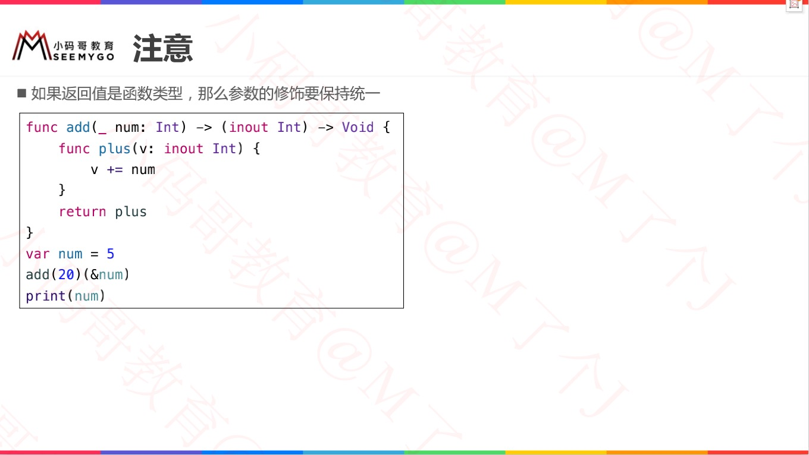

# 闭包 Closure

> 1. 闭包是独立的函数块，可以在代码中传递和使用；
>
> 2. Swift中的闭包类似于C和Objective-C中的`block`以及其他编程语言中的`lambdas(匿名函数)`；
>
> 3. 闭包可以捕获和存储上下文中定义的任何常量和变量的引用；
> 4. 全局函数和嵌套函数实际上是闭包的特例。




闭包的形式有：

| 全局函数                 | 嵌套函数                         | 闭包表达式                                           |
| ------------------------ | -------------------------------- | ---------------------------------------------------- |
| 有名字但不能捕获任何值。 | 有名字，也能捕获封闭函数内的值。 | 无名闭包，使用轻量级语法，可以根据上下文环境捕获值。 |


```swift
let names = ["Chris", "Alex", "Ewa", "Barry", "Daniella"]

func backward(_ s1: String, _ s2: String) -> Bool {
    return s1 > s2
}
var reversedNames = names.sorted(by: backward)

var reversedNames1 = names.sorted(by: {(s1: String, s2: String) -> Bool in
    return s1 < s2
})
print(reversedNames)  // Log: ["Ewa", "Daniella", "Chris", "Barry", "Alex"]
print(reversedNames1) // Log: ["Alex", "Barry", "Chris", "Daniella", "Ewa"]
```


## 简写一览

```swift
// 类型一：变量：() -> Void
var a:() -> Void = { () -> Void in
    print("a")
}
a()
print(type(of: a))

var b:() -> Void = {
    print("b")
}
b()
print(type(of: b))

var c = {print("c")}
c()
print(type(of: c))


// 类型二：方法参数：() -> Void
func test(param: () -> Void) {
    param()
}

test(param: {() -> Void in
    print("test")
})

test(param: {
    print("test")
})

test {
    print("test")
}


// 类型三：方法参数：(Int) -> Void
func test(param: (Int) -> Void) {
    param(10)
}

test(param: {(value: Int) -> Void in
    print(value)
})

test(param: {(value: Int) in
    print(value)
})

test(param: {(value) in
    print(value)
})

test{(value) in
    print(value)
}


// 类型四：方法参数：(Int, Int) -> Int
func test(param: (Int, Int) -> Int) {
    print(param(10, 20))
}

test(param: {(value1: Int, value2: Int) -> Int in
    return value1 + value2
})

test(param: {
    return $0 + $1
})

test(param: {
    $0 + $1
})

test{
    $0 + $1
}
```




## 尾随闭包

```swift
func test(param: () -> Void) {
  	// 函数体部分
    param()
}

// 以下是不使用尾随闭包进行函数调用
test(param: {() -> Void in
    // 闭包主体部分
    print("test")
})

// 以下是不使用尾随闭包进行函数调用
test(param: {
    // 闭包主体部分
    print("test")
})

// 以下是使用尾随闭包进行函数调用
test() {
    // 闭包主体部分
    print("test")
}

// 如果闭包表达式是函数或方法的唯一参数，则当你使用尾随闭包时，你甚至可以把 () 省略掉：
test {
    // 闭包主体部分
    print("test")
}
```






## 值捕获

```swift
func makeIncrementer(forIncrement amount: Int) -> () -> Int {
    var runningTotal = 0
    func incrementer() -> Int {
        runningTotal += amount
        return runningTotal
    }
    return incrementer
}

let incrementByTen = makeIncrementer(forIncrement: 10)

incrementByTen()	// 10
incrementByTen()	// 20	
incrementByTen()	// 30
```


## 闭包是引用类型

```swift
let alsoIncrementByTen = incrementByTen
alsoIncrementByTen()	// 40
```


## 逃逸闭包 @escaping - 异步后调用

> 当一个闭包作为参数传到一个函数中，但是这个闭包在函数返回之后才被执行，我们称该闭包从函数中*逃逸*。
>
> 当你定义接受闭包作为参数的函数时，你可以在参数名之前标注 `@escaping`，用来指明这个闭包是允许“逃逸”出这个函数的。

```swift
var completionHandlers: [() -> Void] = []
func someFunctionWithEscapingClosure(completionHandler: @escaping () -> Void) {
    completionHandlers.append(completionHandler)
}

func someFunctionWithNonescapingClosure(closure: () -> Void) {
    closure()
}

class SomeClass {
    var x = 10
    func doSomething() {
        someFunctionWithEscapingClosure { self.x = 100 }
        someFunctionWithNonescapingClosure { x = 200 }
    }
}

let instance = SomeClass()
instance.doSomething()
print(instance.x)
// 打印出“200”

completionHandlers.first?()
print(instance.x)
// 打印出“100”
```


## 自动闭包 @autoclosure




### 自动闭包 - 延迟加载

```swift
var customersInLine = ["Chris", "Alex", "Ewa", "Barry", "Daniella"]
print(customersInLine.count)
// 打印出“5”

let customerProvider = { customersInLine.remove(at: 0) }
print(customersInLine.count)
// 打印出“5”

print("Now serving \(customerProvider())!")
// 打印出“Now serving Chris!”
print(customersInLine.count)
// 打印出“4”
```


### 自动闭包 + 逃逸闭包

```swift
var customersInLine = ["Chris", "Alex", "Ewa", "Barry", "Daniella"]

// customersInLine i= ["Barry", "Daniella"]
var customerProviders: [() -> String] = []
func collectCustomerProviders(_ customerProvider: @autoclosure @escaping () -> String) {
    customerProviders.append(customerProvider)
}
collectCustomerProviders(customersInLine.remove(at: 0))
collectCustomerProviders(customersInLine.remove(at: 0))

print("Collected \(customerProviders.count) closures.")
// 打印“Collected 2 closures.”
for customerProvider in customerProviders {
    print("Now serving \(customerProvider())!")
}
// 打印“Now serving Barry!”
// 打印“Now serving Daniella!”
```


## 练习






