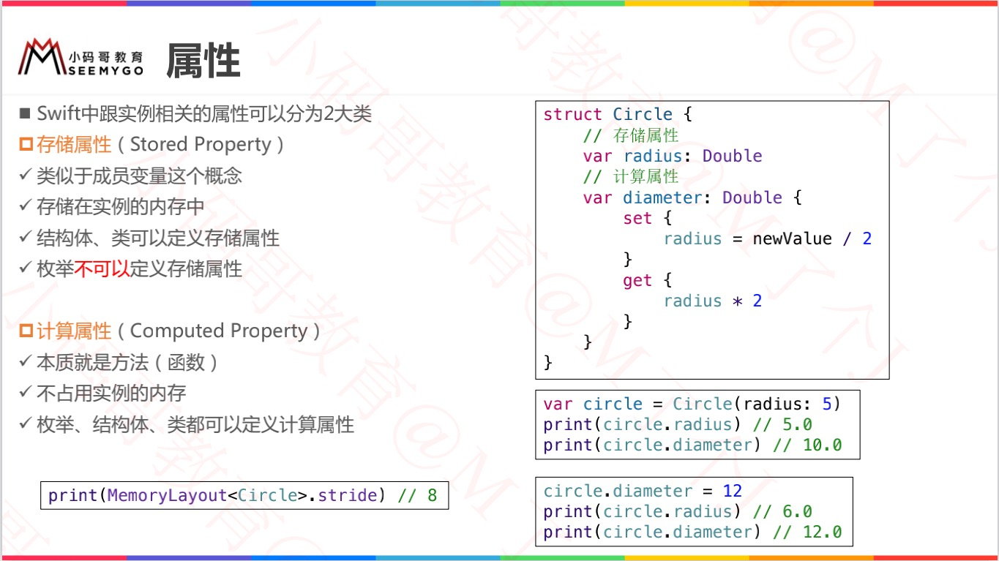
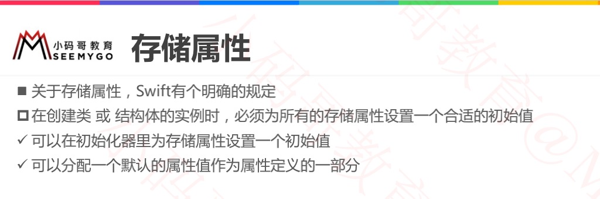
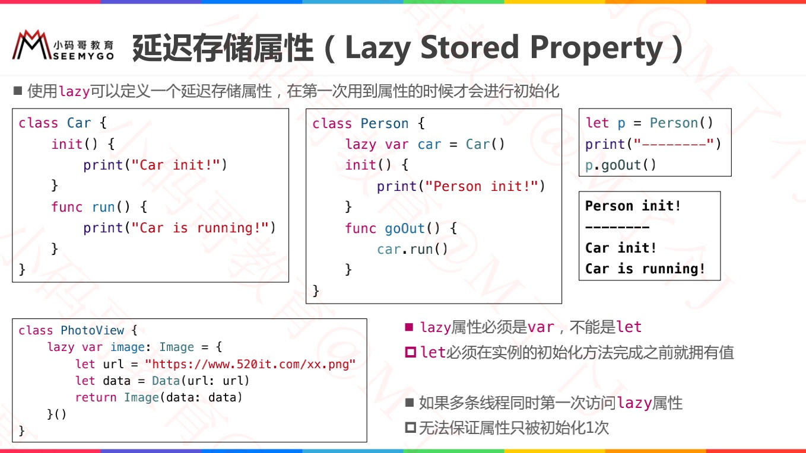
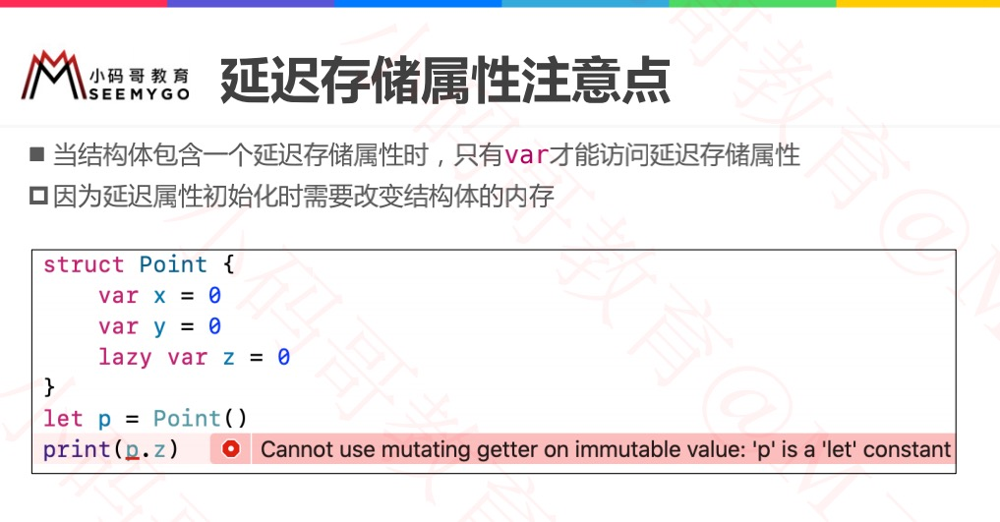
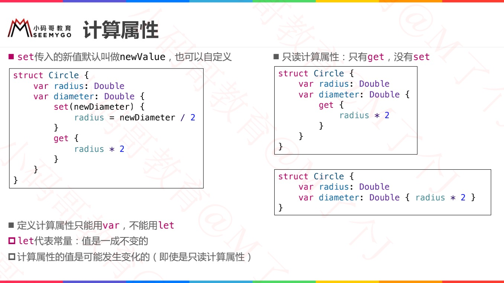

# 属性

Swift中跟实例相关的属性可以分为两大类：

* 存储属性（Stored Property）：存储属性会将常量和变量存储为实例的一部分。
    * 类似于 **成员变量** 这个概念
    * 存储在实例的内存中
    * 结构体、类 **可以** 定义存储属性
    * 枚举 **不可以** 定义存储属性
* 计算属性（Computed Property）：计算属性则是直接计算（而不是存储）值。
    * 本质就是方法（函数）
    * 不占用实例的内存
    * 枚举、结构体、类都可以定义计算属性




# 存储属性



## 常量结构体实例的存储属性

```swift
struct FixedLengthRange {
    var firstValue: Int
    let length: Int
}

var rangeOfThreeItems = FixedLengthRange(firstValue: 0, length: 3)
// the range represents integer values 0, 1, and 2
rangeOfThreeItems.firstValue = 6
// the range now represents integer values 6, 7, and 8

let rangeOfFourItems = FixedLengthRange(firstValue: 0, length: 4)
// this range represents integer values 0, 1, 2, and 3
rangeOfFourItems.firstValue = 6
// this will report an error, even though firstValue is a variable property
```

> 第一个：var rangeOfThreeItems
>
> FixedLengthRange 的实例有一个名为 firstValue 的变量存储属性和一个名为 length 的常量存储属性。在上面的例子中，当新的值域创建时 length 已经被创建并且不能再修改，因为这是一个常量属性。
>
> 
>
> 第二个：let rangeOfThreeItems
>
> 由于 rangeOfFourItems 被声明为常量（用 let 关键字），我们不能改变其 firstValue 属性，即使 firstValue 是一个变量属性。
>
> 这是由于结构体是*值类型*。当一个值类型的实例被标记为常量时，该实例的其他属性也均为常量。
>
> 对于类来说则不同，它是*引用类型*。如果你给一个常量赋值引用类型实例，你仍然可以修改那个实例的变量属性。


## 延迟存储属性

> *延迟存储属性*的初始值在其第一次使用时才进行计算。你可以通过在其声明前标注 `lazy` 修饰语来表示一个延迟存储属性。
>
> 注意：
>
> 你必须把延迟存储属性声明为变量（使用 var 关键字），因为它的初始值可能在实例初始化完成之前无法取得。常量属性则必须在初始化完成*之前*有值，因此不能声明为延迟。
>
> 
>
> **思考：多线程访问时？**
>
> 如果被标记为 lazy 修饰符的属性 **同时被多个线程访问** 并且属性还没有被初始化，则无法保证属性只初始化一次。

```swift
class DataImporter {
    var fileName = "data.txt"
}
 
class DataManager {
    lazy var importer = DataImporter()
    var data = [String]()
}
 
let manager = DataManager()
manager.data.append("Some data")
manager.data.append("Some more data")

// 当调用到改属性时候，才进行初始化。
print(manager.importer.fileName)
// the DataImporter instance for the importer property has now been created
// prints "data.txt"
```






# 计算属性

> `类、结构体和枚举` 都能够定义 ***计算属性***，而它实际并不存储值。相反，他们提供一个读取器和一个可选的设置器来间接得到和设置其他的属性和值。




## 简写set 缩写get

> 如果一个计算属性的设置器没有为将要被设置的值定义一个名字，那么他将被默认命名为 `newValue`。
>
> 如果整个 getter 的函数体是一个单一的表达式，那么 getter 隐式返回这个表达式。

```swift
var center: Point {
    get {
        // 隐式返回，隐藏return
        Point(x: origin.x + (size.width / 2),
              y: origin.y + (size.height / 2))
    }
    set {
        // 默认：newValue
        origin.x = newValue.x - (size.width / 2)
        origin.y = newValue.y - (size.height / 2)
    }
}
```


## 只读计算属性

> 一个有读取器但是没有设置器的计算属性就是所谓的 ***只读计算属性***。
>
> 
>
> 注意
>
> 你必须用 var 关键字定义计算属性——包括只读计算属性——为变量属性，因为它们的值不是固定的。 let 关键字只用于常量属性，用于明确那些值一旦作为实例初始化就不能更改。

```swift
struct Cuboid {
    var width = 0.0, height = 0.0, depth = 0.0
    
    // 你可以通过去掉 get 关键字和他的大扩号来简化只读计算属性的声明：
    var volume: Double {
        return width * height * depth
    }
}
let fourByFiveByTwo = Cuboid(width: 4.0, height: 5.0, depth: 2.0)
print("the volume of fourByFiveByTwo is \(fourByFiveByTwo.volume)")
```


# 属性观察器

> *属性观察者* 会观察并对属性值的变化做出回应。每当一个属性的值被设置时，属性观察者都会被调用，**即使这个值与该属性当前的值相同。**
>
> 可以定义属性观察器来监控属性值的变化，以此来触发自定义的操作。属性观察器可以添加到类本身定义的存储属性上，也可以添加到从父类继承的属性上。
>
> 你可以在如下地方添加属性观察者：
>
> - 你定义的存储属性；
> - 你继承的存储属性；
> - 你继承的计算属性。


# 属性包装器

> 可以利用属性包装器来复用多个属性的 getter 和 setter 中的代码。


# 全局变量和局部变量


# 类型属性

