# 继承简介

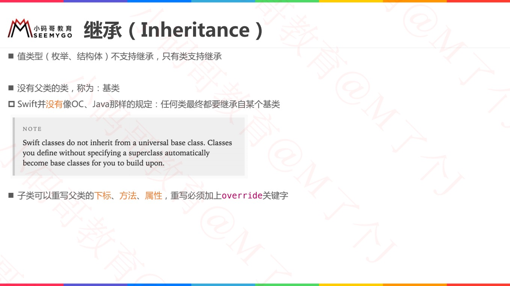

# 类对象的内存结构

* Animal 对象内存：
    * 对象a分配在堆空间，iOS中堆空间分配默认是16的倍数
    * 类分配对象，前十六个字节：前八个指向类型信息+后八个引用计数 = 16
    * 类中 age 是 int 型 = 8
    * 综上 = 32
* Dog 对象内存：
    * Dog 继承自 Animal，所以有age、weight 两个属性 = 16
    * 综合Animal规则 = 32
* ErHa 对象内存：
    * ErHa继承自Dog，所有用于所有父类的属性，包括age、weight，以及自己的属性iq = 24
    * 综上规则 = 48

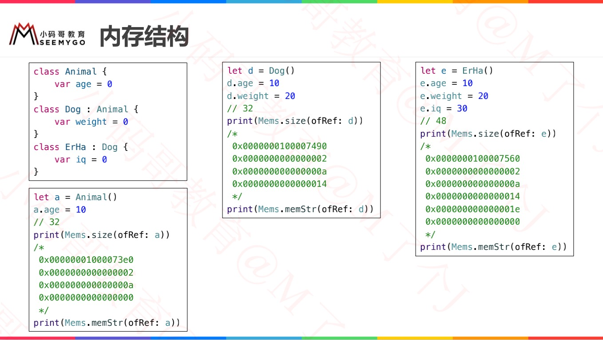

# 重写实例方法

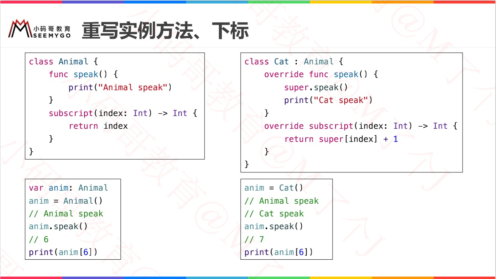

# 重写类型方法

* class、static修饰类型方法的区别？
    * class修饰的类型方法可以被重写；而static修饰的类型方法不可用被重写。
* 父类是class修饰类型方法，子类重写时可以使用static修饰。

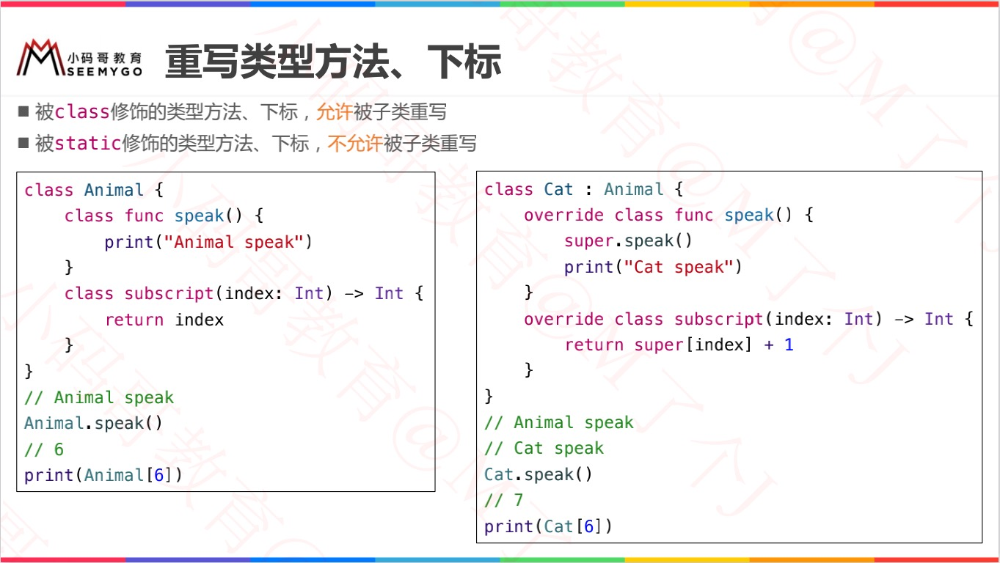

# 重写属性

* 子类 **可以** 重写父类的属性（包括：存储、计算）重写为 **计算属性**
* 子类 **不可以** 重写分类的属性（包括：存储、计算）重写为 **存储属性**
  * 子类虽然不能重写为存储属性，但子类对象中依旧继承父类的存储属性。

## 重写实例属性

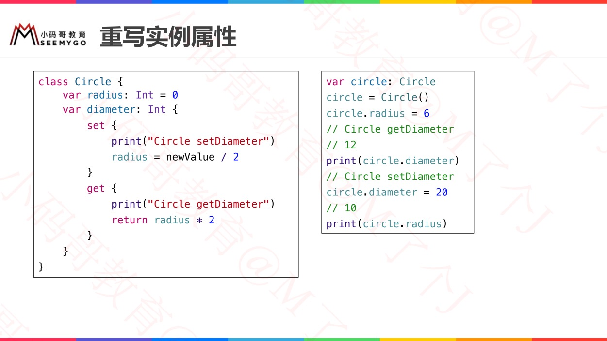

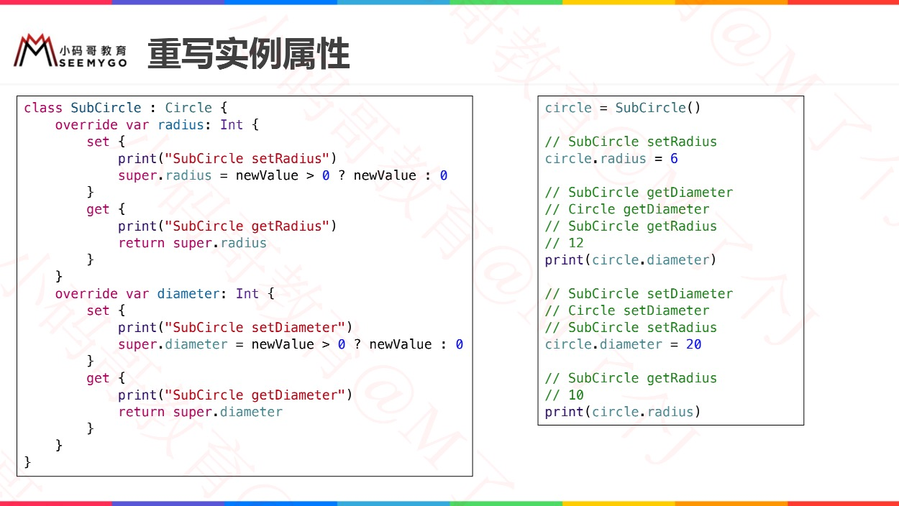

## 重写类型属性

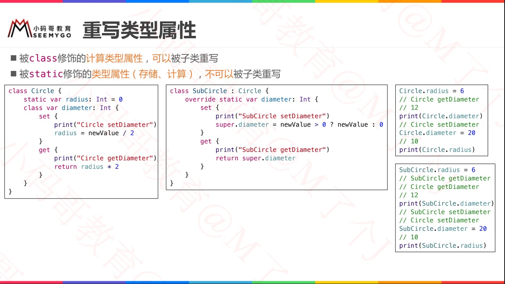

# 属性观察器

* 子类为父类属性增加属性观察器（除了只读计算属性、let属性）

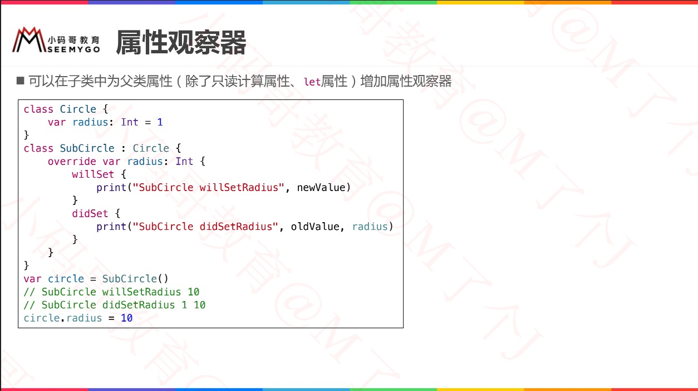

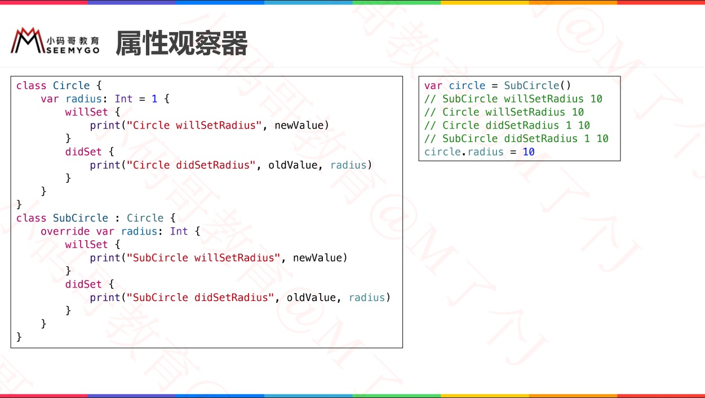

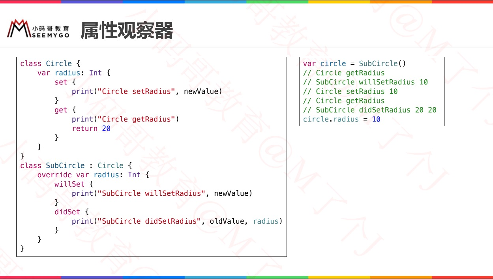

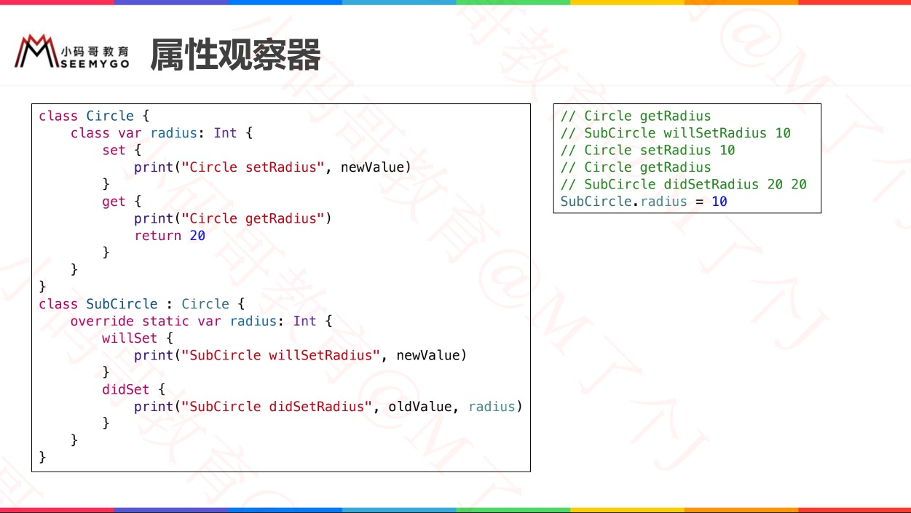

# final

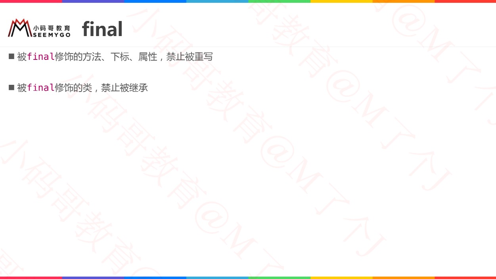

# Swift 多态

