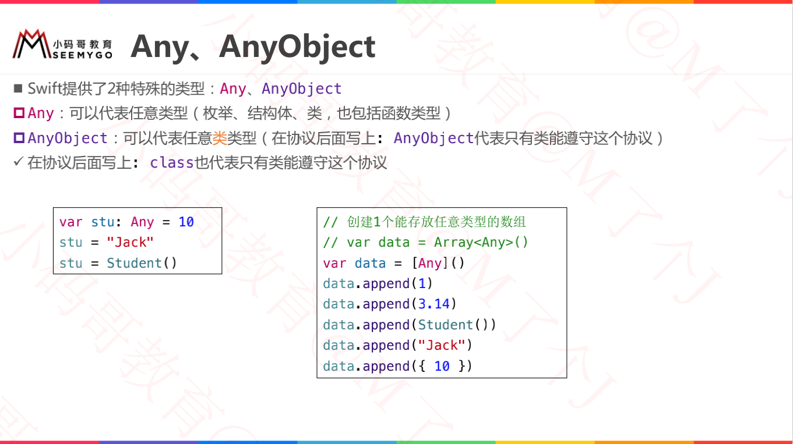
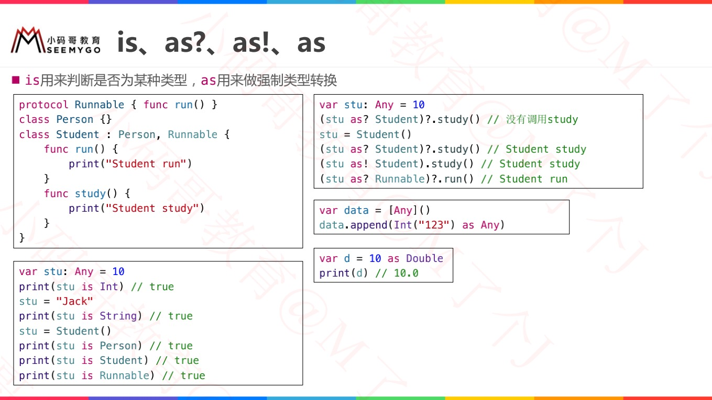

[DESIGNATED，CONVENIENCE 和 REQUIRED](https://swifter.tips/init-keywords/)

# convenience

[DESIGNATED，CONVENIENCE 和 REQUIRED](https://swifter.tips/init-keywords/)

# static VS class

https://juejin.cn/post/6844903792647864328

- static能修饰`class/struct/enum`的计算属性、存储属性、类型方法;class能修饰类的计算属性和类方法
- static修饰的类方法不能继承；class修饰的类方法可以继承
- 在protocol中要使用static

# designated

# required

# [mutating](./03函数与闭包.md)

# [@discardableResult](./03函数与闭包.md)

# [@escaping](./03函数与闭包.md)

# [@autoclosure](./03函数与闭包.md)

# ============分割线=============

# Any / AnyObject

# is、as?、as!、as

> // 知识点：向下转型
>
>   // as! 强制类型转换，无法转换时会抛出运行时异常
>
>   // as？可选类型转换，无法转换时返回nil

# X.self、X.Type、AnyClass

