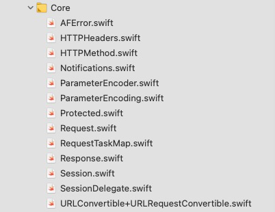
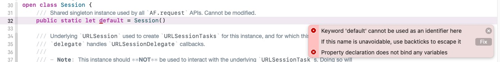

* [Github - Alamofire](https://github.com/Alamofire/Alamofire)
  * [Alamofire Reference](http://alamofire.github.io/Alamofire/)
  * [Usage](https://github.com/Alamofire/Alamofire/blob/master/Documentation/Usage.md#using-alamofire)
  * [Advanced Usage](https://github.com/Alamofire/Alamofire/blob/master/Documentation/AdvancedUsage.md)

* [Swift.org](https://swift.org/)

* [stackoverflow.com](https://stackoverflow.com/)

* 参考blog
  * [Alamofire 5.x 源码阅读分析(Source Code reading and analysis)](https://rayy.top/2019-2019-12-09-alamofire/)
  * [Alamofire源码学习目录合集](https://juejin.cn/post/6914685327172960263/)


## 支持

Alamofire 是基于苹果的 URLSession 的, 即 [URL Loading System](https://developer.apple.com/documentation/foundation/url_loading_system).

在 swift.org 论坛中有专门的版块提供 Alamofire 支持.

在 Stack Overflow 上也有.


## 代码行数

查看了一下 `Alamofire` 实现的代码行数：

```shell
# 安装
pod 'Alamofire', '~> 5.0'

# 找到源码路径下
➜ Alamofire git:(main) ✗ find Source -name "*.swift" | xargs cat |wc -l
   13416
```


## PodSpec

```swift
Pod::Spec.new do |s|
  s.name = 'Alamofire'
  s.version = '5.4.1'
  s.license = 'MIT'
  s.summary = 'Elegant HTTP Networking in Swift'
  s.homepage = 'https://github.com/Alamofire/Alamofire'
  s.authors = { 'Alamofire Software Foundation' => 'info@alamofire.org' }
  s.source = { :git => 'https://github.com/Alamofire/Alamofire.git', :tag => s.version }
  s.documentation_url = 'https://alamofire.github.io/Alamofire/'

  s.ios.deployment_target = '10.0'
  s.osx.deployment_target = '10.12'
  s.tvos.deployment_target = '10.0'
  s.watchos.deployment_target = '3.0'

  s.swift_versions = ['5.1', '5.2', '5.3']

  s.source_files = 'Source/*.swift'

  s.frameworks = 'CFNetwork'
end
```


## 文件分层

* Alamofire.swift：提供 `AF` 名空间的定义。

* Core：包含 Session/Request/Response, 以及请求参数序列化等功能实现。

  

* Extensions：包含任务调度相关的扩展, URLRequest 的相关扩展, Swift `Result` 扩展, 以及 URLSessionConfiguration 的 `default` 实现.

  

  

* Feature：包含响应序列化实现, 便捷响应序列化处理等

  


## 代码分析

### AFError.swift

```swift
public enum AFError: Error {...}
// Public 权限修饰符
```


```swift
public var asAFError: AFError? {
		self as? AFError
}
/// as? 用法
```


```swift
public func asAFError(orFailWith message: @autoclosure () -> String, file: StaticString = #file, line: UInt = #line) -> AFError {
    guard let afError = self as? AFError else {
        fatalError(message(), file: file, line: line)
    }
    return afError
}
// guard 用法 与 if 区别
// @autoclosure 用法
```


```swift
extension Error {...}
// extension 用法
```


```swift
public var urlConvertible: URLConvertible? {
    guard case let .invalidURL(url) = self else { return nil }
    return url
}
// guard case 用法
```

[Pattern Matching, Part 4: if case, guard case, for case](https://alisoftware.github.io/swift/pattern-matching/2016/05/16/pattern-matching-4/)


### Alamofire.swift

```swift
/// Reference to `Session.default` for quick bootstrapping and examples.
public let AF = Session.default

/// Current Alamofire version. Necessary since SPM doesn't use dynamic libraries. Plus this will be more accurate.
let version = "5.4.1"

/// 命名空间？
```

[SPM - swift-package-manager](https://github.com/apple/swift-package-manager)


### Session.swift

> `Session`在其生命周期内创建和管理Alamofire的`Request`类型。它还为所有“请求”提供通用功能，包括排队，拦截，信任管理，重定向处理和响应缓存处理。

```swift
/// Shared singleton instance used by all `AF.request` APIs. Cannot be modified.
public static let `default` = Session()
// 单例如何写？
// default为何引号？
```

去除反引号，报错，default是关键字，需要使用反引号来规避它。




```swift
// 必要初始化方法
public init(session: URLSession,
                delegate: SessionDelegate,
                rootQueue: DispatchQueue,
                startRequestsImmediately: Bool = true,
                requestQueue: DispatchQueue? = nil,
                serializationQueue: DispatchQueue? = nil,
                interceptor: RequestInterceptor? = nil,
                serverTrustManager: ServerTrustManager? = nil,
                redirectHandler: RedirectHandler? = nil,
                cachedResponseHandler: CachedResponseHandler? = nil,
                eventMonitors: [EventMonitor] = []) {
		//.....
}
/// 方便初始化方法
public convenience init(configuration: URLSessionConfiguration = URLSessionConfiguration.af.default,
                            delegate: SessionDelegate = SessionDelegate(),
                            rootQueue: DispatchQueue = DispatchQueue(label: "org.alamofire.session.rootQueue"),
                            startRequestsImmediately: Bool = true,
                            requestQueue: DispatchQueue? = nil,
                            serializationQueue: DispatchQueue? = nil,
                            interceptor: RequestInterceptor? = nil,
                            serverTrustManager: ServerTrustManager? = nil,
                            redirectHandler: RedirectHandler? = nil,
                            cachedResponseHandler: CachedResponseHandler? = nil,
                            eventMonitors: [EventMonitor] = []) {
 		//...... 
}

/// convenience修饰方法有什么用？
```


```swift
public func withAllRequests(perform action: @escaping (Set<Request>) -> Void) {
		//......
}
/// 函数参数为什么这样写？
```


