# 一、CSS三大特性

## 1.层叠性

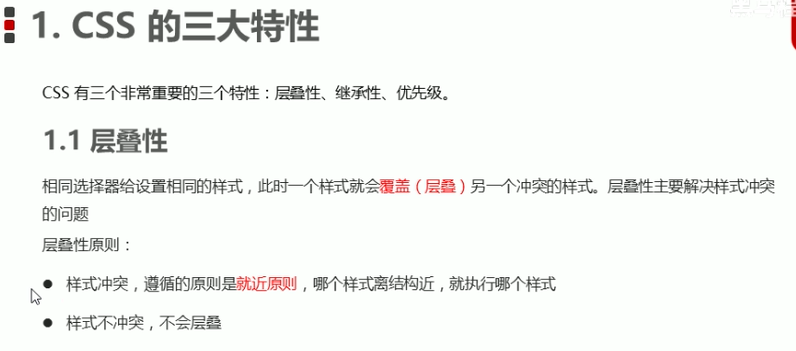

```html
<head>
    <meta charset="UTF-8">
    <meta name="viewport" content="width=device-width, initial-scale=1.0">
    <meta http-equiv="X-UA-Compatible" content="ie=edge">
    <title>CSS层叠性</title>
    <style>
       div {
           color: red;
           font-size: 12px;
       }
       div {
           color: pink;
       }
    </style>
</head>
<body>
    <div>长江后浪推前浪,前浪死在沙滩上</div>
</body>
```

## 2.继承性

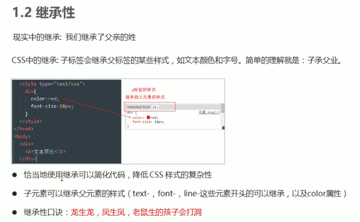

```
<head>
    <meta charset="UTF-8">
    <meta name="viewport" content="width=device-width, initial-scale=1.0">
    <meta http-equiv="X-UA-Compatible" content="ie=edge">
    <title>CSS继承性</title>
    <style>
        div {
            color: pink;
            font-size: 14px;
        }
    </style>
</head>
<body>
    <div>
        <p>龙生龙，凤生凤，老鼠生的孩子会打洞</p>
    </div>
</body>
```

### 2.1.行高的继承性

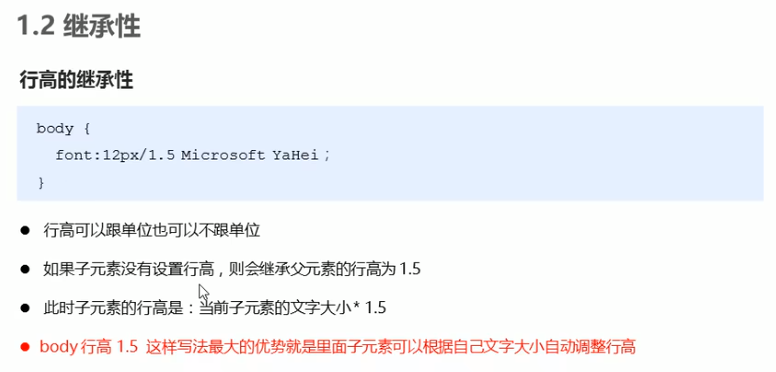

```
<head>
    <meta charset="UTF-8">
    <meta name="viewport" content="width=device-width, initial-scale=1.0">
    <meta http-equiv="X-UA-Compatible" content="ie=edge">
    <title>行高的继承</title>
    <style>
        body {
            color: pink;
            /* font: 12px/24px 'Microsoft YaHei'; */
            font: 12px/1.5 'Microsoft YaHei';
        }
        div {
            /* 子元素继承了父元素 body 的行高 1.5 */
            /* 这个1.5 就是当前元素文字大小 font-size 的1.5倍   所以当前div 的行高就是21像素 */
            font-size: 14px; 
        }
        p {
            /* 1.5 * 16 =  24 当前的行高 */
            font-size: 16px;
        }
        /* li 么有手动指定文字大小  则会继承父亲的 文字大小  body 12px 所以 li 的文字大小为 12px 
        
        当前li 的行高就是  12 * 1.5  =  18
        */
    </style>
</head>
<body>
    <div>粉红色的回忆</div>
    <p>粉红色的回忆</p>
    <ul>
        <li>我没有指定文字大小</li>
    </ul>
</body>
```


## 3.优先级

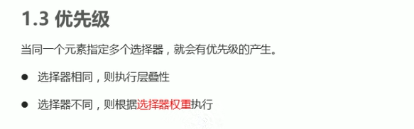

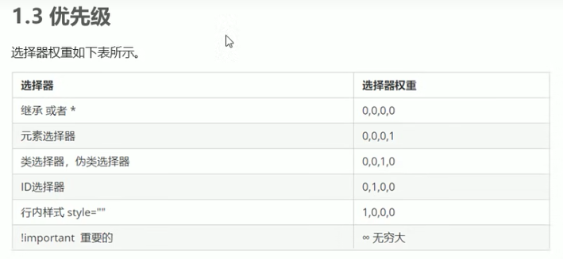

```
<head>
    <meta charset="UTF-8">
    <meta name="viewport" content="width=device-width, initial-scale=1.0">
    <meta http-equiv="X-UA-Compatible" content="ie=edge">
    <title>CSS优先级</title>
    <style>
        .test {
            color: red;
        }
        div {
            color: pink!important;
        }
        #demo {
            color: green;
        }
    </style>
</head>

<body>
    <div class="test" id="demo" style="color: purple">你笑起来真好看</div>
</body>
```

### 3.1.优先级注意点

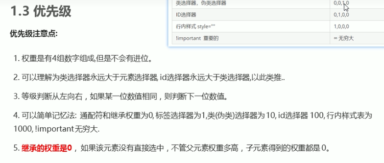

```
<head>
    <meta charset="UTF-8">
    <meta name="viewport" content="width=device-width, initial-scale=1.0">
    <meta http-equiv="X-UA-Compatible" content="ie=edge">
    <title>css权重注意点</title>
    <style>
        /* 父亲的权重是 100  */
        #father {
            color: red!important;
        }
        /* p继承的权重为 0 */
        /* 所以以后我们看标签到底执行那个样式,就先看这个标签有么有直接被选出来 */
        p {
            color: pink;
        }
        body {
            color: red;
        }
        /* a链接浏览器默认制定了一个样式 蓝色的 有下划线  a {color: blue;}*/
        a {
            color: green;
        }
    </style>
</head>
<body>
    <div id="father">
        <p>你还是很好看</p>
    </div>
    <a href="#">我是单独的样式</a>
</body>
```

### 3.2.权重叠加

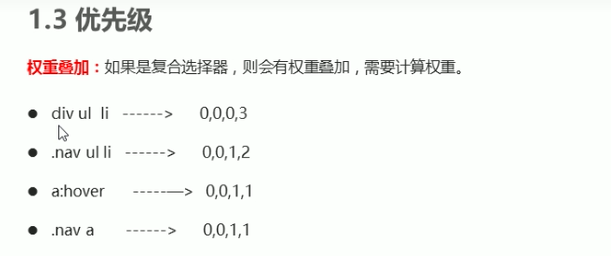

```
<head>
    <meta charset="UTF-8">
    <meta name="viewport" content="width=device-width, initial-scale=1.0">
    <meta http-equiv="X-UA-Compatible" content="ie=edge">
    <title>权重的叠加</title>
    <style>
       /* 复合选择器会有权重叠加的问题 */
       /* 权重虽然会叠加,但是永远不会有进位 */
       /* ul li 权重  0,0,0,1 + 0,0,0,1  =  0,0,0,2     2 */
        ul li {
            color: green;
        }
        /* li 的权重是 0,0,0,1    1 */
        li {
            color: red;
        }
        /* .nav li  权重    0,0,1,0  +  0,0,0,1  =  0,0,1,1    11 */
        .nav li {
            color: pink;
        }
    </style>
</head>

<body>
    <ul class="nav">
        <li>大猪蹄子</li>
        <li>大肘子</li>
        <li>猪尾巴</li>
    </ul>
</body>
```


### 3.3.优先级权重练习


# 二、盒子模型

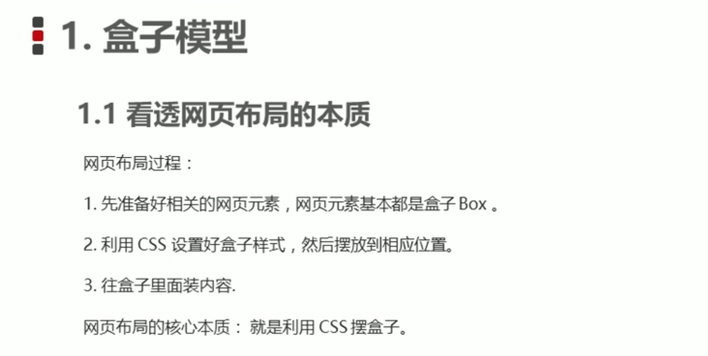

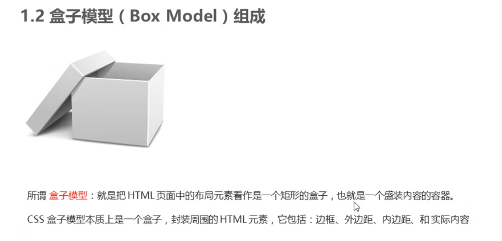

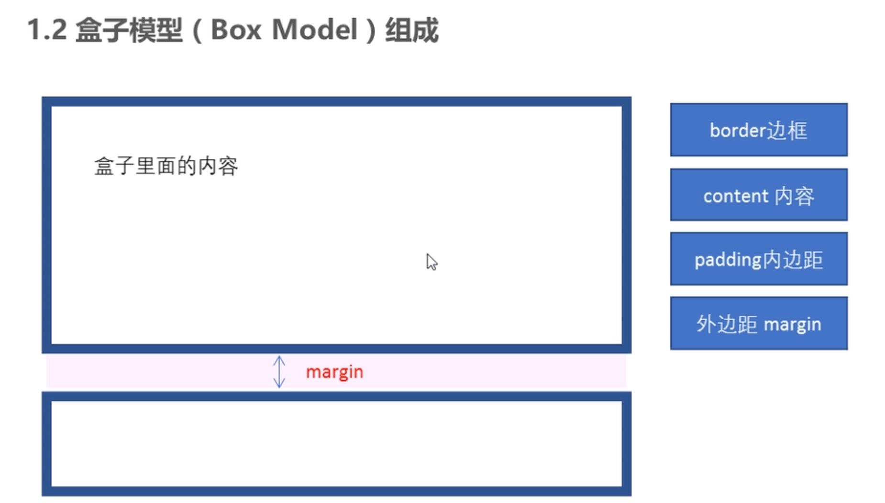

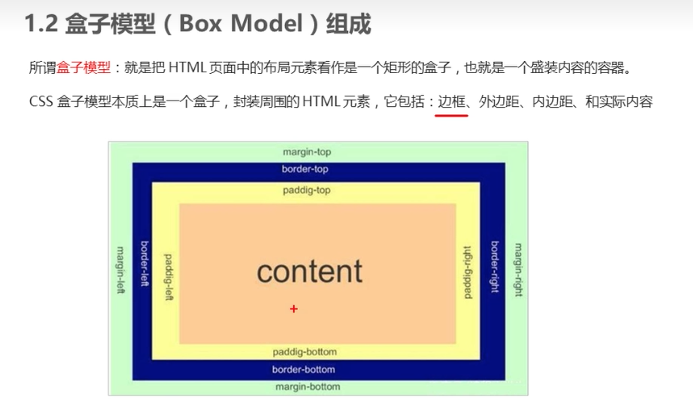

## border

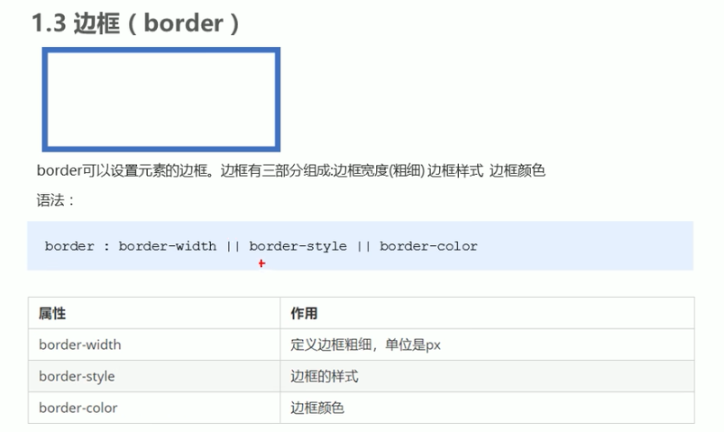

```
<style>
    div {
        width: 300px;
        height: 200px;
        /* border-width 边框的粗细  一般情况下都用 px */
        border-width: 5px;

        /* border-style 边框的样式  solid 实线边框   dashed 虚线边框  dotted 点线边框*/
        border-style: solid;

        /* border-color 边框的颜色 */
        border-color: pink;
    }
</style>
```

**复合写法**

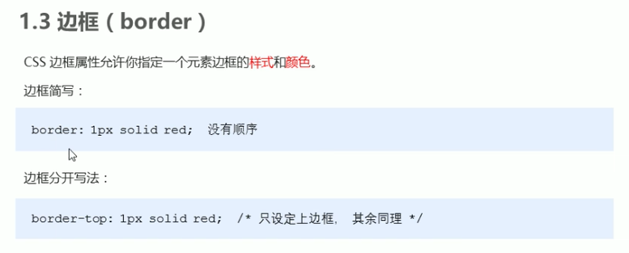

```
<style>
    div {
        width: 300px;
        height: 200px;

        /* 边框的复合写法 简写:  */
        border: 5px solid pink;

        /* 上边框 */
        border-top: 5px solid pink;

        /* 下边框 */
        border-bottom: 10px dashed purple;
    }
</style>
```

**表格边框**

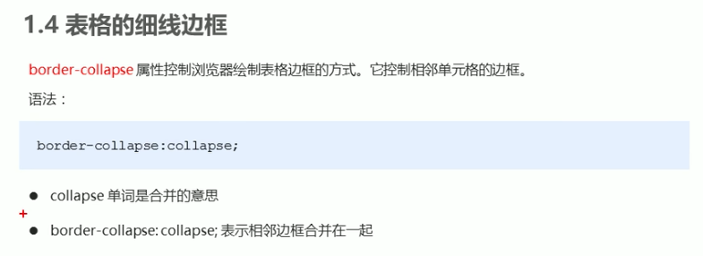

```
<style>
    table {
        width: 500px;
        height: 249px;
    }
    th {
        height: 35px;
    }
    table,
    td, th {
        border: 1px solid pink;
        /* 合并相邻的边框 */
        border-collapse: collapse;
        font-size: 14px;
        text-align: center;
    }
</style>
```

**边框影响盒子宽高**

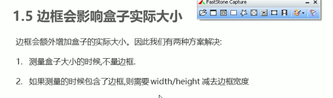

## padding

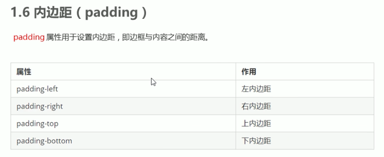

```
<style>
        div {
            width: 200px;
            height: 200px;
            background-color: pink;
            padding-left: 20px;
            padding-top: 30px;

        }
    </style>
```

**简写**

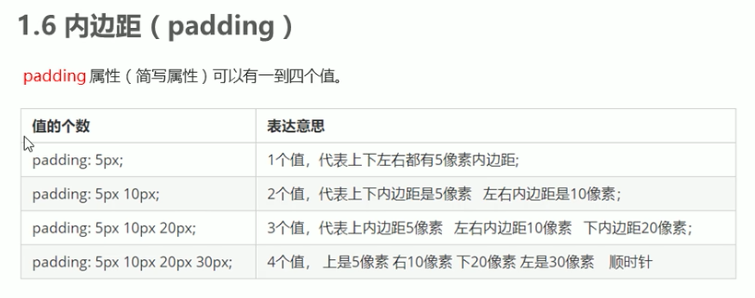

**padding影响盒子宽高**

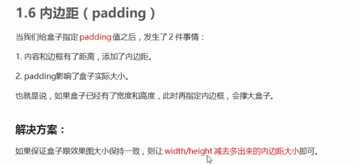


