# 圆角


```

<head>
    <title>圆角边框常用写法</title>
    <style>
        .yuanxing {
            width: 200px;
            height: 200px;
            background-color: pink;
            /* border-radius: 100px; */
            /* 50% 就是宽度和高度的一半  等价于 100px */
            border-radius: 50%;
        }

        .juxing {
            width: 300px;
            height: 100px;
            background-color: pink;
            /* 圆角矩形设置为高度的一半 */
            border-radius: 50px;
        }

        .radius {
            width: 200px;
            height: 200px;
            /* border-radius: 10px 20px 30px 40px; */
            /* border-radius: 10px 40px; */
            border-top-left-radius: 20px;
            background-color: pink;
        }
    </style>
</head>

<body>
    1. 圆形的做法:
    <div class="yuanxing"></div>
    2. 圆角矩形的做法:
    <div class="juxing"></div>
    3. 可以设置不同的圆角:
    <div class="radius"></div>
</body>

```


# 盒子阴影


```
 <style>
     div {
         width: 200px;
         height: 200px;
         background-color: pink;
         margin: 100px auto;

         /* box-shadow: 10px 10px; */
     }

     /* 原先盒子没有影子,当我们鼠标经过盒子就添加阴影效果 */
     div:hover {
         box-shadow: 10px 10px 10px -4px rgba(0, 0, 0, .3);
     }
 </style>
```


# 文字阴影


```
 <style>
     div {
         font-size: 50px;
         color: orangered;
         font-weight: 700;
         text-shadow: 5px 5px 6px rgba(0, 0, 0, .3);

     }
 </style>
```


# 网页布局的三种方式


# 浮动


## 为什么需要浮动？

> 标准流解决垂直布局；浮动解决水平布局。


## 什么是浮动？

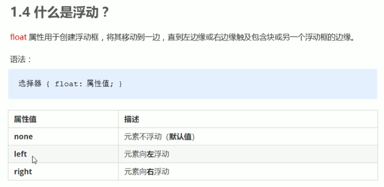


## 浮动特性

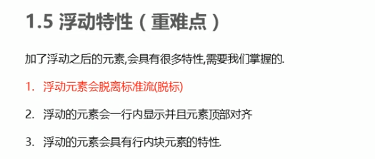

### 特性1：脱标

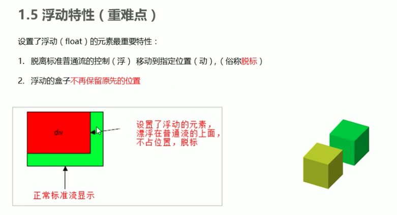

### 特性2：浮动元素一行显示

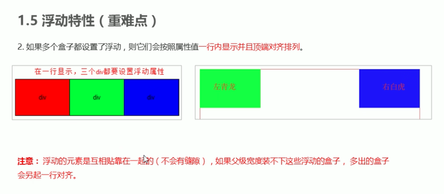

### 特性3：具有行内块元素特性

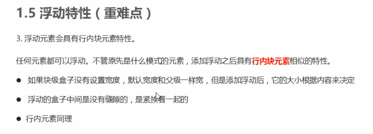

```
<style>
     /* 任何元素都可以浮动。不管原先是什么模式的元素，添加浮动之后具有行内块元素相似的特性。 */
     span,
     div {
         float: left;
         width: 200px;
         height: 100px;
         background-color: pink;
     }

     /* 如果行内元素有了浮动,则不需要转换块级\行内块元素就可以直接给高度和宽度 */
     p {
         float: right;
         height: 200px;
         background-color: purple;
     }
 </style>
```


## 浮动搭配标准流父级使用

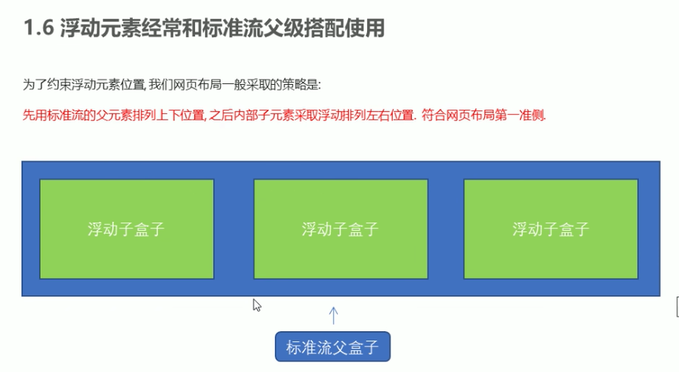


## 浮动实战 - 小米网站

### 1.

### 2.

### 3. 


## 浮动的两个注意点

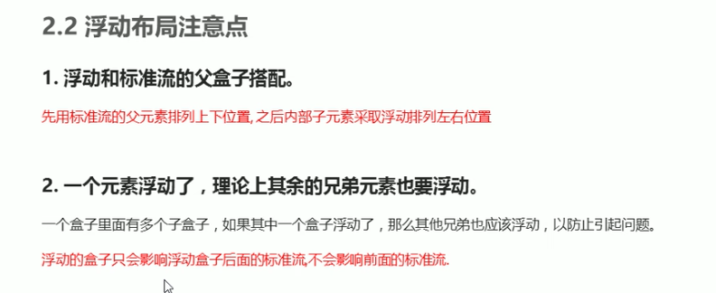

## 清除浮动

### 为什么清除浮动？

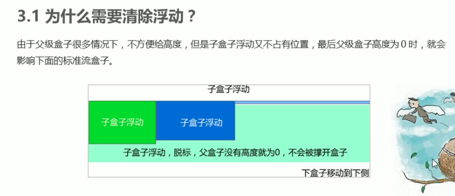

### 清除浮动本质

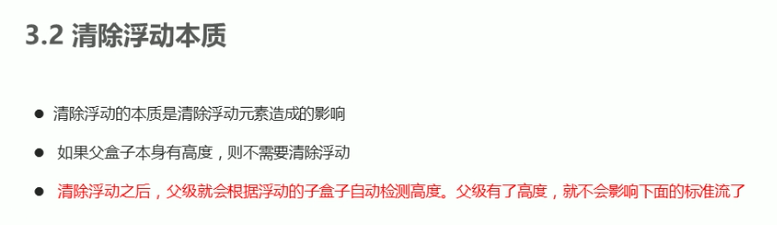

### 如何清除浮动

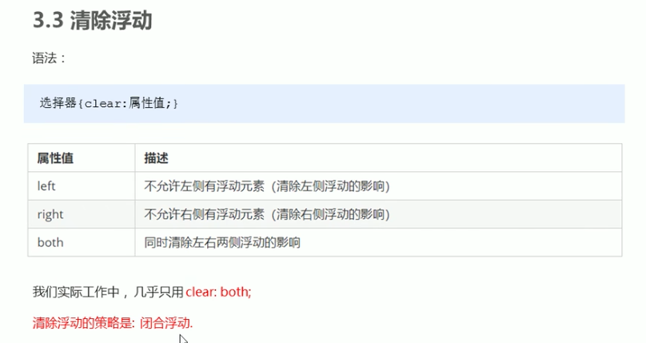

### 清除浮动的方法

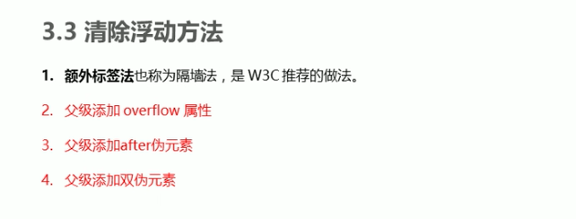

#### 1. 额外标签法 - W3C推荐

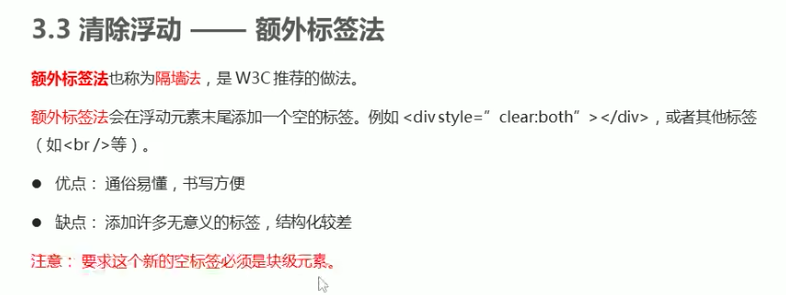

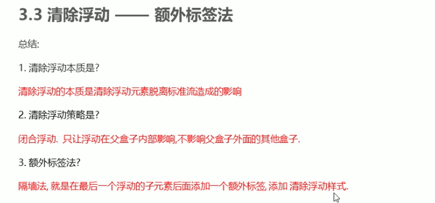

```
<style>
    .clear {
        clear: both;
    }
</style>

<body>
    <div class="box">
        <div class="damao">大毛</div>
        <div class="ermao">二毛</div>

        <!-- 这个新增的盒子要求必须是块级元素不能是行内元素 -->
        <span class="clear"></span>
    </div>
    <div class="footer"></div>
</body>
```

#### 2. 父级添加overflow


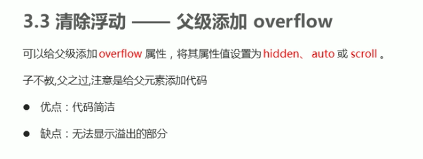

```
<style>
    .box {
        /* 清除浮动 */
        overflow: hidden;
        width: 800px;
        border: 1px solid blue;
        margin: 0 auto;
    }
</style>
```


#### 3. :after伪元素法

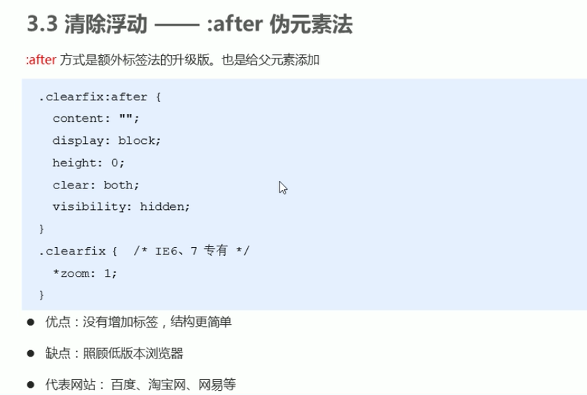

```
 <style>
        .clearfix:after {
            content: "";
            display: block;
            height: 0;
            clear: both;
            visibility: hidden;
        }

        .clearfix {
            /* IE6、7 专有 */
            *zoom: 1;
        }
</style>

<body>
    <div class="box clearfix">
        <div class="damao">大毛</div>
        <div class="ermao">二毛</div>
    </div>
    <div class="footer"></div>
</body>
```


### 4. 双伪类元素法

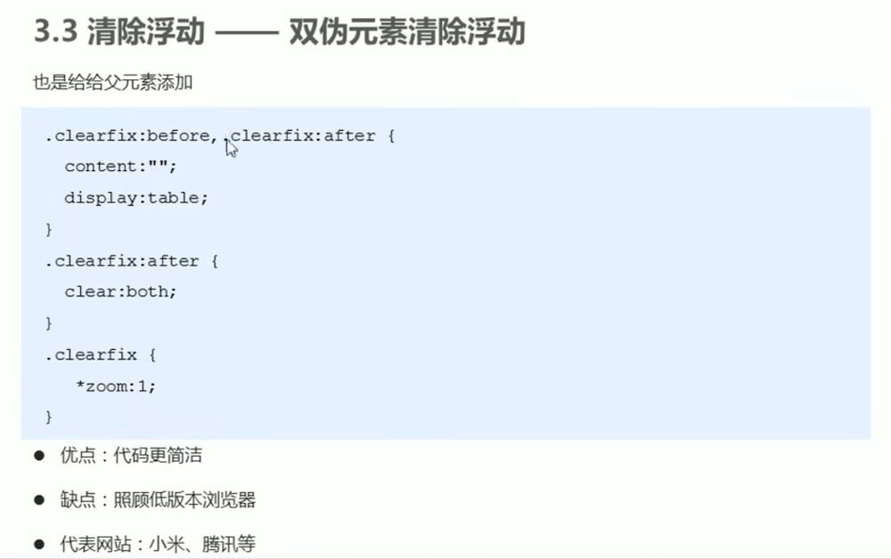

```
 <style>
        .clearfix:before,
        .clearfix:after {
            content: "";
            display: table;
        }

        .clearfix:after {
            clear: both;
        }

        .clearfix {
            *zoom: 1;
        }
</style>

<body>
    <div class="box clearfix">
        <div class="damao">大毛</div>
        <div class="ermao">二毛</div>
    </div>
    <div class="footer"></div>
</body>
```

### 清除浮动总结

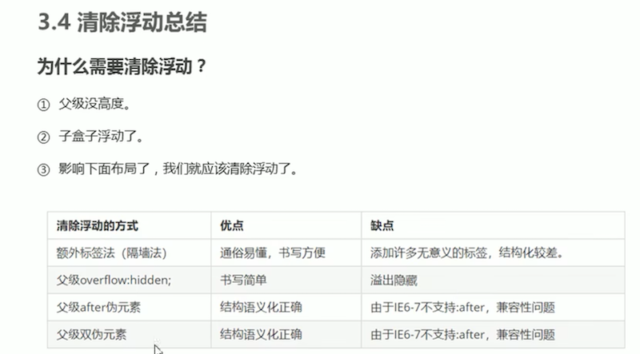


# 实战 - 学成在线
