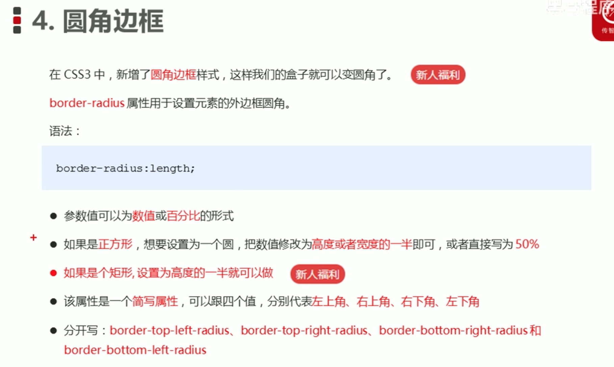
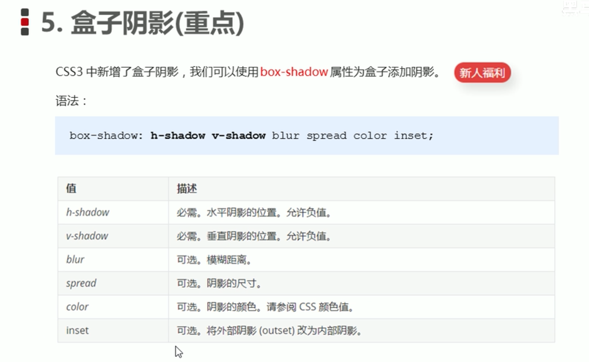
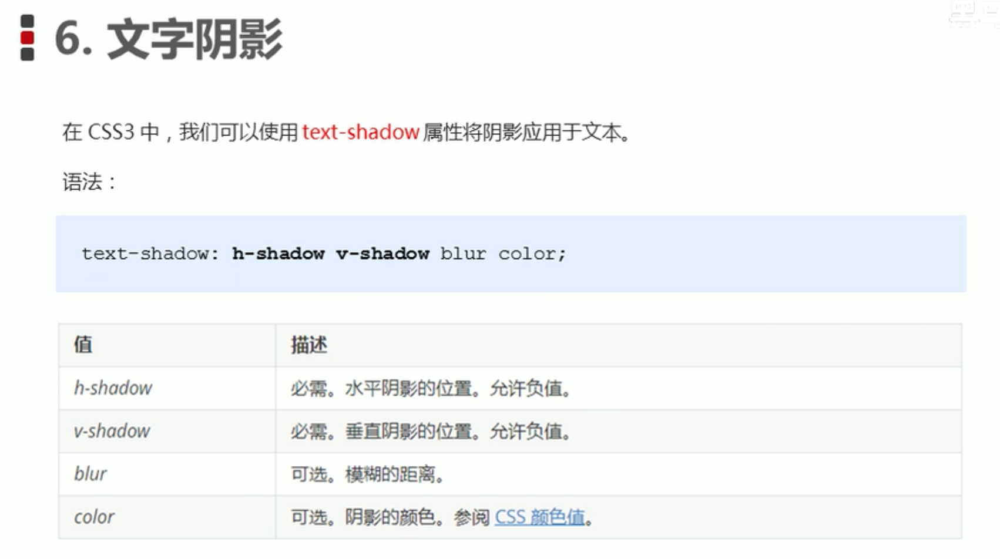
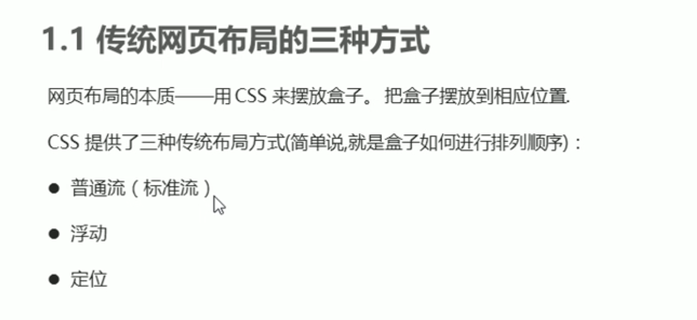
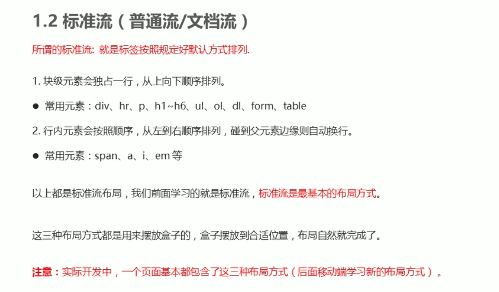
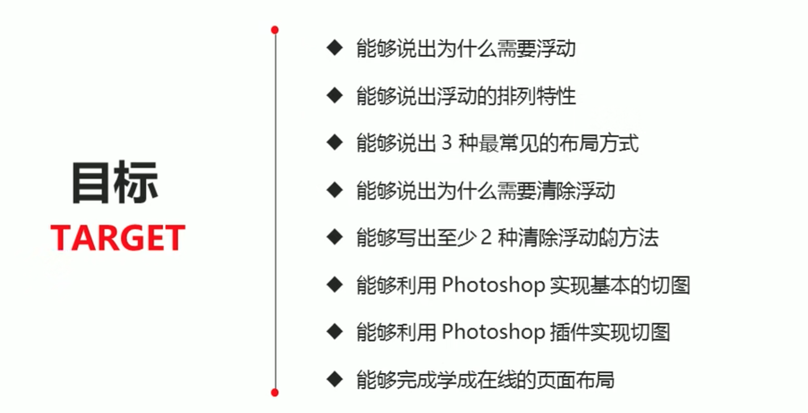

# 圆角




```

<head>
    <title>圆角边框常用写法</title>
    <style>
        .yuanxing {
            width: 200px;
            height: 200px;
            background-color: pink;
            /* border-radius: 100px; */
            /* 50% 就是宽度和高度的一半  等价于 100px */
            border-radius: 50%;
        }

        .juxing {
            width: 300px;
            height: 100px;
            background-color: pink;
            /* 圆角矩形设置为高度的一半 */
            border-radius: 50px;
        }

        .radius {
            width: 200px;
            height: 200px;
            /* border-radius: 10px 20px 30px 40px; */
            /* border-radius: 10px 40px; */
            border-top-left-radius: 20px;
            background-color: pink;
        }
    </style>
</head>

<body>
    1. 圆形的做法:
    <div class="yuanxing"></div>
    2. 圆角矩形的做法:
    <div class="juxing"></div>
    3. 可以设置不同的圆角:
    <div class="radius"></div>
</body>

```


# 盒子阴影



```
 <style>
     div {
         width: 200px;
         height: 200px;
         background-color: pink;
         margin: 100px auto;

         /* box-shadow: 10px 10px; */
     }

     /* 原先盒子没有影子,当我们鼠标经过盒子就添加阴影效果 */
     div:hover {
         box-shadow: 10px 10px 10px -4px rgba(0, 0, 0, .3);
     }
 </style>
```


# 文字阴影



```
 <style>
     div {
         font-size: 50px;
         color: orangered;
         font-weight: 700;
         text-shadow: 5px 5px 6px rgba(0, 0, 0, .3);

     }
 </style>
```


# 网页布局的三种方式






# 浮动



## 为什么需要浮动？

> 标准流解决垂直布局；浮动解决水平布局。


## 什么是浮动？


