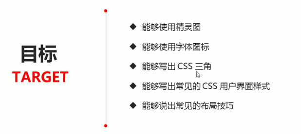

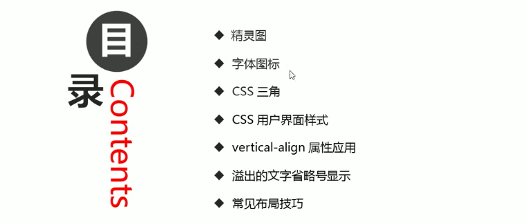

# 1.精灵图

## 为什么需要精灵图


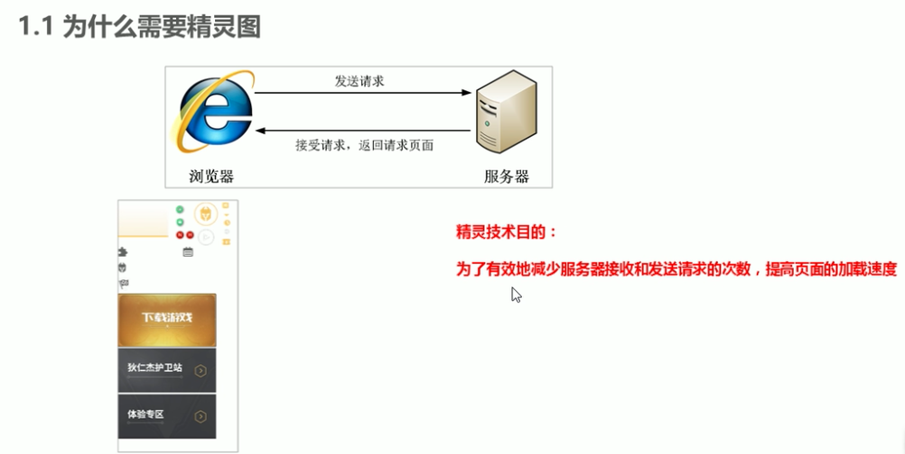

## 精灵图的使用

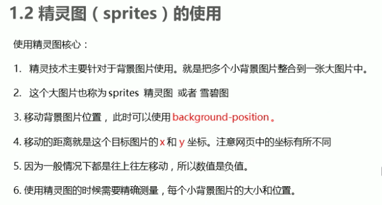

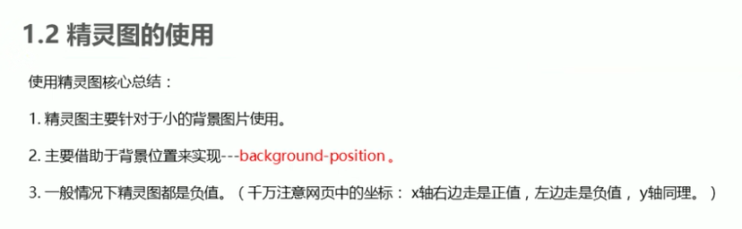


```
.box1 {
    width: 60px;
    height: 60px;   
    margin: 100px auto;
    background: url(images/sprites.png) no-repeat -182px 0;
}
```

## 案例 - 拼出英文名


# 2.字体图标

## 字体图标的产生

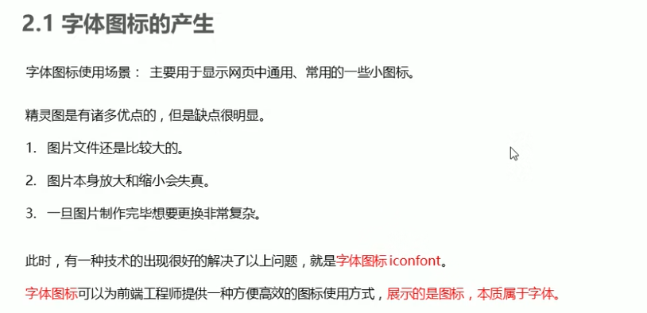

## 字体图标优点

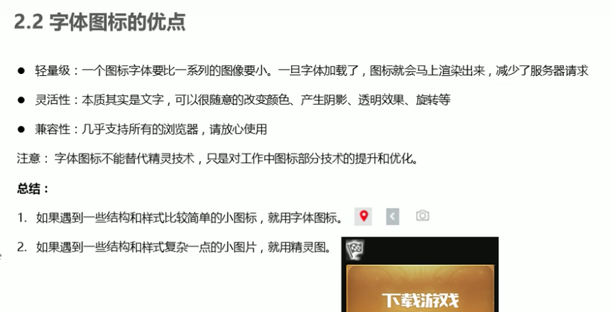

## 下载推荐

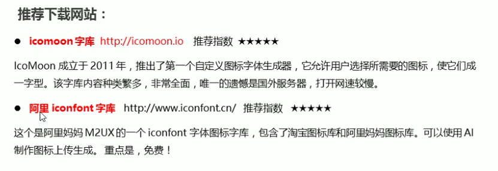

## 字体图标使用

### 1.引入到fonts目录下

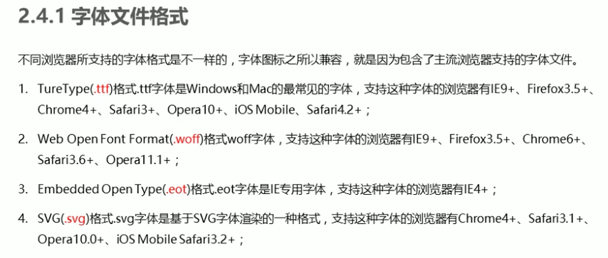

### 2.字体声明

```
<style>
    /* 字体声明 */
    @font-face {
        font-family: 'icomoon';
        src: url('fonts/icomoon.eot?p4ssmb');
        src: url('fonts/icomoon.eot?p4ssmb#iefix') format('embedded-opentype'),
             url('fonts/icomoon.ttf?p4ssmb') format('truetype'),
             url('fonts/icomoon.woff?p4ssmb') format('woff'),
             url('fonts/icomoon.svg?p4ssmb#icomoon') format('svg');
        font-weight: normal;
        font-style: normal;
        font-display: block;
    }
  </style>
```

### 3.使用

```
<style>
    /* 字体声明 */
    @font-face {
        font-family: 'icomoon';
        src: url('fonts/icomoon.eot?p4ssmb');
        src: url('fonts/icomoon.eot?p4ssmb#iefix') format('embedded-opentype'),
             url('fonts/icomoon.ttf?p4ssmb') format('truetype'),
             url('fonts/icomoon.woff?p4ssmb') format('woff'),
             url('fonts/icomoon.svg?p4ssmb#icomoon') format('svg');
        font-weight: normal;
        font-style: normal;
        font-display: block;
    }

    span {
        font-family: 'icomoon';
        font-size: 100px;
        color:pink;
    }
  </style>

<body>
    <span></span>
<span></span>
</body>
```

## 字体图标的新增 - 视频258

# 3.CSS三角

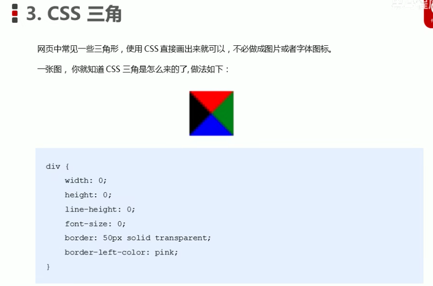

```
.box1 {
    width: 0;
    height: 0;
    /* border: 10px solid pink; */
    border-top: 10px solid pink;
    border-right: 10px solid red;
    border-bottom: 10px solid blue;
    border-left: 10px solid green;
}
.box2 {
    width: 0;
    height: 0;
    border: 50px solid transparent;
    border-left-color: pink;
    margin: 100px auto;
}
```


# 4.CSS用户界面样式

## 4.1.鼠标

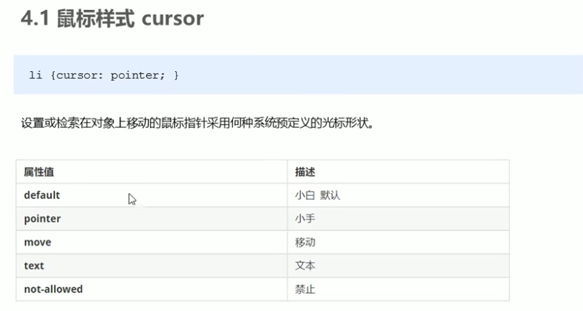

```
<body>
    <ul>
        <li style="cursor: default;">我是默认的小白鼠标样式</li>
        <li style="cursor: pointer;">我是鼠标小手样式</li>
        <li style="cursor: move;">我是鼠标移动样式</li>
        <li style="cursor: text;">我是鼠标文本样式</li>
        <li style="cursor: not-allowed;">我是鼠标禁止样式</li>
    </ul>
</body>
```

## 4.2.表单

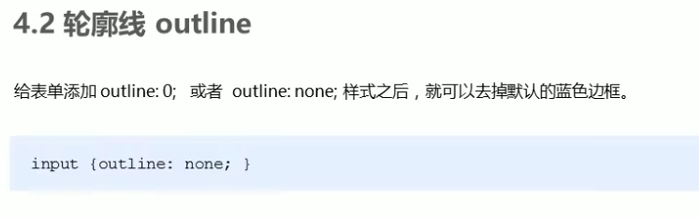

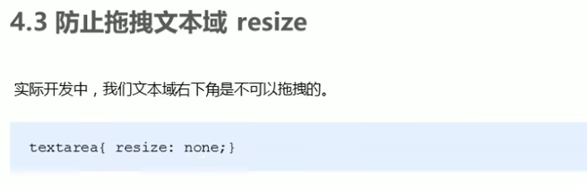

```
input {
    /* 取消表单轮廓 */
    outline: none;
}

textarea {
    /* 防止拖拽文本域 */
    resize: none;
}
```


# 5.vertical-align属性应用

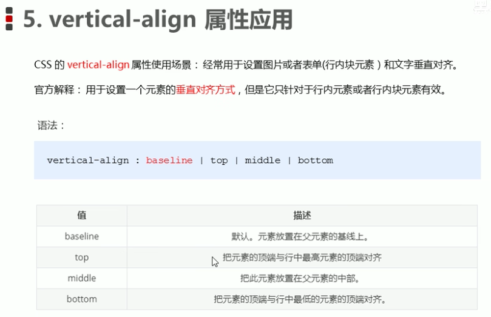

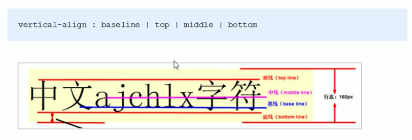

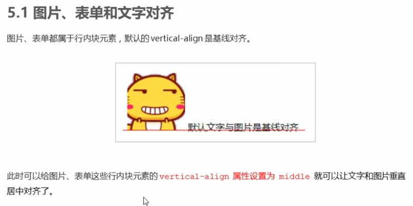

## 5.1.图片底部留白问题