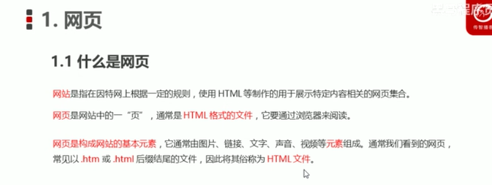
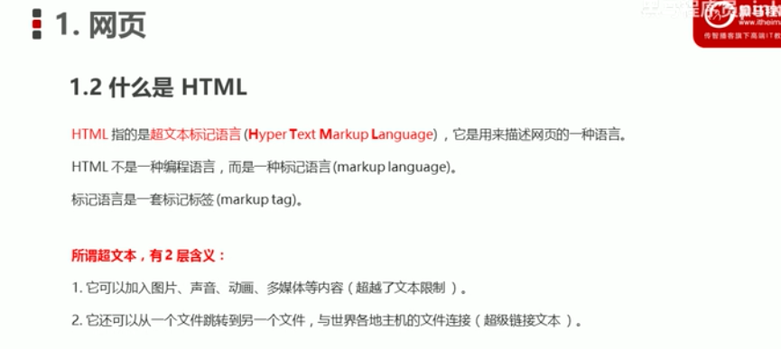
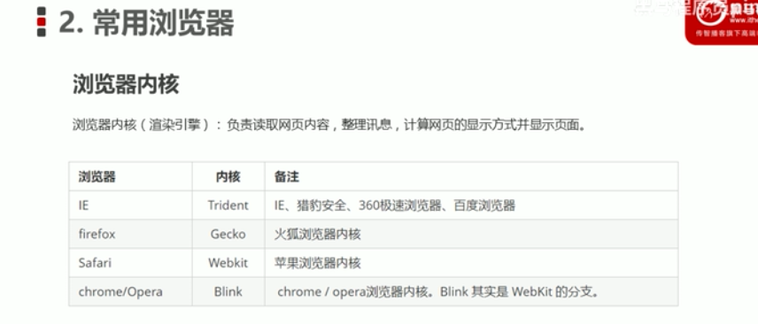
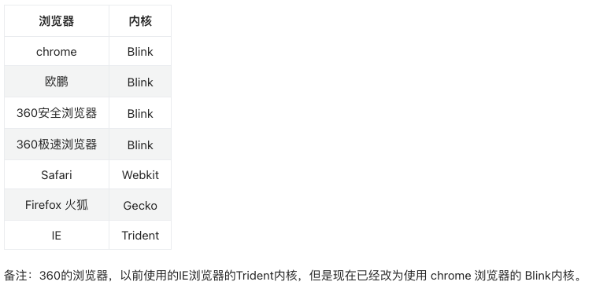
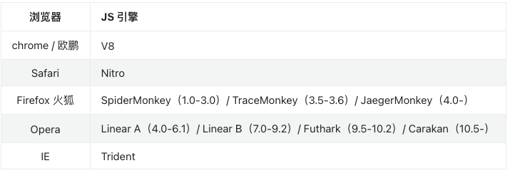
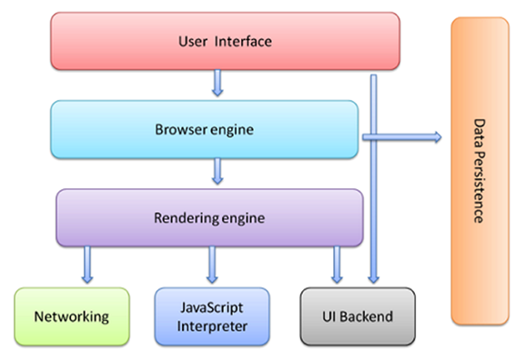
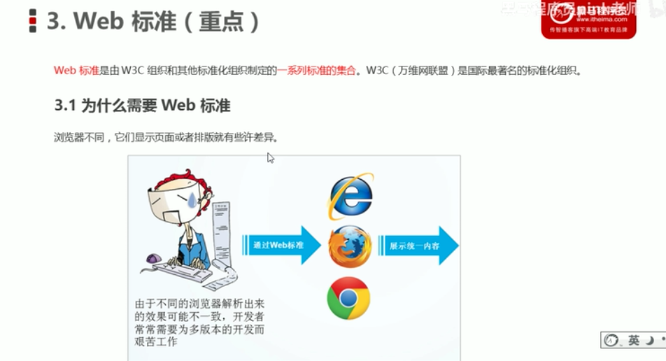
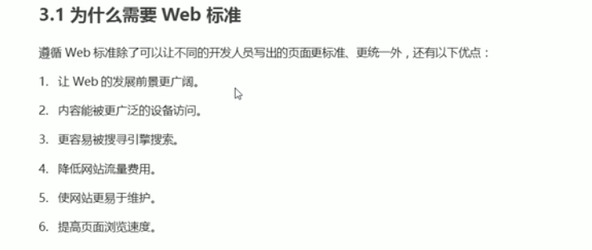
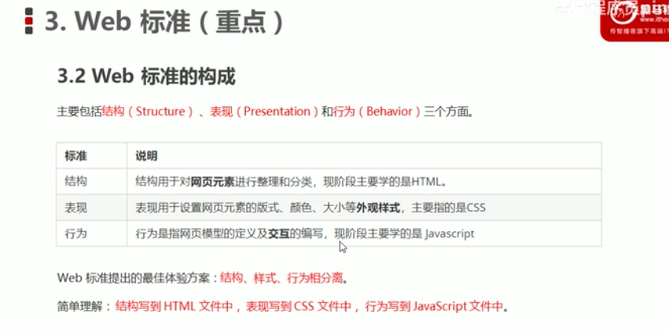
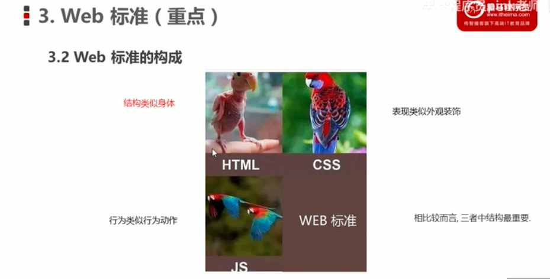

# 1. 什么是网页？

# 2. 什么是HTML？

**HTML** 全称为 ***HyperText Markup Language***，译为 **超文本标记语言**。

HTML **不是一种编程语言**，是一种描述性的 **标记语言**。

**作用**：HTML是负责描述文档**语义**的语言。

## 标记语言

HTML 不是一种编程语言，是一种描述性的**标记语言**。这主要有两层含义：

（1）**标记语言是一套标记标签**。比如：标签`<a>`表示超链接、标签``表示图片、标签`<h1>`表示一级标题等等，它们都是属于 HTML 标签。

说的通俗一点就是：网页是由网页元素组成的，这些元素是由 HTML 标签描述出来，然后通过浏览器解析，就可以显示给用户看了。

（2）编程语言是有编译过程的，而标记语言没有编译过程，HTML标签是直接由浏览器解析执行。

## HTML的专有名词

- 网页 ：由各种标记组成的一个页面就叫网页。
- 主页(首页) : 一个网站的起始页面或者导航页面。
- 标记： 比如`
`称为开始标记 ，`
`称为结束标记，也叫标签。每个标签都规定好了特殊的含义。
- 元素：比如`
内容
`称为元素.
- 属性：给每一个标签所做的辅助信息。
- XHTML：符合XML语法标准的HTML。
- DHTML：dynamic，动态的。`javascript + css + html`合起来的页面就是一个 DHTML。
- HTTP：超文本传输协议。用来规定客户端浏览器和服务端交互时数据的一个格式。SMTP：邮件传输协议，FTP：文件传输协议。

# 3. 常见浏览器

[浏览器的介绍](https://web.qianguyihao.com/01-HTML/02-%E6%B5%8F%E8%A7%88%E5%99%A8%E7%9A%84%E4%BB%8B%E7%BB%8D.html#%E6%B5%8F%E8%A7%88%E5%99%A8%E5%B7%A5%E4%BD%9C%E5%8E%9F%E7%90%86)

## 浏览器的组成

浏览器分成两部分：

- 1、渲染引擎（即：浏览器内核）
    - 浏览器所采用的「渲染引擎」也称之为「浏览器内核」，用来解析 HTML与CSS。渲染引擎决定了浏览器如何显示网页的内容以及页面的格式信息。
    - 渲染引擎的英文叫做 Rendering Engine。通俗来说，它的作用就是：读取网页内容，计算网页的显示方式并显示在页面上。
- 2、JS 引擎
    - 也称为 JS 解释器。 用来解析网页中的JavaScript代码，对其处理后再运行。
    - 浏览器本身并不会执行JS代码，而是通过内置 JavaScript 引擎(解释器) 来执行 JS 代码 。JS 引擎执行代码时会逐行解释每一句源码（转换为机器语言），然后由计算机去执行。所以 JavaScript 语言归为脚本语言，会逐行解释执行。

##  浏览器工作原理

1、User Interface 用户界面，我们所看到的浏览器。

2、Browser engine 浏览器引擎，用来查询和操作渲染引擎。

3、Rendering engine 用来显示请求的内容，负责解析HTML、CSS。

4、Networking 网络，负责发送网络请求。

5、JavaScript Interpreter(解析者) JavaScript解析器，负责执行JavaScript的代码。

6、UI Backend UI后端，用来绘制类似组合框和弹出窗口。

7、Data Persistence(持久化) 数据持久化，数据存储 cookie、HTML5中的sessionStorage。

# 4. Web标准

## Web

Web（World Wide Web）即全球广域网，也称为万维网。

我们常说的`Web端`就是网页端。

## 为什么需要Web标准？

## Web标准的构成

