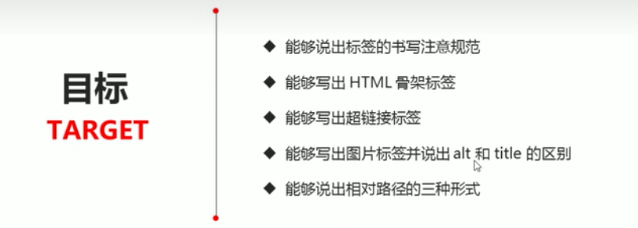

# HTML语法规范


# 第一个HTML

```html
<!DOCTYPE html>
<html lang="en">
<head>
    <meta charset="UTF-8">
    <meta http-equiv="X-UA-Compatible" content="IE=edge">
    <meta name="viewport" content="width=device-width, initial-scale=1.0">
    <title>Document</title>
</head>
<body>
    
</body>
</html>
```


### 文档声明头 - \<!DOCTYPE>


### 页面语言 lang


### 字符集


# HTML常用标签

## 1.标题标签 \<h1> - \<h6>


## 2.段落与换行标签


## 3.文本格式化标签


## 4.\<div>和\<span>


## 5.图像标签


