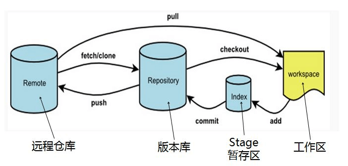
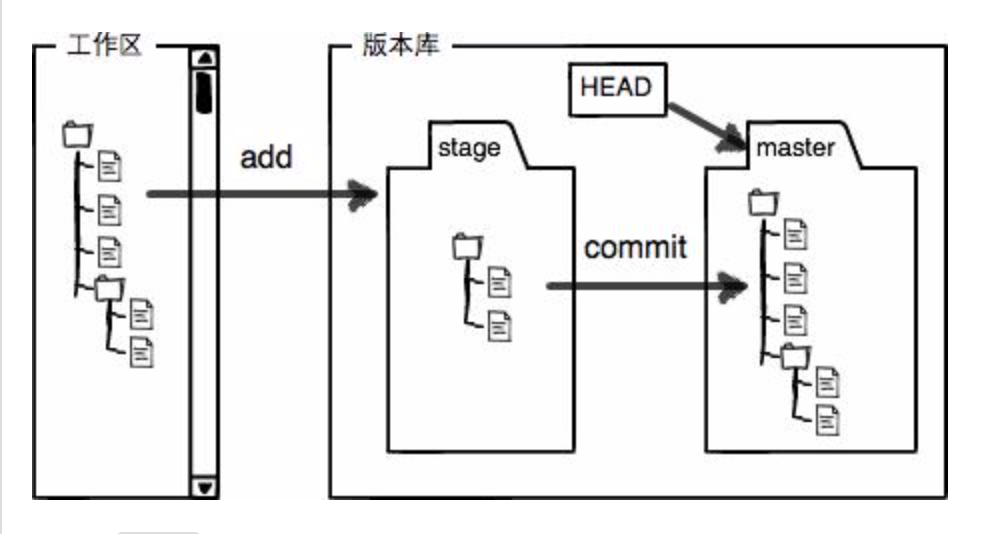
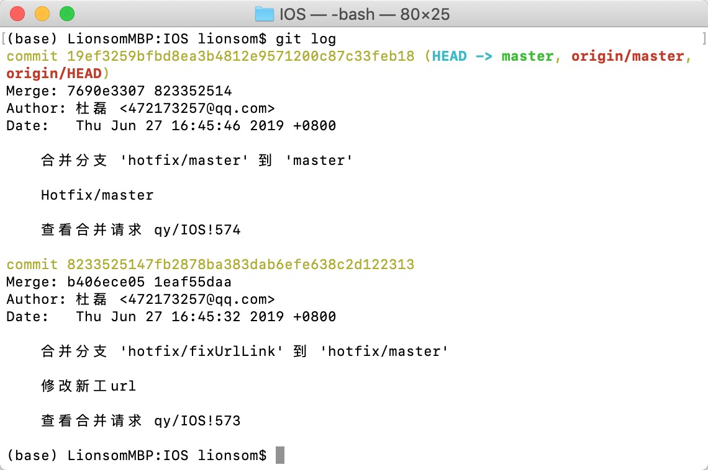

[廖雪峰git教程](https://www.liaoxuefeng.com/wiki/896043488029600)

[菜鸟教程 - Git 教程](https://www.runoob.com/git/git-tutorial.html)


## 基本原理图



- **工作区：**就是你在电脑里能看到的目录。
- **暂存区：**英文叫stage, 或index。一般存放在 ".git目录下" 下的index文件（.git/index）中，所以我们把暂存区有时也叫作索引（index）。
- **版本库：**工作区有一个隐藏目录.git，这个不算工作区，而是Git的版本库。


## 一、拉取master

### 1.1、从远程库克隆（先有远程库，后克隆本地库）

```
// 默认拉取master分支到本地
$ git clone ....

$ git branch
* master
```

### 1.2、本地仓库关联远程仓库（先有本地库，后有远程库）

-- [廖雪峰-添加远程库](https://www.liaoxuefeng.com/wiki/896043488029600/898732864121440)


## 二、分支拉取与切换

### 2.1、拉取远程分支到本地

```
// 之前最好先更新远程仓库信息
$ git fetch origin

// 创建本地dev分支
$ git checkout -b dev origin/dev
```

若失败， 可查看[类似问题](https://blog.csdn.net/qq_40720919/article/details/86748967)

```
// 后续在dev分支上开发
$ git add env.txt
$ git commit -m "add env"
$ git push origin dev
```

### 2.2、本地切换分支并推送远程仓库

```
// 在本地master分支切换新分支feature/justtest
$ git branch            /// 查看本地分支

$ git branch feature/justtest     /// 本地创建feature/justtest分支
$ git checkout feature/justtest   /// 从master分支切换到feature/justtest分支

// 等价于 创建+切换分支
$ git checkout -b feature/justtest
```

```
// 将本地新分支推送到远程仓库
// 方法一：
$ git push origin feature/justtest      /// 远程仓库会创建对应的分支

// 方法二：
$ git push        /// 提示我们远程仓库没有feature/justtest分支上游分支
fatal: The current branch feature/justtest has no upstream branch.
To push the current branch and set the remote as upstream, use

    git push --set-upstream origin feature/justtest
$ git push --set-upstream origin feature/justtest
```


## 三、查看历史

[菜鸟教程 - Git 查看提交历史](https://www.runoob.com/git/git-commit-history.html)





### git 查看分支

* 查看本地分支：`$ git branch`
* 查看远程分支：`$ git branch -r`
* 查看所有(本地+远程)分支：`$ git branch -a`

### 查看远程库信息，使用 `$ git remote -v`


### git 撤销操作：`$ git checkout -- file`

* 一种是`file`自修改后还没有被放到暂存区，现在，撤销修改就回到和版本库一模一样的状态；

* 一种是readme.txt已经添加到暂存区后，又作了修改，现在，撤销修改就回到添加到暂存区后的状态。

总之，就是让这个文件回到最近一次`git commit`或`git add`时的状态。


### git 查看当前分支版本控制记录：`$ git log`

用`$ git log --graph`命令可以看到分支合并图。




### 分支类

查看分支：git branch

创建分支：git branch <name>

切换分支：git checkout <name>

创建+切换分支：git checkout -b <name>

合并某分支到当前分支：git merge <name>

删除分支：git branch -d <name>

强行删除：git branch -D <name>

合并分支强制禁用Fast forward模式：
`$ git merge --no-ff -m "merge with no-ff" dev`


### 将某个远程主机的更新，全部取回本地：`$ git fetch`


### 标签 tag

* 创建标签

```
// 第一步：切换到需要打标签的分支上：
$ git branch
* dev
  master
$ git checkout master
Switched to branch 'master'

// 第二步：直接打tag
$ git tag v1.0

// 第三步：查看所有tag
$ git tag
v1.0
```

* 可以指定标签信息：`$ git tag -a <tagname> -m "blablabla..."`


### 拉取tag分支

拉取远程指定tag：`$ git fetch origin`


先 git clone 整个仓库，然后 git checkout tag_name 就可以取得 tag 对应的代码了。 
但是这时候 git 可能会提示你当前处于一个“detached HEAD” 状态，因为 tag 相当于是一个快照，是不能更改它的代码的，如果要在 tag 代码的基础上做修改，你需要一个分支： 
git checkout -b branch_name tag_name 
这样会从 tag 创建一个分支，然后就和普通的 git 操作一样了。

从`V7.12.0`的tag上拉取一个`chuanhua`新分支：
`$ git checkout -b chuanhua V7.12.0`

---------------------
作者：philos3 
来源：CSDN 
原文：https://blog.csdn.net/philos3/article/details/72812120 
版权声明：本文为博主原创文章，转载请附上博文链接！


