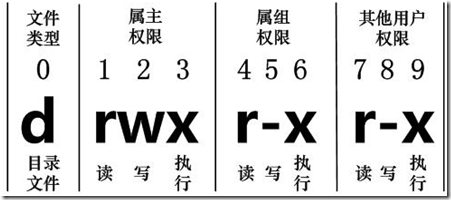

[Linux 命令大全](https://www.runoob.com/linux/linux-command-manual.html)

[菜鸟教程 - Linux 文件与目录管理](https://www.runoob.com/linux/linux-file-content-manage.html)


## 一、文件(夹)操作

* ls 列出目录
  * -a ：全部的文件，连同隐藏档( 开头为 . 的文件) 一起列出来(常用)
  * -d ：仅列出目录本身，而不是列出目录内的文件数据(常用)
  * -l ：长数据串列出，包含文件的属性与权限等等数据；(常用)
* cd 切换目录
* pwd 显示当前路径
* mkdir 创建一个新目录
* rmdir 删除一个空目录 （注意是空目录） 
* cp 复制文件或目录
* rm 移除文件或目录
* mv 移动文件与目录，或修改文件与目录的名称


* 文件权限  [Linux 文件基本属性](https://www.runoob.com/linux/linux-file-attr-permission.html)

```
➜  shell ls -l
total 8
-rwxr-xr-x  1 qiyeyun  staff  33  8  2 11:28 firstShell.sh
drwxr-xr-x  3 qiyeyun  staff  96  8  2 13:46 ha
```

在Linux中第一个字符代表这个文件是目录、文件或链接文件等等。

- 当为[ **d** ]则是目录;
- 当为[ **-** ]则是文件；
- 若是[ **l** ]则表示为链接文档(link file)；
- 若是[ **b** ]则表示为装置文件里面的可供储存的接口设备(可随机存取装置)；
- 若是[ **c** ]则表示为装置文件里面的串行端口设备，例如键盘、鼠标(一次性读取装置)。

接下来的字符中，以三个为一组，且均为『rwx』 的三个参数的组合。其中，[ r ]代表可读(read)、[ w ]代表可写(write)、[ x ]代表可执行(execute)。 要注意的是，这三个权限的位置不会改变，如果没有权限，就会出现减号[ - ]而已。

每个文件的属性由左边第一部分的10个字符来确定（如下图）。




