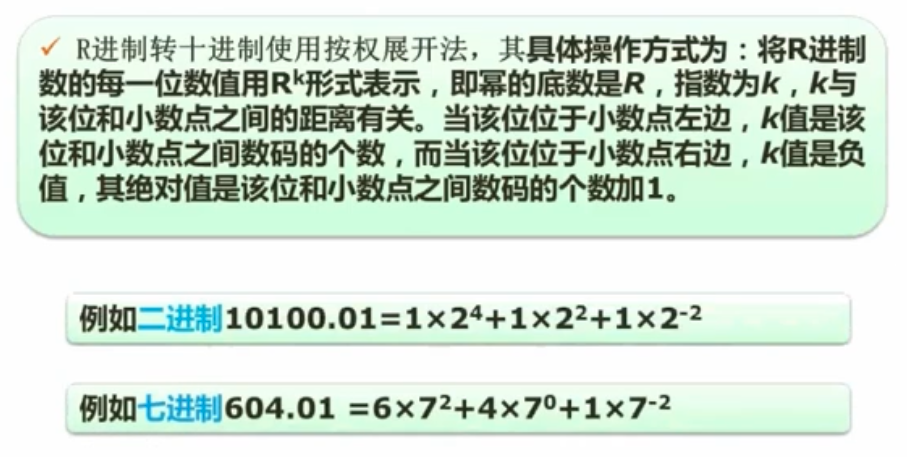
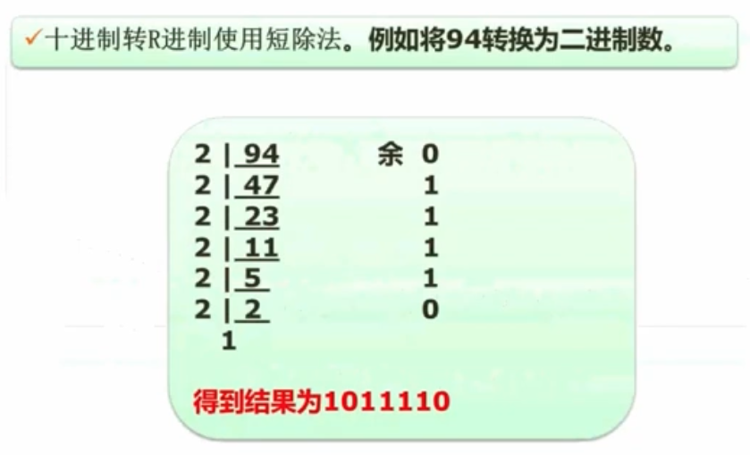

# 数据的表示

## 一、进制转换

### 1. R进制  —> 十进制

核心：每位的数 * 该位置的权

### 2. 十进制 —> R进制

核心：除2，取余

### 3. 二进制 —> 八进制、十六进制

核心：每三个分成一组，分别算出对应的十进制，最后连在一起就是八进制。

十六进制 同上

### 4. 十六进制 —> 八进制

十六进制  —> 二进制 —> 八进制

## 二、原码、反码、补码、移码

